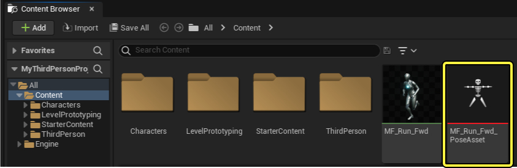
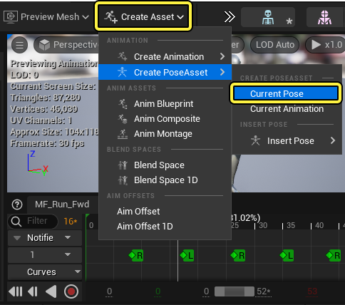
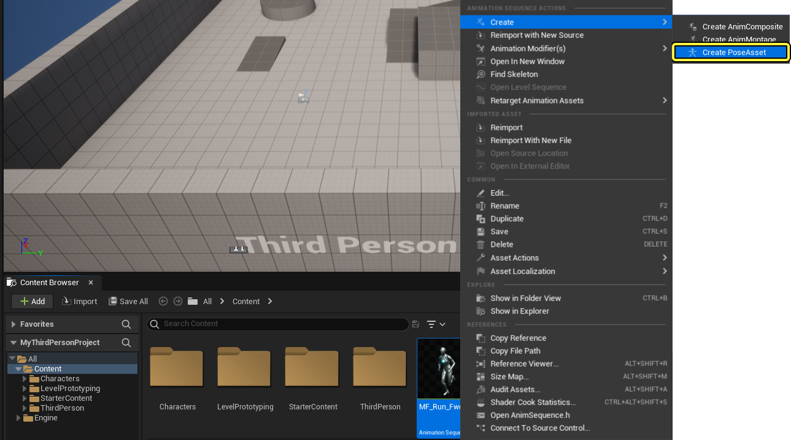
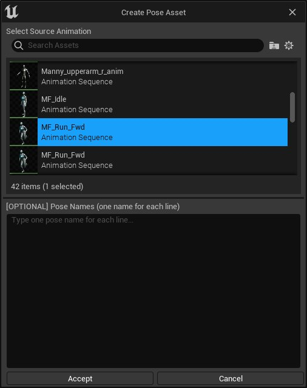
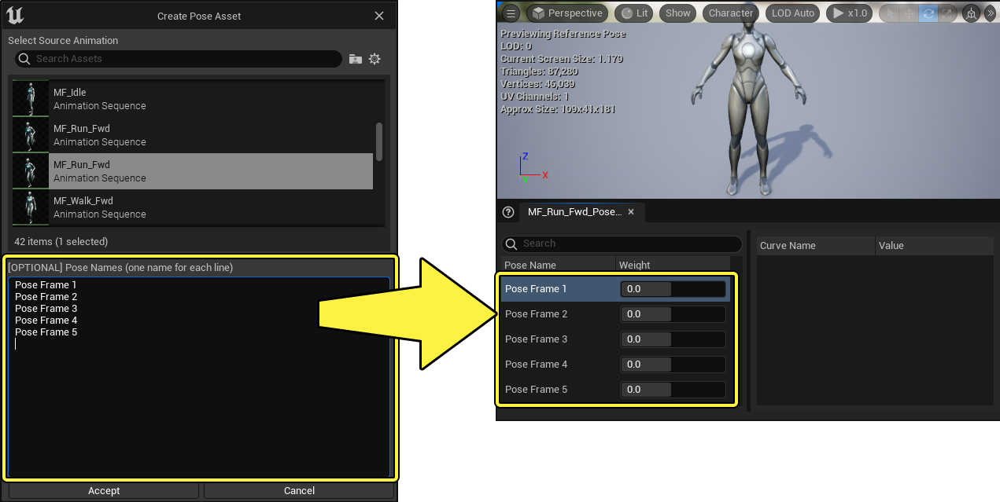
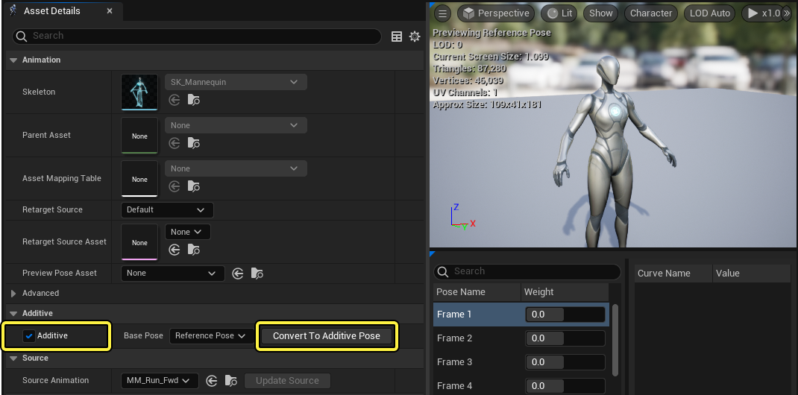

# 动画姿势资产

> 路径：虚幻引擎5.7文档 / 为角色和对象制作动画 / 骨架网格体动画系统 / 动画资产和功能 / 动画姿势资产

> 原始页面：https://dev.epicgames.com/documentation/unreal-engine/animation-pose-assets-in-unreal-engine

在 **虚幻引擎** 中，动画 **姿势资产** 是存储的[骨骼网格体](../../../../working-with-content/skeletal-mesh-assets/index.md)姿势，可在项目中作为动画目标或参考点使用。

姿势资产可保存网格体几何体的位置以及骨架数据。姿势资产可以包含单个静态姿势或许多姿势（作为为资产中的动画曲线保存）。

## 创建姿势资产

有很多方法可创建动画姿势资产。

在[骨架编辑器](../../animation-editors/skeleton-editor/index.md)、[骨骼网格体编辑器](../../animation-editors/skeletal-mesh-editor/index.md)或[动画序列编辑器](../../animation-editors/animation-sequence-editor/index.md)中工作时，你可以使用[动画编辑器](../../animation-editors/index.md) **工具栏** 中的 **创建资产（create asset）** 按钮创建姿势资产，将当前骨骼网格体位置保存为动画姿势资产。

你还可以从整个[动画序列](../animation-sequences/index.md)创建动画姿势资产，方法是 **右键点击** **内容浏览器（Content Browser）** 中的资产并在快捷菜单中选择 **创建（Create）> 创建姿势资产（Create PoseAsset）** 。

选择 **创建姿势资产（Create PoseAsset）** 后，将打开“创建姿势资产（Create Pose Asset）”窗口，你可以在其中选择想从哪个动画序列创建动画姿势资产。

从整个 **动画序列** 生成姿势资产时，虚幻引擎将为每个动画帧创建姿势。生成的姿势可以通过姿势资产中存在的[动画曲线](../animation-sequences/animation-curves/index.md)来访问。

你可以按顺序为生成的姿势曲线输入想要的名称，方法是在 **[可选] 姿势名称（[OPTIONAL] Pose Names）** 字段中为每个动画曲线或帧输入独占一行的名称。

### 叠加姿势资产

创建并打开姿势资产后，你可以将姿势资产修改为叠加姿势，方法是启用 **叠加（Additive）** 属性并在姿势资产的 **资产细节面板（Asset Details Panel）** 中选择 **转换为叠加姿势（Convert to Additive Pose）** 按钮。

叠加姿势资产能够在叠加功能中与动画序列等其他动画数据一起播放，而不覆盖整个姿势。

## 使用姿势资产

姿势资产可以通过许多方式被用于驱动角色。

### Pose Blender

你可以使用 **Pose Blender** 和 **Pose Driver** 动画蓝图节点来控制动画姿势资产的播放和混合，在运行时驱动角色。

- [姿势混合器](pose-blender/index.md) - 如何使用姿势混合器和按名称播放姿势节点播放姿势资产曲线。

- [姿势驱动器](pose-driver/index.md) - 介绍如何使用姿势驱动器以便根据骨骼运动控制动作资产或曲线值。
