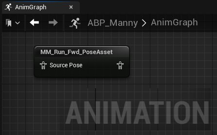
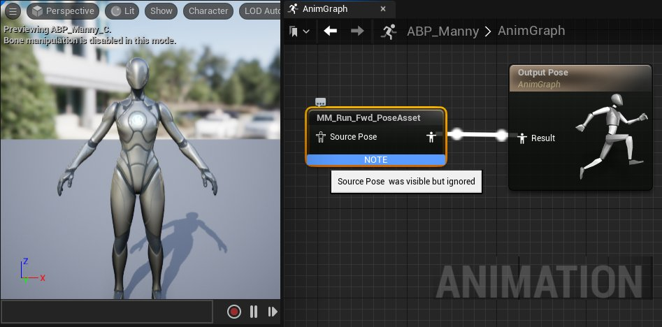
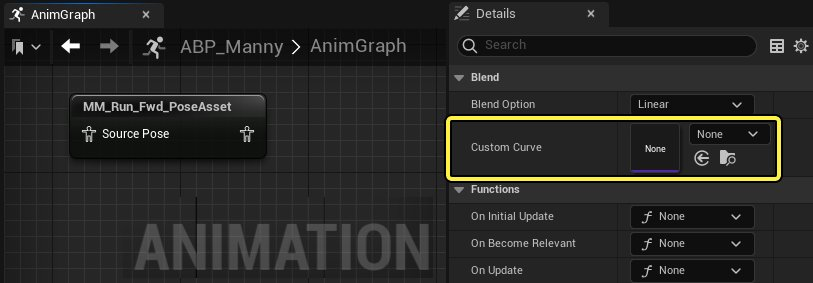
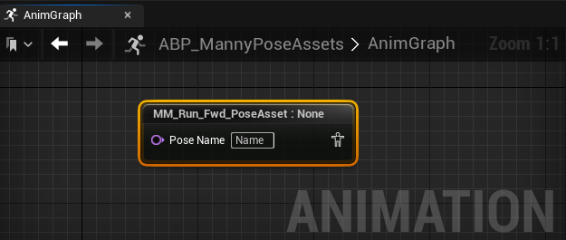
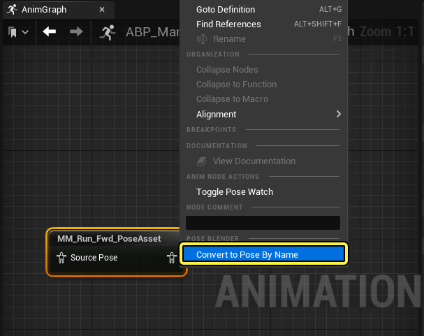
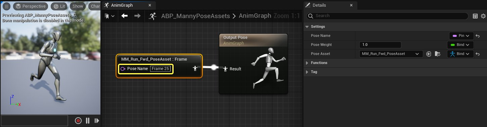
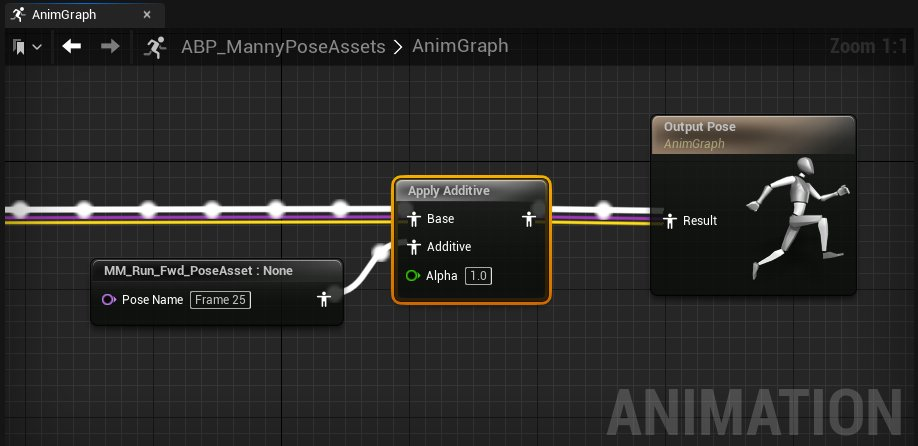

# 姿势混合器

> 路径：虚幻引擎5.7文档 / 为角色和对象制作动画 / 骨架网格体动画系统 / 动画资产和功能 / 动画姿势资产 / 姿势混合器

> 原始页面：https://dev.epicgames.com/documentation/unreal-engine/pose-blender-in-unreal-engine

创建[动画姿势资产](../index.md)之后，你可以用[姿势混合器](#poseblender)和[Pose by Name](#posebyname)[动画蓝图节点](../../../animation-blueprints/index.md)，使用姿势资产为角色制作动画。

## 姿势混合器

**姿势混合器（Pose Blender）** 节点是一种[动画蓝图](../../../animation-blueprints/index.md)节点，可通过将 **姿势资产** 拖入 **AnimGraph** 来自动创建。

姿势混合器节点用于在运行时在[骨架网格体](../../../../../working-with-content/skeletal-mesh-assets/index.md)上播放相关联的 **姿势资产**。

> [!WARNING]
> 如果没有任何方法来驱动包含的**动画曲线**，姿势混合器节点将不会显示**输出姿势**。你需要使用动画蓝图节点来驱动姿势节点的曲线数据，才能生产输出姿势。
>
> 

这是一个[动画序列](../../animation-sequences/index.md)示例，其中包含编写好的动画曲线，可驱动姿势资产曲线，从而生成面部动画。

| animation curves in animation sequence asset | pose blender demo using animation sequence curves to drive anim curve |
| --- | --- |
| 动画序列曲线 | 使用动画序列曲线和姿势混合器节点播放姿势资产 |

虽然动画序列播放器（animation sequence players）之类的节点可以驱动姿势资产中的动画曲线，你也可以使用[曲线资产](../../animation-sequences/animation-curves/index.md)来驱动这些曲线。你可以在 **姿势混合器** 节点的 **细节** 面板中，找到 **自定义曲线（Custom Curve）** 属性，设置一条自定义曲线，根据设置驱动姿势。

## 按名称播放姿势

在处理包含多个被保存为特定动画曲线的[骨架网格体](../../../../../working-with-content/skeletal-mesh-assets/index.md)姿势的姿势资产时，你可以使用按名称播放姿势（Pose by Name）[动画蓝图](../../../animation-blueprints/index.md)节点，使用姿势名称选择性地播放姿势。

要创建"按名称播放姿势"节点，请在AnimGraph中点击右键，在快捷菜单中选择 **创建按名称播放姿势节点（Create Pose by Name Node）** 。

这个"按名称播放姿势"节点输出了姿势资产中的一个姿势。该资产由一个奔跑动画生成。该动画中的每一帧都被分配了各自的动画曲线， `Frame 25` 为所需动画的名称。

在使用"按名称播放姿势"节点时，你可以使用 **Alpha属性（Alpha Property）** 控制特定姿势的权重。在下图中，我们用一个简单的波动值来调整Alpha值，以驱动姿势的权重。

| aniamtion blueprint driving pose alpha | alpha value demo |
| --- | --- |
| 动画蓝图 | 结果 |

> [!NOTE]
> 如果你使用了姿势资产启用了 **叠加（Additive）** 模式，你需要使用 **应用叠加（Apply Additive）** 节点才能正确显示想要的姿势。
>
> 
