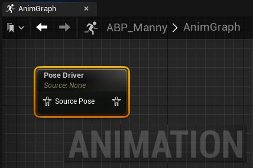
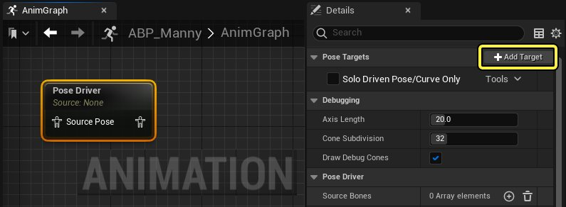
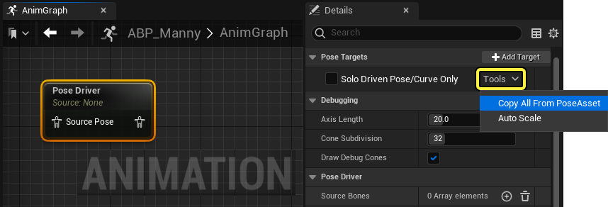
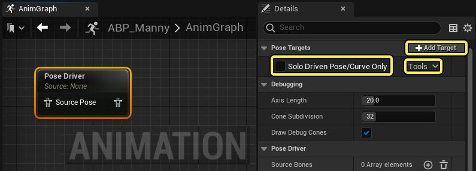
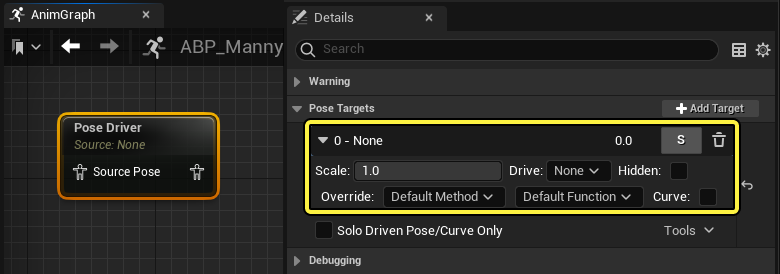
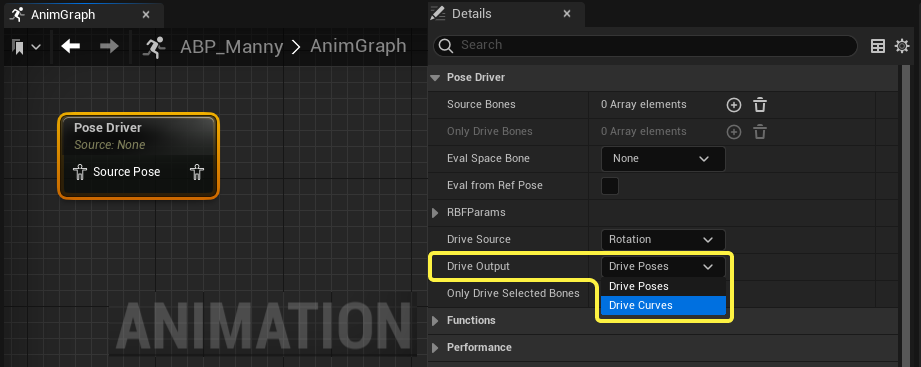
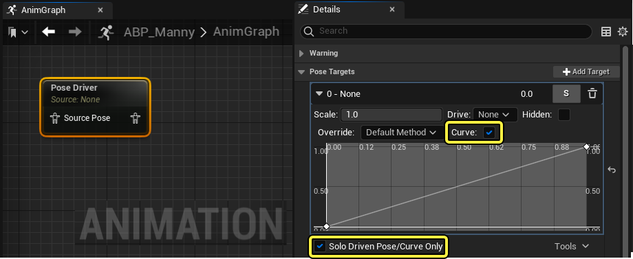
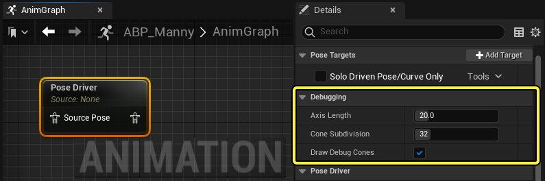

# 姿势驱动器

> 路径：虚幻引擎5.7文档 / 为角色和对象制作动画 / 骨架网格体动画系统 / 动画资产和功能 / 动画姿势资产 / 姿势驱动器

> 原始页面：https://dev.epicgames.com/documentation/unreal-engine/pose-driver-in-unreal-engine

你可以使用 can use the **姿势驱动器（Pose Driver）** [动画蓝图](../../../animation-blueprints/index.md)来驱动[姿势资产](../index.md)，并使用[动画曲线](../../animation-sequences/animation-curves/index.md)来制作角色动画。

[姿势混合器](../pose-blender/index.md)和[Pose by Name](../pose-blender/index.md#posebyname)动画蓝图节点用于在已有的动画姿势之间混合姿势资产，而姿势驱动器节点用于驱动姿势资产中包含的姿势来为角色添加动画。

通过姿势驱动器节点，你可以使用骨骼动作来在运行时驱动姿势资产播放。

| 姿势驱动器示例使用动画序列曲线驱动动画曲线 | 动画图表中使用姿势驱动器 |
| --- | --- |
| 视口 | 图表 |

选中一个姿势资产，设置一个[姿势目标](#posetargets)和一个 **源骨骼（Source Bone）**，你便可以使用源骨骼动作数据控制姿势资产在被驱动时的行为。

> [!WARNING]
> 重新选择一个姿势驱动器节点的姿势资产，并且使用 **工具（Tools）** 属性导入一组新的姿势时，必须先创建一个新的 **姿势驱动器（Pose Driver）** 节点。

## 姿势目标

通过在 **姿势目标（Pose Targets）** 属性中指定目标，你可以从 **姿势资产（Pose Asset）** or **动画曲线（Animation Curves）** 中指定用于姿势驱动器节点的目标骨骼网格体姿势。姿势目标可以手动输入，也可以用 **姿势资产（Pose Asset）** 中的姿势自动分配。

要将姿势资产中包含的姿势作为姿势目标，首先，在姿势驱动器的 **细节（Details）** 面板中，在 **姿势资产（Pose Asset）** 属性下指定一个姿势资产。

姿势资产指定完成后，从 **工具（Tool）** 属性的菜单中选择从姿势资产 **复制资势（Copy Poses）**。

导入的姿势目标现在可以使用姿势驱动器节点进行控制。

### 姿势目标属性参考

以下属性控制着全部姿势驱动器节点的姿势目标的行为。以下可以参考姿势目标的各种属性。

| 属性 | 描述 |
| --- | --- |
| **单独驱动姿势/仅曲线（Solo Driven Pose / Curve Only）** | 在这里可以切换姿势目标是代表整个姿势还是仅仅代表动画曲线。启用后，只单独解算曲线数据，不改变源关节。禁用后，会使用全部的姿势数据。 |
| **工具（Tools）** | 当 **姿势驱动器（Pose Driver）** 节点定义了一个姿势资产，你可以选择以下选项来控制由姿势驱动器驱动的姿势或者曲线的行为。在下拉菜单中可以选择以下选项： **从姿势资产中复制全部（Copy All from PoseAsset）**: 从关联的 **姿势资产** 中复制目标。选用后，该项会覆盖所有已有的姿势目标。 **自动缩放（Auto Scale）**: 自动设置所有的缩放因数，基于到最近一个邻近的姿势目标的距离。 |
| **添加目标（Add Target）** | 你可以使用 **(+) 添加目标（Add Target）** 按钮来添加一个姿势目标。 |

以下属性可以对姿势驱动器节点中的每个姿势目标单独调整。以下可以参考姿势目标的各种属性。

| 属性 | 描述 |
| --- | --- |
| **单独（Solo）** | 点击并按住单独按钮可以在视口中预览姿势目标。双击单独姿势可以将姿势目标预览锁定。双击一个锁定的姿势的单独按钮便可以解除预览锁定。 |
| **移除目标（Remove Target）** | 点击姿势目标旁边的 **移除目标（Remove Target）** 按钮可以将其移除。 |
| **缩放（Scale）** | 在这里可以设置姿势目标的曲线或者姿势缩放。数值1会将全部曲线或者姿势数值作为姿势目标。 |
| **驱动（Drive）** | 在这里可以从姿势资产中选择哪一个姿势用姿势目标来驱动。 |
| **隐藏（Hidden）** | 启用后，调试绘图中会隐藏该姿势目标。 |
| **覆盖（Override）** | 在这里，你可以设置覆盖姿势目标的混合方式和函数。第一个字段中可以选择以下之一混合方式： **欧几里得（Euclidian）** **四元数（Quaternion）** **摇摆角（Swing Angle）** **扭曲角（Twist Angle）** **默认方式（Default Method）** 第二个字段中可以选择以下之一覆盖混合函数： **高斯（Gaussin）** **指数（Exponential）** **线性（Linear）** **三次方（Cubic）** **五次方（Quintic）** **默认函数（Default Function）** |
| **曲线（Curve）** | 当姿势目标是一个[动画曲线](../../animation-sequences/animation-curves/index.md)而不是动画姿势时，启用该属性。如果姿势目标是动画姿势，那么禁用该属性。 |
| **X**、**Y** 和 **Z** | 在这里可以引用并调整姿势目标位置的 **X**、**Y** 和 **Z** 数值。默认情况下其在 **视口（Viewport）** 中显示为一个 **绿色物体**。如果全部数值都设为0，姿势目标的动作会被隔离在 **源骨骼（Source Bone）** 及其 **子级（Children）**。 |

### 基于曲线的姿势目标

除了使用 **姿势资产（Pose Asset）** 以外，姿势目标也可以由[动画曲线](../../animation-sequences/animation-curves/index.md)来驱动。在 **姿势驱动器（Pose Driver）** 节点的细节面板中，将 **驱动输出（Drive Output）** 设置为 **驱动曲线（Drive Curves）**。

在姿势目标比分，启用 *单独驱动姿势/仅曲线（Solo Driven Pose / Curve Only）**，然后为每个曲线姿势目标，启用**曲线（Curve）**。启用了曲线睡醒后便可以在属性窗口中编辑曲线图表。

### 属性参考

以下是姿势驱动器节点的各种属性。

| 属性 | 描述 |
| --- | --- |
| **源骨骼（Source Bones）** | 从角色的 **骨架（skeleton）** 中选择骨骼来用作 **源骨骼（Source Bone）**，从而基于该骨骼的朝向应用驱动动画的姿势参数。可以添加多个源骨骼，但是需要至少一个。**添加（Add (+)）** 序数来定义驱动姿势朝向的源骨骼。 |
| **计算空间骨骼（Eval Space Bone）** | 在这里可以从角色的 **骨架（skeleton）** 中选择骨骼来计算 **源骨骼（Source Bone）** 的变换 。如果未指定，将使用 **源骨骼（Source Bone）** 的 **本地空间（local space）**。 |
| **从参考姿势计算（Eval from Ref Pose）** | 启用后，会相对于 **参考姿势（Reference Pose）** 位置来计算源骨骼方向和变换。推荐在使用 **摇摆（Swing）** 和 **扭曲角（Twist Angle）** 作为 **距离方法（Distance Method）** 使用时启用，因为会从角色的 **参考姿势（RefPose）** 计算扭曲。禁用后，会使用 **源骨骼（Source Bone）** 的 **本地空间（local space）**。 当设置了 **计算空间骨骼（Eval Space Bone）** 时，**从参考姿势计算（Eval from Ref Pose）** 会被略过。 |
| **仅驱动选定骨骼（Only Drive Selected Bones）** | 启用后，会将 **仅驱动骨骼（Only Drive Bones）** 列表中不包含的骨骼过滤掉。 |
| **仅驱动骨骼（Only Drive Bones）** | 在这里可以添加和选择角色中的骨骼，会在 **仅驱动选定骨骼（Only Drive Selected Bones）** 属性启用时使用。 |
| **解算器类型（Solver Type）** | 在这里可以指定使用的解算器类型。**叠加型** 解算器在大部分情况下需要归一化，而**插值型** 解算器不那么依赖于归一化。**插值型** 解算器还具有更加流畅的混合，而 **叠加型** 解算器需要更多的目标，但是可以更加精准地控制每个目标的影响。 **叠加型（Additive）**：叠加型解算器会将每个目标的影响添加总和在一起。这种解算器速度更快，但是需要更多的目标来达到较好的覆盖面，并且需要进行归一化才能够取得流畅的结果。 **插值型（Interpolative）**：插值型解算器会根据距离从每个目标插入数值。只要输入数值在目标所划定的范围内，插值就能够正常运行并且不需要归一化就能够返回0% - 100%之间的权重值。插值比起叠加能够使用更少的目标达到更流畅的结果，但是会有更大的运算性能开销。 |
| **半径（Radius）** | 在这里可以设置每个目标的默认半径。 |
| **自动半径（Automatic Radius）** | 启用后，节点会自动根据目标之间的平均距离自动选择半径。 |
| **函数（Function）** | 在这里可以选择使用的混合函数，有如下选项： **高斯（Gaussin）** **指数（Exponential）** **线性（Linear）** **三次方（Cubic）** **五次方（Quintic）** **默认函数（Default Function）** |
| **距离方法（Distance Method）** | 在这里可以选择使用的混合方式，有如下选项： **欧几里得（Euclidian）** **四元数（Quaternion）** **摇摆角（Swing Angle）** **扭曲角（Twist Angle）** **默认方式（Default Method）** |
| **扭曲轴（Twist Axis）** | 当 **距离方法（Distance Method）** 设为 **摇摆角（Swing Angle）** 时所使用的轴。你可以在 **X**、**Y** 或者 **Z** 轴上设置轴限制数值。 |
| **权重阈值（Weight Threshold）** | 在这里可以设置权重阈值，低于该值的权重不会从目标对输出产生影响。 |
| **归一化方式（Normalize Method）** | 在这里可以选择使用的归一化权重的方式，有如下选项： **仅归一化超过1（Only Normalize Above One）**：当数值超过1时，进行归一化。 **总是归一化（Always Normalize）**：零影响权重会保持为零。 **在中位数内归一化（Normalize Within Median）**：仅在 **中位数参考（Median Reference）** 属性数值中进行归一化。中位数是一个有着 **最大** 角和 **最小** 角的锥形，在其范围内会在不归一化和归一化之间插值。这样可以帮助定义一个体积，在其中总是进行归一化。 *不归一化（No Normalization）**：完全不归一化。仅在使用插值型方法是使用该项，并且已知所有的输入值都在目标划定的区域内。 |
| **中位数参考（Median Reference）** | 当 **归一化方式（Normalize Method）** 设置为 **在中位数内归一化（Normalize Within Median）** 在该项中可以设置中位数限制的旋转或者位置（用于归一化）。 |
| **中位数最小值（Median Min）** | 在这里可以设置用于中位数归一化的最小距离。 |
| **中位数最大值（Median Max）** | 在这里可以设置用于中位数归一化的最大距离。 |
| **驱动源（Drive Source）** | 在这里可以选择读取变换的哪一部分来应用alpha去驱动 **姿势目标（Pose Target）**： **旋转（Rotation）** 还是 **位移（Translation）** 。 |
| **驱动输出（Drive Output）** | 在这里可以选择姿势目标是来自要驱动的姿势资产还是动画曲线中的姿势。可以选择： **驱动姿势（Drive Poses）**： 使用目标DriveName来驱动来自指定姿势资产中的姿势。 **驱动曲线（Drive Curves）**：使用目标的DriveName来驱动曲线。 |
| **姿势资产（Pose Asset）** | 在这里可以选择项目中的 **姿势资产（Pose Asset）** 来进行驱动。 |

### 调试设置

以下是姿势驱动器节点的调试设置。

| 属性 | 描述 |
| --- | --- |
| **轴长度（Axis Length）** | 使用世界单位的轴长度，在调试绘图中使用。 |
| **锥体细分（Cone Subdivision）** | 调试绘制锥体时使用的细分/线条的数量。 |
| **绘制调试锥体（Draw Debug Cones）** | 启用后，会在3D中绘制锥体方便调试。 |
