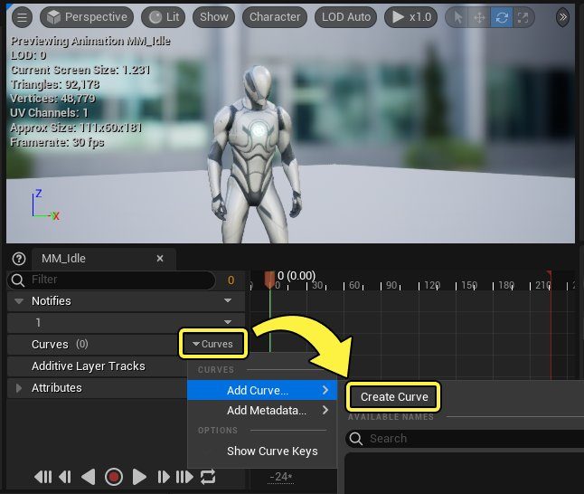
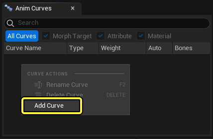
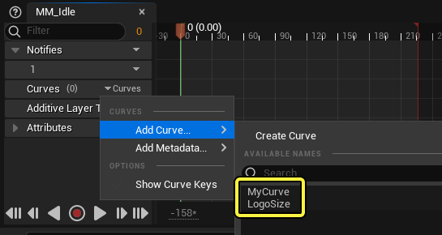
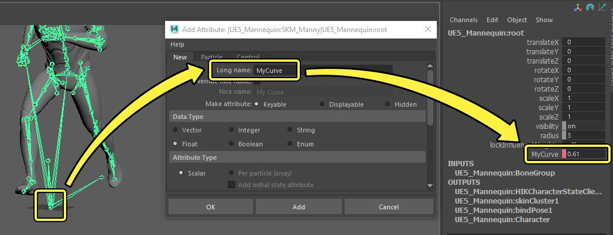
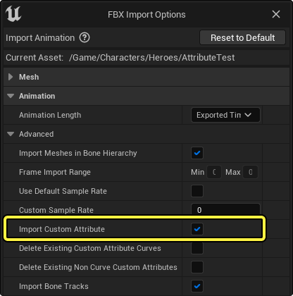
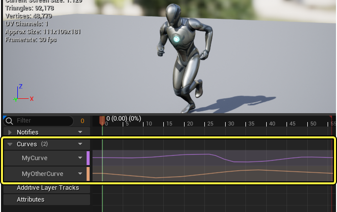
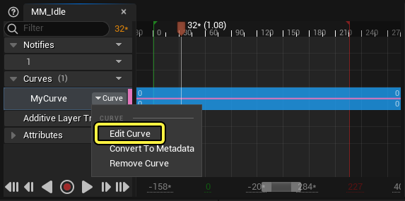
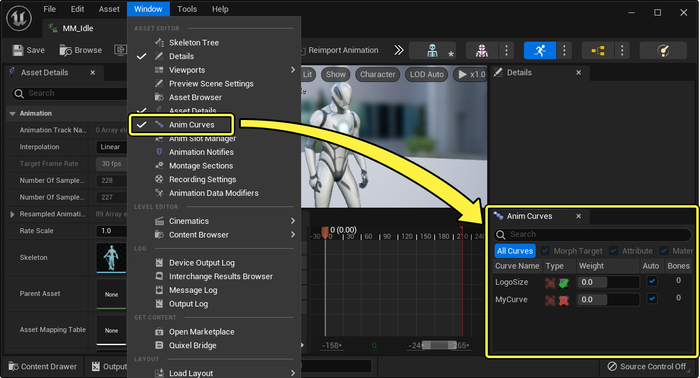

# 动画曲线

> 路径：虚幻引擎5.7文档 / 为角色和对象制作动画 / 骨架网格体动画系统 / 动画资产和功能 / 动画序列 / 动画曲线

> 原始页面：https://dev.epicgames.com/documentation/unreal-engine/animation-curves-in-unreal-engine

你在 **骨骼网格体** 上播放[动画序列](../index.md)时，需要对同步到该动画的额外属性和值制作动画。你可以使用 **动画曲线** （也称为 **anim曲线** 或 **曲线** ）完成此操作，这些曲线是你可以在动画序列中添加和设为关键帧的浮点类型值。曲线很适合通过具有动画动作的额外属性增强你的动画，例如对[材质参数](../../../../../designing-visuals-rendering-and-graphics/unreal-engine-materials/instanced-materials/index.md)、[变形目标](../../../../../working-with-content/fbx-content-pipeline/fbx-morph-target-pipeline/index.md)和其他属性制作动画。

本文档提供了关于动画曲线及其各种用法的概述。

#### 先决条件

- 你的项目包含

  骨骼网格体

  和

  动画序列

  。
- 如果你使用动画曲线来影响

  材质参数

  ，你需要对

  材质实例化

  有基本的了解。
- 如果你使用动画曲线来影响

  变形目标

  ，你需要对如何在骨骼网格体上设置

  变形目标

  有基本的了解。

## 创建动画曲线

动画曲线可以按以下方式创建：

1. 在[动画序列编辑器](../../../animation-editors/animation-sequence-editor/index.md)中查看 **动画序列** 时，点击 **曲线（Curves）** 轨道下拉菜单并选择 **添加曲线…（Add Curve…）> 创建曲线（Create Curve）** 。输入新曲线的名称并按 **Enter** 键来创建曲线。

   
2. 在[动画曲线面板](#%E5%8A%A8%E7%94%BB%E6%9B%B2%E7%BA%BF%E9%9D%A2%E6%9D%BF)，右键点击 **曲线列表区域** 并选择 **添加曲线（Add Curve）** 。输入新曲线的名称并按 **Enter** 键来创建曲线。

   
3. 如果你的骨架已有曲线，你可以从 **曲线（Curves）> 添加曲线…（Add Curve…）** 下拉菜单选择曲线。

   

> [!NOTE]
> 动画曲线存储在 **骨架资产（Skeleton Asset）** 上。因此，当你创建曲线时，你还会编辑[骨架](../../skeletons/index.md)，这需要你进行保存。

### 导入动画曲线

你也可以在Autodesk Maya等外部动画软件中创建自定义属性，再将其作为曲线，与动画序列一起导入。

具体方法是先在你的骨架中的任何骨骼上[创建一个自定义属性](https://knowledge.autodesk.com/support/maya/learn-explore/caas/CloudHelp/cloudhelp/2019/ENU/Maya-Basics/files/GUID-C7385EC4-74E1-4F6E-8C9D-60F5CCDA7994-htm.html)并为其设置关键帧。你必须确保其为浮点类型属性，因为这是曲线唯一兼容的数据类型。完成后，导出你的动画。

> [!NOTE]
> 你必须按顺序为自定义属性设置关键帧，才能正确导入曲线数据。

接下来，[导入含有自定义属性的动画序列](../index.md)。在导入FBX文件时，却确保启用了 **导入自定义属性（Import Custom Attribute）**。

导入后，你的曲线将出现在动画序列中。在本例中，我们在不同的骨骼上创建了两个属性，并将其导入。

## 创建曲线动画

创建动画曲线并将其添加到动画序列后，可以对其值制作动画。选择动画曲线轨道上的 **曲线（Curve）** 下拉菜单并点击 **编辑曲线（Edit Curve）** 。这将打开[曲线编辑器](../../../../cinematics-and-movie-making/unreal-engine-sequencer-movie-tool-overview/animation-curve-editor/index.md)。

> [!NOTE]
> 你还可以双击特定曲线轨道的 **时间轴区域** 来打开曲线编辑器。
>
> > 动图已省略：双击以编辑曲线

曲线编辑器打开后，你可以按 **Enter** 键创建关键帧。这将在 **播放头** 位置创建关键帧，拖动该位置可移动，将关键帧设置在序列上的其他时间。你可以点击并拖动关键帧来更改其时间和值。

> 动图已省略：在曲线编辑器中编辑曲线

请参阅[曲线编辑器](../../../../cinematics-and-movie-making/unreal-engine-sequencer-movie-tool-overview/animation-curve-editor/index.md)页面，详细了解导航、关键帧以及使用曲线编辑器进行切线编辑。

- [曲线编辑器](../../../../cinematics-and-movie-making/unreal-engine-sequencer-movie-tool-overview/animation-curve-editor/index.md)

## 动画曲线面板

你创建和存储的曲线可以在 **动画曲线（Anim Curves）** 面板中查看和管理。要查看此面板，请找到编辑器主菜单并启用 **窗口（Window）> 动画曲线（Anim Curves）** 。动画曲线（Anim Curve）面板只能从[骨架编辑器](../../../animation-editors/skeleton-editor/index.md)、[动画序列编辑器](../../../animation-editors/animation-sequence-editor/index.md)或[动画蓝图编辑器](../../../animation-blueprints/animation-blueprint-editor/index.md)查看。

### 曲线管理

你可以在动画曲线（Anim Curve）面板中的曲线条目上调整多个设置和功能。

> 图片已省略：曲线设置

| 名称 | 说明 |
| --- | --- |
| **曲线名称（Curve Name）** | 曲线的名称。你可以右键点击动画曲线（Anim Curve）面板并选择 **重命名曲线（Rename Curve）** 来重命名曲线。 重命名曲线 |
| **类型（Type）** | 允许将此曲线用于[变形目标](#%E5%8F%98%E5%BD%A2%E7%9B%AE%E6%A0%87)或[材质](#%E6%9D%90%E8%B4%A8)。 |
| **权重（Weight）** | 曲线的当前值。 |
| **自动（Auto）** | 启用此项将在此序列中制作曲线动画时导致 **权重（Weight）** 值根据其设为关键帧的值自动更改。如果禁用此项，将忽略其动画值。禁用此项很适合测试曲线值如何影响角色，而不用将其设为关键帧。 自动设置 |
| **骨骼（Bones）** | [连接](#%E6%9B%B2%E7%BA%BF%E7%BB%86%E8%8A%82)到此曲线的骨骼数量。 |

### 曲线筛选

你可以在动画曲线（Anim Curves）面板中筛选曲线列表，以仅显示常用的曲线，或者仅显示特定类型的曲线。

- 禁用

  所有曲线（All Curves）

  将导致仅显示此动画序列当前使用的曲线。
- 禁用

  变形目标（Morph Target）

  、

  属性（Attribute）

  和

  材质（Material）

  曲线将禁止显示这些曲线类型。

> 动图已省略：曲线筛选

### 曲线细节

选择曲线将在 **细节（Details）** 面板中显示以下属性。

> 图片已省略：曲线细节

| 名称 | 说明 |
| --- | --- |
| **曲线名称（Curve Name）** | 曲线的名称。 |
| **连接的骨骼（Connected Bones）** | 你可以连接到此曲线一组骨骼。如果你希望根据骨骼是否被使用而激活特定曲线，这会很有用。你可以根据是否[合并不同的骨架](../../skeletons/index.md#%E5%AF%BC%E5%85%A5%E6%9C%9F%E9%97%B4%E5%90%88%E5%B9%B6)或者是否针对不同的LOD[减少](../../skeletons/skeletal-mesh-lods/index.md#%E5%87%8F%E5%B0%91%E9%AA%A8%E9%AA%BC)骨骼来激活或不激活骨骼。 |
| **最大LOD（Max LOD）** | 此曲线可使用的最大[LOD](../../skeletons/skeletal-mesh-lods/index.md)，超过此限后将不再求值。例如，将此值设置为 **1** 会导致此曲线针对LOD 0和1求值，但针对2及更高的值不求值。 |

## 使用动画曲线

创建曲线并对其制作动画后，你可以通过各种方式使用该曲线来影响角色。

### 材质

你可以使用动画曲线自动影响[标量材质参数](../../../../../designing-visuals-rendering-and-graphics/unreal-engine-materials/instanced-materials/index.md#%E6%A0%87%E9%87%8F%E5%8F%82%E6%95%B0)。这需要你执行以下操作：

1. 将曲线名称与材质中材质参数的名称相匹配。

   > 图片已省略：曲线名称匹配材质参数
2. 在 **动画曲线（Anim Curves）** 面板中启用材质（Material）曲线类型。

   > 图片已省略：启用动画曲线上的材质类型

完成此操作后，曲线值开始影响材质参数。

> 动图已省略：曲线影响材质

> [!NOTE]
> 材质动画曲线会影响分配给骨骼网格体的所有材质（及其参数）。因此，如果你希望动画曲线仅影响单个材质中的参数，你可能需要相应调整内容。如果骨骼网格体有多个分配的材质派生自单个父材质，这将导致所有分配的材质采用相同的参数名称，从而发生这种情况。
>
> > 图片已省略：多个材质

### 变形目标

你可以像使用材质一样使用动画曲线自动影响骨骼网格体上的[变形目标](../../../../../working-with-content/fbx-content-pipeline/fbx-morph-target-pipeline/index.md)。这需要你执行以下操作：

1. 将曲线名称与[变形目标预览器](../../morph-target-previewer/index.md)中变形目标的名称相匹配

   > 图片已省略：将动画曲线名称与变形目标相匹配
2. 在 **动画曲线（Anim Curves）** 面板中启用变形目标（Morph Target）曲线类型。

   > 图片已省略：启用动画曲线上的变形目标类型

完成此操作后，曲线值开始影响变形目标。

> 动图已省略：曲线影响变形目标

### 动画蓝图

你可以使用动画曲线影响[动画蓝图](../../../animation-blueprints/index.md)中的任意值。在大部分情况下，你可以使用它们来影响特定动画图表节点的alpha值，例如例如IK，以便在播放动画期间更改IK状态。

> 图片已省略：动画蓝图中的曲线值

以下与曲线相关的函数在动画蓝图动画图表和事件图表中均可用：

| 名称 | 图像 | 说明 |
| --- | --- | --- |
| **Get Active Curve Names** | get active curve names | 这会以动画实例为目标，并返回指定曲线类型的激活曲线名称的上次更新列表。 |
| **Get All Curve Names** | get all curve names | 这会以动画实例为目标，并将所有曲线名称返回到字符串数组中。 |
| **Get Curve Value** | get curve value | 这会以动画实例为目标，并返回指定曲线名称的值。 |

## 元数据曲线

元数据曲线是在添加到动画序列时输出静态曲线值 **1.0** 的动画曲线。它们可以按照与普通动画曲线相反的方式运作，后者在默认情况下（没有关键帧）输出静态曲线值 **0.0** 。如果没有将曲线添加到序列，动画曲线值也将回退为值 **0.0** 。

此行为在包含许多动画序列的较大项目中很有用。在这些项目中，许多动画可能自始至终需要常量 **1.0** 曲线值。因此，你可以使用 **元数据曲线（Metadata Curves）** 加快此过程，而不是手动添加普通曲线并采用 **1.0** 将其设为关键帧。换句话说，大项目在使用动画曲线时，可以按以下方式组织其在动画序列中的用法：

- 少数动画序列可能需要有显式曲线动画。因此，将

  动画曲线

  添加到这些动画，并相应将其

  设为关键帧

  。
- 更多的动画序列可能需要恒定设为

  1.0

  的曲线值，以便维持属性值。因此，将

  元数据曲线

  添加到这些动画。
- 其余所有动画序列可能不需要考虑曲线值，或者需要恒定设为

  0.0

  的曲线值。不需要执行操作。

要创建元数据曲线，请点击 **曲线（Curves）** 轨道下拉菜单并选择 **添加曲线…（Add Curve…）> 创建曲线（Create Curve）** 。你可以选择现有曲线，或点击 **新建（Create New）** 来创建新曲线。

> 图片已省略：创建元数据曲线

你也可以将现有动画曲线转换为元数据曲线，方法是点击曲线轨道上的 **曲线（Curve）** 下拉菜单并选择 **转换为元数据（Convert To Metadata）** 。

> 图片已省略：转换为元数据曲线

元数据曲线在创建之后是只读的，并输出常量曲线值 **1.0** 。

> 图片已省略：元数据曲线
