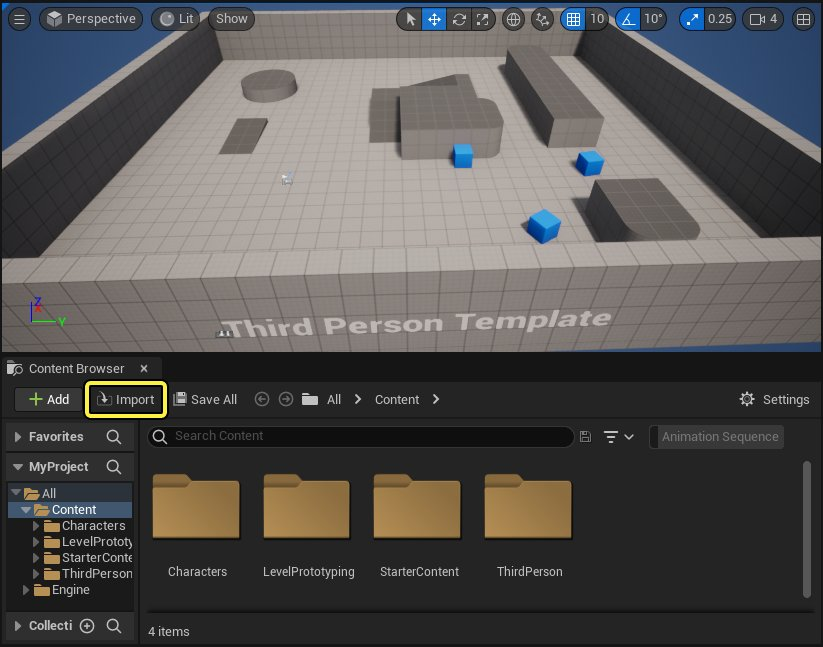
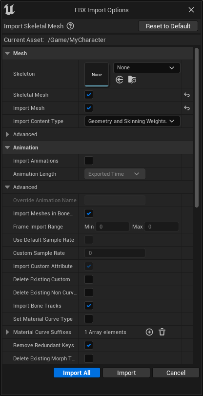
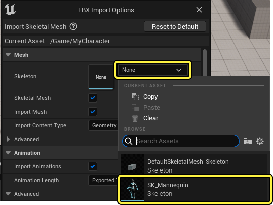
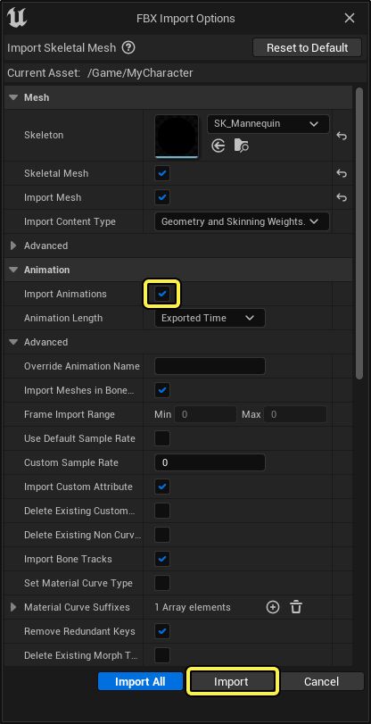
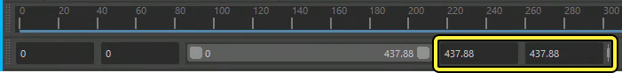
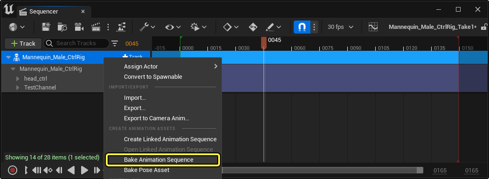
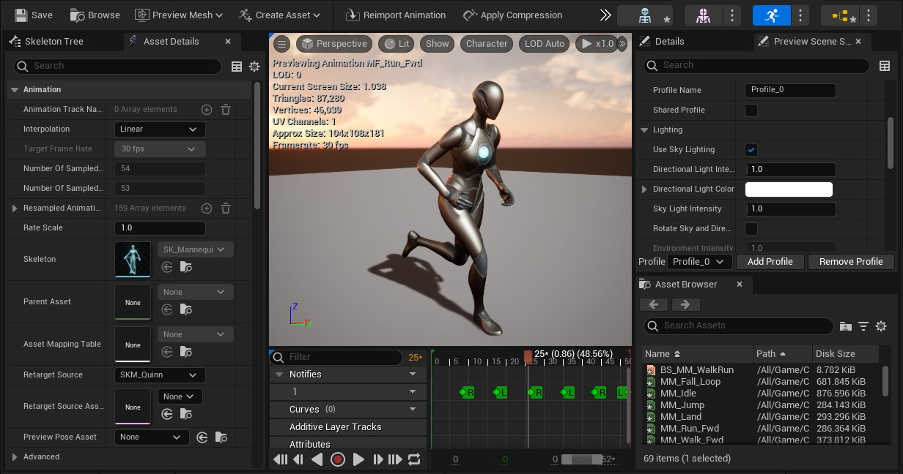
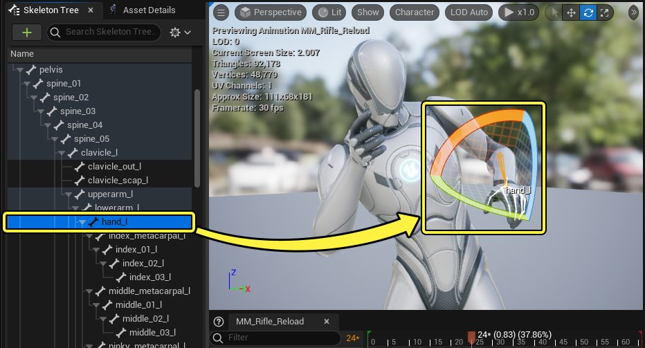

# 动画序列

> 路径：虚幻引擎5.7文档 / 为角色和对象制作动画 / 骨架网格体动画系统 / 动画资产和功能 / 动画序列

> 原始页面：https://dev.epicgames.com/documentation/unreal-engine/animation-sequences-in-unreal-engine

## 概览

动画序列（Animation Sequence）是一种可以在[骨骼网格体](../../../../working-with-content/skeletal-mesh-assets/index.md)上播放的动画资产。一个动画序列包含许多个关键帧，这些关键帧规定了骨骼网格体中[骨骼](../skeletons/index.md)在特定时间点的位置、旋转和缩放信息。通过按照顺序混合这些关键帧，就能在骨骼网格体上播放骨骼动画了。

> 动图已省略：动画序列示例

动画序列资产需要绑定到骨骼上使用。你可以在使用同一个骨架的多个骨骼网格体之间共享动画。

> 动图已省略：在使用同一骨骼的不同网格体上播放动画

## 创建动画

动画序列大多在另外的动画和建模软件中创建，包含在一个FBX文件中。你可以在FBX导入过程中将其导入虚幻引擎来在你的项目中使用它。

### 导入动画

要导入动画，请在 **内容浏览器（Content Browser）** 中点击 **导入（Import）**。

在你电脑的文件资产管理器窗口中找到并选择包含了要导入的动画的FBX文件。

然后会弹出 **FBX导入选项（FBX Import Options）** 窗口。你在这里可以调整动画的导入方式。

**FBX导入选项（FBX Import Options）** 窗口包含以下可以调整的属性：

| 属性 | 描述 |
| --- | --- |
| **导入动画（Import Animation）** | 导入包含动画的FBX文件时，启用该属性来将动画作为动画序列资产导入。 |
| **动画长度（Animation Length）** | **导出时间（Exported Time）**: 基于时间根据导出长度导入动画。 **高级时间（Advanced Time）**: 导入动画中有动画数据的时间段。 **设置范围（Set Range）**: 根据在 **帧导入范围（Frame Import Range）** 属性中定义的帧范围来导入动画。 |
| **覆盖动画名称（Override Animation Name）** | 选用该选项时，该属性会用指定的名称替换导入的动画的名称。默认情况下动画会使用FBX文件的名称。 |
| **在骨骼层级中导入网格体（Import Meshes in Bone Hierarchy）** | 如果选中此选项，嵌套在骨骼层级中的网格体将被导入而不是转换为骨骼。 |
| **帧导入范围（Frame Import Range）** | 在 **动画长度（Animation Length）** 中使用 **设置范围（Set Range）** 时使用的帧范围。 |
| **默认采样速率（Default Sample Rate）** | 将所有的动画曲线的采用速率设置为30 fps。 |
| **自定义采样速率（Custom Sample Rate）** | 定义一个自定的采样速率来导入动画数据。如果设为0，虚幻引擎会自动找出最佳采样速率。 |
| **导入自定义属性（Import Custom Attribute）** | 启用后，会将FBX属性导入为[曲线](animation-curves/index.md)，或导入为[动画属性](fbx-attributes/index.md)。 |
| **删除现有自定义属性曲线（Delete Existing Custom Attribute Curves）** | 如果在重新导入的时候启用，任何现有的自定义属性曲线都会被删除。 |
| **删除现有非曲线自定义属性（Delete Existing Non Curve Custom Attributes）** | 如果在重新导入的时候启用，任何现有的非曲线自定义属性都会被删除。 |
| **导入骨骼轨道（Import Bone Tracks）** | 启用后，将会导入骨骼变换轨道。如果禁用，所有的骨骼变换轨道都会被舍弃。在使用仅曲线的动画时删除骨骼变换曲线会很有用。 |
| **设置材质曲线类型（Set Material Curve Type）** | 启用后，会为存在的所有自定义属性设置材质曲线类型。 |
| **材质曲线后缀（Material Curve Suffixes）** | 在这里可以为具有以下后缀的自定义属性设置材质曲线类型。这与 **设置材质曲线类型（Set Material Curve Type）**是否启用无关。 |
| **移除冗余关键帧（Remove Redundant Keys）** | 将自定义属性作为曲线导入时，移除冗余关键帧。 |
| **删除现有变形目标曲线（Delete Existing Morph Target Curves）** | 启用后，将在导入时从FBX删除所有 **变形目标曲线（Morph Target Curves）**。 |
| **不导入值仅为0的曲线（Do not import curves with only 0 values））** | 启用后，将自定义属性或变形目标作为曲线导入时，如果值为0，则不导入。这可以避免添加额外曲线进行求值。 |
| **保留局部变换（Preserve Local Transform）** | 启用后，将会导入动画中所有的曲线。 |

通过 **导入设置（Import Settings）** 窗口中的 **骨骼（Skeleton）** 属性，可以选择驱动导入的动画的骨骼。不填写该属性时会直接将FBX文件中的骨骼结构作为新的骨骼导入

> [!NOTE]
> 要使用已有的骨骼来驱动任何导入的动画，动画必须使用类似的骨骼。虚幻引擎会使用[骨骼树](../../animation-editors/skeleton-editor/index.md#skeletontree)中的骨骼 **名称（names）** 和 **层级（hierarchy）** 自动将动画中的骨骼与已有的骨骼匹配。

确保 **导入动画（Import Animation）** 选项以启用并选择 **导入（Import）**。

> [!NOTE]
> 同时导入多个FBX时，你可以使用 **导入全部（Import All）** 来用同样的 **FBX导入选项（FBX Import Options）**导入全部选中的FBX文件。

完成导入后，你的动画会作为动画序列资产显示在内容浏览器中。

> [!WARNING]
> 如果动画的结束帧的不是整数值，动画可能无法正确导入虚幻引擎。
>
> 
>
> 你可以将动画序列导入到外部DCC中，然后将结束帧编辑为整数值，或者将FBX导入选项中的 **动画长度（Animation Length）** 属性设置为 **帧范围（Frame Range）**，并手动设置高级部分中的 **帧导入范围（Frame Import Range）** 属性来修复该错误。

更多关于向虚幻引擎中导入动画的信息，请参考[FBX动画流程](../../../../working-with-content/fbx-content-pipeline/fbx-animation-pipeline/index.md)和[如何导入动画](../../../../working-with-content/fbx-content-pipeline/fbx-animation-pipeline/importing-animations-using-fbx/index.md)。

### Sequencer

[Sequencer](../../../control-rig/animating-with-control-rig/fk-control-rig/index.md)可以用于在虚幻引擎中只使用骨骼网格体创建动画。在使用[动画轨道](../../../cinematics-and-movie-making/unreal-engine-sequencer-movie-tool-overview/sequencer-track-list/cinematic-animation-track/index.md)或者用[Control Rig](../../../control-rig/animating-with-control-rig/index.md)创建动画时，如果想要将动画作为新的动画序列保存，该工具会非常有用。

要用在 **Sequencer** 中创建的动画来创建新的动画序列，**右键点击** 骨骼网格体Actor轨道然后选择 **烘焙动画序列（Bake Animation Sequence）**。

你还可以通过FK Control Rig编辑现有的动画，以此来创建动画序列的不同变种和修改过的版本。

关于Control Rig的更多信息，以及如何使用Control Rig来在虚幻引擎中为角色添加动画，参考[Control Rig](../../../control-rig/index.md)文档。

## 编辑动画序列

使用动画序列时，可以使用[动画序列编辑器](../../animation-editors/animation-sequence-editor/index.md)向已有的动画添加编辑并进行调整。在动画序列编辑器中可以预览播放，用多个图层调整动画以及添加动画通知和曲线。

以下是编辑和修改你项目中已有的动画的几种方式。

### 叠加动画轨道

你可以使用 **骨骼操作（Bone Manipulation）** 工具来调整动画序列中角色骨骼的位置。在视口或者骨骼树面板中选中一个骨骼，使用移动工具操作骨骼的位置和旋转。

操作完骨骼后，在 **工具栏（Toolbar）** 中点击 **添加关键帧（Add Key）** 来在 **叠加动画轨道（additive animation track）** 中保存移动数据，它将会出现在序列时间轴上。

> 图片已省略：操作完骨骼后点击添加关键帧在叠加轨道上添加动作

叠加轨道会混合骨骼的位置来使其在添加的关键帧上与操作过的位置匹配。

更多关于骨骼操作的信息，参考骨骼编辑器文档的[骨骼操作](../../animation-editors/skeleton-editor/index.md#bonemanipulation)小节。

### 录制功能

编辑动画序列时，可以使用 **录制按钮（Record Button）** 实时录制操作的动作并将动画保存为新的序列。

> 动图已省略：使用录制按钮录制新的动画序列

产出的动画可以作为单独的动画序列资产使用。

> 动图已省略：录制动画来生成新的动画序列示例

你还可以使用录制功能从混合的动画来创建动画资产。

> 动图已省略：在动画蓝图中录制混合的动画

### 共享动画

如果你的项目使用了不同的骨架和骨骼网格体，你可以让这些资产共用动画序列。你可以根据项目的需要，用多种方式共享动画，或者重定向骨骼。

> 动图已省略：IK rig重定向示例

对于不使用同一个骨架但是有着 **同样骨骼结构** 的骨骼网格体，你可以将它们的骨骼定义为 **可兼容（Compatible）**，以便共用动画序列。请参考 **骨架（Skeleton）** 文档中的[可兼容骨架](../skeletons/index.md#%E5%8F%AF%E5%85%BC%E5%AE%B9%E9%AA%A8%E6%9E%B6)部分来获取更详细的信息。

%animating-characters-and-objects/SkeletalMeshAnimation/AssetsFeatures/Skeleton:topic%

对于使用相同骨架但是有着 **不同网格体比例** 的骨骼网格体，如想要共享动画序列，你可以使用动画重定向。请参考[动画重定向](../skeletons/animation-retargeting/index.md)文档来获取更多信息。

- [动画重定位](../skeletons/animation-retargeting/index.md)

你可以通过IK Rig重定向，让某个骨骼网格体的动画序列来为另一个使用不同骨骼的骨骼网格体创建 **新的动画序列**。参考[IK Rig 重定向](https://dev.epicgames.com/documentation/404)文档来获取更多信息。

%animating-characters-and-objects/SkeletalMeshAnimation/AssetsFeatures/IKRig/IKRetargeting:topic%

## 动画压缩

压缩设置是可以定义的数据资产。它会压缩动画资产。压缩时会移除动画数据，减少动画的内存占用来改善项目的性能。有较少动作的动画受压缩影响会更小，而包含细节动作的动画会明显受到更大的影响。

要创建压缩设置资产，在内容浏览器中点击 **添加（Add (+)）**；然后选择 **动画（Animation > 骨骼压缩设置（Bone Compression Settings）** 或者 **曲线压缩设置（Curve Compression Settings）**。

> 图片已省略：在内容浏览器中添加压缩资产

创建好压缩资产后，可以在 **内容浏览器（Content Browser）** 中 **双击** 它来打开它的 **细节（Details）** 面板。

### 骨骼压缩设置

骨骼压缩设置资产用于向动画序列的骨骼数据定义并应用压缩方式。骨骼压缩会基于在骨骼压缩设置的属性中定义的编解码器方式移除不必要或者任意的骨骼运动数据。

> 图片已省略：骨骼压缩设置资产设置

骨骼压缩设置资产有以下可调整的属性：

| 属性 | 描述 |
| --- | --- |
| **编解码器（Codecs）** | 在这里可以在列表中定义多个动画骨骼压缩编解码器来在压缩动画序列中骨骼数据的时候试用。可以使用以下编解码器： **动画压缩仅按位压缩（Anim Compress Bitwise Compress Only）**: 仅按位的动画压缩；不减少关键帧。 **动画压缩无损（Anim Compress Least Destructive）**: 还原所有动画压缩，将动画还原为原始数据。 **动画压缩每个轨道压缩（Anim Compress Per Track Compression）**: 主要按照每个轨道进行压缩，单独压缩每个轨道。 **动画压缩隔帧移除（Anim Compress Remove Every Second Key）**: 隔帧移除动画中的关键帧。 **动画压缩线性帧移除（Anim Compress Remove Linear Keys）**: 移除与周围帧相同的帧。 **动画压缩移除琐碎帧（Anim Compress Remove Trivial Keys）**: 移除资产的位置和方向保持不变的不重要的帧。 列表中的空项会在压缩时被忽略。然而，列表中必须包含至少一个编解码器来压缩骨骼数据。 |
| **误差阈值（Error Threshold）** | 启用并压缩中触发时，该属性会使用低于该阈值的最佳的编解码器。默认阈值为0.1。 |
| **强制低于阈值（Force Below Threshold）** | 启用后，任何有较低误差阈值的编解码器都会被使用，直到误差低于阈值。 |

你可以在动画序列的 **资产详情（Asset Details）** 面板中应用骨骼压缩设置，位于 **骨骼压缩设置(Bone Compression Settings）** 属性之下。

> 图片已省略：添加骨骼压缩资产

### 曲线压缩设置

使用曲线来驱动动画序列属性时，曲线压缩可以很好地保存项目的性能。

> 图片已省略：曲线压缩设置资产设置

曲线压缩设置资产有以下几个可调整的属性：

| 属性 | 描述 |
| --- | --- |
| **编解码器（Codec）** | 定义动画曲线压缩编解码器。可以使用以下几种编解码器类型： **压缩丰富曲线（Compressed Rich Curves）**: 仅针对丰富曲线进行压缩。 **统一可索引（Uniform Indexable）**: 压缩曲线时使曲线上的点对于其它功能可用。 **统一采样（Uniformly Sampled）**: 压缩后，任何曲线都会采用统一的采样率。 |
| **最大曲线误差（Max Curve Error）** | 压缩丰富曲线时所允许的最大误差阈值。默认值为0。 |
| **使用动画序列采样率（Use Anim Sequence Sample Rate）** | 启用后，可以使用明确的动画序列采样率数值。 |
| **误差采样率（Error sample rate）** | 启用使用动画序列采样率（Use Anim Sequence Sample Rate）时，动画序列会在测量曲线误差时将定义的值作为采样率来使用。默认数值为60。 |

你可以在动画序列的资产详情面板中应用曲线压缩设置，位于曲线压缩设置属性之下。

> 图片已省略：添加曲线压缩设置资产

## 动画序列功能

以下可以找到相关的动画序列功能，可用于项目中的动画序列。

- [动画属性](fbx-attributes/index.md) - 在动画序列中导入并使用自定义动画FBX属性。

- [动画曲线](animation-curves/index.md) - 使用动画曲线为材质参数、变形目标和同步到动画的其他属性制作动画。

- [重定向管理器](retarget-manager/index.md) - 详解骨架编辑器中的重定向管理器选项。

- [动画通知](animation-notifies/index.md) - 使用动画通知来发送和接收同步到动画序列的事件。
