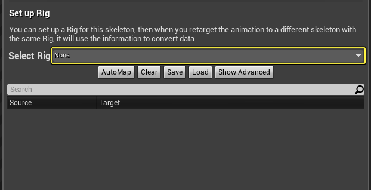
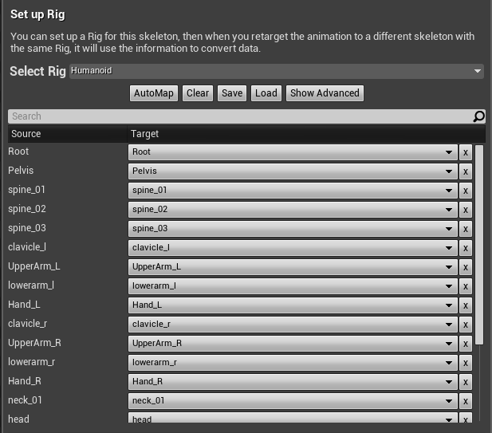

# 重定向管理器

> 路径：虚幻引擎5.7文档 / 为角色和对象制作动画 / 骨架网格体动画系统 / 动画资产和功能 / 动画序列 / 重定向管理器

> 原始页面：https://dev.epicgames.com/documentation/unreal-engine/retarget-manager-in-unreal-engine

**骨架编辑器** 中的 **重定向管理器（Retarget Manager）**可用来管理重定向源，设置骨架绑定以及定义用于[动画重定向](../../../animation-workflow-guides-and-examples/using-retargeted-animations/index.md)的重定向后的基本姿势。

## 管理重定向源

因为重定向使用[**骨架**](../../skeletons/index.md)资产，而骨架的原比例是由最初为之创建骨架的骨架网格体定义的，由此得出结论，在大多数情况下可以顺利地实现单向重定向。但是常常会有一些专为变体版本构建的特殊动画。例如，假设你的多个角色共用了同一个骨架资产（一个基本角色、一个矮小角色和一个高大角色）而你仅为角色的高大版本创建了特殊动画。

如果你将这个新的仅包含高大角色的动画导入，仍然需要和以前一样使用从角色的基本版本创建的同一骨架资产。这将导致新动画的比例失真。解决方法就是使用 **重定向管理器（Retarget Manager）** 中的 **管理重定向源（Manage Retarget Source）** 选项，它使你能够将动画序列与为之设计了动画序列的实际骨架网格体关联。通过这种方法，任何特殊动画重定向问题都可以得到解决。

### 添加重定向源

1. 在 **骨架编辑器** 中，从 **工具栏** 中单击 **重定向源管理器（Retarget Source Manager）** 按钮。
2. 单击 **添加新重定向源（Add New Retarget Source）** 按钮。
3. 选择为之创建了特殊动画的 **骨架网格体**。

   现在你可以看到该骨架网格体在 **重定向管理器（Retarget Manager）** 中列出。
4. 打开针对你的特定 **骨架网格体** 的特殊 **动画序列**。
5. 在 **资产细节（Asset Details）** 面板中，找到 **动画（Animation）** 类别，然后找到 **重定向源（Retarget Source）** 属性并从下拉菜单中选择你的特定 **骨架网格体**。

   通过选择此网格体，你就指定了要使用该网格体的比例驱动此动画。

## 设置骨架绑定

"重定向管理器（Retarget Manager）"的中间部分允许你为骨架指定 **骨架绑定**，可用它将动画数据传递给使用同一个骨架绑定的不同骨架。

为使用不同骨架资产的角色执行任何动画重定向时，需要用到此流程。

你可以从 **选择骨架绑定（Select Rig）** 下拉选项中选择要使用的骨架绑定，其中包含 **人形（Humanoid）** 选项，你将需要为大多数角色选择它。

指定好人形骨架绑定后，你将需要指定骨架中与骨架绑定上的节点对应的相同（或相似）位置的骨骼。你可以使用下拉菜单来选择节点并手动从骨架指定相应的骨骼，或者你可以使用位于菜单顶部的 **自动映射（Auto Mapping）** 功能。此功能将对骨架进行翻查并尝试为骨架绑定上的每个节点找到最匹配的骨骼。

> [!NOTE]
> 如果你使用的不是双足角色，或者角色骨架的层级无法兼容人形绑定资产，那你可以自己创建绑定资产，方法是右键点击内容浏览器中的角色骨架，选择 **创建（Create） > 创建绑定（Create Rig）**。

**清除映射（Clear Mapping）** 按钮将从相应的节点指定中擦除所有当前已指定的骨骼。你也可以使用 **保存（Save）** 和 **加载（Load）** 按钮来保存当前映射指定或加载 **节点映射容器（Node Mapping Container）** 资产（如下所示）中以前保存的映射指定。

**显示高级（Show Advanced）** 按钮将允许你为手指、IK骨骼或扭转骨骼等指定额外的节点/骨骼关联。在为源骨架（驱动要重定向到另一个角色的动画的骨架资产）设置好骨架绑定后，你将需要前往目标骨架的骨架，并指定相同的骨架绑定及定义新骨架中与骨架绑定上的节点最匹配的骨骼。

> [!NOTE]
> 请参阅[使用重定向的动画](../../../animation-workflow-guides-and-examples/using-retargeted-animations/index.md)"来获取设置骨架绑定以在使用不同骨架的角色间重定向动画的分步指南。

## 管理重定向基本姿势

有时你可能希望将动画重定向到基本姿势与源骨架不太一致的骨架。

以下图右侧的骨架为例尝试重定向动画：

源骨架（左侧）呈A字姿势，而目标骨架呈T字姿势。如果我们就这样重定向动画，可能会遇到问题：

在左侧的目标动画中，角色手持散弹枪，然而，当我们将动画重定向到右侧的新角色时，（由于它们使用的基本姿势不同）手臂定位不正确。我们可以通过在 **重定向管理器（Retarget Manager）** 中重定向基本姿势来解决这一问题，重定向管理器（Retarget Manager）使我们能够定义基本姿势使其重定向，并使用重定向后的基本姿势来进行动画重定向，而非使用角色正常的基本姿势。

我们可以选中角色的骨骼并旋转它们（在本示例中，旋转左肩和右肩），使角色呈A字姿势，然后单击 **修改姿势（Modify Pose）**：

在上下文菜单中，选择 **使用当前姿势（Use Current Pose）**：

这样就可以把该姿势设置为在执行任何动画重定向时要使用的重定向后的基本姿势。

现在当我们重定向动画时，将会看到经过更新的重定向后的基本姿势：

当我们针对基本姿势相似度更高的骨架重定向动画时，我们将得到效果更好的结果：

### 从姿势资产导入重定向基本姿势

在 **修改（Modify）** 上下文菜单中，你也可以选择从动画[姿势资产](../../animation-pose-assets/index.md)导入姿势以将其用作重定向后的基本姿势。

在上图中，在选择好要使用的姿势资产（1）之后，可用的姿势将显示在选择下拉菜单中（2）。从姿势资产中选择好要使用的姿势之后，单击 **导入（Import）** 按钮（3），系统将会将视口中的网格体更新为使用刚刚选择的姿势作为重定向后的基本姿势。下面（左图）展示了默认的姿势而且（右图）展示了我们从姿势资产中选择的作为重定向后基本姿势的姿势。
