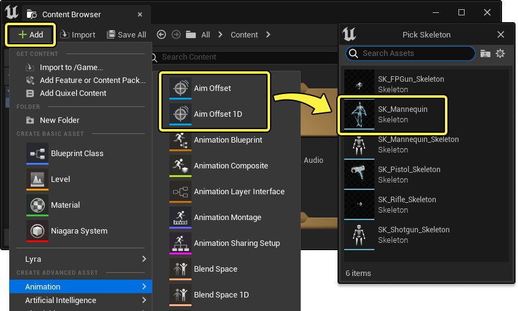
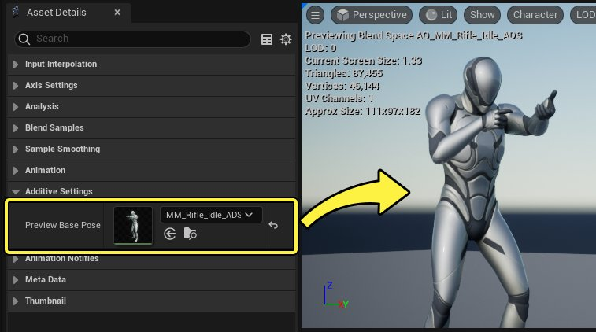
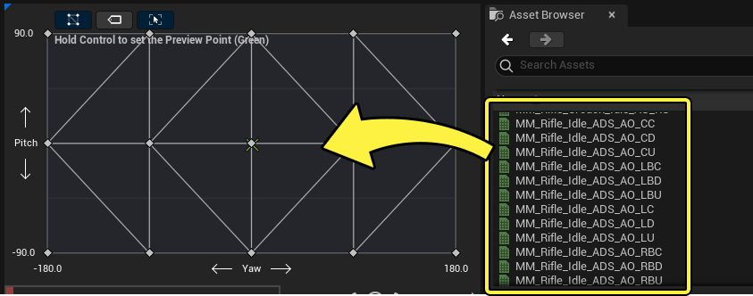
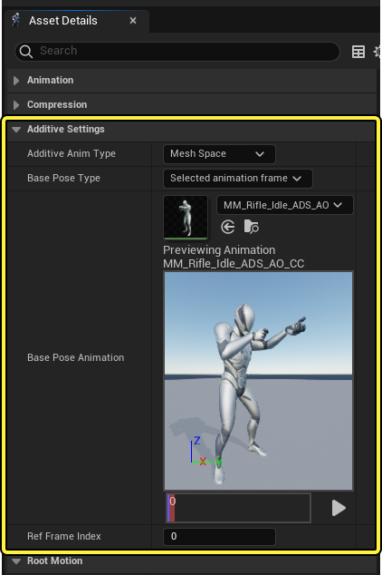
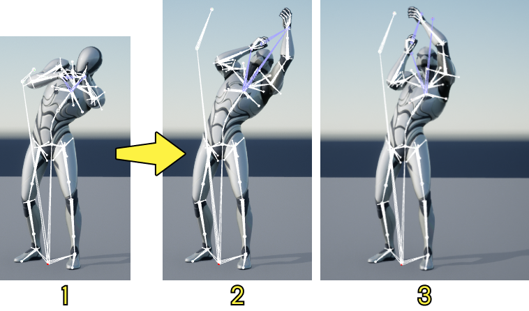
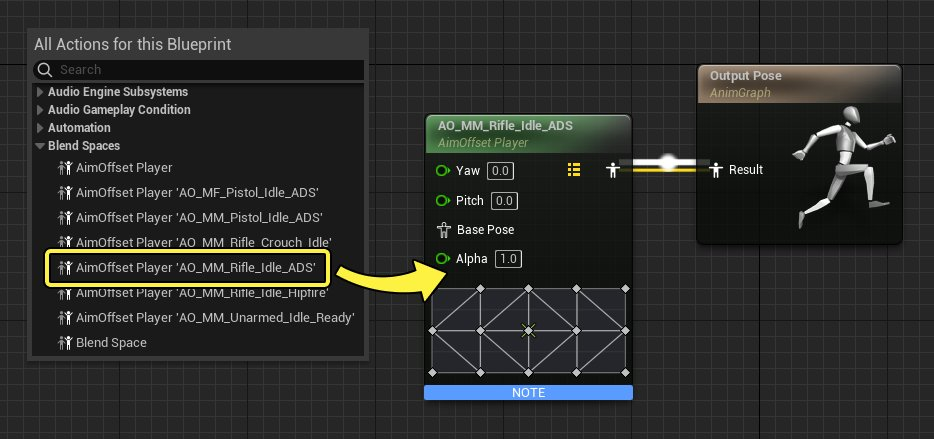
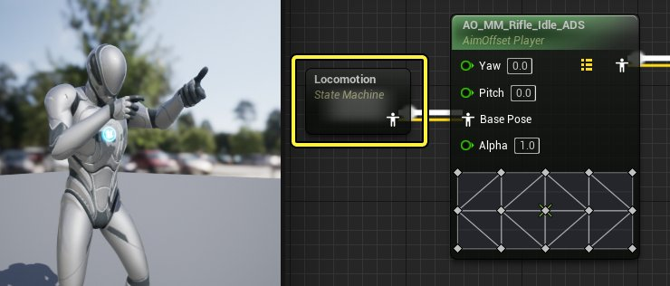
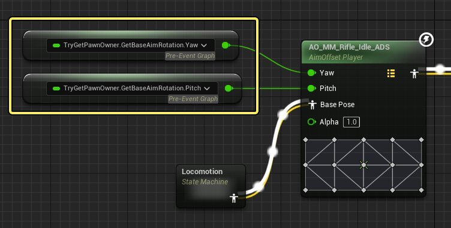

# 瞄准偏移

> 路径：虚幻引擎5.7文档 / 为角色和对象制作动画 / 骨架网格体动画系统 / 动画资产和功能 / 混合空间 / 瞄准偏移

> 原始页面：https://dev.epicgames.com/documentation/unreal-engine/aim-offset-in-unreal-engine

**瞄准偏移（Aim Offset）** 是一种[混合空间（Blend Space）](../index.md)，其中 **叠加** 了多个动画。一般来说，瞄准偏移用于创建多方向武器瞄准混合结构，然后叠加应用到默认的瞄准姿势。

#### 先决条件

- 你的项目包含一个骨骼网格体角色，并且包含所需的导入动画和姿势，可用作瞄准偏移（Aim Offset）图表中的示例。
- 你已了解

  混合空间

  。本文中的瞄准偏移（Aim Offset）也是一种混合空间。

## 概述

瞄准偏移的主要设计理念是，让动画叠加在现有的某个"基础动画"上。以瞄准武器为例，这种"基础动画"通常就是"向前瞄准"动画。

> 动图已省略：瞄准偏移基础动画

然后在此基础上，你可以在瞄准偏移（Aim Offset）图表中实现各种叠加姿势。所需姿势的数量取决于角色需要的动作。通常，瞄准空间示例系统如下所示：

|  |  |  |  |  |
| --- | --- | --- | --- | --- |
| 上右后 | 上右 | 上 | 上左 | 上左后 |

|  |  |  |  |  |
| --- | --- | --- | --- | --- |
| 右后 | 右 | 基础 | 左 | 左后 |

|  |  |  |  |  |
| --- | --- | --- | --- | --- |
| 下右后 | 下右 | 下 | 下左 | 下左后 |

## 创建和设置

要在内容浏览器（Content Browser）中创建瞄准偏移（Aim Offset），请点击 **添加(+)（Add (+)）** ，在上下文菜单中选择 **动画（Animation）> 瞄准偏移（Aim Offset）** 或 [**瞄准偏移1D（Aim Offset 1D）**](../blend-spaces-in-animation-blueprints/index.md#1d)。创建新瞄准偏移时，你必须指定骨架资产。请务必选择将使用该瞄准偏移资产的骨骼网格体资产。

打开新创建的瞄准偏移，继续设置。

### 基础姿势设置

由于在瞄准偏移中，你需要叠加各种动画，所以你先要设置一个基础动画，才能正确预览叠加效果。为此，请找到[资产细节（Asset Details）](../index.md#%E8%B5%84%E4%BA%A7%E7%BB%86%E8%8A%82)面板中的 **预览基础姿势（Preview Base Pose）** 属性，指定要播放的动画资产。

### 引用瞄准姿势

和[混合空间](../index.md#%E5%B0%86%E5%8A%A8%E7%94%BB%E6%B7%BB%E5%8A%A0%E5%88%B0%E5%9B%BE%E8%A1%A8)类似，在创建瞄准偏移时，你需要在混合图表中引用动画。最简单的方法是，将动画从 **资产浏览器（Asset Browser）** 面板拖到图表中。

> [!NOTE]
> 创建瞄准偏移系统时，你要注意偏转动作（左右摆动）的动画效果。例如，角色站立不动时，你在[上文](#%E6%A6%82%E8%BF%B0)中看到的示例姿势没有问题。但是，如果你让角色在其他动画状态中播放，比如跑步或步行，就可能会出现问题。
>
> 为避免这种问题，你可以使用动画蓝图限制用于瞄准偏移的传入数据，以便仅在角色静止时使用左右摆动极值。你也可以更改瞄准偏移，仅上下瞄准角色，通过旋转实际角色来处理左右摆动。

### 网格体空间叠加

如果要让动画用于瞄准偏移，动画必须是叠加型，并且 **叠加动画类型（Additive Anim Type）** 设置为 **网格体空间（Mesh Space）** 。这是必要条件，因为瞄准偏移只接受叠加型动画。

为此，打开你的瞄准偏移中正在使用的所有 **动画序列（Animation Sequences）** 。在它们的 **资产细节（Asset Details）** 面板中，找到并设置以下属性：

- 将

  叠加瞄准类型（Additive Anim Type）

  设置为

  网格体空间（Mesh Space）

  。
- 将

  基础姿势类型（Base Pose Type）

  设置为

  选定动画帧（Selected animation frame）

  。
- 将

  基础姿势动画（Base Pose Animation）

  设为使用与

  基础姿势设置

  相同的基础动画。
- 将

  参考帧索引（Ref Frame Index）

  设置为

  0

  。

选择 **网格体空间（Mesh Space）** ，而非 **局部空间（Local Space）** 的原因在于，选择网格体空间后，可以在 **骨骼网格体组件（Skeletal Mesh Component）** 的空间中应用其叠加效果。这能确保无论骨骼网格体中前一个骨骼的朝向如何，旋转都朝同一方向移动。这对于瞄准偏移很重要，因为在某些情况下，无论角色的当前基础姿势如何，你可能希望来自混合空间的旋转得到一致的应用。

例如，如果你的角色能够在瞄准时侧身倾斜，这可能导致骨骼的整体局部空间向倾斜方向移动。如果叠加类型设置为 **局部空间（Local Space）** ，则可能导致向上瞄准姿势倾斜，并且不能正确朝上。将 **网格体空间（Mesh Space）** 作为你的叠加类型可纠正此问题，因为你可以按照自己的预期应用来自混合空间的旋转偏移。

1. 倾斜后的基础姿势。
2. 倾斜和向上瞄准姿势（局部空间叠加）。
3. 倾斜和向上瞄准姿势（网格体空间叠加）。

## 动画蓝图设置

创建瞄准偏移后，你可以在[动画蓝图](../../../animation-blueprints/index.md)中引用它。与混合空间（Blend Spaces）类似，你可以将其作为[播放器](../blend-spaces-in-animation-blueprints/index.md#%E6%B7%B7%E5%90%88%E7%A9%BA%E9%97%B4%E6%92%AD%E6%94%BE%E5%99%A8)引用，它将直接引用瞄准偏移资产，你也可以将其作为[图表](../blend-spaces-in-animation-blueprints/index.md#%E6%B7%B7%E5%90%88%E7%A9%BA%E9%97%B4%E6%92%AD%E6%94%BE%E5%99%A8)引用，供你在动画图表中分散逻辑。

要在动画图表中引用瞄准偏移播放器（Aim Offset Player），请在图表中单击鼠标右键，从 **混合空间（Blend Spaces）** 类别中选择你的 **瞄准偏移播放器资产（Aim Offset Player Asset）** 。将输出连接到 **Output Pose** 节点。

你还必须将 **基础姿势（Base Pose）** 连接到Aim Offset节点，通常这是在[早前步骤基础姿势](#%E5%A4%B4%E6%96%87%E4%BB%B6%E5%90%8D%E7%A7%B0)，或使用类似基础姿势的[状态机](../../../animation-blueprints/state-machines/index.md)中定义的相同动画。

最后，你必须创建逻辑来驱动瞄准偏移的 **偏转（Yaw）** 值和 **俯仰（Pitch）** 值。根据你的播放器功能按钮，此逻辑可以用多种不同的方式创建。例如，你可以使用[属性访问](../../../animation-blueprints/graphing-in-animation-blueprints/index.md#%E5%B1%9E%E6%80%A7%E8%AE%BF%E9%97%AE)从pawn的基础瞄准旋转输出数据。

