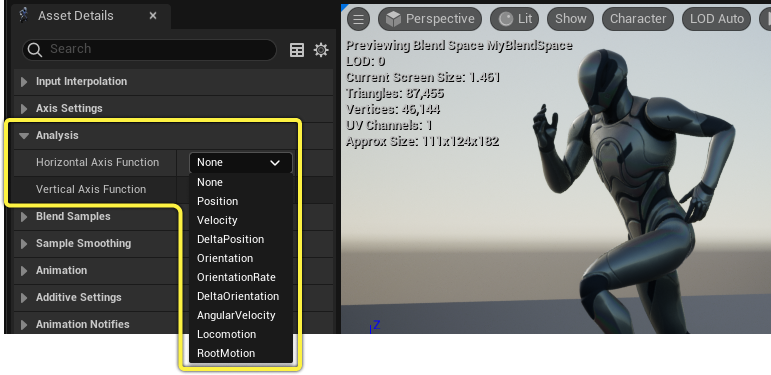
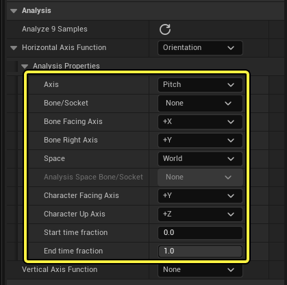
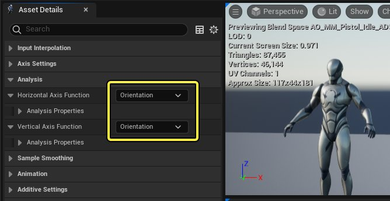
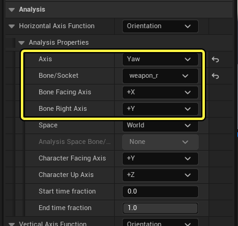
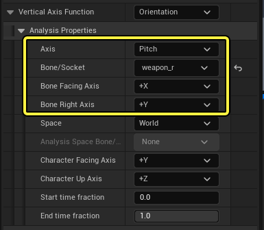
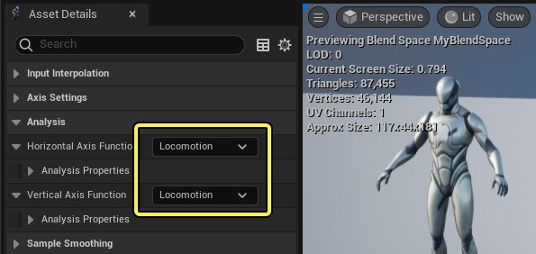
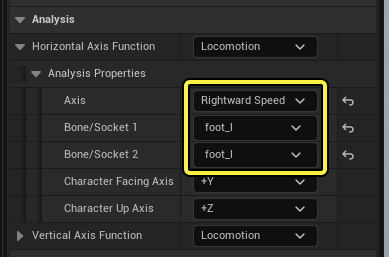
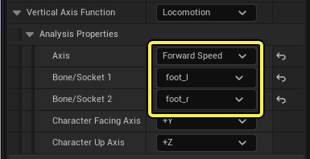

# 混合空间分析

> 路径：虚幻引擎5.7文档 / 为角色和对象制作动画 / 骨架网格体动画系统 / 动画资产和功能 / 混合空间 / 混合空间分析

> 原始页面：https://dev.epicgames.com/documentation/unreal-engine/automatic-blend-space-creation-in-unreal-engine

在[混合图表](../index.md#%E6%B7%B7%E5%90%88%E5%9B%BE%E8%A1%A8)中准确放置示例的操作可能缓慢而繁琐，尤其是在你不确定动画到底有哪些特征的情况下。**混合空间分析（Blend Space Analysis）** 可用于计算一系列相关属性，然后自动在混合空间中放置你的示例。

本文档概述了混合空间中的混合空间分析系统。

#### 先决条件

- 你了解

  混合空间

  。
- 你的项目有一个骨骼网格体角色，其中导入了必要的动画，以用作混合空间图表中的示例。

> [!NOTE]
> 混合空间分析不能用于动画蓝图中创建的混合空间节点。

## 启用分析

可以为所有[混合空间类型](../index.md#%E6%B7%B7%E5%90%88%E7%A9%BA%E9%97%B4%E5%88%9B%E5%BB%BA%E5%92%8C%E7%B1%BB%E5%9E%8B)启用混合空间分析，方法是设置位于 **资产细节（Asset Details）** 面板中的分析轴函数属性。将 **轴函数（Axis Function）** 设置为 **无（None）** 之外的值将启用混合空间分析，并且要选择的值取决于你要创建的混合空间种类。例如，如果你要创建[瞄准偏移](../aim-offset/index.md)，则通常你可能需要选择 **方向（Orientation）**。

以下 **轴函数（Axis Function）** 可供使用：

| 轴函数 | 说明 |
| --- | --- |
| **无（None）** | 为该轴禁用分析。 |
| **位置（Position）** | 计算骨骼或套接字在示例时长内的位置平均值。 |
| **速度（Velocity）** | 计算骨骼或套接字在示例时长内的速度平均值。 |
| **变化增量位置（Delta Position）** | 计算骨骼或套接字在示例时长内的位置变化。 |
| **方向（Orientation）** | 计算骨骼或套接字在示例时长内的方向（翻滚角、俯仰角和偏航角）平均值。 |
| **方向速度（Orientation Rate）** | 计算骨骼或套接字在示例时长内的翻滚角/俯仰角/偏航角变化速度平均值。 |
| **增量方向（Delta Orientation）** | 计算骨骼或套接字在示例时长内的翻滚角/俯仰角/偏航角变化。 |
| **角速度（Angular Velocity）** | 计算示例时长内作为旋转矢量的角速度（以每秒度数为单位）平均值。 |
| **移动（Locomotion）** | 基于脚运动估算两足角色的移动速度。 |
| **根骨骼运动（Root Motion）** | 基于根骨骼的运动估算角色的移动速度（需要动画序列中的根骨骼运动数据）。 |

### 分析属性

选择任意轴函数类型都将显示更多属性，这些属性用于配置分析。其中大部分属性是所有类型通用的，但是，也有一些属性是特定类型所独有的。

| 名称 | 说明 |
| --- | --- |
| **轴（Axis）** | 要分析的骨骼或套接字的轴。根据所选轴函数，需要选择一个不同的 **轴（Axis）** ： **位置（Position）** 、 **速度（Velocity）** 、 **增量位置（Delta Position）** 和 **角速度（Angular Velocity）** 提供了分析轴的 **X** 、 **Y** 或 **Z** 。 **方向（Orientation）** 、 **方向速度（Orientation Rate）** 或 **变化增量方向（Delta Orientation）** 提供了分析轴的 **俯仰角（Pitch）** 、 **翻滚角（Roll）** 或 **偏航角（Yaw）** 。 **移动（Locomotion）** 和 **根骨骼运动（Root Motion）** 提供了分析轴的 **速度（Speed）** 、 **方向（Direction）** 、 **向前速度（Forward Speed）** 、 **向右速度（Rightward Speed）** 、 **向上速度（Upward Speed）** 、**向前斜率（Forward Slope）** 和 **向右斜率（Rightward Slope）** 。 |
| **骨骼/套接字（Bone/Socket）** | 这指定了要分析的骨骼或套接字。如果 **轴（Axis）** 设置为 **移动（Locomotion）** ，则需要两个骨骼/套接字属性，每只脚对应一个属性。一些分析函数还将使用骨骼的方向来计算俯仰角、翻滚角或偏航角值。在这些情况下，你需要确保正确设置 **面向（facing）** 和 **右（right）** 轴，具体取决于角色骨架的设置方式。 |
| **骨骼面向轴（Bone Facing Axis）** | 在选择 **方向（Orientation）**、**方向速度（OrientationRate）** 或 **变化增量方向（DeltaOrientation）** 作为轴函数时，选定骨骼或套接字的朝前轴。 |
| **骨骼右轴（Bone Right Axis）** | 在选择 **方向（Orientation）**、**方向速度（OrientationRate）** 或 **变化增量方向（DeltaOrientation）** 作为轴函数时，选定骨骼或套接字的朝右轴。 |
| **空间（Space）** | 在其中执行分析的空间坐标，这样你可以计算一块骨骼相对于另一块骨骼的位置和方向。你可以选择以下空间坐标： **世界（World）** 空间表示角色在每个动画序列开头所在的空间，并可以从视口轴显示中确定。 **固定（Fixed）** 空间使用特定骨骼或套接字的空间，而不在动画序列期间对其进行更新。使用该空间，你可以使用动画序列的第一个帧中的骨骼或套接字指定你自己的"世界空间"坐标帧。 **更改中（Changing）** ，类似于 **固定（Fixed）** ，但该空间会针对动画序列中分析的每个帧更新。 **移动中（Moving）** 空间，类似于 **更改中（Changing）** ，不同之处是速度也相对于骨骼空间进行计算。 |
| **分析空间骨骼/套接字（Analysis Space Bone/Socket）** | 如果空间设置为 **固定（Fixed）**、**更改中（Changing）** 或 **移动中（Moving）**，则这是你指定要用于空间分析的骨骼或套接字的位置。 |
| **角色面向轴（Character Facing Axis）** | 角色的面向方向，可从视口轴显示中确定。这通常应该设置为 **+Y** 。 角色面向轴 |
| **角色向上轴（Character Up Axis）** | 角色的向上方向，可从视口轴显示中辨识。这通常应该设置为 **+Z** 。 |
| **开始时间部分（Start Time Fraction）** | 要分析的动画示例的规格化开始时间。如果你只想分析动画的特定部分，你可能需要调整此项。 |
| **结束时间部分（End Time Fraction）** | 要分析的动画示例的规格化结束时间。如果你只想分析动画的特定部分，你可能需要调整此项。 |

## 分析示例

下面的一些示例介绍了你可以如何使用混合空间分析来填充混合空间图表。

### 瞄准偏移

如果你想自动放置[瞄准偏移](../aim-offset/index.md)示例，可以按以下方式使用混合空间分析。下面的例子将假定你已经创建瞄准偏移资产。

在"瞄准偏移资产细节（Aim Offset Asset Details）"面板中，找到 **水平轴函数（Horizontal Axis Function）** 和 **垂直轴函数（Vertical Axis Function）** 属性并将其设置为 **方向（Orientation）** 。

每个轴函数下将显示更多[分析属性](#%E5%88%86%E6%9E%90%E5%B1%9E%E6%80%A7)。在 **水平轴（Horizontal Axis）** 下，设置以下属性：

- 将

  轴（Axis）

  设置为

  偏航角（Yaw）

  ，这将沿偏航角（横向）轴分析选定骨骼或套接字。
- 将

  骨骼/套接字（Bone/Socket）

  设置为角色的

  武器（weapon）

  或武器连接到的

  道具骨骼（prop Bone）

  。在大部分情况下，这将是右手上的武器骨骼。
- 将

  骨骼面向轴（Bone Facing Axis）

  设置为匹配武器在连接到骨骼时将瞄准的方向。在大部分情况下，这将是

  +X

  。
- 将

  骨骼右轴（Bone Right Axis）

  设置为匹配武器在连接到骨骼时的朝右方向。在大部分情况下，这将是

  +Y

  。

在"垂直轴函数（Vertical Axis Function）"下，设置以下属性：

- 将

  轴（Axis）

  设置为

  俯仰角（Pitch）

  ，这将沿俯仰角（上下）轴分析选定骨骼或套接字。
- 将

  骨骼/套接字（Bone/Socket）

  设置为角色的

  武器（weapon）

  或武器连接到的

  道具骨骼（prop Bone）

  。在大部分情况下，这将是右手上的武器骨骼。
- 将

  骨骼面向轴（Bone Facing Axis）

  设置为匹配武器在连接到骨骼时将瞄准的方向。在大部分情况下，这将是

  +X

  。
- 将

  骨骼右轴（Bone Right Axis）

  设置为匹配武器在连接到骨骼时的朝右方向。在大部分情况下，这将是

  +Y

  。

你现在可以从 **资产浏览器（Asset Browser）** 拖入你的示例。这样做将对其进行分析并将其自动放置在混合图表中。该图表还会基于分析自动调整其范围和网格划分。

> 动图已省略：添加要分析的示例

按 **Ctrl** 并在图表中移动光标以预览结果。

> 动图已省略：预览分析结果

> [!NOTE]
> 分析示例后，你可能需要调整混合空间的轴范围，使其更准确地包含你的示例。

### 移动

这个例子将创建一个混合空间来控制垂直轴上的向前移动，以及水平轴上的横向/扫射移动。我们将假定你已经创建混合空间资产。

在"混合空间资产细节（Blend Space Asset Details）"面板中，找到 **水平轴函数（Horizontal Axis Function）** 和 **垂直轴函数（Vertical Axis Function）** 属性并将其设置为 **移动（Locomotion）** 。

每个轴函数下将显示更多分析属性。在 **水平轴（Horizontal Axis）** 下，设置以下属性：

- 将

  轴（Axis）

  设置为

  向右速度（Rightward Speed）

  。
- 将

  骨骼/套接字1（Bone/Socket 1）

  设置为角色的脚骨骼之一。
- 将

  骨骼/套接字1（Bone/Socket 2）

  设置为另一块脚骨骼。

在 **垂直轴函数（Vertical Axis Function）** 下，设置以下属性：

- 将

  轴（Axis）

  设置为

  向前速度（Forward Speed）

  。
- 将

  骨骼/套接字1（Bone/Socket 1）

  设置为角色的脚骨骼之一。
- 将

  骨骼/套接字1（Bone/Socket 2）

  设置为另一块脚骨骼。

你现在可以从"资产浏览器（Asset Browser）"拖入你的示例。这样做将对其进行分析并将其自动放置在混合图表中。该图表还会基于分析自动调整其范围和网格划分。

> 动图已省略：分析移动示例

你还可以拖入更多示例，这会将其添加到分析数组。

> 动图已省略：更多示例

## 管理分析

在图表中调整示例位置时，你可以点击"资产细节（Asset Details）"面板中的 **分析所有示例（Analyze all Samples）** ，将所有示例恢复为分析的位置。

> 动图已省略：重置分析

### 分析后清理

根据你的混合空间复杂度，你可能会看到一些产生的三角剖分问题，由图表中的红线指示。

> 图片已省略：混合空间分析红色错误

这些问题可能会在对混合空间进行插值时造成混合不连续，需要进行调整。你可以执行以下某个操作来解决此情况：

- 移动现有示例，这可以修复三角剖分问题，但可能导致示例位置略微不准确。
- 复制现有示例并将其放置在当前区域之外，使外缘的形状更凸（圆形）。
- 创建新示例，你可以将其放置到位置中以删除错误的三角形。

#### 移动例子

在这个例子中，两个示例以几乎彼此叠加的方式放置在图表左侧，从而引起了混合问题。可以选择额外的示例并移至图表右侧的所需位置，因为瞄准的区分度在+180到-180度范围内。

> 动图已省略：移动示例以修复分析

#### 复制例子

在这个例子中，在包含示例的区域边缘之外或附近使用混合空间时，少量的外缘示例就会导致出现问题。你可以将这些示例移至图表外边缘，使其不再生成细/长三角形，然后右键点击它们并选择 **复制（Duplicate）** 来复制它们。这会将副本放置在分析的位置，同时保留你刚才移动的示例。

> 动图已省略：外缘混合空间修复分析
