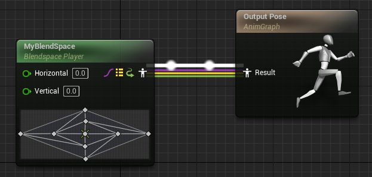
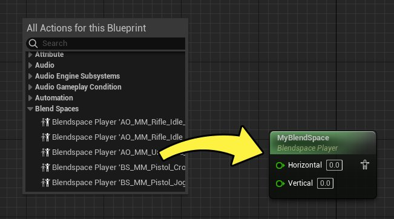
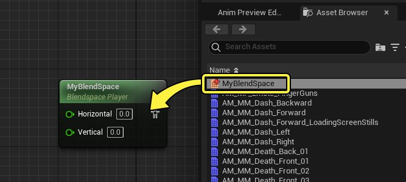
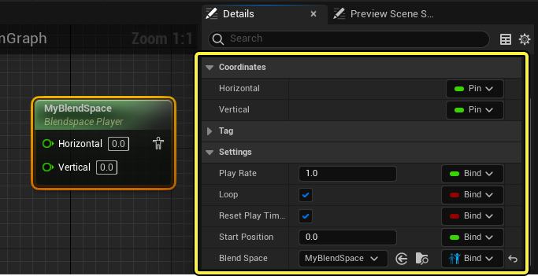
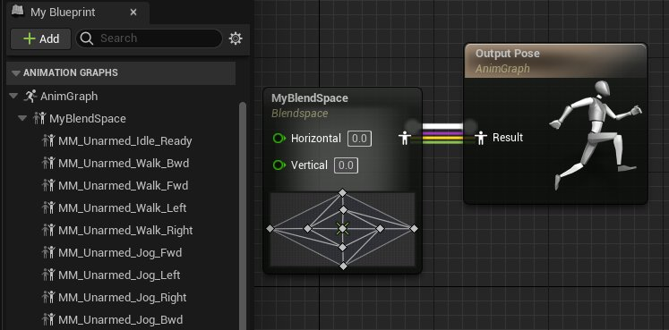
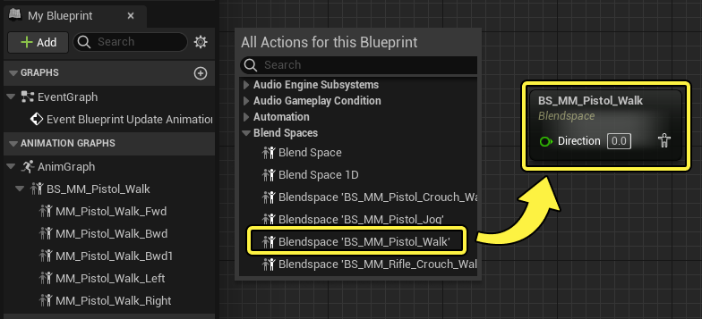
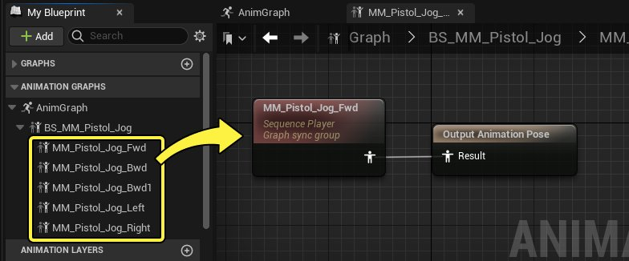
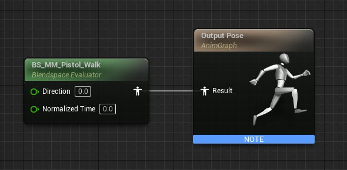

# 在动画蓝图中使用混合空间

> 路径：虚幻引擎5.7文档 / 为角色和对象制作动画 / 骨架网格体动画系统 / 动画资产和功能 / 混合空间 / 在动画蓝图中使用混合空间

> 原始页面：https://dev.epicgames.com/documentation/unreal-engine/blend-spaces-in-animation-blueprints-in-unreal-engine

要在虚幻引擎中使用 **混合空间（Blend Spaces）**，只需在[动画蓝图](../../../animation-blueprints/index.md) 的[AnimGraph](../../../animation-blueprints/graphing-in-animation-blueprints/index.md)中放置节点即可。节点会接收输入数据，以驱动 **混合图表（Blend Graph）** 所使用的样本的混合。你也可以直接在AnimGraph中创建它们，无需预先准备混合空间。

本文将概述动画蓝图中不同类型的混合空间节点，以及它们的使用方法。

#### 先决条件

- 了解并创建过

  动画蓝图

  。
- 创建过一个

  混合空间

  或

  瞄准偏移

  。

## 混合空间播放器

**混合空间播放器（Blendspace Players）** 节点引用现有的混合空间资产。它们包含两个轴的数据引脚输入（如果其使用1D混合空间](animating-characters-and-objects/SkeletalMeshAnimation/AssetsFeatures/Blendspaces#1D)，则只包含一个轴的）。该节点基于这些输入输出最终姿势。

> [!NOTE]
> 瞄准偏移也可被用作播放器。

### 创建和使用

你可以用以下任一方式创建混合空间播放器：

在AnimGraph中点击右键，从 **混合空间（Blend Spaces）** 类别中选择你的混合空间，确保其包含 **Blendspace Player** 前缀。

将混合空间资产从资产浏览器或内容浏览器拖入AnimGraph。

如果你已分配了混合空间，可以双击一个混合空间播放器，在单独的窗口中打开该资产。

> 动图已省略：open blendspace player

### 属性

选中混合空间播放器后，**细节** 面板将显示下列与混合空间相关的属性。

| 名称 | 说明 |
| --- | --- |
| **坐标（Coordinates）** | 混合空间的轴。 |
| **播放速率（Play Rate）** | 在混合空间中播放样本的速度。将此设为负值将反向播放样本。 |
| **循环（Loop）** | 启用此项将无限循环播放样本。禁用此项将导致样本的最后一帧被保留。 |
| **在混合空间发生变化时重置播放时间（Reset Play Time when Blend Space Changes）** | 如果 **混合空间（Blend Space）** 属性发生变化，将重置播放中样本的规格化时间。 |
| **起始位置（Start Position）** | 混合空间中所有样本的起始时间。此为规格化时间，因此必须为 **0** 到 **1** 之间的值。 |
| **混合空间（Blend Space）** | 使用的混合空间资产。 |
| **LOD阈值（LOD Threshold）** | 控制运行此节点运行的最高细节级别（LOD）。例如，如果你将此值设为 **2**，它将在 **LOD2** 及以下级别启用，并在组件的LOD达到 **3** 时禁用。值为 **-1** 时将始终执行该节点，无视LOD级别。此属性只在 **瞄准偏移（Aim Offset）** 和 **瞄准偏移播放器（Aim Offset Players）** 上出现。 |

## 混合空间图表

如果说混合空间播放器是引用现有混合空间的节点，那么 **混合空间图表（Blend Space Graphs）** 就是包含动画蓝图中混合空间的图表。你可以用它们为动画蓝图创建量身定制的混合空间，将它们与其他资产区别开来，并编辑样本逻辑。

> [!NOTE]
> Aim Offsets can also be used in this manner.

### 创建

要创建此类混合空间，请在AnimGraph中点击右键，并在混合空间类别中选择 **混合空间（Blend Space）**。你也可以选择现有的混合空间资产，只要确保其前缀为 **Blendspace**。这将导入（而非引用）混合空间，你可以使其有别于原始版本。

### 用法

由于混合空间图表需要在动画蓝图中创建和管理，你可以双击 **我的蓝图（My Blueprint）** 面板中的混合空间条目，打开混合空间界面。然后，你就可以向对混合空间资产那样[添加样本](../index.md#%E5%B0%86%E5%8A%A8%E7%94%BB%E6%B7%BB%E5%8A%A0%E5%88%B0%E5%9B%BE%E8%A1%A8)，[定义轴数值](../index.md#%E5%AE%9A%E4%B9%89%E8%BD%B4%E5%90%8D%E7%A7%B0%E5%92%8C%E8%8C%83%E5%9B%B4)并[编辑其他属性](../index.md#%E8%B5%84%E4%BA%A7%E7%BB%86%E8%8A%82)。

> 动图已省略：add samples to blend space graph

混合空间中的每个样本都包含其自身的自图表，可以通过双击查看。通过这种方法，你可以创建额外的逻辑，从而向一个样本分配更多功能。

## 混合空间求值器

**混合空间求值器（Blendspace Evaluators）** 是一种混合空间节点，其所有样本的时间都由外部控制，而非自动播放。这种时间控制为规格化（0-1）的浮点值，决定了对姿势进行采样的时间点。

要创建此类混合空间，请在AnimGraph中点击右键，并在混合空间类别中选择 **混合空间求值器（Blendspace Evaluator）**。 你也可以选择现有的混合空间资产，只要确保其前缀为 **Blendspace Evaluator**。

> 图片已省略：create blend space evaluator

在默认情况下，混合空间求值器会直接跳到你提供的时间，而不是推进时间，这会导致跟运动或动画通知（Animation Notifies）不被求值。禁用 **跳至规格化时间（Teleport to Normalized Time）** 可恢复此功能。

> 图片已省略：blend space evaluator settings
