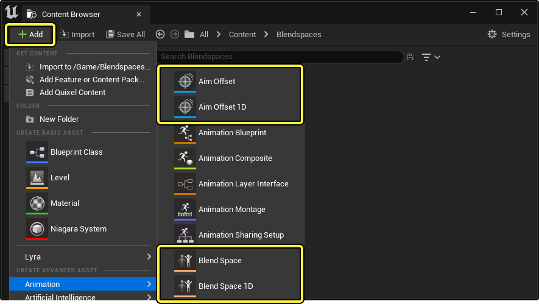
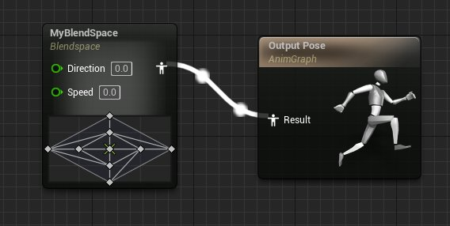
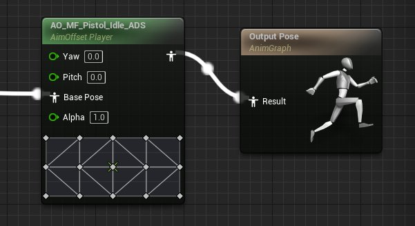
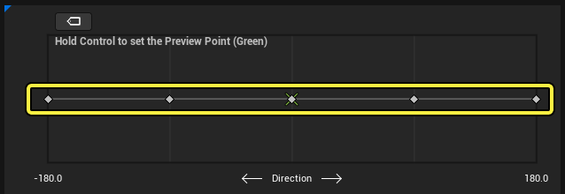
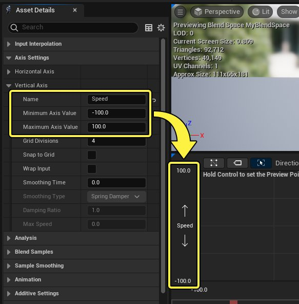
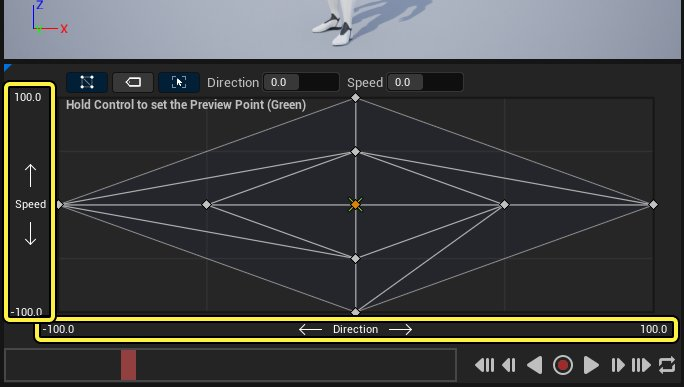
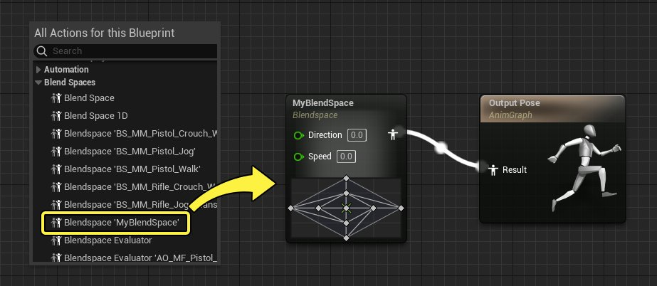

# 混合空间

> 路径：虚幻引擎5.7文档 / 为角色和对象制作动画 / 骨架网格体动画系统 / 动画资产和功能 / 混合空间

> 原始页面：https://dev.epicgames.com/documentation/unreal-engine/blend-spaces-in-unreal-engine

混合空间是一种资产，允许混合多个动画或姿势，方法是将其绘制到一维或二维图表中。然后，该图表可以在[动画蓝图](../../animation-blueprints/index.md)中进行引用，其中混合通过Gameplay输入或其他变量进行控制。通过使用混合空间，几乎所有类型的混合布局都可以用于你的动画。

本文档概述了混合空间、其不同类型及其设置。

#### 先决条件

- 你的项目有一个

  骨骼网格体（Skeletal Mesh）

  ，其中导入了各种方向性或类似

  动画序列（Animation Sequences）

  。

## 混合空间概述

混合空间是一种资产，你可以在其中沿图表上的各个点指定动画，称为 **示例（samples）** 。总体动画通过基于每个轴的输入值在图表上的点之间混合来计算。例如，可以创建一个在方向性移动和空闲动画之间混合的移动系统。

> 动图已省略：混合空间概述

## 混合空间创建和类型

有不同类型的混合空间，它们在资产编辑器中或针对它们在[动画蓝图](../../animation-blueprints/index.md)中的使用方式提供了不同的功能。

以下混合空间类型可以通过点击"内容浏览器（Content Browser）"中的 **添加(+)（Add (+)）** 按钮并从 **动画（Animation）** 菜单进行选择来创建：

- 瞄准偏移（Aim Offset）
- 瞄准偏移1D（Aim Offset 1D）
- 混合空间（Blend Space）
- 混合空间1D（Blend Space 1D）

### 混合空间

常规混合空间是混合空间的基本种类，用于提供沿图表混合动画的所有主要功能。它们旨在作为基础层在动画蓝图中进行引用，次要动画将从中延续。

### 瞄准偏移

瞄准偏移是混合控件，旨在包含网格体空间叠加动画作为其示例。通常，这些用于创建武器或其他"看向"瞄准混合空间。瞄准偏移动画蓝图节点旨在随法线轴输入一起接收输入姿势

请参阅[瞄准偏移](aim-offset/index.md)页面，了解有关如何使用它们的更多信息。

- [瞄准偏移](aim-offset/index.md)

### 1D

混合空间和瞄准偏移都还支持单轴（1D）变体。通常，这些混合空间在你只需要单个轴混合时使用。对于混合空间1D或瞄准偏移1D的情况，图表仅提供水平轴。

> [!NOTE]
> 尽管1D混合空间可用，但普通2D图表也可用于一维方式，方法是仅将单个轴用于你的示例放置。这样一来，你可以根据需要将混合空间从1D扩展到2D。

## 混合空间设置

创建并打开你的混合空间类型后，请继续进行以下设置。

### 定义轴名称和范围

在大部分情况下，你需要定义混合空间中使用的轴的名称和值范围。为此，请导航至 **资产细节（Asset Details）** 面板，并更改位于 **轴设置（Axis Settings）** 类别中的以下属性：

- 名称（Name）
- 最小轴值（Minimum Axis Value）
- 最大轴值（Maximum Axis Value）

> [!NOTE]
> 根据混合空间的类型，如果你要创建瞄准偏移，并且希望网格匹配旋转值，那么你可能需要使用不同的值比例，例如 **-90** 到 **90** 或 **-180** 到 **180**。

### 将动画添加到图表

你可以将动画从 **资产浏览器（Asset Browser）** 或 **内容浏览器（Content Browser）** 拖到图表中，以向图表填充动画。按住 **Shift** 键将使动画对齐到网格点，这对于对齐很有用。根据你要创建的混合空间种类，这些可以是循环动画或静态姿势。

> 动图已省略：混合空间添加动画

> [!NOTE]
> 由于1D混合空间只有一个轴用于输入，你只能沿该单个轴应用动画。
>
> 

在这个例子中，垂直和水平轴分别映射到方向和速度。然后，将设置多个基于周期的动画以基于这些输入的值进行相应混合，生成你在游戏内看到的最终姿势。

### 在动画蓝图中引用

完成图表后，你可以引用和操控[动画蓝图中的混合空间](blend-spaces-in-animation-blueprints/index.md)。要添加混合空间，请右键点击 **AnimGraph** 并找到你的混合空间。你还可以从 **内容浏览器（Content Browser）** 将其拖入图表中。这样做会创建引用该资产的 **混合空间播放器**

请参阅[在动画蓝图中使用混合空间](blend-spaces-in-animation-blueprints/index.md)页面，了解有关使用[动画蓝图](../../animation-blueprints/index.md)中的混合空间的更多信息。

- [在动画蓝图中使用混合空间](blend-spaces-in-animation-blueprints/index.md)

## 编辑器概述

无论使用哪种混合空间类型，打开其中某个资产时都将显示以下编辑器：

> 图片已省略：混合空间编辑器

1. 资产细节（Asset Details）

   ，其中你可以设置该混合空间的属性和其他设置。
2. 视口（Viewport）

   ，其中根据图表显示骨骼网格体和当前播放的动画。
3. 资产浏览器（Asset Browser）

   ，可用作方便的位置来将动画拖入图表中。
4. 混合图表（Blend Graph）

   ，其中你可沿一维或二维图表绘制动画，并预览混合功能。

### 资产细节

"资产细节（Asset Details）"面板包含此混合空间资产的属性和其他设置。

> 图片已省略：资产细节

| 名称 | 说明 |
| --- | --- |
| **使用网格（Use Grid）** | 启用此项将使用旧版网格模式进行混合，而不是默认三角剖分方法。通常，你只会在执行特定混合布局（例如，使用封装输入）时才会使用网格。否则，在大部分情况下，你应该将此项保持禁用状态，而改为使用三角剖分，以获得更准确的混合结果。 |
| **首选三角剖分方向（Preferred Triangulation Direction）** | 控制示例之间的三角剖分混合角度。这仅会影响以均匀方式放置的示例，并且仅在禁用 **使用网格（Use Grid）** 时才会影响。 **无（None）** 将使三角形在整个图表中都有相同的角度。通常，如果你要创建对称混合空间，则不应该选择此选项，因为混合结果在每一边都不同。 三角剖分方向无 **切线（Tangential）** 将使三角形从图表原点朝外。 三角剖分方向切线 **径向（Radial）** 将使三角形朝内指向图表原点。 三角剖分方向径向 |
| **要缩放动画的轴（Axis to Scale Animation）** | 如果使用了 **平滑时间（Smoothing Time）**，则此项指定要在其上缩放动画播放速度的轴。在大部分情况下，这将用于你会在其中指定速度的轴的移动动画。 |
| **名称（Name）** | 要在混合图表中以及混合空间动画蓝图节点上显示的轴的名称。 |
| **最小轴值（Minimum Axis Value）** | 此轴的最小显示值。 |
| **最大轴值（Maximum Axis Value）** | 此轴的最大显示值。 |
| **网格划分（Grid Divisions）** | 此轴上的划分数。此处的值越高，生成的混合结果就越精确。奇数带来的混合结果也会不同于偶数的结果。如果禁用 **使用网格（Use Grid）**，则此项将仅导致网格的外观更改。 |
| **对齐到网格（Snap to Grid）** | 在沿此轴移动动画点时启用到 **网格划分（Grid Divisions）** 的对齐。按住 **Shift** 键还会临时启用所有轴的对齐。 |
| **封装输入（Wrap Input）** | 启用此项时，此轴的输入值可以超出 **最小（Minimum）** 和 **最大轴值（Maximum Axis Values）** 。发生此情况时，混合空间会将该轴视为循环，并将输入转换为另一端的逆值。如果启用此属性，请确保该轴任一端的动画都类似，以防止停顿。 |
| **平滑时间（Smoothing Time）** | 此轴在不同输入之间混合的时间，以秒为单位。值为 **0** 将导致发生无时间混合。你可以观察辅助十字准星独立于预览点的移动过程来预览图表中的混合。 平滑时间 |
| **平滑类型（Smoothing Type）** | 确定在使用平滑时间时会使用哪个缓动函数。你可以从以下选项中进行选择： 平均（Averaged） 线性（Linear） 立方体（Cubic） 慢入/慢出（Ease In/Out） 指数波 弹簧阻尼系统（Spring Damper） |
| **阻尼比（Damping Ratio）** | 使用 **弹簧阻尼系统（Spring Damper）** 作为 **平滑类型（Smoothing Type）** 时，这将确定有多少阻尼。值小于 **1** 会导致过冲，这可能会使一些动作看起来更自然。 混合空间阻尼比 |
| **最大速度（Max Speed）** | 平滑时此轴值的最大变化速度。仅在 **平滑类型（Smoothing Type）** 设置为 **弹簧阻尼系统（Spring Damper）** 或 **指数波（Exponential）** 时使用。如果设置为 **0** ，则混合速度可以是无限的。 |
| **分析（Analysis）** | 你可以指定要针对每个轴用于分析示例并自动将其放置在混合空间中的函数。请参阅[混合空间分析](automatic-blend-space-creation/index.md)页面，了解更多信息。 [使用混合空间分析准确计算并放置你的混合空间示例。混合空间分析[混合空间分析](automatic-blend-space-creation/index.md)](automatic-blend-space-creation/index.md) |
| **混合示例（Blend Samples）** | 此分段列示混合空间中涉及的所有示例，允许修改或删除其细节。你还可以右键点击混合图表中的示例来预览这些相同属性。 |
| **权重速度（Weight Speed）** | 这将控制单独的示例权重可以变化的速度。值为 **2.0** 表示示例的权重可以在半秒内从0变化到1。值为 **0.0** 会禁用该功能，除非你使用 **每个骨骼覆盖（Per Bone Overrides）** 。一般来说，不要将此项与 **平滑时间（Smoothing Time）** 或 **平滑类型（Smoothing Type）** 一起使用。 |
| **平滑（Smoothing）** | 启用权重速度的慢入和慢出。一般来说，不要将此项与 **平滑时间（Smoothing Time）** 或 **平滑类型（Smoothing Type）** 一起使用。 |
| **每个骨骼覆盖（Per Bone Overrides）** | 这是一个数组，你可以在其中指定骨骼按不同速度混合的不同权重速度。此处指定的骨骼还将包括所有后代。 |
| **预览基本姿势（Preview Base Pose）** | 如果你要在混合空间或瞄准偏移中使用叠加动画，则可以在此处指定基本动画以从中预览叠加动画。 |
| **通知触发器模式（Notify Trigger Mode）** | 此混合空间用于控制[动画通知](../animation-sequences/animation-notifies/index.md)如何在多个示例之间混合时触发的当前模式。你可以从以下选项中进行选择： **所有动画（All Animations）** ，这将触发所有通知。 **最高权重动画（Highest Weighted Animation）** ，这将仅触发来自权重最高的示例的通知。 **无（None）** ，这将导致不触发通知。 |

### 混合图表

混合图表是混合空间中的主要交互面板。你将在此处放置和操控动画示例，预览混合行为，并调试混合问题。

> 图片已省略：混合空间图表

#### 工具栏

点击 **显示三角剖分（Show Triangulation）** 会启用或禁用三角剖分视图。仅当在 **资产细节（Asset Details）** 面板中禁用 **使用网格（Use Grid）** 时才会显示此按钮，它会启用三角剖分作为混合方法。

> 动图已省略：混合空间三角剖分

点击 **显示示例（Show Samples）** 将使每个示例显示其名称。

> 图片已省略：混合空间示例名称

你可以点击 **拉伸网格以适应（Stretch Grid to Fit）** 来拉伸图表以适应面板。禁用此项将使图表基于每个轴范围维持相对比例。

> 动图已省略：混合空间图表拉伸

如果选择示例，它将在工具栏中显示其轴坐标，并可以对其进行操控。

> 图片已省略：混合空间示例值

> [!NOTE]
> 这些工具栏设置还可通过右键点击图表，在上下文菜单中访问。
>
> > 图片已省略：混合空间图表上下文菜单

#### 交互

可以在图表中拖动示例来移动示例。按住 **Shift** 键会将它们对齐到该轴的 **网格划分（Grid Divisions）** 属性中定义的网格增量。

> 动图已省略：混合空间移动示例

右键点击示例将显示上下文菜单，你可以在其中编辑其 **混合示例（Blend Sample）** 属性。

> 图片已省略：混合空间示例上下文菜单

#### 预览

按住 **CTRL** 键并在图表中移动光标将在该位置（由绿色十字准星标记）预览混合。如果你要使用 **平滑时间（Smoothing Time）** 属性，则还将显示辅助绿色十字准星，以允许同时预览目标位置和平滑。

> 动图已省略：预览混合空间

按住 **CTRL + ALT** 键还将启用影响显示，你可以在其中看到相对于预览点的不同示例权重。

> 动图已省略：混合空间预览影响

#### 调试

如果示例的放置方式使其导致点之间的三角剖分非常细，则该三角形将显示为红色，表示应该对其进行调整。通常，在执行[混合空间分析](automatic-blend-space-creation/index.md)时可能会发生此情况。

> 图片已省略：混合空间调试

如果启用 **使用网格（Use Grid）** ，则放置不妥的示例将在示例点周围显示红色高亮来指示该错误。这还指示高亮显示的示例将不会对混合空间正确做出贡献。

> 图片已省略：混合空间调试
