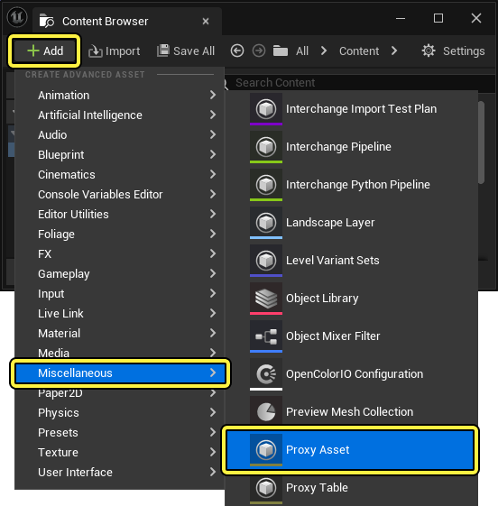
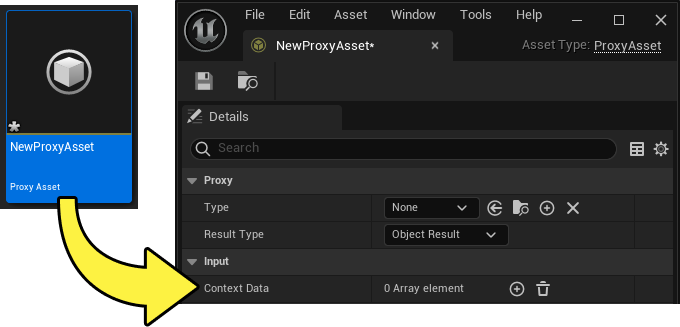
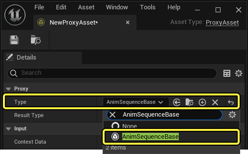
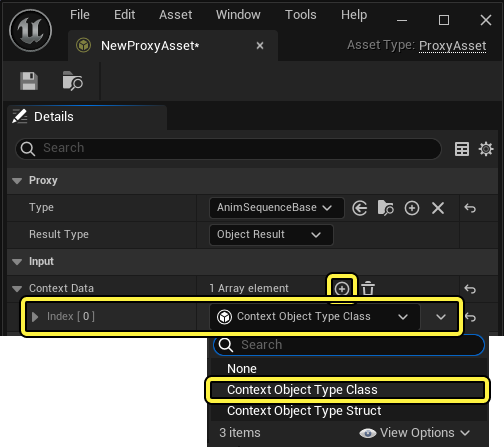
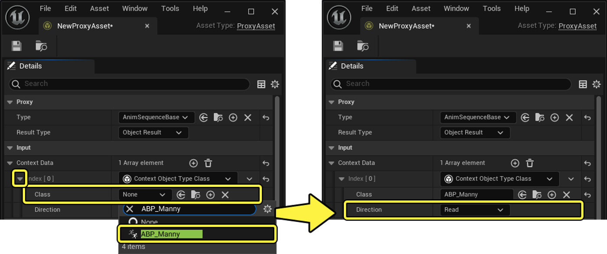
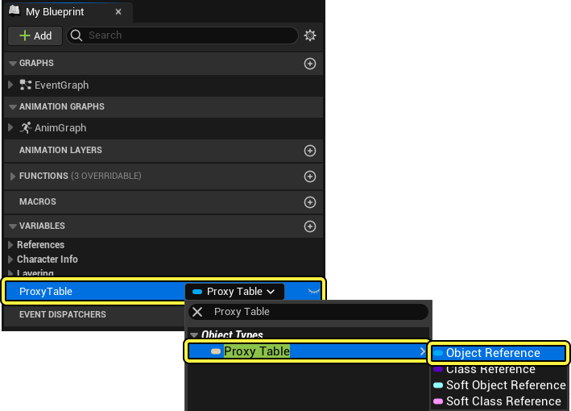
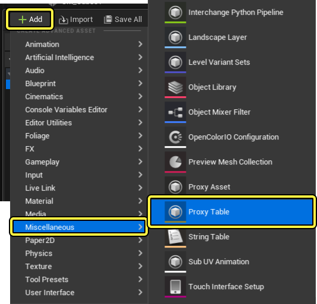
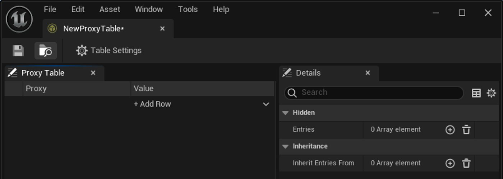

# 动态资产选择

> 路径：虚幻引擎5.7文档 / 为角色和对象制作动画 / 骨架网格体动画系统 / 动画资产和功能 / 动态资产选择

> 原始页面：https://dev.epicgames.com/documentation/unreal-engine/dynamic-asset-selection-in-unreal-engine

你可以组合使用**代理（Proxy）**、 **代理表（Proxy Table）**和**选择器表（Chooser Table）**资产编译动态资产选择逻辑，并基于项目中的变量驱动动画。 例如，你可以使用代理和代理表资产来选择应该为你的角色加载和使用哪种类型的动画集，例如不同的武器集。 你也可以通过项目中的上下文变量，使用选择器表动态选择单独的动画资产，例如基于你的角色被攻击的部位做出不同的命中响应。

你可以参阅以下文档，详细了解如何设置虚幻引擎中的动态动画选择系统。

> [!NOTE]
> 虽然此文档着重介绍如何使用选择器和代理表来选择与动画相关的资产（如动画序列、蒙太奇或AnimInstance类等），但系统本身是通用的，可用于选择任意类型的资产、对象或类。

#### 先决条件

- 启用**选择器（Chooser）**插件。 在**菜单栏**中找到**编辑（Edit）** > **插件（Plugins）**并找到**动画（Animation）**分段中的**选择器（Chooser）**，或使用**搜索栏**。 启用插件并重启编辑器。
- 你的项目包含你想基于运行时的上下文情况动态选择的一组动画。 这可以是唯一的装饰动画集、相关Gameplay动画（如上下文动画场景），或对于武器等可装备物品相关的动画集。
- 你的项目包含一个功能动画蓝图，你可以在其中编译动态动画选择逻辑。

## 设置动画选择系统

你可以在本章节中了解到如何在项目中设置动画选择器系统，根据项目在运行时的情况动态选择命中响应动画播放。

### 创建代理资产

**代理资产**用于存储关于哪个[代理表](index.md#create-proxy-table-assets)资产处于活动状态的上下文信息以及其他相关变量。

要创建代理资产，请点击**内容浏览器**中的**+****添加（+ Add）**按钮，并找到**杂项（Miscellaneous）** > **代理资产（Proxy Asset）**。

> [!NOTE]
> 为你想要从中动态选择动画以驱动角色的每个动画集创建代理资产，例如待机、行走或奔跑动画集。

创建代理资产后，打开每个资产以访问其设置。

将每个代理资产的**类型（Type）**属性设为你所用的动画资产的类型。在本例中为`AnimSequenceBase`。

将**上下文数据（Context Data）**属性设为**动画蓝图（Animation Blueprint）**选项，方法是点击**+****添加（+ Add）**按钮，并选择**上下文对象类型类（Context Object Type Class）**，以添加新的**索引（Index）**数组。

展开**索引（Index）**数组的设置，将**类（Class）**属性设为使用你的动画蓝图。在本例中为`ABP_Manny`。 然后确保将**方向（Direction）**属性设为**读取（Read）**。

### 动画蓝图设置

设置完代理资产后，你必须在你的角色的动画蓝图中创建一个变量，才能在运行时期间存储活动代理表。 要创建此变量，请打开你的角色的动画蓝图，并点击**+****添加（+ Add）**按钮，在**我的蓝图（My Blueprint）**面板中创建新变量。 然后将变量类型设为**代理表对象引用（Proxy Table Object Reference）**。 创建变量之后，**保存**并**编译**你的动画蓝图。

代理表变量将在动画图表中由Evaluate Proxy节点使用，以便在运行时确定活动代理表。

### 创建代理表资产

**代理表（Proxy Table）**资产用于存储可在运行时动态选择的动画资产集。 例如，一个代理表可以存储一个角色的待机动画，而另一个代理表可以存储其行走或奔跑的动画集。

要创建代理表资产，请点击**内容浏览器**中的**+****添加（+ Add）**按钮，找到**杂项（Miscellaneous）** > **代理表（Proxy Table）**。

> [!NOTE]
> 你需要为每个需要不同动画集的上下文情况创建代理表资产，例如为徒手角色和持手枪或步枪的角色创建移动动画集。

创建代理表资产之后，打开资产以访问代理表的值。

在代理表中，点击**+****添加行（Add Row）**按钮并选择资产，为每个**代理资产（Proxy Asset）**添加一个条目。 接着你可以使用值列分配集内的关联动画资产。

> 图片已省略：ImageAltText

在以下工作流程示例中，`ProxyTable_Unarmed`资产在相应的`ProxyAsset_Idle`和`ProxyAsset_Walk`行中被分配了`Unarmed_Idle`和`Unarmed_Walk`动画。 而在`ProxyTable_Pistol`资产中，对应的代理资产行中则被分配了`Pistol_Idle`和`Pistol_Walk`动画。

| ProxyTable_Unarmed | ProxyTable_Pistol |
| --- | --- |
| [ImageAltText](https://dev.epicgames.com/community/api/documentation/image/8c74e318-25f4-461d-9551-d834337ad3db?resizing_type=fit) | [ImageAltText](https://dev.epicgames.com/community/api/documentation/image/a5cf04f0-e5a4-4423-9083-bac3dc6bf2fc?resizing_type=fit) |

> [!NOTE]
> 值列还包含**类（Class）**引用、**选择器资产（Chooser Asset）**，或**查找代理（Lookup Proxy）**，用于更多动态动画选择系统。

### 在运行时使用代理表

要在运行时使用代理表资产，在Sequence Player节点上使用[Animation Node函数](../../animation-blueprints/graphing-in-animation-blueprints/animation-blueprint-node-functions/index.md)即可。 要创建新函数来选择代理表资产，请选择Sequence Player节点，并在**On Update**绑定处添加新函数。

> 图片已省略：ImageAltText

从**On Update**节点添加**Evaluate Proxy**节点。

然后选择该节点并使用下拉菜单在代理属性中选择代理资产。

> 图片已省略：ImageAltText

然后将结果提升到变量，并将输出连接到Sequence Player节点。

> 图片已省略：ImageAltText

接着，你可以使用各种方法（例如选择器表）在Evaluate Proxy节点上设置活动代理表资产，以动态地更改驱动角色的动画集。

### 创建选择器表资产

选择器资产用于存储由动画的各种迭代构成的动画数据集，这些迭代可以基于上下文选择和播放。 例如，选择器表可能包含一组命中响应动画，其中每个条目都是根据身体被命中的不同部位（手臂、腿部、胸部、头部）做出不同响应的动画，可以基于命中部位等上下文变量进行选择。

要创建选择器表资产，请点击**内容浏览器**中的**+****添加（+ Add）**按钮，找到**杂项（Miscellaneous）** > **选择器表（Chooser Table）**。

> 图片已省略：ImageAltText

创建选择器表后，你可以打开资产，访问其属性。

> 图片已省略：ImageAltText

点击**+****添加（+ Add）**按钮以在上下文数据属性中创建新数组元素，并将其属性设为**上下文对象类型类（Context Object Type Class）**。 然后展开索引数组，将**类（Class）**属性设为你的角色的动画蓝图，并确保将**方向（Direction）**属性设为**读取（Read）**。 接着，你可以将输出对象类型设置为你使用的动画资产。 此工作流程示例使用动画序列，因此选择了**AnimSequenceBase**类选项。

> 图片已省略：ImageAltText

这时你可以在选择器表面板中添加列，以便使用**+****添加列（+ Add Column）**按钮从动画蓝图设置变量，以影响选择过程。 创建列后，你可以定义动画蓝图中哪个变量可以影响选择，以及每行中为了选择动画序列资产而必须达到的变量值或状态。

> 图片已省略：ImageAltText

在此工作流程示例中，布尔变量`IsCrouching`将在值为false时选择`MM_HangingIdle`动画，并在值为true时选择`MM_Rifle_Walk_Left`。 `MoveemntAngle`变量将在值介于`-100`到`100`之间时选择`MM_HangingIdle`，而仅在值为`0.0`时选择`MM_Rilfe_Walk_Left`动画。

为了使用此选择过程驱动角色的动画，你必须将代理表条目设为**Evaluate Chooser**并分配选择器表资产。

> 图片已省略：ImageAltText

现在所选动画将基于活动代理表资产和选择器表所做的选择而变化。

> [!NOTE]
> 你还可以在动画蓝图图表或状态机中使用Evaluate Chooser节点，从而只使用ChooserTables，而不使用ProxyTables。
>
> > 图片已省略：ImageAltText
