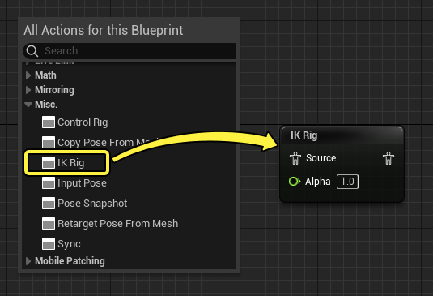
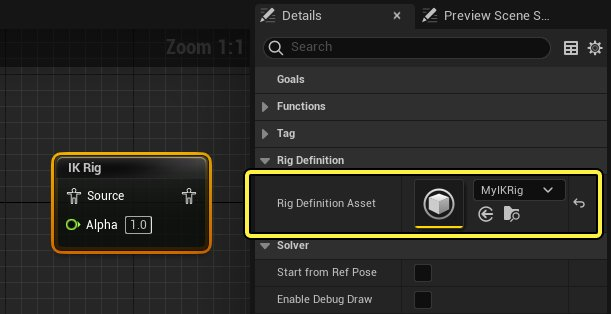
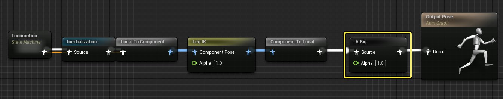
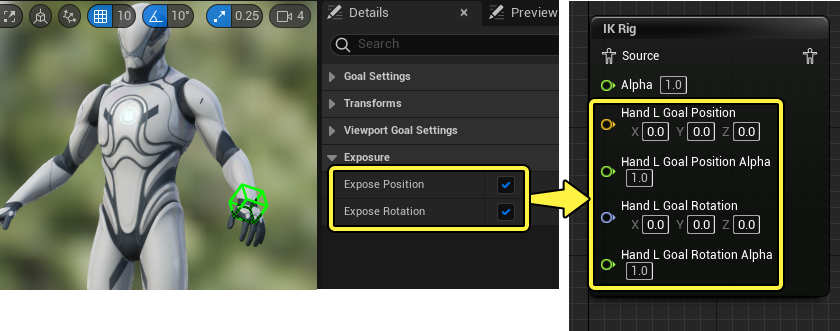
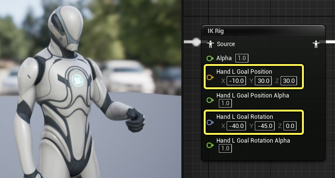
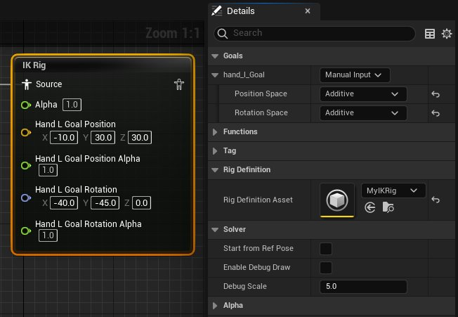

# 动画蓝图中的IK Rig

> 路径：虚幻引擎5.7文档 / 为角色和对象制作动画 / 骨架网格体动画系统 / 动画资产和功能 / IK Rig / 动画蓝图中的IK Rig

> 原始页面：https://dev.epicgames.com/documentation/unreal-engine/ik-rig-in-animation-blueprints-in-unreal-engine

在创建 **IK Rig** 后，可以在[动画蓝图](../../../animation-blueprints/index.md)中加以引用，从而在游戏中使用相应的IK行为。

本文档概述了此过程以及可供使用的各种功能。

#### 先决条件

- 已经为

  骨骼网格体

  创建一个IK Rig。请参阅

  IK Rig编辑器

  页面了解示例设置指南。
- 骨骼网格体包含一个

  动画蓝图

  。如果没有，将由

  第三人称模板

  项目为你提供。
- 基本了解

  动画蓝图

  的使用。

## 设置

IK Rig会在动画蓝图的AnimGraph面板中引用。右键单击 **图表**，然后从 **杂项（Misc）** 类目中选择 **IK Rig** 以创建一个IK Rig节点。

添加完成后，需要在 **细节（Details）** 面板中将IK Rig指定给 **Rig定义资产（Rig Definition Asset）** 属性。

在常用设置中，IK Rig节点放置在大部分运动和其他AnimBP逻辑之后。这样可以保证IK调整会在其他效果之后按照顺序正确执行。

## 用法

默认情况下，IK Rig不会导致动画姿势发生任何变化。为了从节点影响IK更改，你需要公开IK目标（IK Goal）的位置、旋转或将两者同时公开。

为此，请在 **IK Rig编辑器（IK Rig editor）** 中选择一个 **IK目标（IK Goal）**，并在 **细节（Details）** 面板中启用 **公开位置（Expose Position）** 和 **公开旋转（Expose Rotation）**。这将在IK Rig节点上为该目标的位置或旋转添加引脚，并公开目标以供操作。

你可以在此处为这些属性创建 **变量（Variables）**，并构建操作IK Rig的逻辑。

可以通过调整 **目标位置（Goal Position）** 或 **旋转（Rotation）** 引脚值来测试动画蓝图中IK Rig的行为。

编辑 **位置/旋转Alpha（Position / Rotation Alpha）** 将在相应轴上为该目标混合开关IK效果。

> 动图已省略：position rotation alpha

## 属性

选择IK Rig节点后，"细节（Details）"面板中将出现以下特定于IK Rig的属性：

| 名称 | 描述 |
| --- | --- |
| **目标** | 属性分段将填充每个公开的IK目标，并为你提供控制其行为的其他设置。你可以将目标指定为以下一种类型： **手动输入（Manual Input）**，公开节点上的位置和旋转引脚，以手动控制目标的变换。你还可以选择应用于目标的位置或旋转空间： **叠加（Additive）**，将目标变换视为相对于执行器处的骨骼而言的世界空间叠加偏移。 **组件（Component）**，将目标变换视为处于骨骼网格体Actor组件的空间中。 **世界（World）**，将目标变换视为处于世界空间中。 **骨骼（Bone）**，可以在此骨架中指定目标将吸附的骨骼。这在使用辅助骨骼时很有用，例如武器或道具骨骼，它们可以进行程序化调整。 ik goal bone |
| **Rig定义资产（Rig Definition Asset）** | 用于修改传入姿势的IK Rig资产。 |
| **从引用姿势开始（Start from Ref Pose）** | 启用此功能会忽略传入的姿势，转而使用骨骼网格体引用姿势开始求解。 |
| **启用调试绘制（Enable Debug Draw）** | 这实现了所有IK目标在视口中的可视性，以便进行调试和预览。 enable debug draw |
| **调试比例（Debug Scale）** | 在"启用调试绘制（Enable Debug Draw）"启用时，增大或减小IK Rig调试绘制的比例。 |
