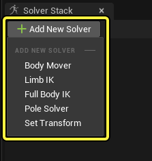
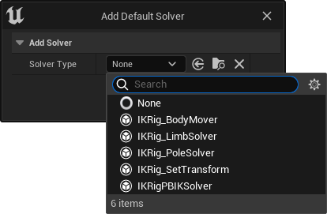
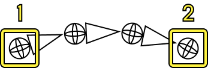
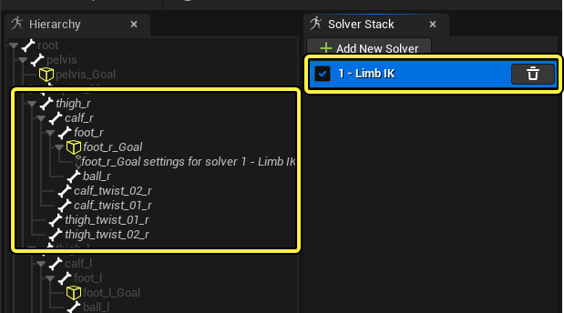
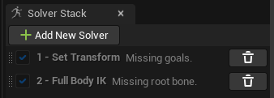
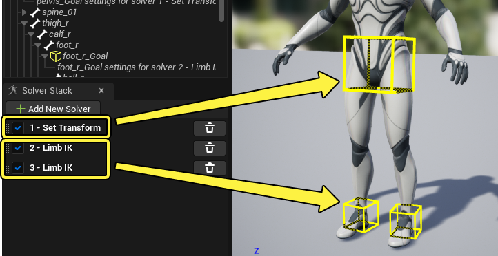
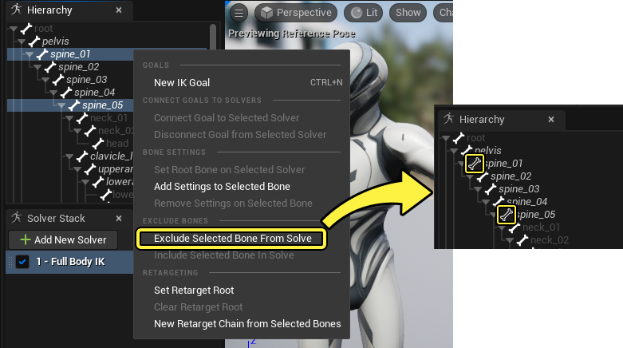
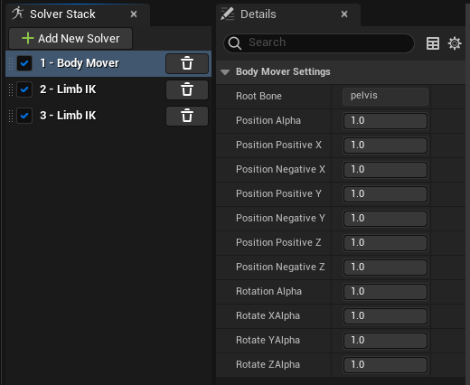

# 解算器

> 路径：虚幻引擎5.7文档 / 为角色和对象制作动画 / 骨架网格体动画系统 / 动画资产和功能 / IK Rig / IK Rig编辑器 / 解算器

> 原始页面：https://dev.epicgames.com/documentation/unreal-engine/ik-rig-solvers-in-unreal-engine

IK Rig支持多种IK解算器，可以作用于各种骨骼层级。它们用于创建逆向运动学解决方案，从而在链中旋转和定位骨骼。可同时使用多个解算器进一步个性化IK效果。

本页概述了可在IK Rig编辑器中添加的不同解算器及其属性。

#### 先决条件

- 已创建并打开一个IK Rig资产。请参阅

  IK Rig编辑器

  页面了解如何执行此操作。
- 已熟悉如何创建

  IK目标

  。

## 创建解算器

创建解算器的主要方式是点击 **解算器堆栈（Solver Stack）** 面板中的 **添加新解算器（Add New Solver）** ，然后选择一个 **解算器** 。

如果IK Rig中还没有解算器，创建 **IK目标（IK Goal）** 时也会提示创建解算器，并将自动与其捆绑。点击 **解算器类型（Solver Type）** 下拉菜单选择一个解算器。

## 解算器的使用

所有IK解算器都需指定一个 **根骨骼** 或 **Ik目标** ，或同时指定两者。这两个起始和结束骨骼将组成该解算器的IK链。

1. 层级链起始的根骨骼。
2. 层级链末端的目标骨骼，即执行器骨骼。它由一个

   IK目标

   驱动。

### 连接至骨骼和目标

要设置解算器的根骨骼，请选择 **层级（Hierarchy）** 中的 **骨骼（Bone）** 和 **解算器堆栈（Solver Stack）** 中的 **解算器（Solver）** ，随后右键点击 **骨骼（Bone）** ，选择 **将根骨骼设置于选定解算器（Set Root Bone on Selected Solver）** 。

> 动图已省略：在所选解算器上设置根骨骼

如果解算器需要连接IK目标，请从 **层级（Hierarchy）** 中选择 **目标** 并从 **解算器堆栈（Solver Stack）** 中选择 **解算器** ，随后右键点击该 **目标** ，选择 **将目标与选定解算器连接（Connect Goal to Selected Solver）** 。

> 动图已省略：将目标连接到所选解算器

> [!NOTE]
> 当骨骼和目标连接至一个解算器以后，选择该解算器就会在"层级（Hierarchy）"和"视口（Viewport）"内高亮显示相应对象。
>
> 

### 多重解算器

"解算器堆栈（Solver Stack）"中也可添加"多重解算器（Multiple Solvers）"，这可以为IK Rig提供额外的功能。"多重解算器（Multiple Solvers）"的顺序很重要，因为它们会按照名称旁边数字的顺序进行求值。

例如，在大多数手足IK设置中，最好确保臀部的 **设置变换解算器（Set Transform Solver）** 先求值，随后再对手足IK链进行求值。这样腿部才能先行对臀部运动进行适当补偿。

可以通过在"解算器堆栈（Solver Stack）"里上下拖拽解算器来调整它们的排序。

> 动图已省略：重新排列解算器

### 排除骨骼

IK链里的骨骼可以从层级中排除，让它们在全部解算器中被忽略。这对于修正不良姿势很有用，也可以用于简化复杂的链。

要排除骨骼，选择要排除的全部 **骨骼** ，右键点击它们并选择 **从解算中排除选中骨骼（Exclude Selected Bone From Solve）** 。被排除的骨骼将以不同的图标标注。

> [!NOTE]
> 要重新包含被排除的骨骼，请右键点击它们并选择 **在解算中包含选中骨骼（Include Selected Bone In Solve）** 。

## 解算器类型

下面列出了可在IK Rig里使用的解算器类型。

### 躯体运动

**躯体运动解算器（Body Mover Solver）** 可根据其他已连接的IK目标的位置（通常是脚）来平移和旋转根骨骼。"躯体运动解算器（Body Mover Solver）"让IK Rig能够生成大规模的整体身体运动，使得最终姿势更加自然。

#### 设置

"躯体运动解算器（Body Mover Solver）"需要一个根骨骼和至少两个IK目标相连。不过，如果角色是四足或多足，该解算器也可以支持多个目标。

#### 用法

"躯体运动解算器（Body Mover Solver）"主要用于地面对齐，应作为第一个解算器与其他解算器配对使用，比如[手足IK](#%E6%89%8B%E8%B6%B3ik)或[全身IK](#%E5%85%A8%E8%BA%ABik)。

举例来说，单独使用"躯体运动解算器（Body Mover Solver）"不能作为IK解算器产出正确的结果。

> 动图已省略：躯体运动解算器

但是，只要设置了其他IK解算器在其后求值并应用了恰当的参数，"躯体运动解算器（Body Mover Solver）"就能更自然地使用。

> 动图已省略：躯体运动解算器

#### 设置

选择"躯体运动解算器（Body Mover Solver）"后，"细节（Details）"面板中将出现额外的设置选项。

这些设置用于控制在位置轴和旋转轴上施加的运动程度，包括其通道。在某些情况下，可能有必要调整这些属性来创建更自然的姿势。

例如，在人形角色上，将 **旋转Alpha（Rotation Alpha）** 调至 **0** 将导致角色不自然地向偏移目标倾靠。

> 动图已省略：躯体运动修复旋转

但是，在四足或多足角色上，保持这种根部旋转而不改变任何设置，可能效果更自然。

> 动图已省略：躯体运动蜘蛛

#### 目标设置

选择位于分配给躯体运动解算器的目标下方的 **目标设置（Goal Setting）** ，将在 **细节（Details）** 面板中显示更多属性。

> 图片已省略：躯体运动目标设置

**影响乘数（Influence Multiplier）** 用于增加或减少此目标对躯体运动解算器施加的影响程度，很适合用于将一个目标设置为相较于其他目标具有更大的影响力。

### 手足IK

"手足IK（Limb IK）"提供了一个性能较低的单链IK解算器。通常情况下，它适用于单个的四肢，如手臂和腿。

#### 设置

"手足IK（Limb IK）"需要一个根骨骼和一个IK目标才能起作用。它遵循典型的IK规则，需要指定起始骨骼（根）和结束骨骼（目标）。该解算器要求链中有至少三根骨骼才能正确工作。

在大多数情况下，需要指定 **肩膀** 或 **手臂** 作为根，**手** 作为目标。对腿部来说，需要指定 **腿上部** 或 **大腿** 作为根，**脚** 作为目标。

> 图片已省略：手足ik

#### 设置

从解算器堆栈面板选择 **手足IK（Limb IK）** 将在 **细节（Details）** 面板中显示更多属性。仅当你的手足IK链由超过3个骨骼组成时，这些属性才有效。因此，如果你要将手足IK用于普通人形 **大腿（Thigh）> 腿部（Leg）> 脚（Foot）** 解算，那么这些属性不会影响其行为。

> 图片已省略：手足ik设置

| 名称 | 说明 |
| --- | --- |
| **根骨骼（Root Bone）** | 分配给此手足IK解算器的根骨骼。 |
| **伸展精度（Reach Precision）** | 该值将控制伸展目标位置的执行器的准确性阈值。数字越低，表示越准确，数字越高，表示越不准确。 |
| **铰链旋转轴（Hinge Rotation Axis）** | 解算器链的法线平面。 |
| **最大迭代次数（Max Iterations）** | 增加该值将导致关节链在目标位置更好地收敛，但会增加手足IK链的CPU开销。 |
| **启用限制（Enable Limit）** | 在根骨骼和执行器之间的关节链上启用旋转限制。 |
| **最小旋转角度（Min Rotation Angle）** | 如果启用了 **启用限制（Enable Limit）** ，这会强制父骨骼与子骨骼之间至少达到此输入角度。 |
| **平均拉力（Average Pull）** | 沿关节链启用平均拉力分布。 |
| **拉力分布（Pull Distribution）** | 在禁用了 **平均拉力（Average Pull）** 时，手动控制链上的拉力分布权重。数字越低，越偏向于执行器，数字越高，越偏向于根骨骼。 |
| **伸展步骤Alpha（Reach Step Alpha）** | 将末端执行器朝目标移动，并限制置换。 |
| **启用扭转校正（Enable Twist Correction）** | 通过比较解算器链上的骨骼方向，沿该链启用扭转校正。 |
| **末端骨骼前向轴（End Bone Forward Axis）** | 启用了 **启用扭转校正（Enable Twist Correction）** 时的首选轴。 |

### 全身IK

"全身IK（Full Body IK）"，简称FBIK，是个功能齐全的多目标IK解算器，支持骨骼限制、刚度和首选角度的调整。如果你想为多个目标创建大规模IK系统，每个目标都对全身施加自然影响，那么这个解算器就很有用。

#### 设置

要使"全身IK（Full Body IK）"正常工作，必须连接一个根骨骼和至少一个IK目标。不过，和"手足IK（Limb IK）"不同，这里可添加多个目标，以允许骨架同时伸向多个位置。

> 动图已省略：全身ik多个目标

#### 用法

与其他解算器不同，可以为受"全身IK（Full Body IK）"解算器影响的任意骨骼创建设置。这样就可以在FBIK链中进一步细化某个特定骨骼的运动。

要创建骨骼设置，请选择 **全身IK解算器（Full Body IK Solver）** ，右键点击想要创建设置的 **骨骼** ，选择 **为选中骨骼添加设置（Add Settings to Selected Bone）** 。

> 图片已省略：全身ik骨骼设置

在"层级（Hierarchy）"中选择骨骼设置后，"细节（Details）"面板中将出现以下骨骼设置选项：

> 图片已省略：全身ik骨骼设置

| 骨骼设置 | 描述 |
| --- | --- |
| **刚度（Stiffness）** | **旋转（Rotation）** 和 **位置刚度（Position Stiffness）** 属性用于控制IK链中的骨骼受目标和执行器影响的程度。使用这些属性来改变骨盆骨骼受功能按钮移动影响的程度。？？？值范围为0-1；**0** 表示完全自由移动，而 **1** 表示完全锁定骨骼，防止移动。 在此人形示例中，骨盆骨骼是FBIK链的根骨骼；不过在它在基础状态下，旋转过猛。调高 **刚度（Stiffness）** 属性可解决此问题。 fbik刚度 |
| **限制（Limits）** | **限制（Limits）** 用于限定IK链上骨骼轴的旋转范围或将其完全锁定。各轴可以采用如下设置： **自由（Free）** ，骨骼可以自由移动。 **有限（Limited）** ，动作仅可以在规定范围内进行。如果选择该选项，将用 **最小值/最大值（Min/Max）** 属性定义动作范围。 **锁定（Locked）** ，禁用沿该轴的移动。 使用限制有助于纠正不自然的关节运动。举例来说，这些限制可用于纠正不自然的脚踝转动。将 **Z最小值（Min Z）** 设置为 **-50** ，将 **Z最大值（Max Z）** 设置为 **40** ，然后将 **Z** 轴设置为 **有限（Limited）** 。 fbik限值 |
| **首选角度（Preferred Angles）** | **首选角度（Preferred Angles）** 可用于设置让关节优先沿指向执行器的特定轴旋转。在某些情况下，可用于解决关节旋转僵硬的问题。启用 **使用首选角度（Use Preferred Angles）** 将令旋转参考 **首选角度（Preferred Angles）** 。 "首选角度（Preferred Angle）"属性的定义取决于角色类型及其关节结构。举例说明，人体模型的膝盖应沿着 **Z轴（Z axis）** 弯曲更多，因此 **Z** 属性增大。 首选角度 |

#### 设置

选择"全身IK解算器（Full Body IK Solver）"后，"细节（Details）"面板中将出现以下属性：

> 图片已省略：fbik设置

| 名称 | 描述 |
| --- | --- |
| **迭代（Iteration）** | 增大该值将使执行器在其目标位置上收聚，但会增加FBIK链的CPU占用率。引入 **刚度（Stiffness）** 、较高的 **质量乘数（Mass Multiplier）** 和 **旋转限制（Rotation Limits）** 都会影响收聚速度，可能需要对该值做进一步调整。 |
| **质量乘数（Mass Multiplier）** | 这是全局值，影响骨骼对旋转和平移的抵抗程度。值的范围通常为 **0.0 到** **10.0** ，**0.0** 表示完全活络，**10.0** 表示非常僵硬。如果增加该值，还需要增加 **迭代次数（Iterations）** ，以便实现收敛。 增加质量乘数可以解决FBIK中的严重收敛问题，这些问题最常见于较大的角色。通常来说，你的角色体型越大，该数值就该越高。 质量乘数抖动修复 |
| **最小质量乘数（Min Mass Multiplier）** | 只要解算器能实现的结果，就保持该值尽可能低。该值越低，链收聚越好。 |
| **允许拉伸（Allow Stretch）** | 启用该项将使IK链上的骨骼平移以到达执行器。**位置刚度（Position Stiffness）** 值会影响该属性结果；刚度越高，拉伸越少。 |
| **根行为（Root Behavior）** | 控制根骨骼的平移行为。可以选择以下选项： **预拉（Pre Pull）** 通过目标的平均运动来限制根的平移。该选项有助于更好地收聚，以到达所有目标。 **固定为输入（Pin to Input）** 锁定根的平移和旋转。该选项也会取消应用在根骨骼上的所有骨骼设置。 **自由（Free）** 允许骨骼自由移动，或根据任意骨骼设置移动。与 **预拉（Pre Pull）** 相比，这项设置需要设定更多迭代以完成收聚。 |
| **从输入姿势开始解算（Start Solve from Input Pose）** | 启用后，解算器会将每个记号重置为从当前输入姿势开始。若禁用，则输入的动画姿势将被忽略，解算器从上一次解算结果开始工作。 |

#### 目标设置

选择位于分配给全身IK解算器的目标下方的 **目标设置（Goal Setting）** 将在 **细节（Details）** 面板中显示该目标的更多属性。

> 图片已省略：fbik目标设置

| 名称 | 说明 |
| --- | --- |
| **强度Alpha（Strength Alpha）** | 此属性影响此执行器对IK链的作用强度。使用较低的数字时，此IK目标不会很强有力地将链拉向自己，导致其他目标优先。 |
| **拉取链Alpha（Pull Chain Alpha）** | 通过设置大于 **0.0** 的值来启用时，FBIK解算器会将骨架分隔为从执行器延伸到最接近的骨架层级偏离的多个"链"。使用此设置可改善稀疏骨骼链的结果，但对于更复杂的受约束骨骼链，会导致意外结果。 |
| **引脚旋转（Pin Rotation）** | 将混合执行器变换的旋转（**1.0**）与输入骨骼的旋转（**0.0**）之间的执行器骨骼旋转。 |

### 极解算器

"极解算器（Pole Solver）"为单个骨骼链提供 **极向量（Pole Vector）** 控制，用于将中间关节设置为朝向IK目标，比如肘部或膝盖。通常情况下，该解算器应与其他解算器结合使用，比如[手足IK](#%E6%89%8B%E8%B6%B3ik)。

#### 设置

与其他解算器不同，"极解算器（Pole Solver）"必须同时指定根骨骼和末端骨骼。右键点击根骨骼和末端骨骼并选择 **在选定解算器上设置根/末端骨骼（Set Root / End Bone on Selected Solver）** 。在这个示例中，上臂被设为根，手被设为末端。

> 图片已省略：极解算器

必须使用IK目标，它将作为"极向量（Pole Vector）"。在大多数情况下，必须为根上的第一个子骨骼创建IK目标。

举例来说，在一个简单的三骨骼链中，IK目标必须创建在根的第一个子骨骼上。这样它将置于中间的关节。

在更长的链中，首个子项将不在中间关节上，这使得IK目标的位置更靠近根。

指定根、末端和目标之后，可以操控IK目标预览"极解算器（Pole Solver）"。

#### 用法

在大多数情况中，应将"极解算器（Pole Solver）"与另一个解算器配对，并将"极解算器（Pole Solver）"设置为最后执行。在这个示例中，它与一个"IK手足解算器（IK Limb Solver）"配对。

### 设置变换

"设置变换（Set Transform）"将平移和旋转骨骼，使其匹配目标。该解算器不涉及IK系统，因为它只会平移并旋转单个骨骼及其子项。在大多数情况中，该解算器应与其他解算器配对使用，以实现更复杂的IK效果。

#### 设置

该解算器只需要连接单个IK目标，将其作为变换点。

#### 用法

通常情况下，最好将该解算器与其他解算器配对，并设置为先执行"设置变换（Set Transform）"。在这个示例中，臀部的 **设置变换（Set Transform）** 与腿上的 **手足IK（Limb IK）** 进行了配对。
