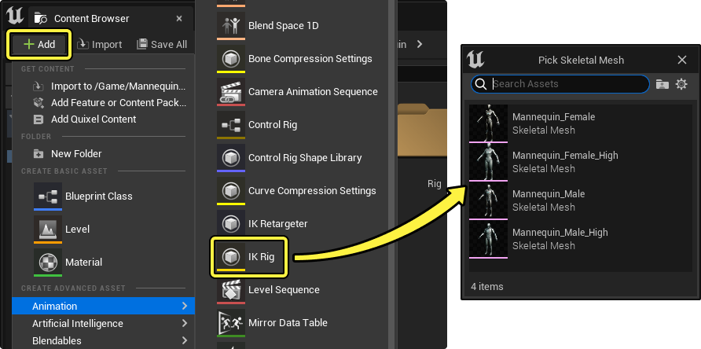
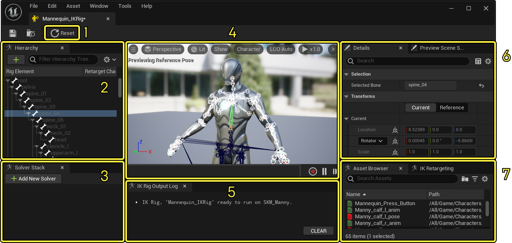
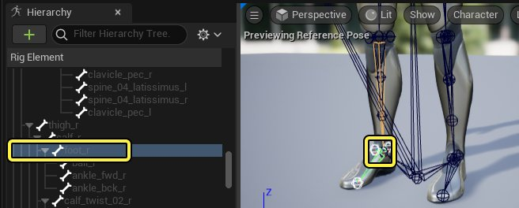
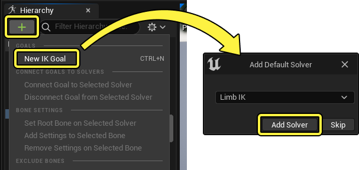
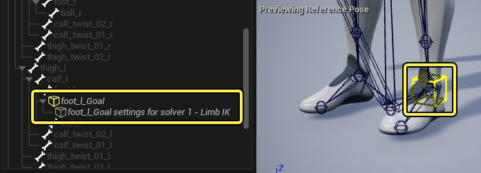
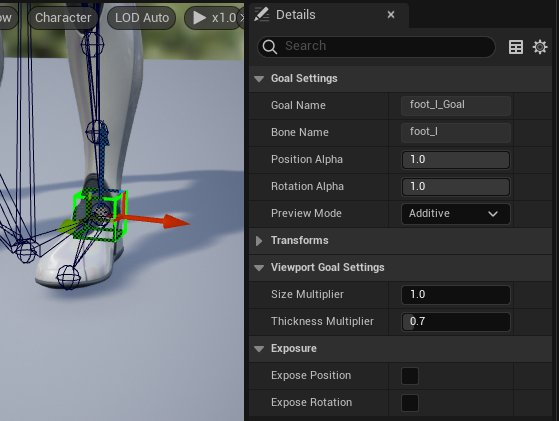
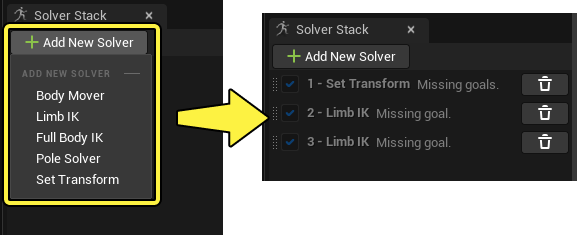

# IK Rig编辑器

> 路径：虚幻引擎5.7文档 / 为角色和对象制作动画 / 骨架网格体动画系统 / 动画资产和功能 / IK Rig / IK Rig编辑器

> 原始页面：https://dev.epicgames.com/documentation/unreal-engine/ik-rig-in-unreal-engine

**IK Rig编辑器** 允许你为角色设置IK Rig并为角色重定向。你可以使用该编辑器创建不同的解算器、调整骨骼设置，并预览结果。

本文概述了此编辑器以及如何创建IK Rig资产。

#### 先决条件

- IK Rig需要项目中有

  骨骼网格体

  。

## 创建IK Rig

创建IK Rig时，你必须首先创建 **IK Rig资产（IK Rig Asset）** 。为此，请点击 **内容浏览器（Content Browser）** 中的 **添加(+)（Add (+)）** ，然后选择 **动画（Animation） > IK Rig** 。引擎会打开一个窗口，提示你选择哪一个骨骼网格体需要使用IK Rig。

选择骨骼网格体后，系统将创建IK Rig资产。在 **内容浏览器（Content Browser）** 中双击打开它。

## 编辑器和功能概述

IK Rig编辑器包含以下工具和选项：

1. 重置（Reset）

   按钮，用于将

   IK目标

   重置为默认位置。
2. 层级（Hierarchy）

   ，其中将显示骨骼、IK目标和设置。
3. 解算器堆栈（Solver Stack）

   ，其中将显示此骨骼网格体上所使用的

   IK解算器

   。
4. 视口（Viewport）

   ，供你选择骨骼并操控IK目标以预览IK行为。
5. IK绑定输出日志（IK Rig Output Log）

   显示IK绑定的调试信息。它会显示警告和错误，说明绑定的当前状态。
6. 细节（Details）

   面板将显示所选项目的属性。

   预览场景设置（Preview Scene Settings）

   可用于更改环境光视口环境（例如光照和背景）。
7. 资产浏览器（Asset Browser）

   将显示

   动画序列

   的列表，可以随IK行为一起预览，以测试效果。

   IK重定向（IK Retargeting）

   用于你在使用IK Rig

   重定向

   此角色时指定要用于IK重定向器资产的骨骼链。

### IK目标

IK目标（IK Goal）是IK链的操控点和执行器点，在IK Rig编辑器中创建。IK目标与[解算器](ik-rig-solvers/index.md)一起使用，以修改传入姿势来到达目标位置。

要创建IK目标，请首先在你想创建的IK链中选择结束骨骼。通常，如果你是沿手臂或腿部创建IK，那么就选择手或脚的骨骼。

接着，点击层级（Hierarchy）面板中的 **添加（+）**，然后选择 **新建IK目标（New IK Goal）** 。如果你的IK Rig尚无解算器，则将显示对话框窗口，你可以在其中选择要与新目标关联的解算器。对于常用IK设置，你可以选择 **Limb IK** ，然后点击 **确定（OK）** 。

> [!NOTE]
> 你也可以右键点击层级面板中的骨骼，来访问 **添加（+）** menu.

现在，系统将创建特定于目标和解算器的设置，并且在视口和层级中可见。

#### IK目标属性

选择IK目标时，你将在 **细节（Details）** 面板中看到以下属性：

| 名称 | 说明 |
| --- | --- |
| **目标名称（Goal Name）** | IK目标对象的名称。 |
| **骨骼名称（Bone Name）** | IK目标充当其执行器的结束骨骼的名称。 |
| **位置Alpha（Position Alpha）** | 将IK目标的最终位置从输入姿势中的目标骨骼位置（**0**）混合到目标自身的位置（**1**）。 位置Alpha |
| **旋转Alpha（Rotation Alpha）** | 将IK目标的最终旋转从输入姿势中的目标骨骼位置（**0**）混合到目标自身的旋转（**1**）。 旋转Alpha |
| **预览模式（Preview Mode）** | 在 **叠加型（Additive）** 或 **绝对型（Absolute）** 模式下预览（仅限编辑器内）目标。若要IK行为随传入动画变化，选择 **叠加型（Additive）** ，若要覆盖链上的所有传入动画，选择 **绝对型（Absolute）** 。叠加型目标行为可以在运行时完成，方法是在[IK绑定动画图表节点](../ik-rig-in-animation-blueprints/index.md)上将目标设置为 **手动输入（Manual Input）** 和 **叠加型（Additive）** 预览模式 |
| **变换（Transforms）** | 包含所选IK目标的当前变换信息。 |
| **大小乘数（Size Multiplier）** | 乘以IK目标相对于[视口设置](#%E8%A7%86%E5%8F%A3%E8%AE%BE%E7%BD%AE)中的基本大小的大小。如果你有更大的非人类角色，请增大该值。 大小乘数 |
| **厚度乘数（Thickness Multiplier）** | 乘以IK目标相对于[视口设置](#%E8%A7%86%E5%8F%A3%E8%AE%BE%E7%BD%AE)中的基本厚度的线条厚度。如果你增大了 **大小乘数（Size Multiplier）** ，可能需要增大该值。 厚度乘数 |
| **公开位置（Expose Position）** | 在[IK Rig动画蓝图节点](../ik-rig-in-animation-blueprints/index.md)上公开位置引脚，以便影响[动画蓝图](../../../animation-blueprints/index.md)中的IK目标的位置。 |
| **公开旋转（Expose Rotation）** | 在[IK Rig动画蓝图节点](../ik-rig-in-animation-blueprints/index.md)上公开旋转引脚，以便影响[动画蓝图](../../../animation-blueprints/index.md)中的IK目标的旋转。 |

### 解算器

你可以为你的IK Rig添加不同的IK行为，这些行为称为 **解算器（Solvers）** 。你可以使用解算器创建各种各样的IK效果，从简单的三骨骼链到全身多肢体IK系统，不一而足。

请访问[解算器](ik-rig-solvers/index.md)页面，详细了解你可以添加的不同解算器以及如何在IK Rig中使用。

- [解算器](ik-rig-solvers/index.md)

### 视口设置

若未在IK Rig编辑器中做出选择，**细节（Details）** 面板将显示以下视口设置：

| 名称 | 说明 |
| --- | --- |
| **预览骨架网格体（Preview Skeletal Mesh）** | 运行IK解算的骨架网格体。你可以在此更改分配的骨架网格体，IK绑定系统会尝试在你新替换的骨架网格体上运行。如果新的骨架网格体包含不兼容的骨骼名称或层级，IK绑定将不会生效。你可以参考 **IK绑定输出日志（IK Rig Output Log）**，详细了解不兼容的情况。 |
| **绘制目标（Draw Goals）** | 在视口中显示或隐藏[IK目标](#ik%E7%9B%AE%E6%A0%87)。 |
| **目标大小（Goal Size）** | IK目标的基本大小。 |
| **目标厚度（Goal Thickness）** | IK目标的基本厚度。 |

## IK Rig示例设置

在虚幻引擎中，IK的一个常见用处是让角色双脚对齐高低不平的地面，而这需要控制角色的脚部和臀部。下面的示例将引导你逐步为人体模型角色设置此IK Rig系统。

### 创建解算器

首先创建新的解算器。为此，请点击解算器堆栈面板中的 **添加新解算器（Add New Solver）** ，然后添加以下解算器：

- 设置变换（Set Transform）

  。
- 肢体IK（Limb IK）

  。
- 再次添加

  肢体IK（Limb IK）

  。

解算器的添加顺序很重要，因为解算器将根据名称旁边显示的数字按顺序执行。对于此IK系统，肢体IK应该最后求值。

> [!NOTE]
> 你可以根据需要拖动解算器堆栈中的解算器以更改其顺序。
>
> > 动图已省略：更改解算器顺序

### 创建目标

由于用于此IK系统的解算器类型，你将需要为每个解算器创建[IK目标](#ik%E7%9B%AE%E6%A0%87)。为此，请选择骨盆和脚骨骼，右键点击，然后选择 **新建IK目标（New IK Goal）**。系统将在上述每个骨骼的位置处创建目标。

> 动图已省略：创建IK目标

> [!NOTE]
> 你可以选择调整目标，使其在视口中更显眼，方法是将其选中，然后编辑其 **大小（Size）** 和 **厚度乘数（Thickness Multiplier）** 属性。
>
> > 图片已省略：IK目标大小

### 将目标连接到解算器

每个IK目标必须连接到一个解算器，才能正确充当该解算器的执行器。

为此，请同时选择 **解算器（Solver）** 和 **IK目标（IK Goal）** ，右键点击目标，然后选择 **将目标连接到所选解算器（Connect Goal to Selected Solver）** 。

> 动图已省略：将目标连接到所选解算器

为每个目标和解算器重复该操作，使你的所有目标都连接到各自的解算器。

> 图片已省略：将目标连接到所选解算器

### 设置解算器根

对于一些解算器（如肢体IK），你必须同时指定 **目标** 和 **根**。根通常是IK链的开始骨骼。在本示例中，**大腿** 将为根。

要设置解算器的根，请同时选择 **解算器（Solver）** 和 **骨骼（Bone）**，右键点击骨骼，然后选择 **在所选解算器上设置根骨骼（Set Root Bone on Selected Solver）**。

> 动图已省略：在所选解算器上设置根骨骼

为两个肢体IK解算器重复该操作，使两者都将各自的大腿骨骼设置为根。

> 图片已省略：在所选解算器上设置根骨骼

### 最终效果

现在你可以在视口中预览IK系统，选择IK目标后操控即可。点击 **重置（Reset）** 会将你的目标恢复为初始状态。

> 动图已省略：IK Rig设置
