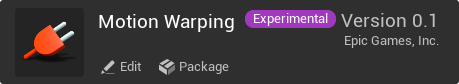
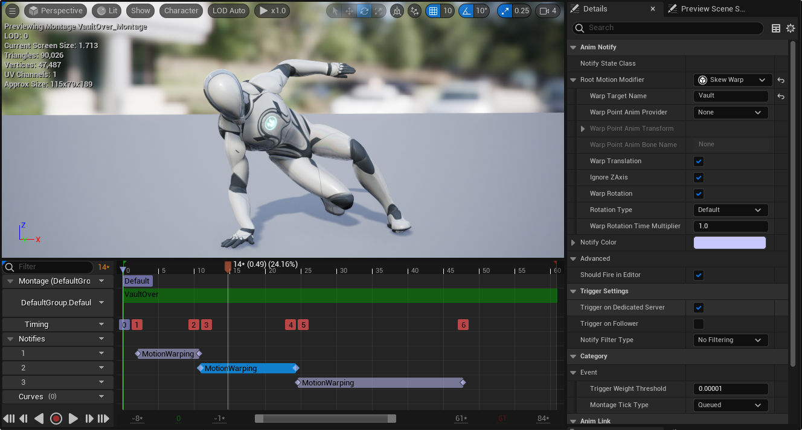
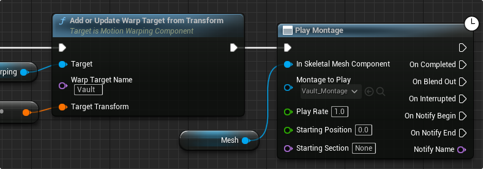
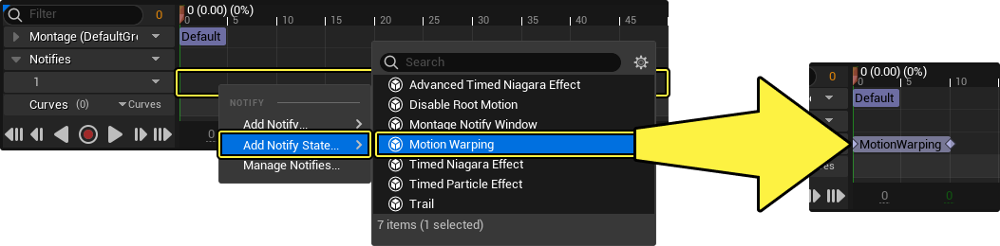
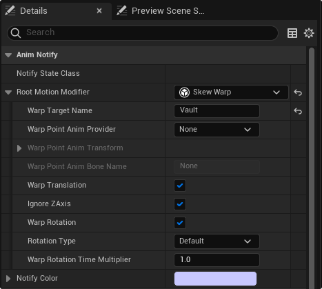
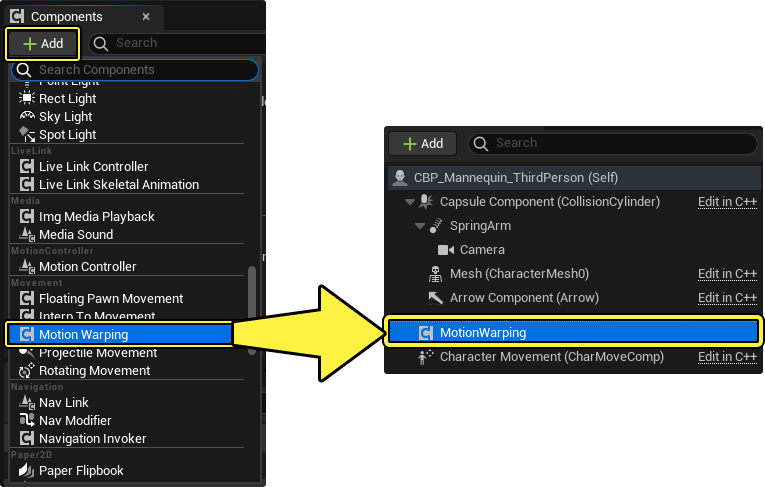
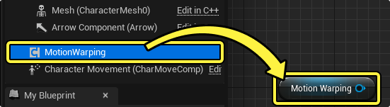
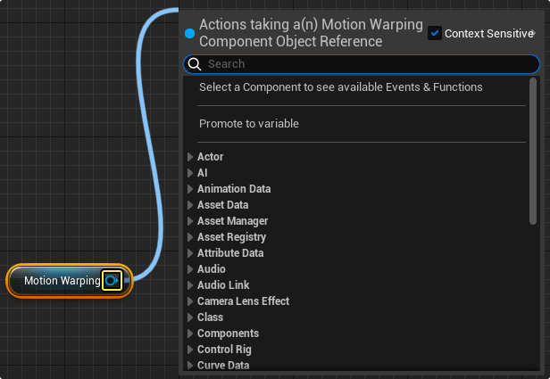

# 运动扭曲

> 路径：虚幻引擎5.7文档 / 为角色和对象制作动画 / 骨架网格体动画系统 / 动画资产和功能 / 移动 / 运动扭曲

> 原始页面：https://dev.epicgames.com/documentation/unreal-engine/motion-warping-in-unreal-engine

**运动扭曲** 是一种可以动态调整角色的根骨骼运动以对齐目标的功能。本文档介绍如何在角色蓝图中创建运动扭曲逻辑，在动画蒙太奇中分配运动扭曲窗口，并链接到指定位置。

#### 先决条件

- 必须启用

  运动扭曲（Motion Warping）

  插件。如需详细了解插件及其安装方法，请参阅：

  使用插件

  。

- 运动扭曲利用了[蓝图](../../../../../blueprints-visual-scripting/index.md)和[动画蒙太奇](../../animation-montage/index.md)工作流程。因此，你需要了解这些功能。
- 你的项目中有[角色蓝图](../../../animation-workflow-guides-and-examples/setting-up-a-character/index.md)、[输入功能按钮](../../../../../gameplay-systems/input/index.md)和[动画](../../animation-sequences/index.md)，可用于创建Gameplay示例。

## 运动扭曲概述

运动扭曲的整体功能可分为两大区域：

1. 动画蒙太奇（Animation Montage）

   ，你可以在其中创建具备动画通知状态的运动扭曲窗口。

1. 蓝图逻辑（Blueprint Logic）

   ，你可以在其中设置逻辑来分配扭曲目标并播放蒙太奇。

## 动画蒙太奇

动态蒙太奇可供你指定运动扭曲区域，自定义其行为，并对其命名。

### 创建

要新建一个运动扭曲区域，右键点击一个 **通知（Notifies）** 轨道，选择 **添加通知状态...（Add Notify State...）> 运动扭曲（Motion Warping）** 。

这些是带有开始和结束时间的可自定义区域，你可以将其对齐到动画中最适合应用扭曲的区域。

比如，在这个覆盖蒙太奇中，当角色把手放在障碍物上时，你可能需要确保起始扭曲区域覆盖整个区域。

> 动图已省略：运动扭曲序列

### 细节

**动画通知** 的 **细节（Details）** 面板包含运动扭曲正常运行所需的属性和设置。选择你的运动扭曲分段以显示这些细节。

| 细节名称 | 说明 |
| --- | --- |
| **根骨骼运动修饰符（Root Motion Modifier）** | 要指定的运动扭曲类型。 **缩放（Scale）** ：一种运动扭曲，可均匀地改变动画的比例。 **倾斜扭曲（Skew Warp）** ：扭曲游戏对象的根骨骼运动，使其匹配关卡中扭曲窗口末尾的动画位置和旋转。 |
| **扭曲目标名称（Warp Target Name）** | 用于查找此扭曲目标的名称。关联到 **Add or Update Warp Target Point** 蓝图节点。 |
| **扭曲点动画提供程序（Warp Point Anim Provider）** | 为 **扭曲点（Warp Point）** 选择所需的提供程序。 **无（None）** ：此处没有声明扭曲点提供程序。 **静态（Static）** ：用户定义的参数变换所定义的扭曲点，可以通过扭曲通知本身来声明。 **骨骼（Bone）** ：扭曲点由骨骼定义。 |
| **扭曲点动画变换（Warp Point Anim Transform）** | 变换动画扭曲点。仅当 **扭曲点动画提供程序（Warp Point Anim Provider）** 设置为 **静态（Static）** 时才相关。 |
| **扭曲点动画骨骼名称（Warp Point Anim Bone Name）** | 声明要用作扭曲点目标的骨骼名称。仅当 **扭曲点动画提供程序（Warp Point Anim Provider）** 设置为 **骨骼（Bone）** 时才相关。 |
| **扭曲平移（Warp Translation）** | 是否扭曲根骨骼运动的平移组件。 |
| **忽略Z轴（Ignore ZAxis）** | 是否扭曲平移的Z组件。 |
| **扭曲旋转（Warp Rotation）** | 是否扭曲根骨骼运动的旋转组件。 |
| **旋转类型（Rotation Type）** | 是否应扭曲旋转以匹配扭曲目标的旋转或面向扭曲目标。 **默认（Default）** ：角色旋转以匹配扭曲目标的旋转。 **面向（Facing）** ：角色旋转以面向扭曲目标。 |
| **扭曲旋转时间乘数（Warp Rotation Time Multiplier）** | 修改旋转的扭曲速度。比如，如果运动扭曲（Motion Warping）窗口持续存在2秒，且此属性的值为0.5，则将在1秒后达到最终旋转。 |
| **通知颜色（Notify Color）** | 设置运动扭曲通知关键帧的颜色。 |

## 蓝图

蓝图用于添加你的运动扭曲组件，触发扭曲，并指定扭曲目标。

### 运动扭曲组件

你必须将运动扭曲组件添加到蓝图才能启用运动扭曲行为。方法为点击 **组件（Components）** 面板中的 ***(+) 添加（*(+) Add）** ，并在 **移动（Movement）** 类别下找到 **运动扭曲（Motion Warping）** 。点击即可添加。

现在将该组件从组件（Components）面板拖放到 **事件图表（Event Graph）** ，即可在你的蓝图图表中引用该组件。

### 节点

从运动扭曲引用拖移链接后，你可以浏览与之相关的函数和事件。它们位于运动扭曲类别中。

你可以在蓝图中使用以下运动扭曲节点：

| 节点名称 | 节点图像 | 说明 |
| --- | --- | --- |
| **Add or Update WarpTarget** | add or update warp target节点 | 此节点用于将蒙太奇资产中定义的扭曲目标名称链接到位置。右键点击 **扭曲目标（Warp Target）** 引脚并选择 **分割结构体引脚（Split Struct Pin）** ，可将该引脚分割成单独的 **平移（Translation）** 引脚和 **旋转（Rotation）** 引脚。 反过来，可以使用 **Remove Warp Target** 节点来解除 **扭曲目标名称（Warp Target Name）** 的链接。 |
| **Add Root Motion Modifier Skew Warp** | add root motion modifier skew warp | 你可以使用此节点通过蓝图生成新运动扭曲窗口，而不是在蒙太奇资产中添加 **倾斜扭曲动画通知（Skew Warp Anim Notifies）** 。 你也可在此处分配此运动扭曲窗口的设置，例如 **开始时间（Start Time）** 、 **结束时间（End Time）** 和 **扭曲目标名称（Warp Target Name）** 。 此处还提供了 **Add Root Motion Modifier for Scale** 节点，以及用于禁用所有根骨骼运动修饰符的节点。 |

## 运动扭曲示例

本小节介绍了如何设置角色扭曲到击打目标的简单运动扭曲示例。

#### 禁用扭曲

> 动图已省略：禁用扭曲

开始之前，确保你打算使用的动画启用了根骨骼运动。具体做法是打开动画资产并启用 **EnableRootMotion** 。

> 图片已省略：启用根骨骼运动窗口

### 设置目标位置

第一步是创建并放置一个你要扭曲到的目标。此示例使用了圆柱体。

在 **放置Actor（Place Actors）** 面板中，点击 **所有类（All Classes）** 并找到 **目标点（Target Point）** 。将其拖放到关卡中以添加目标点。确保它对齐并旋转到你所需的扭曲点。

> 图片已省略：添加运动扭曲目标

### 设置动画蒙太奇

接下来，创建动画蒙太奇资产。要想从现有动画派生此类资产，有一个简单的方法，那就是是右键点击你的动画资产，并选择 **创建（Create）** > **创建动画蒙太奇（Create AnimMontage）** 。创建蒙太奇之后，打开资产。

> 图片已省略：创建动画蒙太奇

现在蒙太奇已打开，你可以在序列中推移以预览你的动画。下一步是在通知轨道下添加运动扭曲窗口。具体做法是，右键点击轨道区域并选择 **添加通知状态...（Add Notify State...）** > **运动扭曲（Motion Warping）** 。

> 图片已省略：运动扭曲通知状态

现在已创建运动扭曲窗口，你可以使用其中的控点设置开始和结束范围。

设置此运动扭曲窗口的范围，让它在动画开头附近开始，在角色攻击的那一刻结束。你还可以在移动 **通知** 关键帧时按住 **Shift** 键预览那个时刻的当前动画。

> 动图已省略：运动扭曲通知

接下来，选择运动扭曲关键帧，并找到 **细节（Details）** 面板。你将在此处设置此关键帧的一些属性。

- 将 **根骨骼运动修饰符配置（Root Motion Modifier Config）** 设置为 **倾斜（Skew）****扭曲（Warp）** 。此操作用于指定扭曲类型。
- 为 **扭曲目标名称（Warp Target Name）** 设置名称。此操作用于用名称标识此扭曲。

> 图片已省略：设置细节面板

### 获取目标位置

现在打开你的角色蓝图资产。在事件图表中，创建映射到所需输入操作的 **Input Action** 节点。具体做法是，右键点击图表，并从 **输入（Input）> 操作事件（Action Events）** 中选择你的输入事件。

在本示例中，有一个用于打击的输入操作事件（Input Action Event for Punch）。

> 图片已省略：获取输入

接下来，你需要获取你早先放在此示例中的目标点的位置。你有几种办法可以选择，但对于本示例，请创建 **Get All Actors Of Class** 节点。将 **Actor类（Actor Class）** 设置为 **目标点（Target Point）** 。最后，将Input Action节点中的 **按下（Pressed）** 输出引脚挂接到Get All Actors of Class函数的输入执行引脚。

> 图片已省略：获取actor

最后，添加 **Get**（副本）节点以连接到输出Actor（Out Actors）数组数据引脚。你还要创建 **Get Actor Location** 函数，并将其输入 **目标数据（Target data）** 引脚连接到 **Get** 节点的输出数据引脚。

> 图片已省略：获取位置

### 扭曲目标

现在你要创建逻辑来获取目标点的位置。

首先，将运动扭曲组件添加到角色蓝图。具体做法是，点击组件（Components）面板中的 ***(+) 添加（*(+) Add）** ，在移动（Movement）类别下找到运动扭曲（Motion Warping）。点击它以添加组件。

> 图片已省略：添加运动扭曲组件

接下来，从组件（Components）面板将运动扭曲组件（Motion Warping Component）拖放到事件图表中。

> 图片已省略：运动扭曲实例

从运动扭曲（Motion Warping）引用引脚拖移，以添加 **Add or Update Warp Target from Transform** 节点。创建后，将其输入事件引脚连接到 **Get All Actors Of Class** 节点。你还要确保将扭曲目标名称分配到 **名称（Name）** 引脚。此名称必须匹配你早先在蒙太奇中定义的扭曲目标名称。

> 图片已省略：同步点逻辑

你还需要将 **Add or Update Warp Target from Transform** 节点链接到目标位置。右键点击扭曲目标（Warp Target）引脚，选择 **分割结构体引脚（Split Struct Pin）** 将其转换为双位置/旋转引脚结构。然后将 **Get Actor Location** 的 **返回值（Return Value）** 引脚连接到 **Get Actor Location** 的返回值（Return Value）引脚。

连接Get Actor Location节点的 **返回值（Return Value）** （由黄色引脚指示的向量值）和Add or Update Warp Target from Transform节点的目标变换（Target Transform）引脚（由橙色引脚表示的变换值）时，将创建转换节点。如果存在不同值类型，但它们在转换后可兼容，则虚幻引擎会在连接引脚时自动创建转换节点。

> 图片已省略：同步点位置

### 播放蒙太奇

现在，你可以在事件图表中引用 **骨骼网格体（Skeletal Mesh）** 组件，并在其上播放蒙太奇。将 **骨骼网格体（Skeletal Mesh）** 组件拖放到事件图表中。

右键点击图表并选择 **动画（Animation）> 蒙太奇（Montage）> 播放蒙太奇（Play Montage）** 以添加 **Play Montage** 节点。然后将你的蒙太奇资产分配到 **要播放的蒙太奇（Montage to Play）** 引脚。

> 图片已省略：播放蒙太奇

### 结果

现在你运行关卡时，应该能够看到角色在播放其打击动画时扭曲到相应的点。

> 动图已省略：运动扭曲已启用

你可以在下面看到本页用于将运动扭曲实现到简单扭曲目标位置的角色蓝图逻辑大图。

> 图片已省略：蓝图概述
