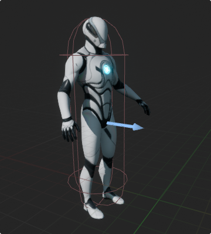
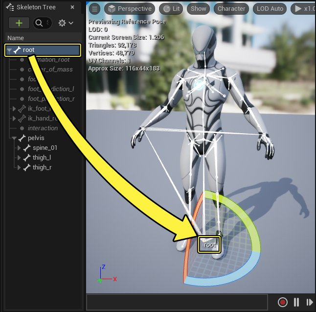
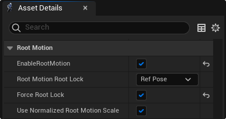
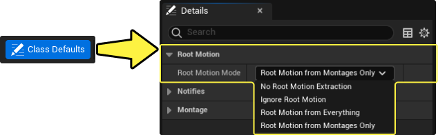

# 根运动

> 路径：虚幻引擎5.7文档 / 为角色和对象制作动画 / 骨架网格体动画系统 / 动画资产和功能 / 移动 / 根运动

> 原始页面：https://dev.epicgames.com/documentation/unreal-engine/root-motion-in-unreal-engine

通过根运动（Root Motion）动画，你可以用动画数据驱动角色的动作，从而在关卡中创建更真实的动作。

本文将介绍什么是根运动（Root Motion），并且简单解释如何在兼容动画中启用根运动。

#### 先决条件

- 你的项目需要包含一个[角色](../../../animation-workflow-guides-and-examples/setting-up-a-character/index.md)，并且其[骨架](../../skeletons/index.md)包含一个[根骨骼](#root%20bone).
- 你的项目需要包含一个[动画序列](../../animation-sequences/index.md)或者[蒙太奇](../../animation-montage/index.md)，并且为其骨架的根骨骼指定了动作数据。

## 概览

在关卡中，一个角色会由许多[组件](../../../../../understanding-the-basics/actors-and-geometry/basic-components/index.md)构成。角色的动作通常由角色的[动作组件](https://dev.epicgames.com/documentation/404)负责驱动。

以下是[蓝图视口编辑器](../../../../../blueprints-visual-scripting/user-interface-reference-for-the-bl-73593f79/user-interface-components/components-mode-viewport-in-the-blueprints-visu-2a55f70f/index.md)中一个的角色，他使用了[骨骼网格体组件](https://dev.epicgames.com/documentation/404)和[胶囊体组件](../../../../../gameplay-systems/gameplay-framework/components/index.md#%E5%9B%BE%E5%85%83%E7%BB%84%E4%BB%B6)。

### 根骨骼

动画由[骨骼网格体](../../../../../understanding-the-basics/actors-and-geometry/unreal-engine-actors-reference/skeletal-mesh-actors/index.md)的 [骨架](../../skeletons/index.md)驱动，而骨架由许多骨骼构成。**根骨骼（Root Bone）** 是骨架的基础骨骼；与其它骨骼不同，根骨骼不是为了显示骨架中的某个骨骼，比如腿或者手臂，而是当作整个骨架结构的一个参考点。一些动画在根骨骼上没有动画数据，那么根骨骼便会静止不动，将骨骼和动画停留在一个点上，另外的一些动画会让根骨骼跟随动画在3D空间中的位移。

以下是一个示例骨骼网格体，高光显示了根骨骼。

### 根运动

在角色不运动的情况下，根骨骼静止的动画仍然会播放，但是角色不发生任何实际的运动或位移。

> 动图已省略：不启用根运动

虽然一些动画和上面的示例一样，根骨骼保持静止，但是其它一些运动会在根骨骼上分配动作。

以下示例动画中根骨骼上有动作数据。**红线** 代表根骨骼的移动轨迹，从起始位置到当前位置。

> 动图已省略：根骨骼位移

然而，根骨骼上的运动数据在默认情况下不会影响角色的移动，必须先启用 **根运动（Root Motion）** 属性。

| 不启用根运动 | 启用根运动 |
| --- | --- |
| 不启用根运动 | 启用根运动 |

不启用根运动时，动画会将骨骼网格体远离根骨骼和角色（用线框胶囊表示）。骨骼网格体和角色分离，然后才在动画循环结束的时候回到初始的位置。启用动画的根运动后，根骨骼的运动数据能够驱动角色的动作，沿着根骨骼的运动方向拖动角色。

通过用根运动驱动角色的动作，动画能够反复循环，从上一个循环的最后位置开始另一个循环。以下是一个反复循环的动画示例。

> 动图已省略：反复的根运动

## 启用根运动

要启用并使用根运动功能，你必须先有一个带有根骨骼的骨架，并且根骨骼上添加了动画。

### 动画序列

每个动画序列或者蒙太奇都必须切换为 **启用** 根运动。该属性位于[动画序列编辑器](../../../animation-editors/animation-sequence-editor/index.md)的 **资产细节（Asset Details）** 面板。

下表解释了编辑动画序列资产时与根运动有关的属性。

| 属性 | 描述 |
| --- | --- |
| **启用根运动（EnableRootMotion）** | 启用后，将允许提取根运动。使用动画蓝图的类默认属性 **根运动模式（Root Motion Mode）** 来定义如何提取根运动。 |
| **根运动根锁（Root Motion Root Lock）** | 在提取根运动时将根骨骼锁定在定义的位置。 可以用以下选项来锁定根骨骼： **参考姿势（Ref Pose）**：将根骨骼锁定在其在骨骼网格体 **参考姿势（Reference Pose）** 中的位置。 **动画第一帧（Anim First Frame）**：将根骨骼锁定在选中动画的 **第一帧** 的位置。 **零（Zero）**：将根骨骼锁定在网格体相对坐标的0,0,0位置。 |
| **强制根锁（Force Root Lock）** | 启用后，强制施加根骨骼锁定，即使未启用 **根运动（Root Motion）** 也是如此。 |
| **使用规格化根运动比例（Use Normalized Root Motion Scale）** | 启用后，将对提取的根运动使用规格化比例值。FVector(1.0, 1.0, 1.0)。 |

### 动画蓝图

在动画序列的参数中将根运动启用后，你需要判定[动画蓝图](../../../animation-blueprints/index.md)中如何用该序列驱动对象的动画。在动画蓝图中有多种方式处理根运动。要访问这些选项，在[动画蓝图编辑器](../../../animation-blueprints/animation-blueprint-editor/index.md)的 **工具栏（Toolbar）** 中点击 **类默认（Class Defaults）**。这会打开一个 **细节（Details）** 面板，其中包含一个 **根运动模式（Root Motion Mode）** 属性下拉菜单。

菜单中有如下选项：

| 名称 | 描述 |
| --- | --- |
| **无根运动提取（No Root Motion Extraction）** | 根运动（Root Motion）按原样保留（应用到根骨骼）。 |
| **忽略根运动（Ignore Root Motion）** | 提取根运动（Root Motion）（并从根骨骼中移除根运动），但不应用到角色。 |
| **来自每一项目的根运动（Root Motion from Everything）** | 提取每个帮助构建最终角色姿势的动画资源的根运动。每一部分的提取根运动均根据构成该姿势的源资产的权重进行混合。 |
| **仅来自蒙太奇的根运动（Root Motion from Montages Only）** | 仅从启用了根动作的[动画蒙太奇](../../animation-montage/index.md)中提取根动作。 |

> [!NOTE]
> 启用根动作会造成性能成本。
>
> 启用 **来自每一项目的根运动（Root Motion from Everything）** 或者 **来自蒙太奇的根运动（Root Motion from Montages）**时，动画图表会在游戏线程上更新而不是工人线程上更新。在游戏[线程](../../../animation-blueprints/graphing-in-animation-blueprints/index.md#cputhreadusageandperformance)上增加工作量可能会导致性能问题。

### 结果

启用根运动并且在动画蓝图中定义好根运动提取的应用方式后，动画会在播放时驱动动作组件。

> [!NOTE]
> 根运动会考虑到角色的物理状态。举个例子，如果角色正在X和Y轴上 **行走** 或者 **坠落**，那么根运动的Z轴会被忽视，并且会应用重力。角色可以坠落、沿坡滚下或者上楼梯。如果角色正在无限制的状态下 **飞行**，那么会应用整个根运动并且忽视重力。
>
> 这些可以在动画蓝图中用一个 **移动模式节点（Movement Mode Node）** 进行调整。

## 调试根运动

以下是使用跟运动动画时的一些相关调试属性。

### 动画序列编辑器

在编辑器的视口中编辑动画序列的时候，有很多有用的功能可以在调试时使用。

要将角色的骨架作为骨骼网格体上的覆盖来渲染，前往 **角色（Character）** 选项卡并打开 **骨骼（Bones）** 菜单。在 **骨骼绘制（Bone Drawing）** 标题中，选择 **所有层级（All Hierarchy）**。该选项会渲染整个骨架，根骨骼渲染为红色。由于根骨骼正在运动，根骨骼的起始点和当前位置之间会有一条红色的轨迹线。

以下示例中启用了 **所有层级（All Hierarchy）** 骨骼绘制模式。

> 动图已省略：显示骨骼所有层级骨骼绘制模式

> [!NOTE]
> **红线** 表示根骨骼由于根运动所形成的位移。你可以看到移动量，并且在动画中追踪根骨骼的运动。

要改变根运动动画的播放设置，前往 **角色（Character）** 选项卡并打开 **动画（Animation）** 菜单。在 **根运动（Root Motion）** 标题下可以切换预览播放选项，如下。

| 选项 | 图片 | 描述 |
| --- | --- | --- |
| **忽略（Ignore）** | 忽略根运动模式 | 忽略所有根运动并用静态设置播放动画。 |
| **循环（Loop）** | 循环根运动模式 | 启用根运动播放，并且持续从上一个循环的最终点再次开始循环。 |
| **循环并重置（Loop and Reset）** | 循环并重复根运动模式 | 启用根运动播放，并且持续从根骨骼原始点循环动画。 |

### 控制台指令

你可以使用 **控制台指令** 来让角色的胶囊体组件在运行时显示。

> [!NOTE]
> 虽然碰撞组件不是角色物体，但是它可以作为一个方便快捷的方式来将角色物体从其网格体分别显示。

当游戏在编辑器中运行时，按下 **反引号**（**`**）键，启用控制台指令窗口。

输入控制台指令：`show collision` 然后按下 **回车** 按键。
