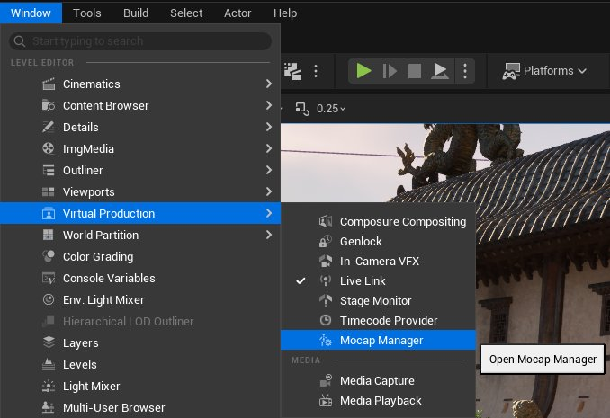
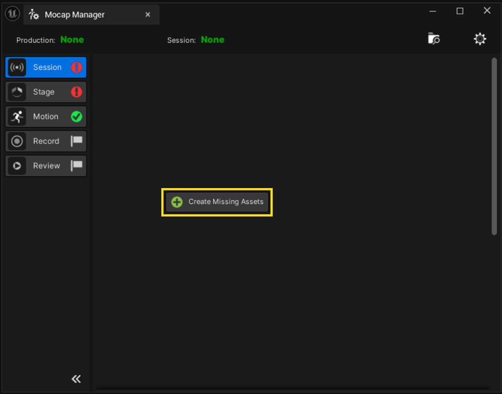
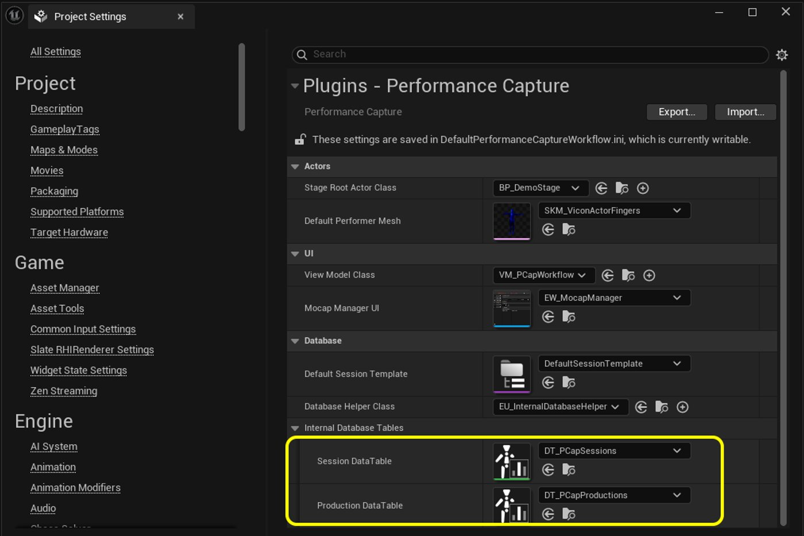
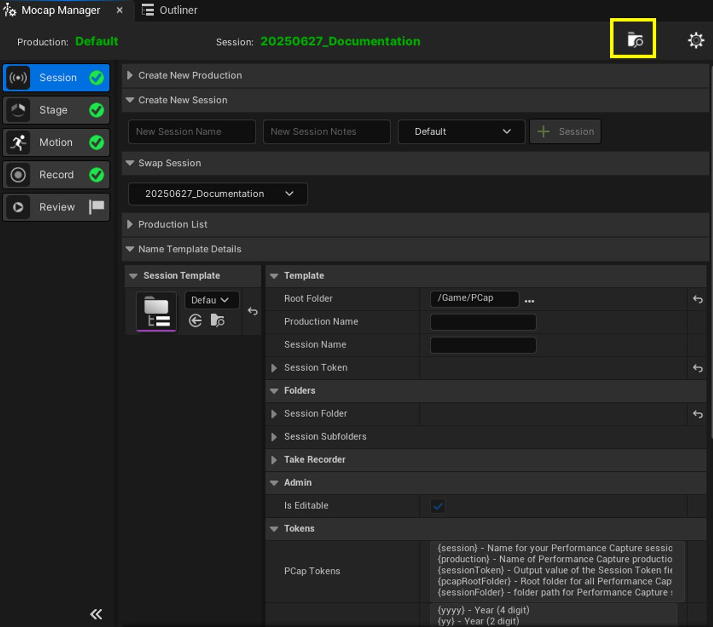
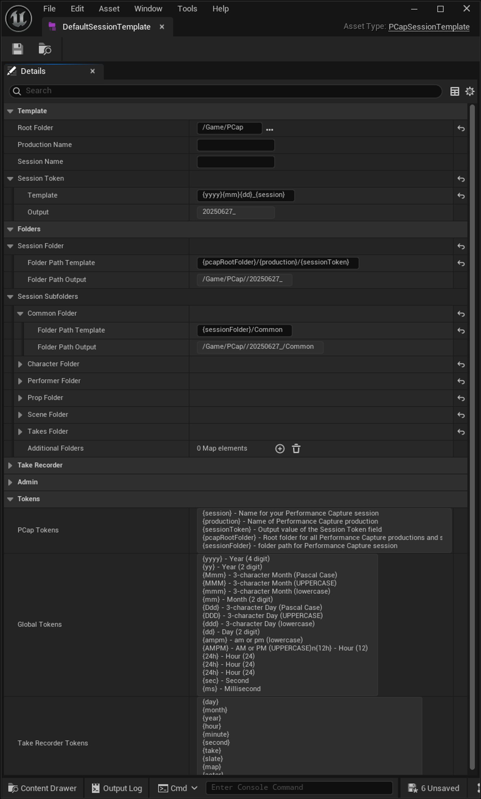
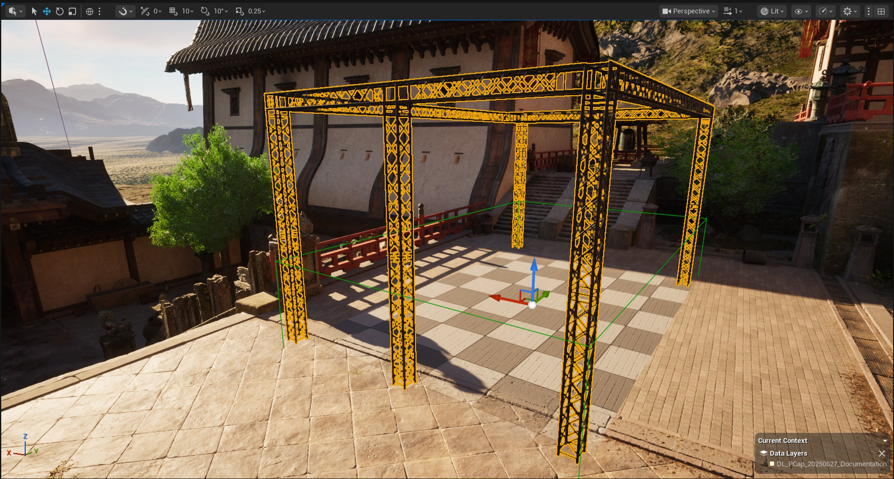
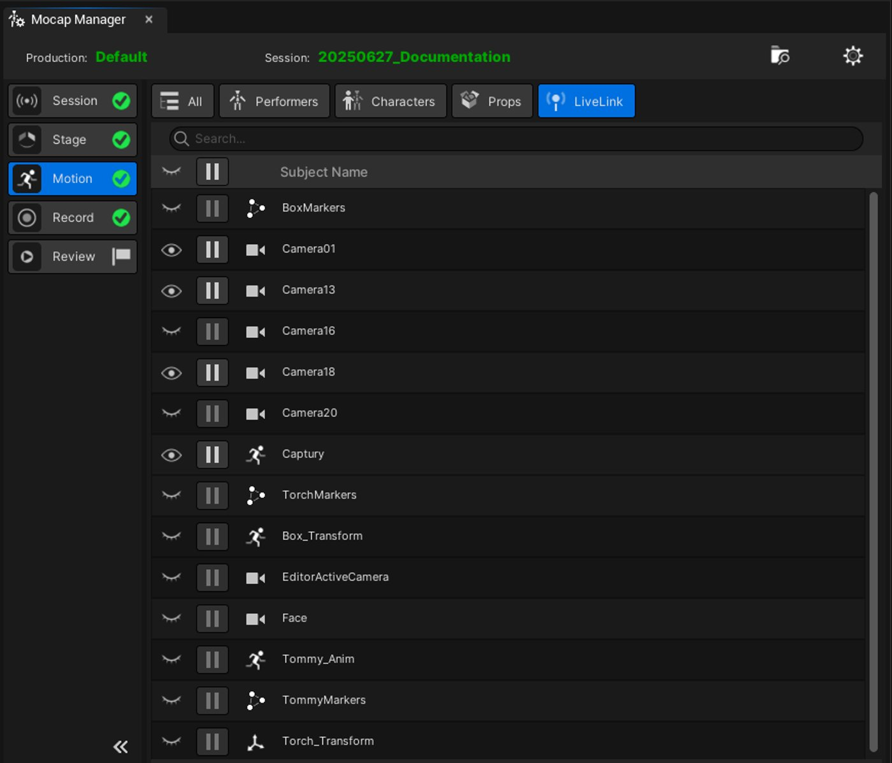
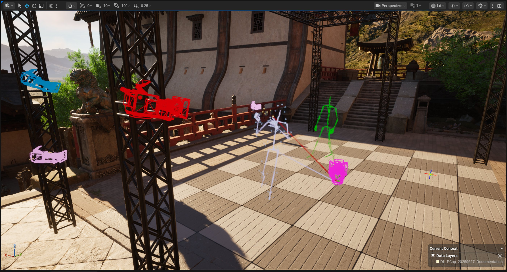

# 动捕管理器

> 路径：虚幻引擎5.7文档 / 为角色和对象制作动画 / 骨架网格体动画系统 / 动画资产和功能 / 动捕管理器

> 原始页面：https://dev.epicgames.com/documentation/unreal-engine/mocap-manager-in-unreal-engine

本教程将全方位讲解动捕管理器。动捕管理器是虚幻引擎"表演捕获工作流程"插件的一部分。

本教程涵盖了如何启用插件、设置动捕舞台表现、管理演员、角色和道具、录制和审核镜头试拍等操作，从而支持完整的表演捕获流程。

## 设置动捕管理器

### 启用表演捕获工作流程插件

1. 转到**编辑（Edit）** > **插件（Plugins）**。
2. 搜索并启用**表演捕获工作流程（Performance Capture Workflow）**插件。
3. 弹出提示后重启编辑器。

### 打开动捕管理器

1. 转到**窗口（Window）** > **虚拟制片（Virtual Production）** > **动捕管理器（Mocap Manager）**。

### 创建所需资产

1. 若弹出提示，请点击**创建缺失资产（Create Missing Assets）**。

   
2. 确认并将这些资产保存至默认文件夹：`Content/Pcap`。

除点击"创建缺失资产"按钮外，你也可以手动创建会话和制片表。 转到内容浏览器，前往**添加（Add）** > **表演捕获（Performance Capture）** > **PCap数据表（PCap Datatable）**，创建一张会话结构体表格，以及一张制片结构体表格。 转到**项目设置（Project Settings）** > **表演捕获（Performance Capture）**，设置对以上两张新表格的引用。

针对每个启用表演捕获工作流程插件的项目，你都只需要添加一次上述资产。

你可能还需要创建自己的会话模板，以决定会话文件夹的创建方式。 为此，请转到 **添加（Add）** > **表演捕获（Performance Capture）** > **PCap数据资产（PCap Dataset）**并选择会话模板的类型。 或者，你也可以复制默认会话模板资产，并按需修改（见`/Plugins/PerformanceCaptureWorkflow/Core/DefaultSessionTemplate`）。

## 使用动捕管理器

动捕管理器是一款集中式管理工具，负责控制动捕拍摄期间所需的内容。 动捕管理器旨在以线性的方式引导你从头到尾完成整个过程。

### 创建会话

1. 在**新建会话（Create New Session）**分段中输入会话名称和任意备注。
2. 点击**+会话（+Session）**。

如此即可创建一个文件夹结构并将其激活。

> [!NOTE]
> 动捕管理器一次只能使用一个活动会话。

你可以随时点击动捕管理器的**文件夹**图标，从而前往你的会话文件夹。

凭借制片，你可以在单个虚幻项目中组织大规模的工作，例如独立的游戏或过场动画交付等。 制片是可选的，如果你不想使用，可以使用默认制片。

会话代表了单独的捕获会话（例如上午或下午的拍摄）。 创建会话时，系统会同步创建会话期间使用的文件夹和部分资产。

你可以使用动态[命名标记](https://dev.epicgames.com/documentation/unreal-engine/BlueprintAPI/NamingTokens/GetNamingTokens?application_version=5.6)自定义会话模板的文件夹结构和名称。

动捕管理器创建的所有Actor都会被分配到会话的数据层或子关卡中。 每个会话都会获得一个新的数据层或子关卡。

创建会话时，动捕管理器会检查当前打开的关卡是否使用了世界分区或关卡流送。 在`[会话名称]/Scenes`文件夹中，系统会根据所创建项的上下文创建一个数据层或子关卡。 该数据层或子关卡将充当关卡的编辑上下文。 这意味着所有Actor都会被放置在此上下文中。

### 在虚幻引擎中设置动捕舞台

表演捕获工作流程（Performance Capture Workflow）插件附带一个名为**BP_DemoStage**的默认预制场景。 你可以按需复制并编辑此蓝图。

系统会在摄像机前方的有效地板上生成舞台。 请调整其位置以对齐你在真实世界中的捕获空间。

在**动捕管理器**的**舞台（Stage）**选项卡中，你可以切换网格视图和舞台虚影网格体，以便更轻松地实现定位，从而对齐你的虚幻关卡与真实世界舞台。

生成的舞台会被添加到关卡的**当前上下文（Current Context）**中。

### 运动Actor设置

你可以在动捕管理器的"运动（Motion）"选项卡中配置Live Link主题，并创建演员、道具和角色。

#### Live Link预览

在**LiveLink**选项卡中，你可以切换预览中显示的传入Live Link主题数据。 列表中的图标表明了数据的类型，即骨架网格体、摄像机或标识。

点击**显示/隐藏**图标即可选择显示单个主题还是全部主题。

#### 创建演员

点击动捕管理器的**运动（Motion）**选项卡中的**演员（Performers）**选项卡，即可创建并生成演员。 演员被封装在名为**PCapPerformer**的数据资产中。

> 图片已省略：演员选项卡

要创建演员，请执行以下操作：

1. 转到**演员（Performers）**选项卡的**创建比例网格体（Create Proportioned Mesh）**分段，从下拉菜单中选择一项**Live Link主题（Live Link Subject）**。 下拉菜单中只会列出角色类型为"动画"（骨架数据）的主题。
2. 点击**启动工作流程（Launch Workflow）**以打开**创建比例网格体（Create Proportioned Mesh）**视口。

   > 图片已省略：动捕管理器的比例网格体工作流程
3. 在视口中，让演员移动位置，直到骨架与原点对齐（使骨盆位于(0,0)处）。
4. 你也可以按暂停键以冻结动画，从而让演员从保持原点姿势的状态中放松下来。
5. 点击**创建网格体和IK绑定（Create Mesh & IKRig）**。这将关闭**比例网格体**视口，并返回**动捕管理器（Mocap Manager）**面板。
6. 点击**创建演员（Create Performer）**按钮，可生成PCapPerformer数据资产。

现在你就可以在**生成演员（Spawn Performer）**分段中选择该演员了。 点击**生成（Spawn）**以生成新建的、应用了Live Link数据的骨架网格体，并将其作为舞台根Actor的子项。

#### 创建道具

点击动捕管理器的**运动（Motion）**选项卡中的**道具（Props）**选项卡，即可创建供演员使用的道具。

> 图片已省略：道具选项卡

要创建道具，请执行以下操作：

1. 转到**道具（Props）**选项卡，点击**启动工作流程（Launch Workflow）**以打开**创建道具（Create Prop）**视口。
2. 转到**静态网格体（Static Mesh）**或**骨架网格体（Skeletal Mesh）**下拉菜单，选择道具的网格体。
3. 转到**主题（Subject）**下拉菜单，选择一个Live Link主题。
4. 转到"道具偏移（Prop Offset）"分段，做出调整以对齐网格体和主题。
5. 转到**名称重载项（Name Override）**字段，输入道具的名称。
6. 点击**完成（Finalize）**。这将关闭**创建道具（Create Prop）**视口，并返回动捕管理器面板。
7. 点击**创建道具资产（Create Prop Asset）**以生成PCapProp数据资产。

与演员数据资产一样，在选择器中选择该道具并点击**生成道具（Spawn Prop）**，即可将对应道具生成到关卡中。

#### 可选：准备一个Metahuman

> [!NOTE]
> 默认情况下，Metahuman蓝图并不适合用于动捕重定向和录制，因为它们不使用SkeletalMeshComponent作为根组件。

要为动捕管理器准备Metahuman，请执行以下操作：

1. 创建一个派生自**CaptureCharacter**的蓝图。
2. 将必要的骨架网格体组件和Groom从你的Metahuman蓝图复制到新蓝图中。
3. 禁用所有组件的贴花。
4. 在除头部组件外，为所有连接到根组件的骨架网格体组件在构造脚本中添加一个**Follow Leader Pose**节点，以强制这些组件从根组件获取姿势。
5. 转到蓝图的**表演捕获（Performance Capture）**分段，取消勾选**强制所有组件跟随先导（Force All Components to Follow Leader）**。

> [!NOTE]
> 如果角色并非Metahuman或不使用多个网格体，则可以直接使用CaptureCharacter并指定单个骨架网格体。

#### 创建角色

你可以在动捕管理器的**角色（Characters）**选项卡中创建角色以供演员控制。

> 图片已省略：动捕管理器的角色选项卡

1. 请在**新建角色资产（Create New Character Asset）**分段中输入以下信息：

   1. **源演员资产（Source Performer Asset）**：选择控制此角色的演员。
   2. **角色类（Character Class）**：选择默认的**CaptureCharacter**类（使用自定义蓝图时除外），例如上文中Metahuman示例的类。
   3. 角色网格体（Character Mesh）：指定角色的身体骨架网格体。 此项为重定向所必需。
   4. **角色名称（Character Name）**：输入角色的名称。
2. 点击**创建角色资产（Create Character Asset）**。 这将生成角色数据资产，用以存储对演员、重定向资产、IK绑定、网格体和CaptureCharacter类的引用。
3. 点击**生成角色（Spawn Character）**即可在场景中生成角色。

生成的角色会被附到舞台根Actor之上。

#### 调整重定向

在动捕管理器中，点击角色上的**重定向调整器**按钮，以打开**重定向设置（Retarget Settings）**窗口。 你可以在此窗口中修改各骨骼链的重定向属性。 重定向调整器仅适用于人形双足结构，因为其骨骼链是专门为匹配自动IK绑定脚本所创建的骨骼链而命名的。

> 图片已省略：调整重定向按钮和重定向设置窗口。

#### 动捕录制器

##### 创建Slate

使用带有名称和元数据的Slate预定义你的录制名称。 这还能为你在会话过程中使用核对清单提供便利。

要在动捕管理器中打开Slates选项卡，请点击**录制（Record）**选项卡，然后点击**Slates**。

Slate会被存储在数据表中。 使用`.csv`文件即可导入更新。

点击所选Slate的**准备（Prep）**按钮，即可指定文本录制的名称。

##### 录制

要在动捕管理器中录制动捕，请执行以下操作：

1. 点击"录制（Record）"选项卡，然后点击"动捕录制器（Mocap Recorder）"。

   > 图片已省略：动捕录制器选项卡
2. 选择要捕获的Actor和数据（演员、道具、Live Link或音频）。
3. 点击**录制（Record）**以开始录制。 录制期间，界面的其余部分会被锁定。
4. 点击**停止（Stop）**以停止录制。

#### 审核面板

录制项会被自动记录在**镜头试拍数据（Takes Data）**表格中。

要查看你的镜头试拍，请执行以下操作：

1. 转到动捕管理器，点击**审核（Review）**选项卡，然后点击**查看镜头试拍（Take View）**。
2. 转到**镜头试拍数据（Takes Data）**，双击其中任一镜头试拍以将其打开。

打开镜头试拍后即可推移、预览并检查该录制项。 为其指定1-5星的评分，以方便整理和筛选。

你可以将镜头试拍表格导出为`.csv`文件，以供日后制片追踪。
