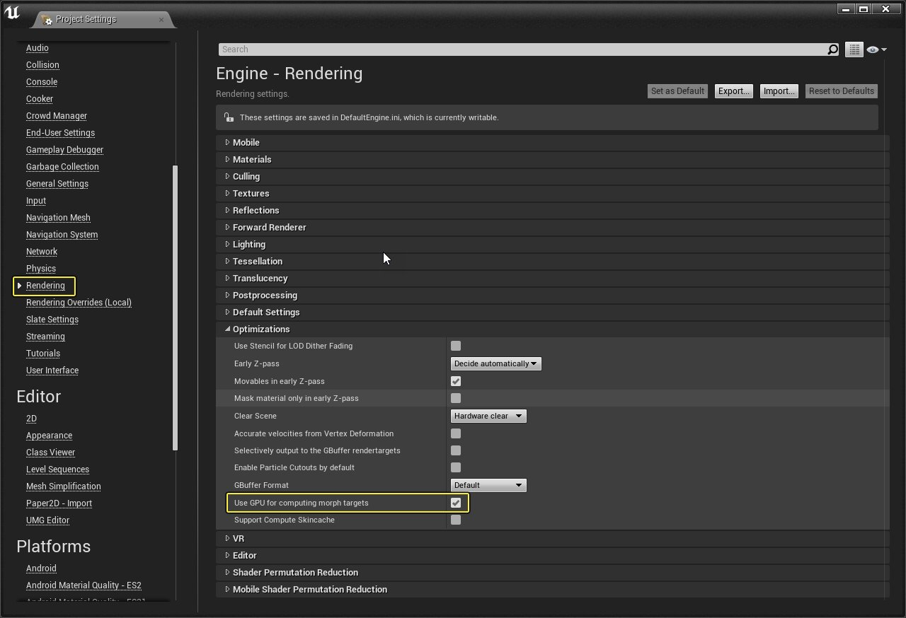

# 变形目标预览器

> 路径：虚幻引擎5.7文档 / 为角色和对象制作动画 / 骨架网格体动画系统 / 动画资产和功能 / 变形目标预览器

> 原始页面：https://dev.epicgames.com/documentation/unreal-engine/morph-target-previewer

**变形目标预览器（Morph Target Previewer）** 用于预览应用到 **骨架网格体** 的 **变形目标（Morph Targets）**（有时称作"变形"或"混合变形"）。每个 **变形目标** 将附加混合到现有的 **骨架网格体** 几何体中。多个变形目标组合后可创建复杂的顶点驱动动画，适合处理面部表情之类的内容。

打开[动画编辑器](../../animation-editors/index.md) 后，**变形目标预览器** 窗口便会默认显示。

## 界面

**变形目标预览器** 面板由两大部分组成：

1. 搜索栏
2. 变形目标列表

搜索栏可过滤出 **变形目标** 列表，以便进行快速查找。输入所需目标的前几位字母后列表便会开始过滤。 也可在一个 **变形目标** 上点击右键，之后将弹出一个含额外操作（如 **Delete** 或 **Copy Morph Target Names**）的对话框。

## 创建变形目标

可将 **变形目标** 作为 **骨架网格体** 的一部分导入，也可独立导入（独立于给定的网格体）。导入文件格式为 FBX。

> [!NOTE]
> 如需了解设置过程和如何将变形目标导入虚幻引擎的更多内容，请查阅[FBX变换目标管线](../../../../working-with-content/fbx-content-pipeline/fbx-morph-target-pipeline/index.md)。

## 使用变形目标

变形目标到位后，则需要设置[动画蓝图](../../animation-blueprints/index.md) 对其加以利用。这将借助 **Set Morph Target** 节点在事件图表中完成。

| 引脚 | 描述 |
| --- | --- |
| 输入引脚 |  |
| Execution | 触发节点效果的执行连线。 |
| Target | 目标 **骨架网格体**。多数情况下这会指向"self"。 |
| Morph Target Name | 正在编辑的 **变形目标** 命名。 |
| Value | 一个（0.0 到 1.0 之间）的浮点值，用于设置编辑中 **变形目标** 的值。 |
| 输出引脚 |  |
| Execution | 将执行传至下一个节点。 |

## 变形目标调试视图模式

启动此视图模式后即可轻松查看哪些顶点受到每个变形目标的影响。

1. 在视口窗口中，点击

   Show

   >

   Mesh Overlay

   >

   Selected MorphTarget Vertices

   。
2. 现在从

   Morph Target Preview

   面板中选中任意

   变形目标

   ，查看调试视图。

## 优化

如目标平台支持 Shader Model 5，则可启用变形目标的 GPU 计算。这意味着如果游戏 CPU 受限，CPU 则无需执行计算，可省出 GPU 处理。此功能可在 **Project Settings** 中启用，请按照以下步骤执行：

1. 在文件菜单上点击

   Edit

   >

   Project Settings

   。
2. 打开

   Project Settings

   的

   Rendering

   部分。
3. 在

   Optimizations

   类目中找到

   Use GPU for computing morph targets

   勾选框并将其启用。

点击查看大图。
