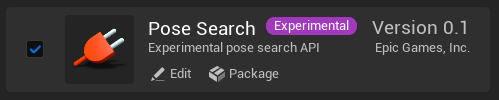
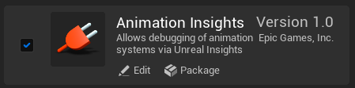
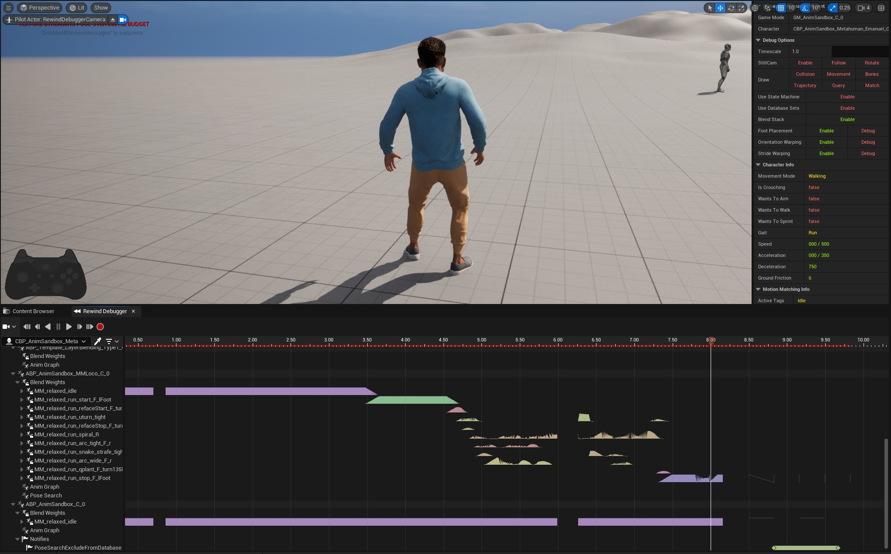
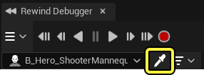
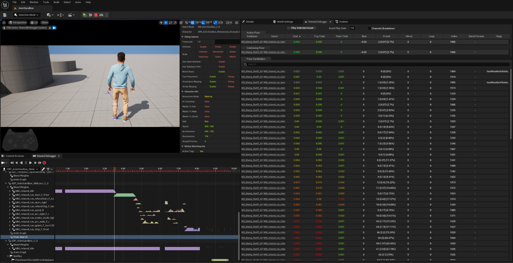
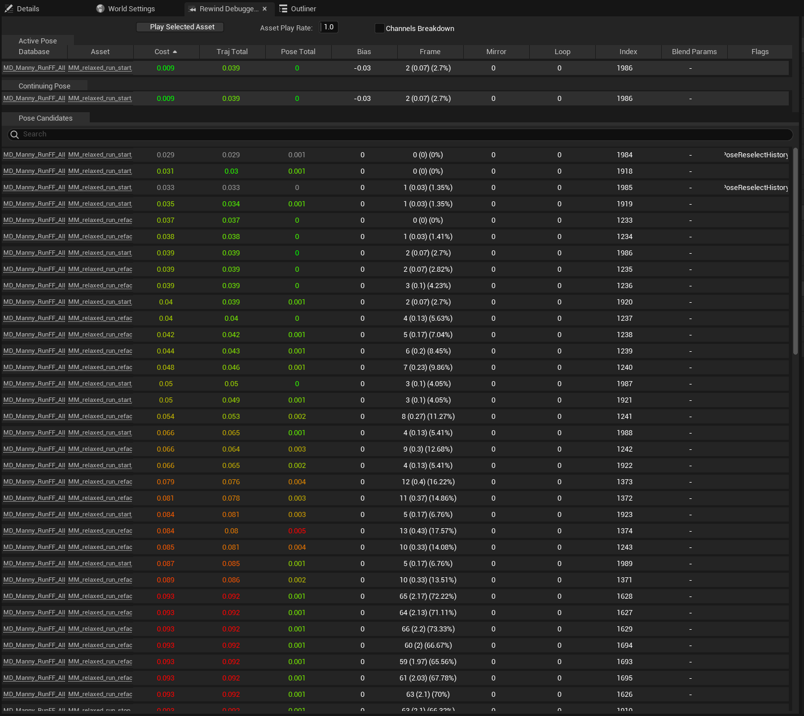
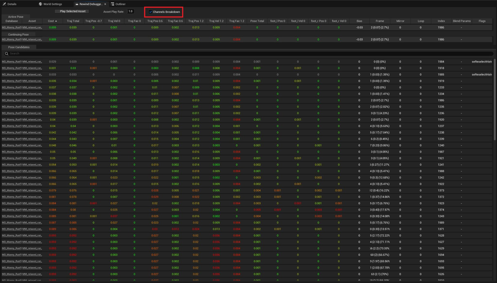
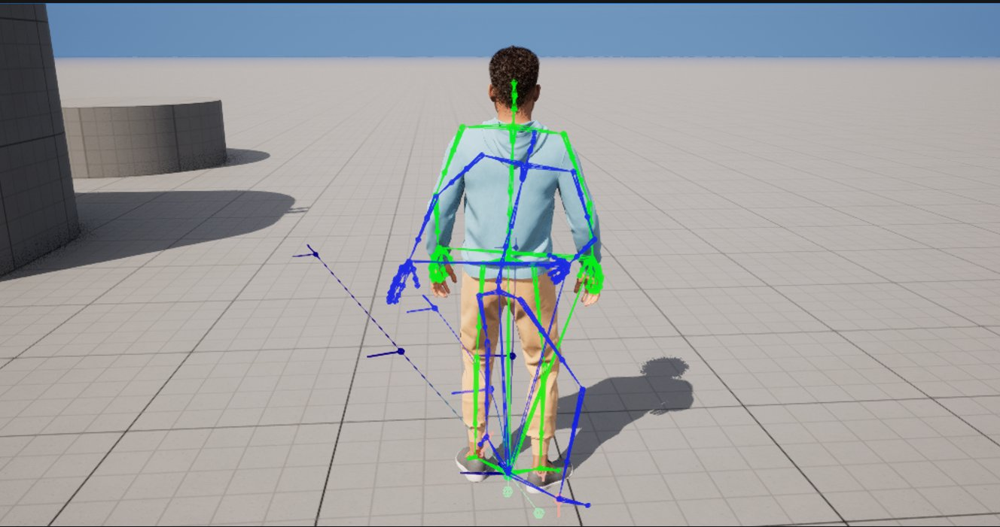

# 运动匹配调试

> 路径：虚幻引擎5.7文档 / 为角色和对象制作动画 / 骨架网格体动画系统 / 动画资产和功能 / 运动匹配 / 运动匹配调试

> 原始页面：https://dev.epicgames.com/documentation/unreal-engine/motion-matching-debugging-in-unreal-engine

Pose Search插件附带了一套调试工具和选项，用于在虚幻引擎中编辑和调整运动匹配系统。此外，该插件还提供了一个自定义的Rewind调试器实现，以观察运动匹配节点在Gameplay录制片段中的姿势选择。

#### 先决条件

- 启用Animation Insights

  插件

  。在菜单栏中找到

  编辑（Edit）

  >

  插件（Plugins）

  ，并在动画分段中找到Animation Insights插件，或使用搜索栏。

  启用

  插件并重启编辑器。

- 启用Pose Search

  插件

  。在菜单栏中找到

  编辑（Edit）

  >

  插件（Plugins）

  ，并在动画分段中找到Pose Search插件，或使用搜索栏。

  启用

  插件并重启编辑器。

- 有一个使用运动匹配节点来驱动其动画蓝图的角色蓝图。

## 自定义Rewind调试器实现

Rewind调试器是一个调试和优化工具，你可以用它来录制Gameplay片段，然后播放所录制的片段，更好地观察动画系统的行为。Pose Search插件附带了一组自定义的Rewind调试器工具，可以跟踪运动匹配姿态分段和值，你可以观察它们以更好地了解哪些姿态被选择，以及为何如此选择。

要将Rewind调试器用于运动匹配系统，请在菜单栏中找到 **工具（Tools）** > **调试（Debug）** > **Rewind调试器（Rewind Debugger）** 和 **Rewind调试器详情（Rewind Debugger Details）** ，打开Rewind调试器和Rewind调试器详情面板。

在录制完一段Gameplay后，你可以播放所录制的片段，实时观察运动匹配系统做出选择。要查看运动匹配选择表，请使用滴管工具在其动画图式中选择使用运动匹配系统的角色。

选择角色后，Rewind调试器大纲视图会用各种组件和资产填充Actor。展开动画蓝图轨道，然后展开 **姿势搜索（Pose Search）** 轨道，观察不同的动画选择和每个动画播放的相应权重。此外，选择姿势搜索轨道后，可以在 **Rewind调试器详情** 面板中观察运动匹配选择表。

### 运动匹配选择表

Rewind调试器详情面板包含多个选项卡，其中包含与运动匹配系统选择标准相关的有用信息和数据。你可以使用这些选项卡来观察运动匹配系统为何选择某个特定姿势。**活动姿势（Active Pose）** 选项卡可基于Rewind调试器在时间轴中设置的时刻查看当前活动的姿势。**后续姿势（Continuing Pose）** 选项卡将列出接下来会选择的动画。比较"活动姿势（Active Pose）"和"后续姿势（Continuing Pose）"选项卡之间的选择，有助于观察在运行时将一个姿势切换为另一个姿势的时机和原因。最后， **候选姿势（Pose Candidates）** 选项卡将列出可从连接的数据库资产中选择的剩余姿势。

每个选项卡包含与运动匹配系统在进行姿态选择时考虑的不同选择因素相关联的值。Rewind调试器详情面板根据使姿势更易被选中的因素为这些值标注颜色。这个热力图将直观地展示哪些值最理想，因此哪些姿势更有可能被选择。绿色值表示该选择比较有利，而红色值表示该选择在所跟踪的所有值类型中不太有利。灰色值表示将被完全忽略的姿势选择。运动匹配系统会尝试在所有类别中找到最有利的动画选择。

下表列出了在典型运动匹配设置中考虑的值：

| 值 | 说明 |
| --- | --- |
| **数据库（Database）** | 列出包含该选择的姿势搜索数据库资产。 |
| **资产（Asset）** | 列出用于设置当前活动姿势的动画资产。 |
| **开销（Cost）** | 列出做出该选择的性能开销的一般值。启用面板顶部的 **通道细分（Channels Breakdown）** 属性，可更广泛地细分用于计算一般开销值的不同因素。 |
| **轨迹总数（Trajectory Total）** | 列出一个值，表示该选择与查询系统的匹配程度。 |
| **姿势总数（Pose Total）** | 列出一个值，表示该姿势与当前活动姿势的接近程度。此值表示从当前活动姿势过渡到所选姿势的难度。 |
| **偏差（Bias）** | 列出一个值，表示运动匹配系统应用于该姿势选择的偏差。正值表示更有可能选择它，而负值表示不太可能选择它。 |
| **帧（Frame）** | 列出所选资产中当前活动姿势正在使用的帧。 |
| **镜像（Mirror）** | 显示是否对资产执行镜像以实现所选姿势。值为 `0` 表示该姿势不会被镜像，值为 `1` 表示该姿势会被镜像。 |
| **循环（Loop）** | 显示资产在播放期间是否设置为循环。值为 `0` 表示该姿势不会循环，值为 `1` 表示该姿势可以循环。 |
| **标记（Flags）** | 这里你可以看到运动匹配系统分配给姿势选择的所有标记。这些标记会增加、减少、甚至完全消除选中某些选择的可能性。默认配置中分配的一个常见标记是 `PoseReselectHistory` ，这意味着该姿势最近被使用过，系统将忽略它，直至选择了更多姿势。 |

此外，你可以展开列出的值，以纳入构成总开销或开销差异的具体因素的完整细分。你可以选择 **通道细分（Channel Breakdown）** 来细分开销输出中的通道，以获得构成帧开销的完整细分。

你可以在Rewind调试器详情面板中选择姿势，以此观察不同姿势选择的调试图。除了所选姿势各自的理想角色轨迹，所选姿势的骨架将在视口中渲染。

