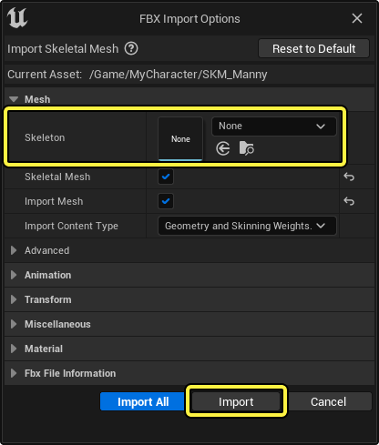
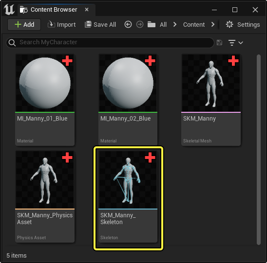
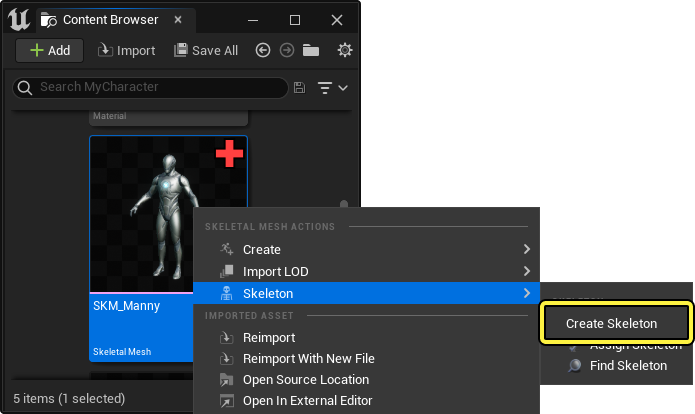
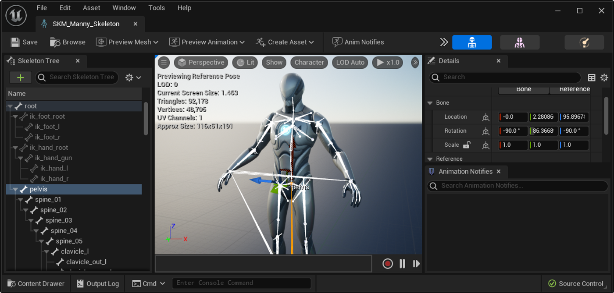
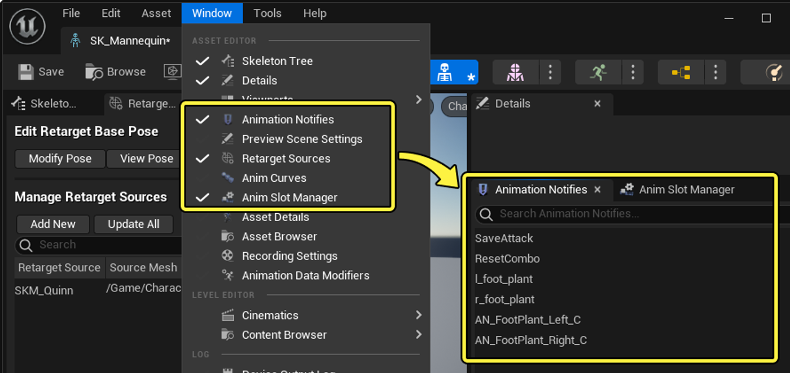
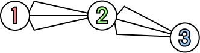
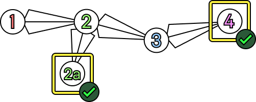
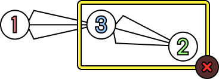

# 骨架

> 路径：虚幻引擎5.7文档 / 为角色和对象制作动画 / 骨架网格体动画系统 / 动画资产和功能 / 骨架

> 原始页面：https://dev.epicgames.com/documentation/unreal-engine/skeletons-in-unreal-engine

**骨架（Skeleton）**本质上是一种层级结构，用于定义[骨架网格体](../../../../understanding-the-basics/actors-and-geometry/unreal-engine-actors-reference/skeletal-mesh-actors/index.md)中的**骨骼（Bone）**（有时也称作**关节（Joint）**）。 就骨骼的位置及其对角色动作的控制而言，这些骨骼和生物学意义上的骨骼并无二致。

在虚幻引擎中，骨架用于保存动画数据、整体骨架层级和[动画序列](../animation-sequences/index.md)，并设置它们的关联。 骨架资产还可以通过多种方式进行共享，从而让动画/数据在不同骨架间共享。

本文将介绍如何创建并使用骨架。

#### 先决条件

- 你的项目需要包含一个[骨架网格体Actor](../../../../understanding-the-basics/actors-and-geometry/unreal-engine-actors-reference/skeletal-mesh-actors/index.md)，或者你需要有一个能导入到虚幻引擎中的带蒙皮的FBX角色。

## 创建骨架

创建骨架的主要方式是[导入](../../../../working-with-content/fbx-content-pipeline/fbx-skeletal-mesh-pipeline/importing-skeletal-meshes-using-fbx/index.md)一个带蒙皮的FBX角色，该角色会被转换成一个虚幻引擎的**骨架网格体**。 导入骨架网格体时，将[FBX导入选项](../../../../working-with-content/fbx-content-pipeline/fbx-import-options-reference/index.md)窗口中的**骨架（Skeleton）**字段留空，那么系统会基于被导入的蒙皮角色自动创建一个骨架资产。

导入角色后，该**骨架资产（Skeleton Asset）**会随其它骨架网格体资产被一同创建。

> [!NOTE]
> 你还可以用任何骨架网格体创建一个骨架副本：在**内容浏览器（Content Browser）**中右键点击该骨架网格体，选择**骨架（Skeleton） > 创建骨架（Create Skeleton）**即可。 这样会创建一个与现有骨骼网格体关联的骨架。 如果该网格体已经有了另一个与它关联的骨架，它会重新链接至新的骨架并且将已有的动画也关联到新的骨架上。
>
> 

双击该骨架资产即可打开[骨架编辑器](../../animation-editors/skeleton-editor/index.md)。

## 骨架树信息

[骨架树](../../animation-editors/skeleton-editor/index.md)中显示的骨骼和其它项目会因多种因素而有所不同。

| 图标 | 说明 |
| --- | --- |
|  | 一个普通的骨骼，能够影响骨骼网格体上的顶点。 |
|  | 当前骨架中的骨骼，不影响骨骼网格体上的顶点。 这些骨骼通常是额外的，比如附加的武器和物品，但是作为骨骼仍然能够添加动画。 |
|  | [插槽](skeletal-mesh-sockets/index.md)，这是一种静态的点，可以用作骨骼的偏移附加点。 |
|  | [虚拟骨骼](virtual-bones/index.md)，这种骨骼会随其他骨骼的变换而变换，但虚拟骨骼的变换位于另一个骨骼空间内。 这种骨骼适合用于锁定不需要的关节动作，并与[IK](../../../skeletal-mesh-an-2df34997/animation-blueprints/animation-blueprint-nodes/animation-bluep-7b8b20e5/animation-bluep-5896e52c/index.md)共同使用。 |
|  | 当前骨架中的骨骼，但是不被骨骼网格体所使用。 如果你[合并](index.md)了骨架，或者当前预览的骨架LOD不使用特定的骨骼，那么就会出现这种骨骼。 |

## 动画数据储存

除了控制动画以外，虚幻引擎中的骨架还用于储存用于动画的数据。 当利用那些资源创建数据时，比如在动画序列中创建一个[动画通知](../animation-sequences/animation-notifies/index.md)，那么它会作为共享的数据被添加到骨架上。

骨架可以储存以下几中动画数据：

- [动画通知](../animation-sequences/animation-notifies/index.md)。
- [动画曲线](../animation-sequences/animation-curves/index.md)。
- [插槽](../../animation-blueprints/animation-slots/index.md)。
- [重定向源](../animation-sequences/retarget-manager/index.md)。
- [混合配置文件和混合遮罩](blend-masks-and-blend-profiles/index.md)。

点击骨架编辑器菜单中的**窗口（Window）**，然后启用一个或者多个面板，即可在专门的工具面板中查看该数据。

## 共享骨架

骨架资产的一个重要特性是单个的骨架资产可以由多个骨骼网格体使用，只要其需要拥有相同的整体rig层级。 这意味着骨骼命名和骨骼的层级排序必须一致，才能够正确地共享。

举个例子，一个骨骼网格体中的一个肢拥有3块骨骼， 骨骼被分别命名为**1**、**2**和**3**：

如果有另一个需要使用相同骨架资源的骨架网格体，则需要保证这些骨骼的命名和排序相同。 然而第二个骨骼网格体可以添加额外或者层级外部的骨骼。 如果接收到的动画数据是用于骨骼网格体之外的骨骼，那么该数据会被忽略。

在这种情况下，你的新层级应该如下所示。 在这里，第二个骨骼网格体有着额外的骨骼，但是并没有改变第一个骨架的层级结构，也没有造成冲突。

然而，为使两个骨架网格体使用相同的骨架资源，无法对层级进行重新排序，也无法重命名骨骼。 如果第二个骨骼网格体要使用不同的骨骼层级和命名结构，那么需要重新创建一个新的骨骼资产。

如果你在不改变顺序的情况下插入一个骨骼，那么能够正常共享。 然而大部分情况下，额外的骨骼可能会导致骨架产生意料之外的变形偏移。 我们建议尽量避免这样做。

> 图片已省略：共享骨架示例4

结合这些共享规则，再虚幻引擎中有几种方式来在骨骼网格体之间共享骨架。 以下是一些细节。

### 导入期间合并

第一种共享骨架的方式是在FBX导入过程期间进行的。 导入你的新骨骼网格体时，（包含额外的和外部的骨骼，遵循上述的共享规则），你可以从项目中已有的骨骼网格体中选择一个骨架。 虚幻引擎将会将这些骨架合并，并且将全部新骨骼添加到层级中。 除此以外，你的骨架的比例会由创建它的原始骨骼网格体来定义。

> 图片已省略：合并共享

> [!NOTE]
> 如果你要导入的骨架与将要合并的骨架大不相同，并且不符合了共享规则，那么会看到一个错误信息：
>
> > 图片已省略：合并骨骼失败
>
> 在这种情况下，你可能需要为导入的骨骼网格体创建一个新的骨架资产，而不是与一个现有的进行合并。

查看合并后的骨架时，层级中会有一些额外的骨骼，但是它们只有在用于对应的骨骼网格体时才可见并激活。

|  |  |
| --- | --- |
|  |  |
| 骨骼网格体1 | 骨架网格体变体2 |

### 可兼容骨架

除此以外，还可以通过将其它骨架定义为可兼容，从而在不同骨架之间非破坏性地共享动画资产。 兼容的骨架可以共享[动画序列](../animation-sequences/index.md)、[蒙太奇](../animation-montage/index.md)、[动画蓝图](../../animation-blueprints/index.md)等等。

要将另一个骨架定义为兼容某个角色，请在[骨架编辑器](../../animation-editors/skeleton-editor/index.md)中打开该角色的骨架资产，点击**工具栏**中的对应按钮以打开**重定向管理器（Retarget Manager）**。

> 图片已省略：可兼容骨架

在**重定向管理器**中，找到**重定向源（Retarget Sources）**面板的**管理兼容骨架（Manage Compatible Skeletons）**分段，然后点击**添加骨架（Add Skeleton）**，从而使用上下文菜单在你的项目中选择另一份骨架资产。

> 图片已省略：添加兼容骨架

现在，你就可以从被添加到**管理兼容源（Manage Compatible Sources）**列表中的骨架上共享动画了。

> 动图已省略：可兼容骨架

> [!NOTE]
> 骨架可兼容性并不是双向的。 如果你将 骨架1 设为与 骨架2 兼容，这并不意味着骨架2与骨架1兼容。如果要让共享完全双向，你还需要将 骨架2 设为与 骨架1 兼容。

创建并管理一个系统的可兼容骨架可以有效地优化你项目中用来驱动角色的动画资产数量。 然而，要使用可兼容骨架系统，所有的角色都必须使用几乎一致的骨架层级结构和命名规则。 除此以外，所有角色都必须拥有相似的网格体比例来达到理想的结果。

如果你需要让有着相同的骨架结构但比例不同的角色共享动画，请参阅[动画重定向](animation-retargeting/index.md)文档。

如果你需要重新编译动画序列，以使其适用于骨架结构截然不同的角色，请参阅[IK绑定重定向](../ik-rig/ik-rig-retargeting/index.md)文档。

## 骨架功能

虚幻引擎中的骨架支持各种功能，包括附加、混合以及其它设置。 参考以下页面来了解这些功能：

- [动画重定位](animation-retargeting/index.md) - 描述如何在多个骨架网格体中使用重定位动画以便共享动画，
- [混合遮罩和混合描述](blend-masks-and-blend-profiles/index.md) - 使用混合遮罩和混合描述来屏蔽骨骼或者改变单个骨骼的混合速度。
- [骨骼网格体LOD](skeletal-mesh-lods/index.md) - 使用骨骼网格体缩减工具生成和修改骨骼网格体的LOD
- [骨架编辑](skeleton-editing/index.md) - 使用骨架编辑工具创建和编辑骨架资产。
- [骨骼网格体插槽](skeletal-mesh-sockets/index.md) - 使用插槽在骨骼网格体中创建附加点。
- [虚拟骨骼](virtual-bones/index.md) - 使用虚拟骨骼和IK来解决分层动画问题。
