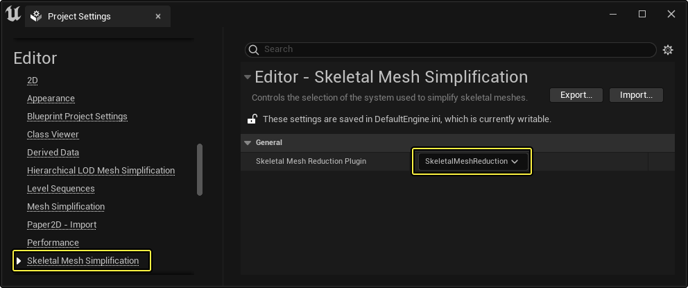
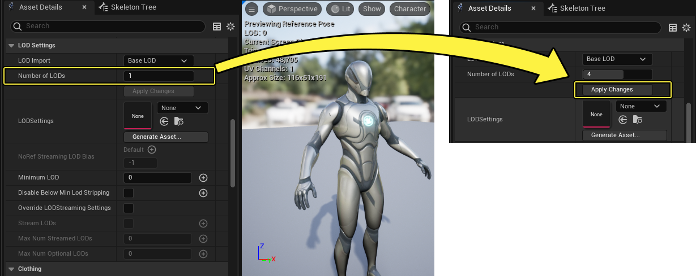
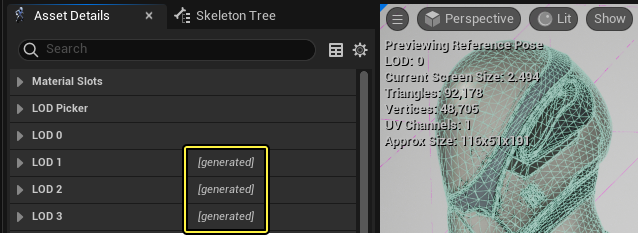
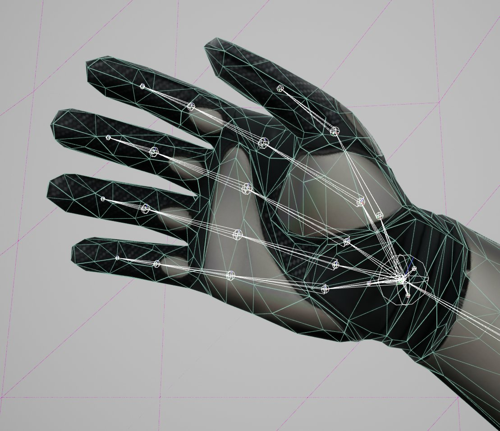
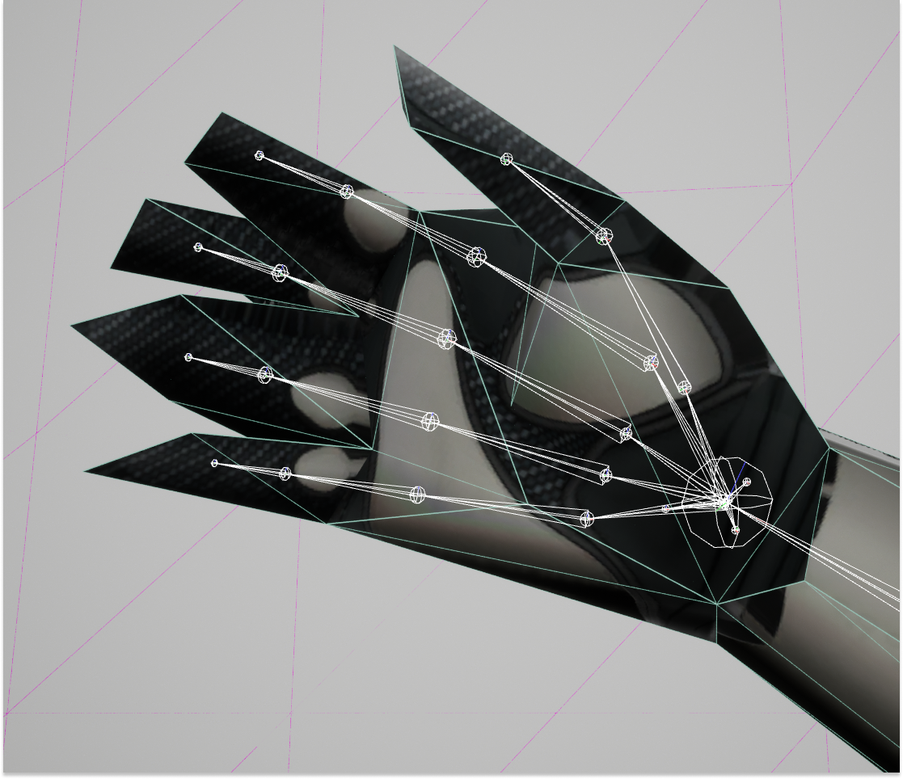
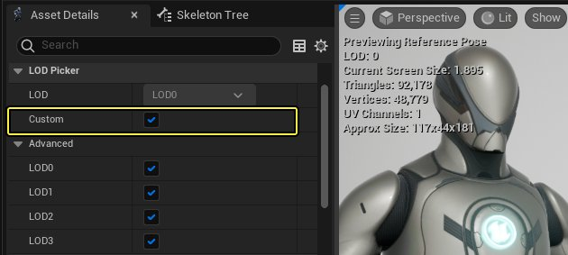
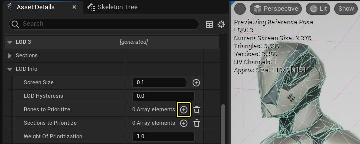

# 骨骼网格体LOD

> 路径：虚幻引擎5.7文档 / 为角色和对象制作动画 / 骨架网格体动画系统 / 动画资产和功能 / 骨架 / 骨骼网格体LOD

> 原始页面：https://dev.epicgames.com/documentation/unreal-engine/skeletal-mesh-lods-in-unreal-engine

在 **虚幻引擎（Unreal Engine）** 中，你可以生成骨骼网格体[LOD（细节级别）](../../../../../working-with-content/static-meshes/creating-and-using-lods/index.md)模型变体以优化Gameplay。在以下文档中，你可以阅读如何使用LOD生成工具和 **骨骼网格体缩减工具（Skeletal Mesh Reduction Tool）** 功能调整LOD生成，以保留细节并更精确地优化 **骨骼网格体** 。

#### 先决条件

- 你的项目包含

  骨骼网格体

  。
- 你的项目启用了骨骼网格体缩减插件。

首先在 **菜单栏** 中点击 **编辑（Edit）> 项目设置（Project Settings）** ，以打开 **项目设置（Project Settings）** 窗口。在项目设置（Project Settings）窗口中，找到 **骨骼网格体缩减简化（Skeletal Mesh Reduction Simplification）** 类别，并确保 **骨骼网格体缩减插件（Skeletal Mesh Reduction Plugin）** 属性设置为 **SkeletalMeshReduction** 。

## 创建LOD

通过你的骨骼网格体，你可以使用LOD生成工具创建模型的LOD变体，以供在项目中使用。

> [!NOTE]
> 在一些情况下，骨骼网格体的LOD在外部数字内容创建（简称DCC）软件中创建。骨骼网格体缩减工具可用于存在外部创建LOD的情况，但重新生成的LOD将覆盖现有LOD，即使是从外部源导入的LOD也不例外。

### 生成LOD

首先，打开你想为其生成LOD的骨骼网格体。在[骨骼网格体编辑器](../../../animation-editors/skeletal-mesh-editor/index.md)的 **资产细节（Asset Details）** 面板中，找到 **LOD设置（LOD Settings）** 分段。

你可以通过 **LOD数量（Number of LODs）** 属性定义你想生成多少LOD。

生成4个LOD会为角色产生总共4个LOD。LOD 0是导入虚幻引擎中的最高质量网格体。从LOD 1开始，每个递增一个LOD都会使骨骼网格体的质量降低一级，LOD 3是最低质量的网格体。

点击 **应用更改（Apply Changes）** ，为骨骼网格体生成新的LOD。

系统将提示你选择LODSettings文件的保存位置，该文件可以保存在与骨骼网格体及相关文件相同的位置。

生成的LOD现在将在视口中的LOD菜单选项中可见。

**骨骼网格体LOD**

> [!NOTE]
> 根据骨骼网格体的复杂度和硬件的性能，LOD生成过程可能需要一些时间才能完成。

LOD可以单独修改，并随时通过从单个LOD的 **缩减设置（Reduction Settings）** 中选择 **重新生成LOD（Regenerate LOD）** 来重新生成，也可以使用基础LOD（LOD 0）的 **LOD设置（LOD Settings）** 中的 **应用更改（Apply Changes）** 修改并重新生成整个集。

> [!NOTE]
> 若是使用虚幻引擎生成的LOD，在资产细节（Asset Details）面板中，其属性分段旁边会有一个注释，指示它已 **[生成]** 。
>
> 

## 骨骼网格体缩减工具

在虚幻引擎中生成LOD时，可能在一些情况下，网格体缩减会消除网格体的关键细节或重要细节。使用 **骨骼网格体缩减工具（Skeletal Mesh Reduction Tool）** ，你可以更精确地定义生成LOD的方式，并控制缩减效果。

### 要优先处理的骨骼

在 **资产细节（Asset Details）** 面板中单个LOD的属性集内，你可以使用 **要优先处理的骨骼（Bones to Prioritize）** 属性保留关联的蒙皮几何体质量。

LOD 3手部

LOD 6手部

首先，在 **资产细节（Asset Details）***面板中，找到 **LOD选取器（LOD Picker）** 分段并启用 **自定义（Custom）** 属性。这样一来，你可以在 **资产细节（Asset Details）*** 面板中看到每个LOD的属性集。

接下来，在单独的LOD属性中，找到 **LOD信息（LOD Info）> 要优先处理的骨骼（Bones to Prioritize）** 并点击 **(+)** ，将新元素添加到数组。

若要保留骨骼网格体中的结构，请从下拉菜单选择结构中的每个骨骼。在每个数组元素中定义单独的骨骼。

> 图片已省略：在要优先处理的骨骼中定义的骨骼示例属性

定义你想保留的结构的所有骨骼后，在 **LOD信息（LOD Info）** 下为 **优先级权重（Weight Of Prioritization）** 属性设置较高的值，例如5,000，然后选择 **重新生成LOD（Regenerate LOD）** 。

> 图片已省略：选择重新生成LOD以重新生成LOD

下面是定义了在生成LOD时要优先处理的骨骼的网格体示例。

> 图片已省略：未定义要优先处理的骨骼的LOD 6

> 图片已省略：将手部骨骼定义为要优先处理的骨骼的LOD 6

未定义要优先处理的骨骼的LOD 6

将手部骨骼定义为要优先处理的骨骼的LOD 6

### 锁定网格体边缘

控制LOD生成过程以减少视觉错误的另一个方法是，使用 **锁定网格体边缘（Lock Mesh Edges）** 功能。锁定网格体边缘（Lock Mesh Edges）会将网格体 **顶点** 锁定到位，以尝试在网格体 **边缘** 维持简化的网格体的结构，代价是 **三角形** 数量更多。当顶点与网格体断开连接，导致网格体边缘出现视觉错误时，此属性很有用。

要启用锁定网格体边缘（Lock Mesh Edges）属性，请在 **资产细节（Asset Details）** 面板中展开LOD的属性。在 **缩减设置（Reduction Settings）** 下，启用 **锁定网格体边缘（Lock Mesh Edges）** ，然后选择 **重新生成LOD（Regenerate LOD）** 。

> 图片已省略：资产细节面板中的锁定网格体边缘属性

## 终止条件

你可以通过 **终止条件（Termination Criterion）** 属性控制网格体几何体的数量和计算方法，从而确定在LOD生成过程中每个单独LOD级别保留多少网格体几何体。为项目的骨骼网格体生成或重新生成LOD网格体时，你可以指定在优化一组LOD或单个LOD级别时必须满足的 **三角形** 或 **顶点** 数量或百分比阈值。

> [!NOTE]
> 一般来说，骨骼网格体的内存开销与网格体几何体中的 **顶点** 数量相关，而特定渲染开销与 **三角形** 数量更密切相关。

选择骨骼网格体的最高质量LOD（**LOD 0**），然后展开其 **缩减设置（Reduction Settings）** 。

> 图片已省略：资产细节面板中的终止条件属性

在 **终止条件（Termination Criterion）** 属性中，你可以选择使用哪种方法在LOD生成过程中优化网格体。从下拉菜单，你可以选择所需的优化方法。

根据所选优化方法，更多属性将可供访问，你可以将其用于微调LOD生成方法，以适应项目的需要。如需终止条件属性的完整列表及其随附说明，请参阅[属性引用](#%E5%B1%9E%E6%80%A7%E5%BC%95%E7%94%A8)的[骨骼网格体缩减工具](#%E9%AA%A8%E9%AA%BC%E7%BD%91%E6%A0%BC%E4%BD%93%E7%BC%A9%E5%87%8F%E5%B7%A5%E5%85%B7)小节。

定义这些属性后，选择 **应用更改（Apply Changes）** 以生成或重新生成骨骼网格体的LOD集，或在修改单个LOD级别的 **终止条件（Termination Criterion）** 时 **重新生成LOD（Regenerate LOD）** 。

### 体积校正

**体积校正（Volumetric Correction）** 可控制优化后的骨骼网格体相较于其源所占用的空间。如果禁用（值为 **零**），简化过程会使圆角表面变平和瘪掉。你可以调整 **体积校正（Volumetric Correction）** 属性，轻微增加（对于大于1的值）或减少（对于小于1的值）骨骼网格体LOD的体积。

> [!NOTE]
> 通常，使用默认设置（值 **1.0**）时效果最佳。

你可以在LOD 0 **缩减设置（Reduction Settings）** 中访问 **体积校正（Volumetric Correction）** 属性，然后选择 **应用更改（Apply Changes）** ，将体积校正应用于整个LOD集。

> 图片已省略：资产细节面板中的体积校正属性

体积校正可以应用于每个单独LOD的 **缩减设置（Reduction Settings）** ，并选择 **重新生成LOD（Regenerate LOD）** 。

## 缩减骨骼

处理骨骼网格体LOD时，可能在一些情况下，你需要随骨骼网格体中的缩减来缩减该网格体的[骨架资产](../index.md)中的骨骼数量。不同于LOD生成工作流程，该过程需要手动定义你想删除的骨骼。

在所需LOD的 **LOD信息（LOD Info）** 属性中，找到 **要删除的骨骼（Bones to Remove）** 属性。使用 **(+)** ，添加数组元素，并在下拉菜单中选择你想删除的骨骼。

> 图片已省略：资产细节面板中的要删除的骨骼属性

添加新的数组元素，并在所选LOD级别为你想删除的每个单独的骨骼定义一个骨骼。

> 图片已省略：在资产细节面板中选择要删除的骨骼

定义你想删除的每个骨骼后，选择 **重新生成LOD（Regenerate LOD）** 。

骨骼网格体的LOD从其骨架删除骨骼后，这些骨骼仍将在该LOD的骨架树中可见，但是它们将由点图标表示，而不再使用通常的骨骼图标表示。

> 图片已省略：骨架树中已删除骨骼的示例

## 属性引用

此处你可以在骨骼网格体编辑器的 **资产细节（Asset Details）** 面板中工作时引用与骨骼网格体LOD相关的属性。

> 图片已省略：资产细节面板

### LOD选取器

在 **LOD选取器（LOD Picker）** 属性分段中，你可以选择哪个LOD的属性在 **资产细节（Asset Details）** 面板中将可访问。

| 属性 | 说明 |
| --- | --- |
| **LOD** | 你可以从下拉菜单切换哪个LOD的属性在 **资产细节（Asset Details）** 面板中可见。默认情况下，一次只有一个LOD的属性可见。 |
| **自定义（Custom）** | 切换到此属性后，你可以使用 **高级（Advanced）** 属性下拉菜单切换哪个LOD的属性将可见，允许多个LOD属性集同时可见。 |
| **高级（Advanced）** | 使每个单独LOD的属性集在资产细节（Asset Details）面板中可见。 |

### LOD信息

对于与骨骼网格体关联的每个LOD变体，在切换到 **视口（Viewport）** 中的单独LOD之后，或者在 **LOD选取器（LOD Picker）** 属性分段中选择你想查看的LOD之后，以下属性集将可访问。

| 属性 | 说明 |
| --- | --- |
| **LOD滞后（LOD Hysteresis）** | 该值用于在跨过LOD阈值时避免"闪烁"。此属性仅在从复杂LOD过渡到简单LOD时考虑。值越高，感知到的模型滞后或延迟越严重，这可以使迥异的LOD之间实现平滑过渡。 |
| **要优先处理的骨骼（Bones to Prioritize）** | 虽然骨骼网格体缩减工具对于缩减骨骼网格体的三角形数量很有效，但在一些情况下缩减过于激进。为了更好地控制哪些优化、哪些不优化，要优先处理的骨骼（Bones to Prioritize）数组会确保不会优化蒙皮到列表中骨骼的几何体。此处列出了应优先处理以保留质量的骨骼的数组。使用下面的 **优先级权重（Weight of Prioritization）** 属性可控制在哪个值优化它们。 |
| **要优先处理的分段（Sections to Prioritize）** | 该属性类似于上面的要优先处理的骨骼（Bones to Prioritize）属性，是应该优先处理以保留质量的分段或材质插槽的数组。使用下面的 **优先级权重（Weight of Prioritization）** 属性可控制在哪个值优化它们。 |
| **优先级权重（Weight of Prioritization）** | 此处列出的值用于确定针对要优先处理的骨骼（Bones to Prioritize）和要优先处理的分段（Sections to Prioritize）属性给予多少考虑分量。权重是额外的顶点简化罚分，其中0表示无罚分。值越高，所列出的骨骼和分段的优先级权重越大，值越低，优先级权重越小。 |
| **源导入文件名（Source Import Filename）** | 列出的是基础网格体FBX文件的源文件目录，以及分开的关联自定义LOD源文件。 |
| **皮肤缓存用法（Skin Cashe Usage）** | 此下拉菜单将设置使用皮肤缓存功能时的LOD行为。选项如下所示： **自动（Auto）** 将遵从项目设置中确立的默认项目全局选项。 **禁用（Disabled）** 意味着网格体不会使用皮肤缓存。 **启用（Enabled）** 意味着网格体要使用皮肤缓存。 如果网格体上启用了 **支持光线追踪（Support Ray Tracing）** 属性，则表示默认为 **启用（Enabled）** 。 |
| **变形目标位置容错（Morph Target Position Error Tolerance）** | 该属性值以微米为单位显示。值越大，压缩越强，内存占用量越少，但质量更差。 |
| **烘焙姿势（Bake Pose）** | 选择要烘焙为姿势的单帧动画。当自动LOD生成为较低细节LOD删除了骨骼，但你想保留已删除的更精细细节，这样做很有用。如需了解详细信息，请参阅[姿势资产](../../animation-pose-assets/index.md)页面。 |
| **烘焙姿势覆盖（Bake Pose Override）** | 覆盖烘焙姿势（Bake Pose）属性。如果使用了一些LOD设置，那么可以禁用源烘焙姿势（Bake Pose）。如需了解详细信息，请参阅[姿势资产](../../animation-pose-assets/index.md)页面。 |
| **要删除的骨骼（Bones to Remove）** | 要从此LOD级别的骨架删除的骨骼的数组。 |

### 骨骼网格体缩减工具

此处你可以引用骨骼网格体缩减工具属性的列表和说明，你可以使用这些属性量身定制骨骼网格体的LOD生成过程。

| 属性 | 说明 |
| --- | --- |
| **终止条件（Termination Criterion）** | 使用骨骼网格体缩减工具中的终止条件（Termination Criterion）选项，你可以更改简化器在LOD生成中缩减骨骼网格体资产的方式。例如，你可以指定顶点而不是三角形的数量（或百分比），提供更多控制权来更好地适应内存或性能目标。 缩减技术的可用选项如下所示： **三角形（Triangles）** ：缩减工具依赖于 **三角形百分比（Percent of Triangles）** 属性，以基础网格体的三角形百分比为目标来生成LOD。 **顶点（Vertices）** ：缩减工具依赖于 **顶点百分比（Percent of Vertices）** 属性，以基础网格体的顶点百分比为目标来生成LOD。 **首个百分比简化（First Percent Simplified）** ：此选项将同时考虑三角形百分比和顶点百分比因素，使用首先实现的任一因素完成LOD，从而生成简化的LOD。 **三角形数量上限（Max Triangles）** ：此选项将使用 **三角形数量上限（Max Triangle Count）** 属性中确立的三角形数量上限生成LOD。 **顶点数量上限（Max Vertices）** ：此选项将使用 **顶点数量上限（Max Vertex Count）** 属性中确立的顶点数量上限生成LOD。 **首个最大值满足（First Max Satisfied）** ：此选项将同时考虑 **三角形数量上限（Max Triangles）** 和 **顶点数量上限（Max Vertices）** 因素，使用首先实现的任一因素完成LOD，从而生成简化的LOD。 根据选择的终止条件，以下选项将动态更改为相关属性。 |
| **三角形百分比（Percent of Triangles）** | 此属性是用于为新LOD生成简化版源网格体的三角形目标百分比值。 |
| **顶点百分比（Percent of Vertices）** | 此属性是用于为新LOD生成简化版源网格体的顶点目标百分比值。 |
| **三角形数量上限（Max Triangles Count）** | 使用百分比条件时要保留的三角形数量上限。这是用于限制自动生成的最大值。 |
| **顶点数量上限（Max Vertices Count）** | 使用百分比条件时要保留的顶点数量上限。这是用于限制自动生成的最大值。 |
| **三角形数量上限（Max Triangles Count）** | 使用三角形数量上限条件时要保留的三角形数量上限。 |
| **顶点数量上限（Max Vertices Count）** | 使用顶点数量上限条件时要保留的顶点数量上限。 |
| **重新映射变形目标（Remap Morph Targets）** | 将现有变形目标从基础LOD重新映射到所选的缩减LOD。 |
| **骨骼影响上限（Max Bone Influence）** | 分配给每个顶点的骨骼数量上限。 |
| **强制实施骨骼边界（Enforce Bone Boundaries）** | 如果启用，虚幻将处罚那些附加了不同主要骨骼的顶点之间的边缘折叠。这有利于摆动的片段，如舌头，但在极端简化的情况下可能会导致意外结果。 |
| **合并一致顶点骨骼（Merge Coincident Vertices Bones）** | 如果启用，相同的位置（例如UV边界）始终有相同的骨骼权重。这可以修复在对角色制作动画时的骨骼合并错误。 |
| **体积校正（Volumetric Correction）** | 用于确定在此LOD级别实现的体积校正的滑块。使用默认值1时，就会尝试保留体积。使更小的值时，将因曲面展平而失去体积，使用更大的值时，曲面将突出。 |
| **锁定网格体边缘（Lock Mesh Edges）** | 如果启用，会将顶点锁定到一个位置，从而保留网格体表面中的切口。这会提高简化的网格体在边缘处的质量，代价是三角形数量更多。 |
| **锁定顶点颜色边界（Lock Vertex Color Boundaries）** | 如果启用，将锁定连接两个顶点颜色的边缘。这会提高简化的网格体在边缘处的质量，代价是三角形数量更多。 |
| **重新生成（Regenerate）** | 如果按下此项，虚幻将使用上面应用的缩减工具属性重新生成当前LOD。 |

## 控制台命令

下面是你在处理骨骼网格体LOD时可以使用的实用控制台命令参考。

| 命令 | 说明 |
| --- | --- |
| **FORCESKELLOD LOD=X** | 强制骨骼网格体在分配的LOD级别渲染，其中X是骨骼网格体的可用LOD编号。 |
| **a.VizualizeLODs** | 在运行时期间绘制LOD。 |
