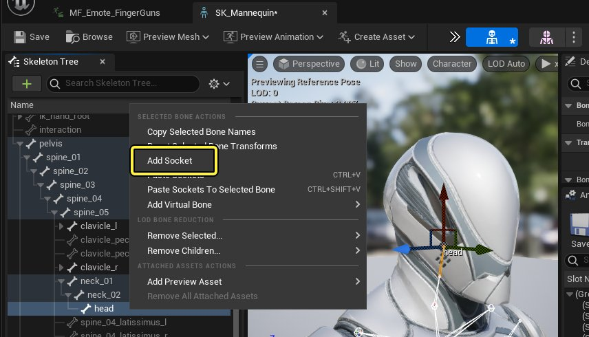
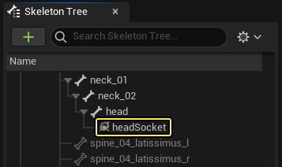
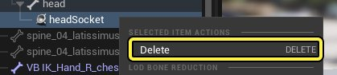
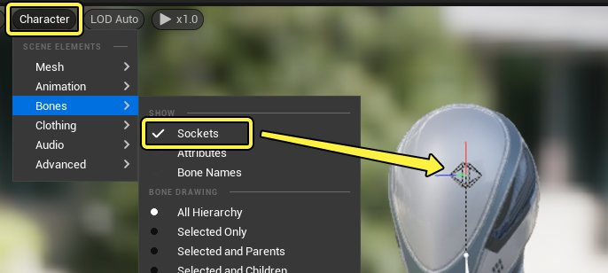
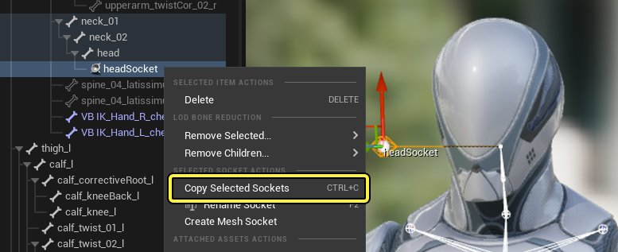
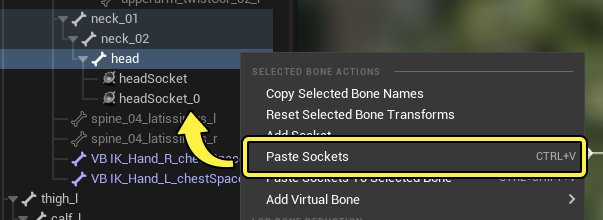
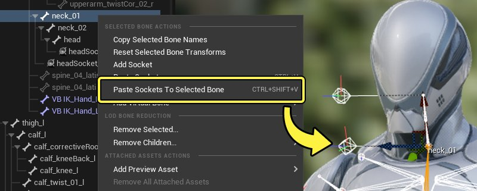
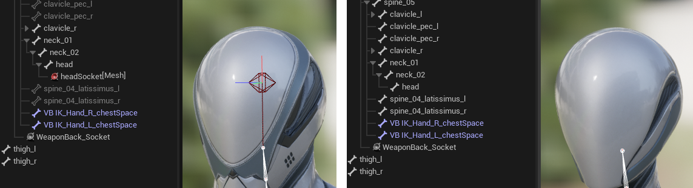

# 骨骼网格体插槽

> 路径：虚幻引擎5.7文档 / 为角色和对象制作动画 / 骨架网格体动画系统 / 动画资产和功能 / 骨架 / 骨骼网格体插槽

> 原始页面：https://dev.epicgames.com/documentation/unreal-engine/skeletal-mesh-sockets-in-unreal-engine

有时，将对象绑定到骨骼网格体的某个骨骼上时，你可能需要偏移此绑定对象。这时，你不必使用数学运算来估算偏移值，而是可以创建一个 **插槽（Sockets）** 。插槽是骨架层级中的一种特殊的绑定点，可以相对于作为其父节点的骨骼进行变换。设置之后，你可以将对象、武器和其他Actor附加到插槽。

本文档概述了如何创建和使用插槽。

#### 先决条件

- 你的项目有

  骨骼网格体

  。

## 创建插槽

插槽从 **骨架树（Skeleton Tree）** 创建，后者可从主要[动画编辑器](../../../animation-editors/index.md)访问。右键点击 **骨架树（Skeleton Tree）** 中的骨骼并选择 **添加插槽（Add Socket）** 。

新插槽现在将显示在骨架树中，以你之前选择的骨骼为父节点。

右键点击插槽并选择 **删除（Delete）** 或在键盘上按 **Delete** 键可删除插槽。

> [!NOTE]
> 默认情况下，创建和操控插槽时，这将编辑骨骼网格体的[骨架资产](../index.md)。因此，你在更改插槽后必须保存。

## 管理和编辑插槽

创建插槽后，你可以按以下方式与之交互。

### 插槽可视性

默认情况下，插槽在[动画编辑器视口](../../../animation-editors/index.md#%E8%A7%86%E5%8F%A3)中不可见，你可以在视口菜单中找到 **角色（Character）> 骨骼（Bones）** 并启用 **插槽（Sockets）** 来使其可见。

### 选择和移动

要选择插槽，可以在骨架树中点击插槽，如果插槽已在视口中可见，可以在视口中点击插槽。接着，你可以拖动视口中的变换操控器来移动插槽。插槽可以平移、旋转和缩放。

> 动图已省略：选择和移动插槽

### 复制和粘贴

插槽可以根据你的要求以不同方式复制和粘贴。

要复制插槽，请在骨架树中右键点击它并选择 **复制所选插槽（Copy Selected Sockets）** ，或按 **Ctrl+C** 。

接下来，你可以选择以下任一操作：

1. 将插槽粘贴到相同的骨骼，方法是右键点击骨架树中的任一骨骼并选择 **粘贴插槽（Paste Sockets）** 。这实际上会复制该插槽。

   
2. 将插槽粘贴到不同的骨骼，方法是右键点击骨架树中的不同骨骼并选择 **将插槽粘贴到所选骨骼（Paste Sockets To Selected Bone）** 。这将使用相同的偏移信息粘贴该插槽的副本，但会以新的骨骼为父节点。

   

### 网格体插槽

在不同的骨骼网格体之间[共享骨架](../index.md#%E5%85%B1%E4%BA%AB%E9%AA%A8%E6%9E%B6)时，可能需要创建专属于某个骨骼网格体的插槽。这可以使用 **网格体插槽（Mesh Sockets）** 来完成，这样做会使插槽存在于 **骨骼网格体（Skeletal Mesh）** 上，而不是 **骨架（Skeleton）** 上。

要创建网格体插槽，请右键点击现有插槽并选择 **创建网格体插槽（Create Mesh Socket）** 。这会将插槽转换为网格体插槽。确保你当前是将[骨骼网格体编辑器](../../../animation-editors/skeletal-mesh-editor/index.md)用于你想为其创建此插槽的骨骼网格体。

> 图片已省略：创建网格体插槽

> [!NOTE]
> 与骨架资产上现有的插槽一样，网格体插槽将转而存在于骨骼网格体上，这需要你在创建或修改网格体插槽时保存该资产。

### 插槽细节

选择插槽时，**细节（Details）** 面板中包含以下属性。

> 图片已省略：插槽细节

| 名称 | 说明 |
| --- | --- |
| **相对位置/旋转/比例（Relative Location / Rotation / Scale）** | 插槽在位置、旋转或比例方面的当前变换坐标，采用相对于其父骨骼的坐标。 |
| **强制始终制作动画（Force Always Animated）** | 启用此属性将导致此插槽的所有父骨骼始终求值，无论它们是否由于当前LOD设置而被删除。 |
| **插槽名称（Socket Name）** | 此插槽的名称。 |
| **骨骼名称（Bone Name）** | 此插槽附加到的骨骼的名称。将此值更改为不同骨骼会为插槽采用新的父节点。 |

## 附加到插槽

创建并定位插槽后，你可以向其附加对象、效果和其他Actor。你可以执行以下种类的附加。

### 基本关卡附加

你可以在关卡中设置基本附加，其中对象将默认附加到插槽。有多种方法可以做到这一点。

> 图片已省略：关卡中的基本插槽附加

#### 拖放

在关卡大纲视图中，将对象拖到骨骼网格体Actor上。界面上将显示一个窗口，你可以在其之后选择要附加到的骨骼或插槽。选择你的插槽，附加过程将完成。

> 动图已省略：拖放插槽附加

> [!NOTE]
> 在关卡中附加时，对象将保留之前的世界变换，如果你要为不同的对象创建唯一的偏移，这会很有用。如果你想要对象匹配插槽的变换，则将对象的变换值设置为默认值。
>
> > 图片已省略：零变换

#### 上下文菜单

右键点击对象并选择 **附加到（Attach To）** ，然后点击骨骼网格体Actor。界面上将显示一个窗口，你可以在其之后选择要附加到的骨骼或插槽。选择你的插槽，附加过程将完成。

> 图片已省略：上下文菜单插槽附加

#### 插槽对齐

点击关卡编辑器中的 **设置（Settings）** 下拉菜单，选择 **启用插槽对齐（Enable Socket Snapping）** 。这将使所有 **插槽** 在视口中可见。

> 图片已省略：启用插槽对齐

接下来，你可以快速将对象附加到任意可见的插槽，方法是选择该对象，然后选择插槽。

> 动图已省略：插槽对齐附加

### 基本蓝图附加

你还可以在[蓝图](../../../../../blueprints-visual-scripting/index.md)中设置 **骨骼网格体组件（Skeletal Mesh Component）** 的基本默认附加。

首先，将对象拖到 **组件（Components）** 面板中的骨骼网格体上，使骨骼网格体组件成为该对象的父节点。

> 图片已省略：蓝图插槽附加

接下来，选择子对象，并在 **细节（Details）** 面板中找到 **父插槽（Parent Socket）** 属性。点击 **搜索按钮** 并选择要附加到的插槽。

> 动图已省略：蓝图父插槽附加

### 动态附加

如果你想控制对象何时附加到插槽、何时脱离插槽，你可以使用各种 **附加** 和 **脱离** 蓝图函数。

若要附加，你可以使用以下函数：

- Attach Actor To Actor

  。
- Attach Actor To Component

  。
- Attach Component To Component

  。

> 图片已省略：附加蓝图函数

附加函数包含以下属性：

| 名称 | 说明 |
| --- | --- |
| **目标（Target）** | 所附加的子Actor或组件。 |
| **父节点（Parent）** | **目标（Target）** 所附加到的父Actor或组件。 |
| **插槽（Socket）** | 附加时要使用的插槽 |
| **位置/旋转/比例规则（Location / Rotation / Scale Rule）** | 用于控制 **目标（Target）** 在附加后应该位于何处的变换规则。可以从以下选项中进行选择： **保持相关（Keep Relative）** ，用于维持当前变换数字值。这可能会导致目标移入新位置，很适合用于在附加时维持相同的偏移坐标。 **保持世界（Keep World）** ，这将维持目标的当前视觉变换。这不会在附加时导致转移，因为系统将执行计算，以在附加前后维持相同的视觉变换。 **对齐到目标（Snap to Target）** ，这会将目标传送到父节点或插槽的坐标。 |
| **结合模拟的形体（Weld Simulated Bodies）** | 是否将目标[结合](../../../../../gameplay-systems/physics/physics-asset-editor/physics-asset-editor-tutorial-directory/welding-physics-bodies-in-unreal-engine-by-usin-ecdbfc9b/index.md)到父节点。 |

若要脱离，你可以使用以下函数：

- Detach From Actor
- Detach From Component

> 图片已省略：脱离蓝图函数
