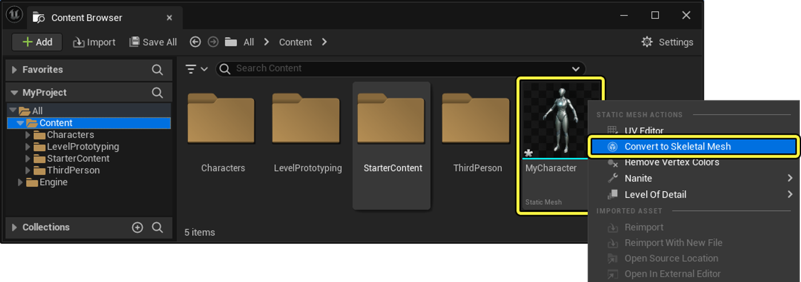
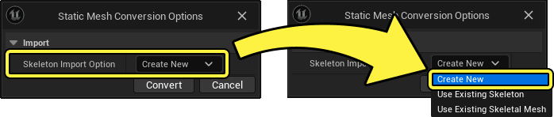
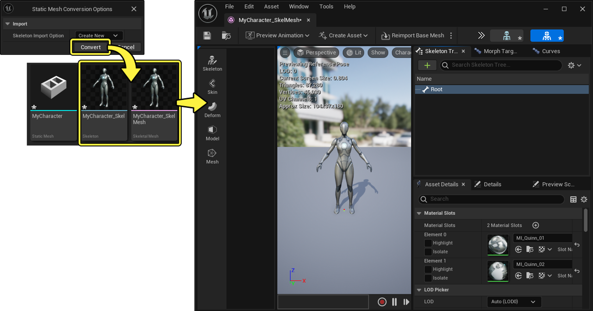
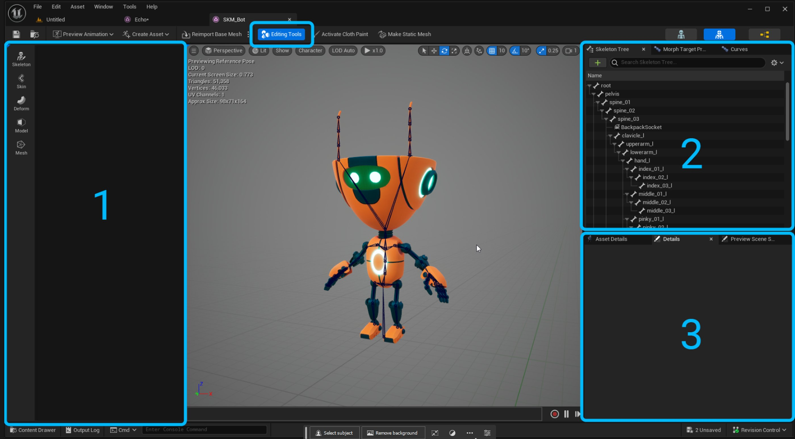
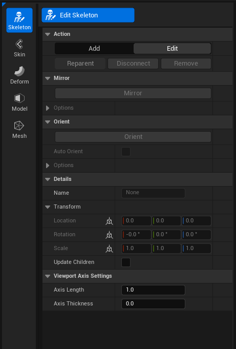
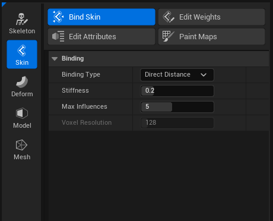
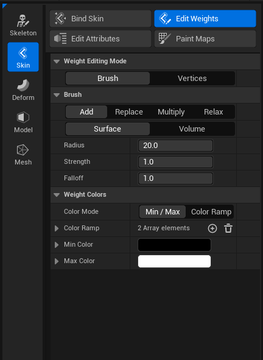

# 骨架编辑

> 路径：虚幻引擎5.7文档 / 为角色和对象制作动画 / 骨架网格体动画系统 / 动画资产和功能 / 骨架 / 骨架编辑

> 原始页面：https://dev.epicgames.com/documentation/unreal-engine/skeleton-editing-in-unreal-engine

你可以使用虚幻引擎的骨架编辑（Skeleton Editing）工具来编辑和修改现有骨架，执行重命名骨骼、编辑骨骼位置或更改骨骼层级等操作。

你还可以为静态网格体创建新的骨架资产，而无需使用骨骼创建（Bone Creation）和蒙皮权重绘制（Skin Weight Painting）等工具导入FBX文件。 结合Control Rig和Sequencer等工具，你可以使用虚幻引擎仅在编辑器中就能对角色进行蒙皮和动画处理。

#### 先决条件

- 启用**骨骼网格体编辑工具（Skeletal Mesh Editing Tools）**[插件](../../../../../understanding-the-basics/foundational-knowledge-in/working-with-plugins/index.md)。 在**菜单栏**中找到**编辑（Edit）> 插件（Plugins）**，转到**动画（Animation）**分段，找到**骨骼网格体编辑工具（Skeletal Mesh Editing Tools）**，或使用**搜索栏**。 启用插件并重启编辑器。

- 你的项目包含一个可以为其创建骨架的静态网格体对象，或者一个待编辑骨架资产的骨骼网格体角色。

## 创建骨骼网格体

在**内容浏览器**中**右键点击**任意静态网格体对象，然后在上下文菜单中选择**转换为骨骼网格体（Convert to Skeletal Mesh）**选项。



选择转换为骨骼网格体（Convert to Skeletal Mesh）选项后，将出现一个菜单，让你选择绑定到静态网格体的现有骨架资产。或者你也可以选择**新建（Create New）**来创建新的骨架资产。



创建新骨架资产时，静态网格体的原点处将创建单个`根`骨骼。



## 编辑骨架资产

创建新的骨架资产或选择你要编辑的现有资产后，在骨架编辑器中打开骨架。 打开编辑器后，在工具栏中，选择编辑工具（Editing Tools）按钮，开始编辑骨架。

你可以参考下面的骨架编辑器的工具和面板概述。



1. **工具面板**
2. **骨架树**
3. **细节（Details）/资产详情（Asset Details）/预览（Preview）**

### 创建和编辑骨骼

要开始创建骨骼，请在工具面板（Tools Panel）中选择骨架（Skeleton）模式。



你可以使用**编辑骨架（Edit Skeleton）**工具，将骨骼放置在视口中的网格体内。

激活**添加（Add）**模式（**N**），然后在视口中选择骨骼，并将新骨骼拖动到角色上的相应长度和位置。 选定的第一根骨骼将充当新骨骼的父骨骼。

创建新骨骼后，选择**接受（Accept）**，确认新骨骼及其位置。

> [!TIP]
> 使用**轴长度（Axis Length）**和**轴厚度（Axis Thickness）**来查看新骨骼所指的方向。

启用**更新子项（Update Children）**属性后，将在编辑时移动以选定骨骼作为父骨骼的所有骨骼。 这将帮助你调整整条骨骼链。

### 设置骨骼父级

通过在骨架树（Skeleton Tree）面板中选择骨骼，并将其拖放到新父级，可以在骨架层级中重新将骨骼设为父级。

### 重命名骨骼

右键点击骨骼，并在上下文菜单中选择**重命名骨骼（Rename Bone）**选项，即可**重命名**（**F2**）该骨骼。

> 动图已省略：ImageAltText

你还可以通过多选骨骼链批量重命名骨骼。 此外，你可以在名称末尾使用主题标签（**#**）运算符，用连续的数字重命名多根骨骼。 例如，你可以在一条骨骼链上多选，将第一根骨骼重命名为`tail_##1`，输入更改后，第一根骨骼的名称将变为`tail_001`，而后面的骨骼名称则将依次变为`tail_002`、`tail_003`等等。

### 编辑模式

选择**编辑模式（Edit Mode）**，然后使用[定向骨骼](index.md#orient-bones)和[镜像骨骼](index.md#mirror-bones)等工具即可编辑骨架中的现有骨骼。

### 定向骨骼

骨骼需要指向正确方向，以便骨骼以理想方式旋转。 此即所谓的**骨骼定向（Bone Orientation）**。 要定向骨骼，请选择要定向的骨骼链并展开定向（Orient）分段。

你可以参考下面的骨骼定向属性及功能说明列表：

| 属性 | 说明 |
| --- | --- |
| **首要（Primary）** | 设置骨骼的朝向，通常是**X**轴。 |
| **次要（Secondary）** | 设置代表骨骼向上方向的轴 |
| **使用平面作为次要（Use Plane as Secondary）** | 启用此属性后，将构建一个穿过骨骼的，以帮助你定向。 |
| **次要目标（Secondary Target）** | 设置用于次要轴的位置 |
| **定向子项（Orient Children）** | 启用此属性后，会对所选骨骼下的所有子骨骼执行定向操作。 |

你还可以手动定向骨骼，方法是选择骨骼并使用旋转控件（Rotate Gizmo）（**R**），或者在每个轴（**X**、**Y**、**Z**）上明确指定变换值。

### 镜像骨骼

为了加快骨架创建过程，你可以使用镜像骨骼（Mirror Bones）工具镜像骨骼链，以复制四肢或其他镜像骨骼结构。 要镜像骨骼链，请选择要镜像的骨骼或骨骼链，然后使用**编辑（Edit）**模式中的**镜像（Mirror）**按钮。

你可以参考下面的镜像骨骼属性及功能说明列表：

| 属性 | 说明 |
| --- | --- |
| **镜像轴（Mirror Axis）** | 设置镜像时要沿其翻转的轴平面。 |
| **镜像旋转（Mirror Rotation）** | 启用后，平面上的旋转将翻转。 这对于动画通常是必要功能。 |
| **左字符串（Left String）** | 定义将用于在左侧搜索的命名 |
| **右字符串（Right String）** | 定义将用于在右侧搜索的命名 |
| **镜像子项（Mirror Children）** | 启用后，镜像骨骼还将镜像所选骨骼链内的所有子骨骼。 |

## 蒙皮重量

为骨骼网格体添加新骨骼时，**绑定蒙皮（Bind Skin）**工具可以帮你为这些骨骼添加**蒙皮权重（Skin Weights）**，从而让骨骼能够影响网格体的几何形状。"蒙皮权重（Skin Weights）"是分配给骨骼网格体几何体的各个顶点的值，表示骨骼在移动时对使顶点变形的影响。 每个顶点可以受到骨架中多根骨骼的影响。 作为用户，你需要为每个顶点分配每根骨骼的权重，以表明顶点应该附着于哪些骨骼。 每根骨骼在每个顶点上都有一个从`0.0`到1.0的值，其中`0`表示顶点完全不受骨骼影响，`1`表示顶点完全附着于骨骼。 `0`和`1`之间的值让顶点能够在一定程度上受骨骼影响。 为每个顶点单独设置蒙皮权重不切实际，因此，绘制蒙皮权重贴图提供了更好的解决方案，可以在整个角色上实现巧妙的变形。

> [!NOTE]
> 每个顶点的蒙皮权重值均需规格化，这意味着每个顶点的总权重必须等于`1`。 这可确保当骨架作为一个整体平移时，网格体中的顶点随之移动。 如果顶点的总权重小于1，则顶点的移动会显得比骨架移动迟缓。 相反，如果总值大于1，则顶点的移动幅度将大于骨架。 因此，虚幻引擎通过规格化网格体每个顶点的蒙皮权重值，强制将总值设置为1。
>
> 例如，如果前臂骨骼在肘部顶点上的权重值为`0.7`，则剩余的`0.3`权重将被分配给一根或多根其他骨骼。 这里，权重可能属于上臂。
>
> 当你编辑顶点权重时，虚幻引擎会自动规格化其他权重，确保总值始终等于1，这可能会导致虚幻引擎自动调整蒙皮权重的值。
>
> 如果顶点仅有1个影响源，即只有1根骨骼对其权重大于零，则你无法对该骨骼的权重进行有意义的修改。 将权重设为`1.0`以外的任何值都会触发规格化程序，无论你指定的值是什么，该程序都会将值设置回`1.0`。 一旦顶点为多根骨骼分配了非零权重，规格化程序就会按需将额外的权重转储到其他影响源上，以实现用户所设的权重。
>
> 想一想前面的顶点示例，其中前臂的权重为0.7，上臂的权重为0.3。 如果用户尝试*移除*前臂上的权重，比如将其设为0.6，那么规格化程序会自动将上臂的权重值从0.3更改为0.4，以保持总值为1。
>
> 最好仅明确添加顶点权重，让规格化程序能够按需删除权重，从而达到所需的值。
>
> 如果你希望骨骼的影响力变小，最好为不同的骨骼添加额外的权重。 这样你可以明确影响力的归属，而不是依靠规格化将其平均分配到其他影响源。

### 绑定蒙皮权重

要开始绘制蒙皮权重，请在工具（Tools）面板中选择蒙皮（Skin）模式，然后选择绑定蒙皮（Bind Skin）工具来设置资产基线设置。



你可以参考下面的绑定蒙皮工具属性及功能说明列表：

| 属性 | 说明 |
| --- | --- |
| **绑定类型（Binding Type）** | 选择用于绑定的方法。 可供选择的方法有：**直接距离（Direct Distance）**：使用骨骼和顶点之间的直线距离，从而将顶点绑定到最近的骨骼。**测地线体素（Geodesic Voxel）**：使用体素化有向距离场内的距离，将顶点绑定到骨骼。 |
| **刚度（Stiffness）** | 设置绑定的刚度。 值越低，将允许距离越远的骨骼参与绑定。 |
| **最大影响数（Max Influences）** | 设置影响每个顶点的最大骨骼数量。 |
| **体素分辨率（Voxel ResolutionVoxel Resolution）** | 当**绑定类型（Binding Type）**设置为**测地线体素（Geodesic Voxel）**时，你可以使用此属性设置体素化网格的分辨率。 较高的值会影响性能，但可能有助于处理更精细的细节。 |

### 绘制权重

有了一组基础权重后，你现在可以绘制蒙皮权重贴图，以设置每根骨骼所影响的网格体区域了。 要绘制蒙皮权重贴图，请在**蒙皮（Skin）**模式中选择**编辑权重（Edit Weights）**按钮。



然后，你可以选择要使用的工具，在网格体上绘制蒙皮权重贴图。 权重编辑模式有两种：

- [笔刷](index.md#brush-mode)：使用笔刷工具在整个网格体上绘制权重。 此模式主要用于在大面积或简单结构上绘制权重。
- [顶点](index.md#vertices-mode)：使用选择工具，选择单个顶点以编辑蒙皮权重。 该模式主要用于精细的权重编辑和遮罩。

> 动图已省略：ImageAltText

#### 笔刷模式

要开始使用笔刷（Brush）模式绘制权重，请从骨架树（Skeleton Tree）面板的层级中选择一根骨骼。 然后，将显示分配给网格体上该骨骼的权重。

> 动图已省略：ImageAltText

笔刷（Brush）模式包含了一组笔刷**操作**，可帮助你编辑权重：

| 操作 | 说明 |
| --- | --- |
| **添加（Add）** | 默认的笔刷模式，可以为当前权重值添加权重，直到达到上限`1.0`。 |
| **替换（Replace）** | 此模式会替换当前权重，减去强度值。 |
| **乘算（Multiply）** | 此模式会将当前权重乘以强度值。 |
| **放松（Relax）** | 此模式会将连接顶点权重的平均值按边缘应用于当前权重。 此模式的操作方式与平滑类似。 |

虚幻还提供以下两种笔刷**类型**供你选择：

| 笔刷 | 说明 |
| --- | --- |
| **表面（Surface）** | 表面笔刷影响与网格体表面的距离成比例的顶点，该距离即**测地线距离**。 这种类型在绘制具有高曲率的狭窄点（如嘴唇）时非常有用。 绘制下唇时，表面笔刷不会影响上唇，反之亦然。 |
| **体积（Volume）** | 体积笔刷影响与从笔刷中心到顶点的直线距离成比例的顶点。 无论网格体的连接或距离如何。 |

每个笔刷还可以通过以下设置进行修改：

| 设置 | 说明 |
| --- | --- |
| **半径（Radius）** | 设置笔刷的大小。 |
| **强度（Strength）** | 设置影响笔刷操作结果的笔刷强度。 |
| **衰减（Falloff）** | 设置笔刷的指数衰减，或者笔刷如何影响笔刷中心周围的点。 |

选择笔刷和模式后，你可以在视口中的网格体上点击并拖动笔刷工具，为所选骨骼绘制的蒙皮权重贴图。

> [!TIP]
> 你可以用热键**B**直观地编辑**笔刷大小（Brush Size）**和**笔刷强度（Brush Strength）。**
>
> 按住B并**左右拖动**，即可编辑笔刷的*半径（Radius）*。
>
> > 动图已省略：ImageAltText
>
> 按住B并**上下拖动**，即可编辑笔刷的*强度（Strength）*。

完成权重编辑后，点击**接受（Accept）**即可确定新权重，并退出工具。

如果你对效果不满意，即使在接受权重后，也可以使用**Ctrl+Z**轻松撤消修改。

#### 顶点模式

在**顶点（Vertices）**模式下，你可以使用**选取框（Marquee）**工具，选择需要编辑权重的顶点。

你可以参考下面的顶点模式操作及功能说明列表：

| 操作 | 说明 |
| --- | --- |
| **镜像（Mirroring）** | 根据**镜像平面（Mirror Plane）**的方向，将当前选定的骨骼和顶点权重镜像到另一侧。 |
| **洪泛权重（Flood Weights）** | 使用**笔刷操作**洪泛选定权重。 你可以选择顶点和骨骼，并使用**添加（Add）**操作，即可洪泛权重。如果骨骼上的权重被洪泛为`0.0`或无权重，则该骨骼的权重将被发送回该层级的根骨骼。 |
| **修剪权重（Prune Weights）** | 低于给定阈值的权重将被删除。 这对于提高性能特别有用。 |

要平滑权重贴图的硬周界，请选择顶点、骨骼，然后使用**放松（Relax）**操作。

### 镜像权重

为了加快蒙皮权重绘制工作流程，你可以使用镜像（Mirror）按钮镜像对称结构，例如四肢或其他镜像结构。 要镜像某个结构，请选择你要镜像的骨骼、骨骼链或顶点，然后转到**编辑权重（Edit Weights）**选项卡下的**工具（Tools）**面板，选择**镜像（Mirror）**按钮。

> [!NOTE]
> 使用顶点（Vertices）模式时，如果未选择任何顶点，将对所有受所选骨骼影响的顶点执行该操作。 这对于将角色整个左侧的权重镜像到右侧非常有用

### 绘制属性贴图

**特性贴图（Attribute Maps）**是各顶点的权重贴图，绘制后可作为数据发送到虚幻引擎中的其他位置，例如[变形器图表](../../deformer-graph/index.md)。 要创建新的特性贴图以开始绘制，请找到**编辑特性（Edit Attributes）**选项卡，为贴图指定新名称，然后执行**添加权重贴图层（Add Weight Map Layer）**。

这张新贴图将在**特性检查器（Attributes Inspector）**的**顶点特性（Vertex Attributes）**分段中显示。

创建新的特性贴图后，选择工具（Tool）面板中的**绘制贴图（Paint Maps）**选项卡，即可绘制贴图。 你可以在**选定特性（Selected Attribute）**下选择要绘制的贴图类型，然后点击并拖动**视口**，开始绘制网格体。

## 热键参考

你可以参考下面的每种骨架创建模式的可用热键列表。

### 权重编辑

| 热键 | 说明 |
| --- | --- |
| **B**（按住）（左右拖动） | 更改笔刷的半径大小 |
| **B**（按住）（上下拖动） | 更改笔刷的强度 |
| **Shift** | 放松笔刷 |
| **Ctrl** | 反转当前笔刷 |
| **鼠标中键点击**（骨骼） | 以可视化的方式选择要绘制的影响力 |
| **F** | 将摄像头框在选定的顶点或骨骼上 |

### 骨骼编辑

| 热键 | 说明 |
| --- | --- |
| **N** | 创建新骨骼 |
| **ESC** | 编辑骨骼 |
| **B** | 重设父级 |
| **Shift** + **P** | 断开连接（取消父级） |
| **Delete** | 删除骨骼 |

## Python API

你可以参考下面的骨架编辑工具的Python API，用来编写脚本，实现工作流程的自动化。

### 访问骨骼和权重

C++

```
mesh_path = "/Game/Characters/Mannequins/Meshes/SKM_Quinn_Simple" asset_editor = unreal.EditorAssetLibrary() skel_mesh = asset_editor.load_asset(mesh_path)
```

### 加载修饰符库

C++

```
# load the weight modifier weight_modifier = unreal.SkinWeightModifier() # load the skeleton modifier skeleton_modifier = unreal.SkeletonModifier()
```

### 创建新骨骼

C++

```
# Create two bones, a and b skeleton_modifier.set_skeletal_mesh(skel_mesh) skeleton_modifier.add_bones(["a", "b"],["root", "root"], [unreal.Transform(), unreal.Transform()])
```

### 设置骨骼父级

C++

```
# Parent bone b to bone a skeleton_modifier.parent_bone("b", "a")
```

### 提交更改

C++

```
# Commit the changes skeleton_modifier.commit_skeleton_to_skeletal_mesh()
```
