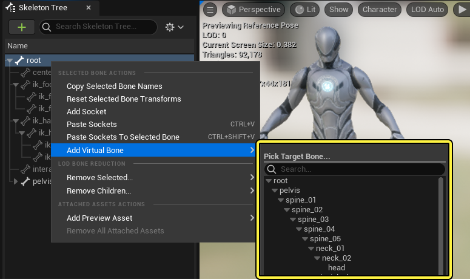
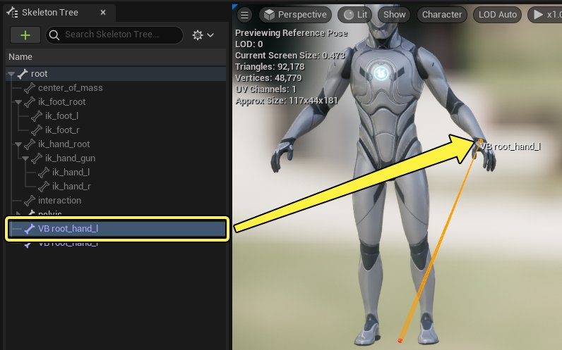
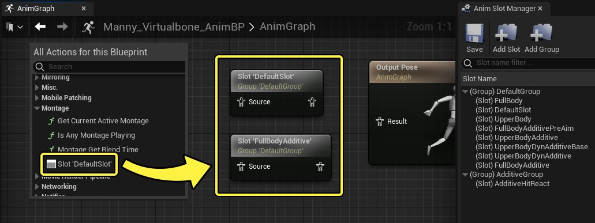
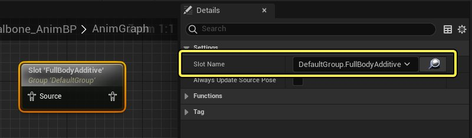
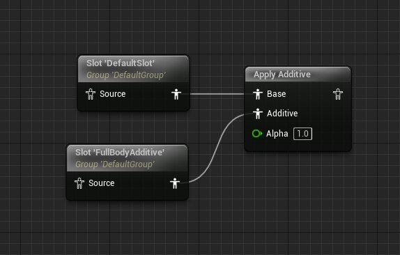
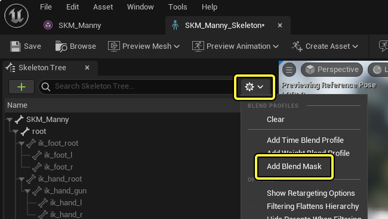
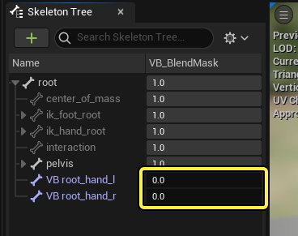
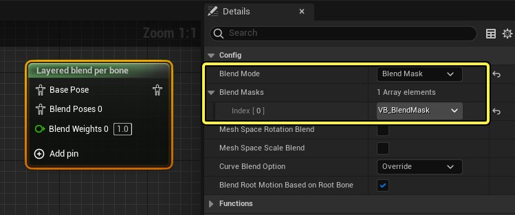

# 虚拟骨骼

> 路径：虚幻引擎5.7文档 / 为角色和对象制作动画 / 骨架网格体动画系统 / 动画资产和功能 / 骨架 / 虚拟骨骼

> 原始页面：https://dev.epicgames.com/documentation/unreal-engine/virtual-bones-in-unreal-engine

在构建复杂的混合、分层或压缩动画系统时，可能会在角色的四肢（通常是手和脚）上导致多余的非预期移动（称为"游泳现象"）。**虚拟骨骼** 与[IK节点](../../../../skeletal-mesh-an-2df34997/animation-blueprints/animation-blueprint-nodes/animation-bluep-7b8b20e5/animation-bluep-5896e52c/index.md)一起使用可纠正这一非预期行为。

本文介绍了如何在[骨架](../index.md)中创建虚拟骨骼，并将其用于动画蓝图](animating-characters-and-objects/SkeletalMeshAnimation/AnimBlueprints)。

#### 先决条件

- 你的项目包含[骨骼网格体Actor](../../../../../working-with-content/skeletal-mesh-assets/index.md)。
- 你已经基本理解如何使用[动画蓝图](../../../animation-blueprints/index.md)。

## 虚拟骨骼概述

虚拟骨骼是变换其他骨骼之后的骨骼，但位于不同的骨骼空间。在大部分情况下，这意味着虚拟骨骼将成为 **根骨骼** 的子节点，但在手或脚等 **末端骨骼** 之后。换句话说，虚拟骨骼可以直接跟在目标骨骼之后，而不收到导向该目标的所有关节的正向运动学（FK）层级的额外效果。你可以使用此功能设置逆向运动学（IK）系统，使角色手足跟在虚拟骨骼之后，从而解决复杂动画系统中的"游泳现象"和其他手足摆动问题。

在此示例中，使用IK的虚拟骨骼用于在显示累加头部盯视动画时保持步枪和手的位置。如果不使用IK，手和武器将"游动"，导致意外的移动。

|  |  |
| --- | --- |
| 使用虚拟骨骼 | 无虚拟骨骼 |

### 与传统IK的差异

虚拟骨骼的一个主要方面是，它们跟在目标骨骼之后。这样一来，你仍可以播放目标骨骼可以移动的动画，改变虚拟骨骼的位置。这种设置优于传统的纯IK系统，后者的IK可能会干扰动画。例如，如果你设置的系统中，手通过IK附加到武器，你就需要执行额外的步骤在重新装弹药等特定情况下禁用IK。

在此示例中，即使是在播放累加动画，使用IK的虚拟骨骼仍能够允许相对于其他物体的基础手部移动。虽然传统IK设置可能会解决"游泳"问题，但会导致手部始终固定在一个地方，迫使你创建额外逻辑在诸如以上的情况下关闭IK。

|  |  |
| --- | --- |
| 允许基础手部移动的虚拟骨骼 | 将手部固定在一个地方的纯IK设置 |

## 创建虚拟骨骼

你可以在动画编辑器的[骨架树](../../../animation-editors/skeleton-editor/index.md#%E9%AA%A8%E6%9E%B6%E6%A0%91)中创建虚拟骨骼。右键点击骨骼，它将为 **父节点** ，然后选择 **添加虚拟骨骼（Add Virtual Bone）** 。从此列表选择骨骼，以指定 **目标** 。在此示例中，虚拟骨骼创建为 **根骨骼** 的子节点，然后以 **hand_l骨骼** 为目标。

创建后，你现在应该会看到虚拟骨骼是 **父骨骼** 的子节点，但匹配 **目标骨骼** 的变换。默认情况下，虚拟骨骼按照其命名规范自动命名为 `VB <Parent>_<Target>` 。

> [!NOTE]
> 你还可以预览[动画序列](../../animation-sequences/index.md)并观察虚拟骨骼在动画的时长内跟在目标骨骼之后。
>
> > 动图已省略：虚拟骨骼跟随

## 动画蓝图设置

创建虚拟骨骼后，你可以在[动画蓝图](../../../animation-blueprints/index.md)中为其设置逻辑。由于虚拟骨骼具有任意性，你可以采用许多不同的方式来使用。本小节将演示如何为虚拟骨骼创建基本武器覆盖和累加动画设置。

### 插槽设置

首先，在动画蓝图[动画图表](../../../animation-blueprints/graphing-in-animation-blueprints/index.md)中，创建两个[插槽](../../../animation-blueprints/animation-slots/index.md)节点。插槽是动画蓝图中的代理区域，你可以在其中插入一次性的动画，插槽将用于区分基础和累加动画层。

右键点击动画图表并选择 **蒙太奇（Montage）> 插槽'DefaultSlot'** 以创建插槽。

对于第二个插槽，将其选中，并在 **细节（Details）** 面板中将 **插槽名称（Slot Name）** 属性设置为不同于DefaultSlot的值，以便动画可以正确发散。

将插槽连接到 **Apply Additive** 节点，将 **默认插槽** 连接到 **基础（Base）** 引脚，并将 **累加插槽** 连接到 **累加（Additive）** 引脚。

### 排除虚拟骨骼

接下来，你需要创建[混合遮罩](../blend-masks-and-blend-profiles/index.md)，以便排除虚拟骨骼而不在累加插槽中求值。

在动画编辑器的[骨架树](../../../animation-editors/skeleton-editor/index.md#%E9%AA%A8%E6%9E%B6%E6%A0%91)中，点击 **选项（Options）** 下拉菜单并选择 **添加混合遮罩（Add Blend Mask）** 。为其命名，然后按 **Enter** 键。

接下来，找到你的虚拟骨骼，并将其混合值设置为 **0.0** 。

返回到动画图表，创建[Layered Blend per Bone](../../../animation-blueprints/animation-blueprint-nodes/animation-blueprint-blend-nodes/index.md#layeredblendperbone)节点，并在其中设置以下属性：

- 将

  混合模式（Blend Mode）

  设置为

  混合遮罩（Blend Mask）

  。
- 将

  混合遮罩（Blend Masks）

  设置为排除虚拟骨骼的混合遮罩。

连接此节点，使其位于 **累加插槽** 和 **Apply to Additive** 节点之间，将该插槽仅连接到 **混合姿势（Blend Poses）** 引脚。现在，随着动画从此累加插槽播放，混合遮罩将导致累加动画不影响虚拟骨骼。

> 图片已省略：将插槽连接到layered blend per bone

### IK设置

最后，你需要创建IK设置，使手足跟在虚拟骨骼之后，同时累加层将排除所有多余的虚拟骨骼移动。

创建[Two Bone IK](../../../../skeletal-mesh-an-2df34997/animation-blueprints/animation-blueprint-nodes/animation-bluep-7b8b20e5/animation-bluep-5896e52c/index.md)节点，并在细节（Details）面板中对其设置以下属性：

- 针对此手足将IKBone设置为你的末端目标骨骼。
- 将

  执行器位置空间（Effector Location Space）

  设置为

  骨骼空间（Bone Space）

  。
- 启用

  从执行器空间获取旋转（Take Rotation from Effector Space）

  ，这会向IK骨骼添加旋转。
- 针对此手足将

  执行器目标（Effector Target）

  设置为你的虚拟骨骼。
- 将

  关节目标位置空间（Joint Target Location Space）

  设置为

  父骨骼空间（Parent Bone Space）

  。
- 将

  关节目标（Joint Target）

  设置为

  IKBone

  的相同值。

> 图片已省略：two bone ik属性

关节目标位置用于定义IK极向量，它应该设置为肘后的位置。根据角色的关节，该值可能有所不同。对于默认虚幻引擎人体模型，该值设置为：

1. X：-25.0
2. Y：-50.0
3. Z：0.0

> 图片已省略：关节目标位置

为你想匹配到虚拟骨骼的每个手足创建额外的 **Two Bone IK** 节点。

### 查看结果

全部完成后，动画图表应该类似于如下内容，其中你将拥有：

1. 用于基础和累加动画层的

   插槽

   节点。
2. 这些插槽连接到Apply Additive节点，并且

   Layered Blend per Bone

   节点用于通过

   混合遮罩

   从累加层排除虚拟骨骼。
3. IK节点在手足上用于附加到最终虚拟骨骼位置，这将使用基础动画层。

> 图片已省略：动画图表摘要

现在，当在此框架中播放动画时，你应该会看到角色的手足跟在虚拟骨骼位置之后，并且每当播放累加动画时都不受影响。

> 动图已省略：虚拟骨骼结果
