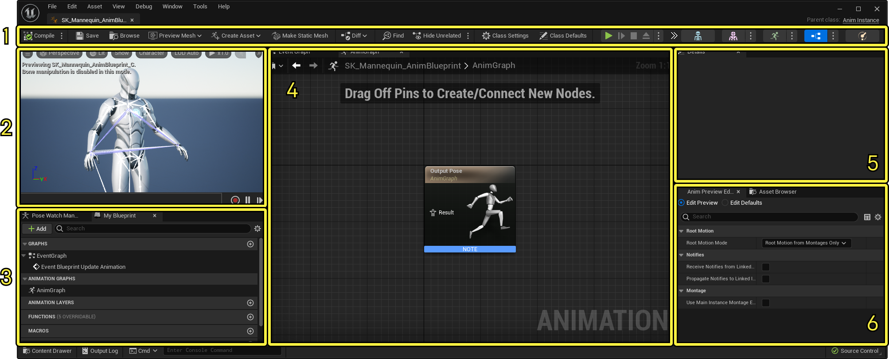
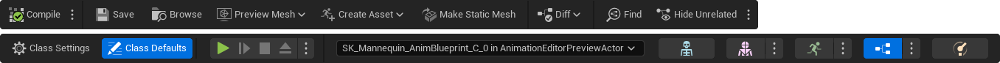
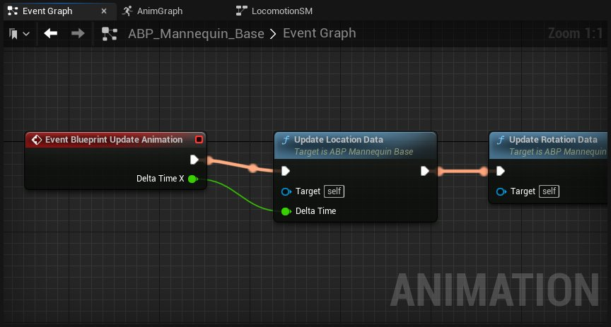
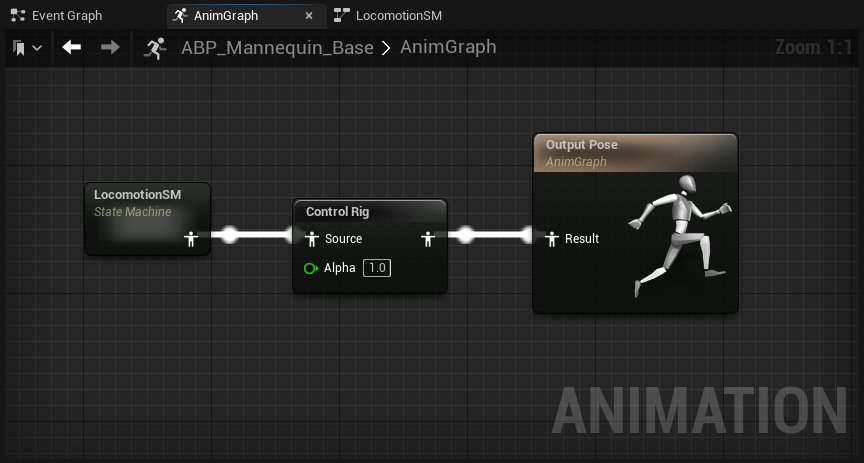
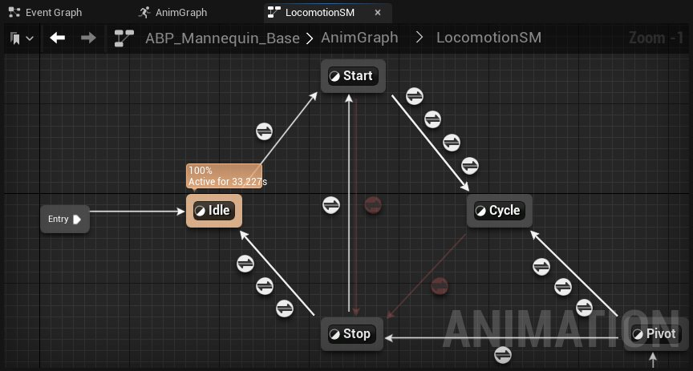
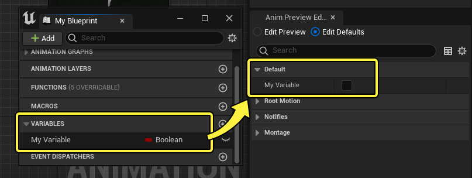
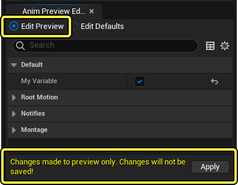

# 动画蓝图编辑器

> 路径：虚幻引擎5.7文档 / 为角色和对象制作动画 / 骨架网格体动画系统 / 动画蓝图 / 动画蓝图编辑器

> 原始页面：https://dev.epicgames.com/documentation/unreal-engine/animation-blueprint-editor-in-unreal-engine

**动画蓝图编辑器（Animation Blueprint Editor）** 的工作方式与[蓝图编辑器](../../../../blueprints-visual-scripting/user-interface-reference-for-the-blueprints-vis-53faed96/index.md)类似，但是使用不同的功能、工具与窗口，其目的在于给角色动画编写脚本。

这篇文档大致介绍动画蓝图编辑器的界面。

#### 先决条件

- 你已经创建并打开了一个

  动画蓝图

  。
- 你对于

  蓝图可视化脚本

  有基本的了解，动画蓝图编辑器的许多界面和工作方式都基于它而来。

打开一个动画蓝图后，你将会看到以下界面：

1. 工具栏（Toolbar）

   ，包含管理动画蓝图和切换编辑器类型的按钮。
2. 视口（Viewport)

   ，这里你可以预览动画蓝图逻辑对于角色动作的影响。更多信息，参阅

   动画编辑器

   该页面的

   视窗

   小节。
3. 我的蓝图（My Blueprint）

   ，与

   蓝图编辑器中

   类似，这里罗列了你的图表、函数、变量以及其他与动画蓝图相关的属性。这里还包括了

   姿势观看管理器（Pose Watch Manager)

   面板, 更多信息请参阅

   动画制作小提示

   页面。
4. 图表（Graph）

   ，显示在动画蓝图中用于可视化脚本的各种图表。
5. 细节（Details）

   ，显示选中物体的属性。
6. 动画预览编辑器（Anim Preview Editor）

   ，可以在这里对默认的变量和类进行修改。另外的选项卡中的

   资产浏览器（Asset Browser）

   可以用来查看并打开与当前骨骼相关联的动画资产。更多信息请访问

   动画序列编辑器

   该页面的

   资产编辑器

   小节。

## 工具栏

工具栏用于编译你的蓝图、在 **（内容浏览器（Content Browser）** 中 **保存（Save）** 并找到动画蓝图资产、调整 **类设置（Class Settings）** 和 **类默认（Class Defaults）** 设置。这里的一些按钮和工具与大部分动画编辑器的类似，比如 **预览网格体（Preview Mesh）**。了解更多关于这些常见通用菜单的信息[动画编辑器工具栏](../../animation-editors/index.md#toolbar)。

动画蓝图编辑器包括以下按钮和菜单：

| 名称 | 图标 | 描述 |
| --- | --- | --- |
| **编译（Compile）** |  | 编译当前动画蓝图。这个图标会根据蓝图当前的编译状态而改变。大多数情况下，一旦对任何图表做出修改就需要重新编译。 点击 **选项（Options）** 菜单，可以看到其它编译选项。 **编译后保存（Save On Compile）** 可以在编译时自动保存动画蓝图。 **跳转至错误节点（Jump to Error Node）** 启动后，会自动显示报错的图表节点。 动画蓝图编译设置 |
| **差异（Diff）** |  | 如果你在虚幻引擎中使用了[源控制包](../../../../production-pipeline/collaboration-and-version-control/using-source-control-in-the-unreal-editor/index.md)，这个下拉菜单可以用于将当前的动画蓝图与历史版本做比较。 |
| **查找（Find）** |  | 打开一个搜索面板，可以搜索引用的函数、事件、变量、节点和所有图表中的引脚。可以用 **Ctrl + F** 按键打开。**Ctrl + Shift + F** 会打开一个全局搜索面板，用于在整个项目或者动画范围中搜索全部蓝图。 |
| **隐藏不相关的（Hide Unrelated）** |  | 启用后，图表中任何当前没有被选中或者没有链接至已选中节点的节点都会被隐藏淡化。你也可以在选项菜单中启用 **锁定节点状态（Lock Node State）**，来保持当前所有隐藏淡化的节点，即使之后再将其选中也不受影响。 动画蓝图隐藏不相关的 |
| **类设置（Class Settings）** |  | 点击后，细节面板会显示蓝图的类设置。大部分属性都是常规的[蓝图](../../../../blueprints-visual-scripting/index.md)类设置。然而，以下几个选项是动画蓝图特有的。 **目标骨骼（Target Skeleton）**: 选择这个动画蓝图使用的骨骼资产。 **使用多线程动画更新（Use Multi Threaded Animation Update）**: 使动画蓝图在一个工人线程上更新它的原生更新、混合树、蒙太奇和资产播放器。编译器会检测线程更新中的各种问题。 **蓝图使用警告（Warn About Blueprint Usage）**: 启用后，每当AnimGraph调用蓝图时都会显示警告。这样可以帮助找到需要优化的部分。 |
| **类默认（Class Defaults）** |  | 点击后细节面板上会显示蓝图的变量，包括蓝图类中的默认变量。 **根骨骼位移模式（Root Motion Mode）**: 控制[根骨骼位移](../../animation-assets-and-features/locomotion/root-motion/index.md)在当前动画蓝图中的运行。可以更改以下选项： **禁用根骨骼位移提取（No Root Motion Extraction）** ，使得根骨骼动作不能被提取或运用。 **忽略根骨骼位移（Ignore Root Motion）**, 提取根骨骼动作，但是不使用它。 **全部使用根骨骼位移（Root Motion from Everything）** ，全部动画源都使用根骨骼位移。通常多人和联网游戏里不应该启用该选项。 **只有蒙太奇使用根骨骼位移（Root Motion from Montages Only）** ，只有[动画蒙太奇](../../animation-assets-and-features/animation-montage/index.md)使用根骨骼位移。这样更适合多人和联网游戏。 **从链接的实例接收动画通知（Receive Notifies from Linked Instances）**: 是否处理来自链接的动画实例的动画通知。 **将动画通知传递至链接的实例（Propagate Notifies to Linked Instances）**: 是否将动画通知传递至链接的动画实例。 **使用主实例蒙太奇评估数据（Use Main Instance Montage Evaluation Data）**: 启用后，链接的动画实例将会使用主实例的蒙太奇数据，在主实例播放蒙太奇的时候同步所有实例。 |
| **播放/模拟（Play / Simulate）** |  | 这些按钮可以利用[编辑器内测试](../../../../building-virtual-worlds/level-editor/ineditor-testing-play-and-simulate/index.md)框架来播放或者模拟动画蓝图。 |
| **调试物体（Debug Object）** |  | 这个下拉菜单将动画蓝图视口与一个激活的动画示例相关联，用于模拟或者播放动画。它可以用于在Control Rig中预览当前动画。你的图表节点也会对这里的输入和修改作出反应，以便对图表和角色状态进行调试。 |
| **动画编辑器/蓝图（Animation Editors / Blueprint）** |  | 为一个骨架创建动画蓝图时，这个按钮会作为一个[编辑器模式](../../animation-editors/index.md#editormodes)区域中可选择的编辑器类型出现。点击这里就可以打开动画蓝图。在多个动画蓝图都使用这个骨架的情况下，你也可以点击旁边的 **选项（Options）** 下拉菜单来选择其中一个蓝图。 |

## 图表

图表面板用于创建游戏中控制角色的逻辑。一共有三种图表，各自使用不同的界面：

- **事件图表（Event Graph）** 可以构建基于蓝图的逻辑，用于定义节点的属性和包含其他图表区域信息的变量。

  
- **动画图表（Anim Graph）** 用于构建基于姿势的逻辑，可以为当前帧评估骨架网格体的最终姿势。

  
- **状态机（State Machines）**, 用于构建基于状态的逻辑，通常用于移动。

  

更多动画蓝图中图表的相关信息，访问 [在动画蓝图中使用图表功能](../graphing-in-animation-blueprints/index.md) 和 [状态机](../state-machines/index.md)页面。

- [在动画蓝图中使用图表功能](../graphing-in-animation-blueprints/index.md)

- [状态机](../state-machines/index.md)

## 动画预览编辑器

动画预览编辑器可以修改变量（包括类默认），用于更新视口中的骨架网格体。

点击 **编辑预览（Edit Preview）** 会将你在面板中对变量做出的更改变为临时的，这样就可以只预览不同变量状态而不会造成错误的编辑。进行更改时，会弹出提示询问你是否要将这些更改应用到默认上。

