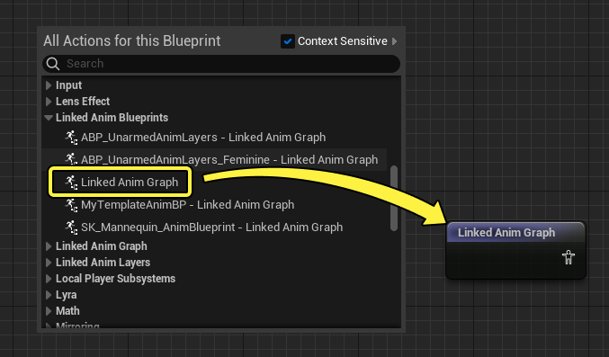
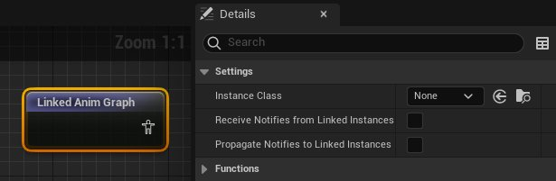
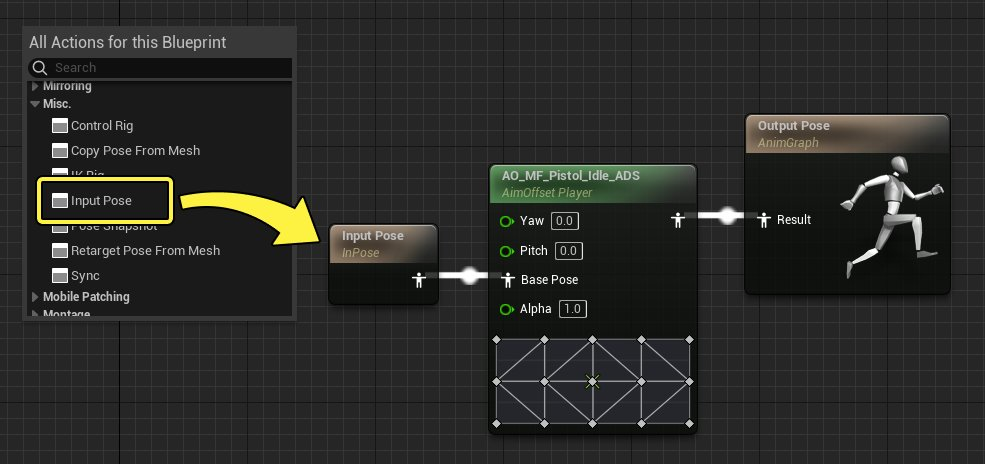
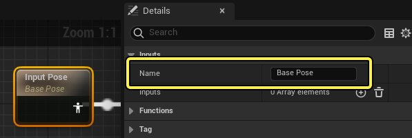
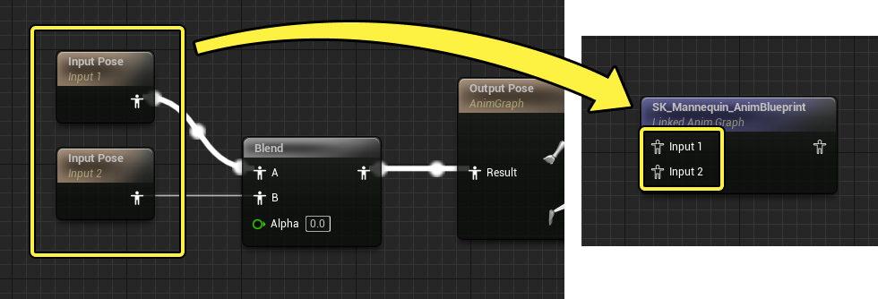
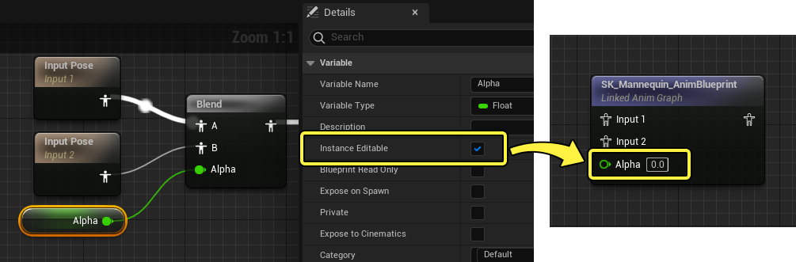
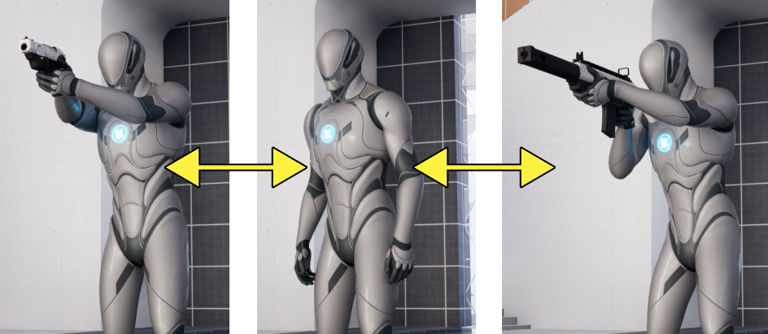
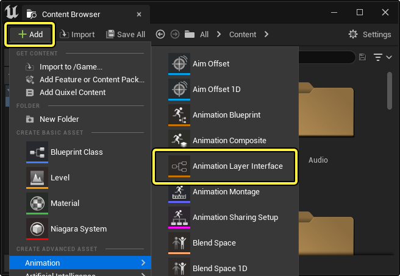

# 动画蓝图链接

> 路径：虚幻引擎5.7文档 / 为角色和对象制作动画 / 骨架网格体动画系统 / 动画蓝图 / 动画蓝图链接

> 原始页面：https://dev.epicgames.com/documentation/unreal-engine/animation-blueprint-linking-in-unreal-engine

随着你为角色创建的动画蓝图越来越复杂，有时你可能需要将某个动画蓝图的一些部分复用于另一个动画蓝图。实现此操作的方法多种多样，例如链接特定动画蓝图、链接动画层，或使用模板。

本文档概括介绍了将动画蓝图模块化的各种方法。

#### 先决条件

- 你已创建并了解

  动画蓝图

  。

## 链接的动画图表

在动画蓝图中，你可以使用 **Linked Anim Graph** 节点引用另一个动画蓝图。

### 创建和概述

要创建此节点，请右键点击 **动画图表（Anim Graph）** ，并从 **链接的动画蓝图（Linked Anim Blueprints）** 类别选择 **链接的动画图表（Linked Anim Graph）** 。你还可以从此列表选择特定动画蓝图引用，以添加该节点并加以引用。

该节点包含 **细节（Details）** 面板中的以下属性。这些设置还将应用于 **Linked Anim Layer** 节点：

| 名称 | 说明 |
| --- | --- |
| **实例类（Instance Class）** | 要用于此链接的动画图表的动画蓝图类。 |
| **从链接的实例接收通知（Receive Notifies from Linked Instances）** | [骨架动画通知](../../animation-assets-and-features/animation-sequences/animation-notifies/index.md#skeletonnotifies)是否将由此链接的实例从其他链接的动画接收。这很适合用于将动画通知处理封装在一个链接的动画实例中，而播放可以在另一个实例中执行。 |
| **将通知传播到链接的实例（Propagate Notifies to Linked Instances）** | 骨架动画通知是否将从此链接的实例发送到其他链接的实例。**将通知传播到链接的实例（Propagate Notifies to Linked Instances）** 还必须在目标链接的动画实例上启用，才能成功传播通知。 |

> [!NOTE]
> 双击Linked Anim Layer节点将打开链接的动画蓝图资产（如果已分配）。

### 输入姿势

使用链接的动画图表的一种方法是使用Input Pose节点显示动画输入。右键点击链接的蓝图的 **动画图表（Anim Graph）** 并从 **杂项（Misc.）** 类别选择 **输入姿势（Input Pose）** 以创建此节点。然后，你可以将此节点连接到动画节点。

> [!NOTE]
> 你可以选中输入节点并在 **细节（Details）** 面板中更改 **名称（Name）** 来重命名。
>
> 

你可以根据需要创建任意数量的输入姿势，它们全部会在Linked Anim Graph节点上显示为输入引脚。

### 输入变量

[变量](../../../../blueprints-visual-scripting/specialized-blueprint-visual-scripting-node-groups/blueprint-variables/index.md)还可以公开给链接的动画图表，过程类似于[将变量设为公共](../../../../blueprints-visual-scripting/specialized-blueprint-visual-scripting-node-groups/blueprint-variables/index.md#%E5%85%AC%E5%85%B1%E5%8F%98%E9%87%8F)的蓝图过程。选择变量并启用 **实例可编辑（Instance Editable）** 。这将在链接的动画图表上公开该变量。

## 链接的动画层

通过链接的动画图表，你将链接到特定动画蓝图。通过 **链接的动画层（Linked Anim Layers）** ，你将以更标准化的形式使用链接。链接的动画层要求你创建 **动画层接口（Animation Layer Interface）** ，其中定义了图表的预设动画层。然后，你可以创建主动画蓝图，其中包含这些不同层的主逻辑结构，然后为每个Gameplay差异因子创建不同的动画蓝图。

在创建高度复杂的动画项目时，例如在其中添加新动画并进行更新的实时服务项目，你通常需要使用链接的动画层。这是因为工作流程所围绕的中心是，为特定Gameplay逻辑新建或删除动画蓝图。

你不必持续更新和管理单个动画蓝图，而可以将逻辑划分到这些层。这样一来就可以进行多用户合作，并节省内存，因为系统将加载正在链接和使用的相关动画蓝图。

> [!NOTE]
> 你可以将动画蓝图分解为多个资产文件，以使用链接的动画层控制动画内存。包含链接的层的动画蓝图可以根据需要使用虚幻引擎的内存管理系统加载和卸载。因此，如果你想从内存删除已取消链接的动画蓝图，必须设置额外的流送逻辑。

### 动画层接口

要创建链接的动画层系统，必须创建动画层接口资产，你将在其中定义要在动画蓝图中使用的动画层。在 **内容浏览器（Content Browser）** 中，点击 **添加 (+)（Add (+)）** ，然后选择 **动画（Animation）> 动画接口（Animation Interface）** 。

打开资产以查看动画层接口编辑器。你与此资产交互的主要方式是添加 **动画层（Animation Layers）** ，具体做法是点击 **我的蓝图（My Blueprint）** 面板中的 **添加 (+)（Add (+)）** 。

> 图片已省略：将层添加到接口

> [!NOTE]
> 在同一个非默认 **组** 名下的层会共享相同的动画实例。建议图层界面中，为图层设置一个新的/非默认的共享名称。

对于一些层，你可能还需要公开姿势和属性输入，因为这对于链接的动画结构而言可能很有必要，例如，此层要修改传入姿势。为此，请点击所选层的 **细节（Details）** 面板的 **输入（Inputs）** 分段上的 **添加 (+)（Add (+)）** 。你还可以在 **输入（Inputs）** 属性下添加属性输入。

> 图片已省略：动画层接口输入姿势

如需了解示例动画层设置，你可能需要创建一个包含 **全身（Full Body）** 、 **上半身（Upper Body）** 和 **IK** 层的通用系统。这些层为角色提供以下功能：

- 全身（Full Body）

  ：角色的总体基础移动和动画。
- 上半身（Upper Body）

  ：如果角色握持物品或武器，你可以使用包含此逻辑的层。
- IK

  ：对角色的最终手臂或腿部调整。通常，这将是腿部IK来调整脚部位置，或手臂IK来确保双手正确握持武器。

在本例中，动画层接口可能如下所示：

> 图片已省略：动画层接口示例

> [!NOTE]
> 动画层接口图表是只读的，仅用于预定义动画蓝图的共享动画层和输入的列表。

### 基础蓝图设置

使用链接的动画层时，你将构造一个"基础"动画蓝图，并将其分配给角色。此基础可能包含链接的动画层的一般结构，但不一定包含其中的逻辑或数据。

首先，你需要将动画层接口绑定到动画蓝图，方法是选择 **类设置（Class Settings）**，然后点击 **接口（Interfaces）** 分段中的 **添加（Add）** 下拉菜单。选择你的 **动画层接口（Animation Layer Interface）** 。

> 图片已省略：分配动画层接口

现在你将看到预定义层显示在蓝图的动画层（Animation Layers）分段中。将这些层拖入AnimGraph以构建基础逻辑。在此示例中，总体结构顺序为 **全身（Full Body）> 上半身（Upper Body）> IK** 。上半身和IK层都添加了姿势输入，以允许动画通过和修改。

> 图片已省略：参考层

> [!NOTE]
> 根据你希望设置达到的复杂和模块化程度，你可以选择不在基础动画蓝图中创建特定逻辑。层可以保留为空和默认值，而真正的逻辑来自各种链接的动画蓝图。
>
> > 图片已省略：无层逻辑

### 特定蓝图设置

接下来，你需要为角色上的某个动画蓝图状态创建特定逻辑。这需要你创建第二个动画蓝图，并且也将动画层接口绑定到该蓝图。

创建、打开并绑定接口到蓝图后，现在可以在每个链接的层中创建逻辑。继续之前的示例，此动画蓝图将处理配备武器的角色的总体动画和行为。层包含以下逻辑：

- 上半身（Upper Body）

  包含一个

  Aim Offset

  节点，用于控制角色的武器瞄准行为，特定于该武器。
- IK

  包含一个

  IK Rig

  节点，用于控制角色的最终手部位置，特定于该武器。
- 全身（Full Body）

  包含一个

  状态机（State Machine）

  ，用于控制角色的一般移动，特定于该武器或移动集。

> 图片已省略：特定动画蓝图逻辑

通过这种方式，你会将武器的整个动画蓝图逻辑完全分隔到此蓝图，使不同用户能够处理这些蓝图。你可以根据需要创建任意数量的不同动画蓝图，根据上下文在其中使用不同的逻辑。

> [!NOTE]
> 对于这些特定于逻辑的动画蓝图，你不需要重新创建基础蓝图中存在的相同动画图表逻辑。相反，你可以将基础蓝图视为"父"蓝图，用于在动画图表中维持该总体逻辑结构。你仅使用这些特定蓝图在每个链接的层中创建逻辑。

## 链接动画层

使用链接的动画层的最后一步是添加 **Link Anim Class Layers** 蓝图节点。你使用此节点将某个特定动画蓝图类的层绑定到动画层系统，使其内部层逻辑覆盖当前逻辑。

> 图片已省略：link anim class layers节点

- 目标（Target）

  可供你连接骨骼网格体组件。
- 位于类（In Class）

  可供你指定动画蓝图类。

继续之前的示例，创建 **Link Anim Class Layers** 节点，其中连接了角色网格体，并且 **位于类（In Class）** 输入设置为特定武器动画蓝图。在某些情况下，你可能还需要在层更改后播放[蒙太奇](../../animation-assets-and-features/animation-montage/index.md)，以使用动画帮助过渡更改，例如"武器配备"动画。

> 图片已省略：链接动画类层示例

总结一下此示例：

- 武器Actor蓝图将存储武器动画蓝图层的引用。这意味着，与该特定武器相关的动画仅当游戏中激活该武器时才会加载。
- 然后，你可以为其他武器创建类似的逻辑和资产，例如步枪、弓或火箭发射器。每个武器将存储其关联的动画蓝图层的引用，因此在加载这些武器时仅会加载这些特定动画。

### 更多用例示例

下面显示了《堡垒之夜》上使用的链接的动画层用例。

> 图片已省略：《堡垒之夜》示例

在此示例中，有两个接口，一个用于武器，一个用于载具。你可以同时激活这两个接口。你还可能让实现其中某个接口的单个动画蓝图覆盖图表的多个点，例如武器覆盖 `WeaponUpperBody` 和 `WeaponAdditive` 。

下面是以上设置的一些可能情况：

- 开车时，载具层将覆盖角色的整个姿势。
- 作为乘客乘车时，载具将覆盖角色下半身的就座动画，而武器控制上半身。如果角色更改武器，新的武器动画蓝图将控制上半身，而下半身继续从载具播放。
- 武器可以覆盖上半身姿势，接着将与主图表中的下半身组合，然后将在全身姿势之上从武器播放自定义叠加动画，例如怠速噪声。

通过这种方式，武器可以覆盖主图表中的多个不同点。例如，将使用移动状态机，其中包含跳跃、坠落、着陆和飞索滑行之类的状态。不必为每个武器复制此状态机，因为状态机将驻留在主图表中，武器动画蓝图有一个可以针对每个状态覆盖的层。

如果武器不需要覆盖一些状态，则你不需要将任何内容连接到对应层中的输出姿势。此外，包含层的动画蓝图有自己的事件图表。因此，如果你需要处理特定载具的数据，可以将其保留在该载具动画蓝图的事件图表中。

## 动画蓝图模板

动画蓝图还可以创建为模板，它们是不引用特定骨架资产或动画的蓝图。这意味着，你可以通过更加模块化的方式复用动画蓝图逻辑。

要创建模板动画蓝图，请执行[常规动画蓝图创建过程](../index.md#animationblueprintcreation)，但不指定骨架，而是点击 **模板（Template）** ，然后点击 **创建（Create）** 。

> 图片已省略：创建动画蓝图模板

### 模板用法

动画蓝图模板包含与常规动画蓝图中相同的[接口和编辑器](../animation-blueprint-editor/index.md)。但是，由于模板不对应于骨架，因此你无法直接引用与特定骨架相关的动画或资产。你可以改为将模板逻辑参数化，并公开另一个蓝图中设置的变量。

例如，你可以在AnimGraph中创建 **Sequence Player** 节点。通常，此节点用于直接播放动画序列，但你可以改为将 **序列（Sequence）** 属性公开为 **变量（Variable）** 。为此，请点击序列播放器的 **细节（Details）** 面板中的 **绑定（Bind）** 下拉菜单，然后选择 **公开为引脚（Expose As Pin）** 。

> 图片已省略：创建模板序列播放器

接下来，右键点击序列播放器上新公开的 **引脚** ，并选择 **提升到变量（Promote to Variable）** ，以创建变量供动画序列播放。类似于公开链接的动画图表变量，你还必须[将此变量设为公共](#%E8%BE%93%E5%85%A5%E5%8F%98%E9%87%8F)。

> 图片已省略：提升到变量

在动画图表中引用动画蓝图模板的方式是右键点击图表，并从上下文菜单的 **链接的动画蓝图（Linked Anim Blueprints）** 选择模板。

> 图片已省略：引用动画蓝图模板

然后，你可以在此模板上设置公开的变量，以对应你的蓝图要求。

> 图片已省略：设置模板变量
