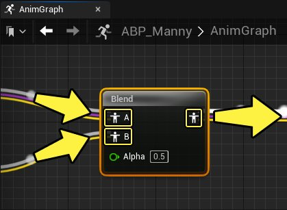
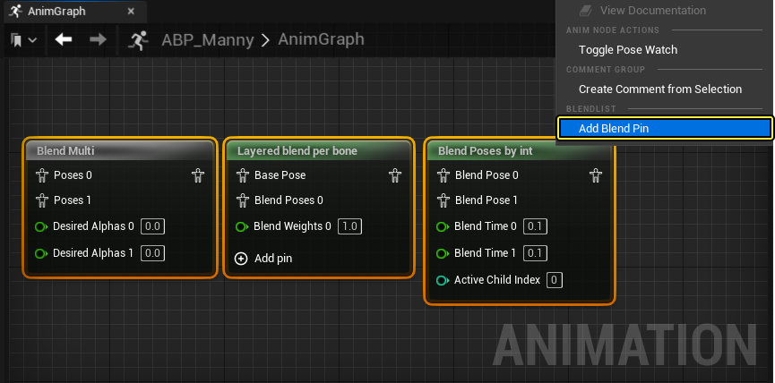
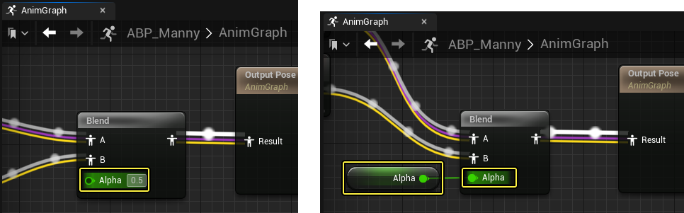
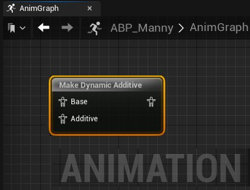
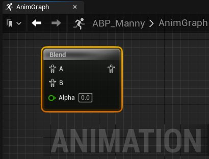
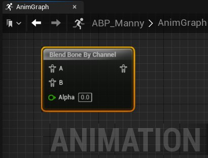
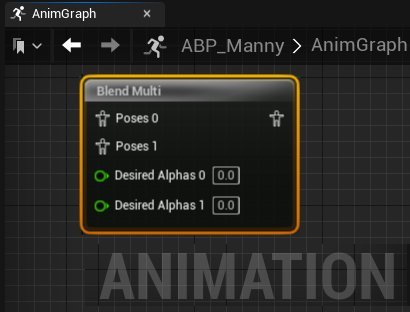
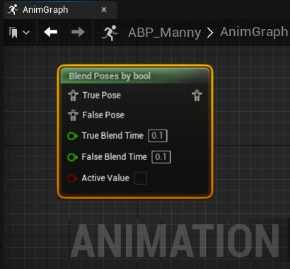

# 混合节点

> 路径：虚幻引擎5.7文档 / 为角色和对象制作动画 / 骨架网格体动画系统 / 动画蓝图 / 动画节点参考 / 混合节点

> 原始页面：https://dev.epicgames.com/documentation/unreal-engine/animation-blueprint-blend-nodes-in-unreal-engine

在角色的 **动画蓝图（Animation Blueprint）** 的 **动画图表（AnimGraph）** 中，你可以使用 **混合节点（blend nodes）** 将多个原始动画姿势混合在一起，创建出新的动画姿势。

> 动图已省略：动画姿势混合示例

你可以在混合节点的 **姿势输入引脚（pose input pins）** 上传入多个动画姿势，然后用节点的 **输出姿势引脚（output pose pin）** 生成一个混合后的姿势。

一些混合节点可以接收并混合两个以上的动画姿势。你可以在 **动画图表（AnimGraph）** 中 **右键点击** 节点并选择 **添加混合引脚（Add Blend Pin）** 来添加额外的姿势输入引脚。

**右键点击** 引脚并选择 **移除混合引脚（Remove Blend Pin）** ，可以移除多余的姿势输入引脚。

使用混合节点时，你可以使用一个 **Alpha值** 来控制混合的程度。你可以手动指定混合节点的Alpha值。只要选中变量输入引脚，或者节点的细节面板中的Alpha属性，就可以更改Alpha值。你还可以在 **动画图表（AnimGraph）** 中将Alpha变量节点连接至Alpha输入引脚来指定混合节点的Alpha。Alpha数值为0时，会偏向采用原始姿势，而数值1时，会偏向采用第二种姿势。

借助更加高级的混合节点，你可以整合更多动画数据，在项目中创造出不同的混合结果。下文介绍了 **虚幻引擎** 中可用来混合动画姿势的各种混合节点。

## 混合节点

标准混合节点的名称以灰色显示。它们会根据节点参数，对动画姿势进行简单的混合。下文列出了常用的标准混合节点，可用于在项目的 **动画图表（AnimGraph）** 中混合动画姿势。

### 应用叠加型姿势

**应用叠加型姿势（Apply Additive）** 和 **应用网格体空间叠加型姿势（Apply Mesh Space Additive）** 会根据Alpha值，在基本动画姿势上叠加姿势。

应用叠加动画混合节点 应用网格体空间叠加混合节点

通过节点输入引脚，可以连接一个 **基础** 和一个要应用的 **叠加** 姿势。

**应用叠加型姿势（Apply Additive）** 节点也受到[LOD](../../../animation-assets-and-features/skeletons/skeletal-mesh-lods/index.md)阈值系统的影响。可以在 **应用叠加型姿势（Apply Additive）** 和 **应用网格体空间叠加型姿势（Apply Mesh Space Additive）** 节点的 **细节（Details）** 面板中找到该设置。

除此以外，你还可以使用 **创建动态叠加型姿势（Make Dynamic Additive）** 节点来反向混合叠加动画姿势。用这个节点可以从基础姿势减去叠加姿势来创建输出姿势。

在制作动态叠加型姿势节点的细节面板中也可以选用让节点在 **网格体空间（Mesh Space）** 中运行。

### 混合

标准的混合节点基于一个 **Alpha** 输入引脚的数值定义的权重简单地混合两个输入姿势。

你可以将动画姿势连接到 **A** 和 **B** 输入引脚，然后使用 **Alpha** 引脚来控制它们之间的混合程度。

### 根据通道混合骨骼

**根据通道混合骨骼（Blend Bone by Channel）** 混合节点可以用于指定骨骼来进行特定的混合转换。

在根据通道混合骨骼的 **细节（Details）** 面板中可以点击 **(+) 添加** 来添加 **骨骼定义（Bone Definitions）** 分区。创建好后，可以定义要提取转换数据的源骨骼，以及要应用混合目标骨骼。还可以通过切换属性来定义要在混合中加入转换的哪些部分，比如 **位移（Translation）** 、 **旋转（Rotation）** 和 **缩放（Scale）** 。除此以外，还可以定义在哪个 **转换空间（Transform Space）** 中计算转换数据，比如 **世界空间（World Space）** 、 **组件空间（Component Space）** 、 **父级骨骼空间（Parent Bone Space）** 以及 **骨骼空间（Bone Space）** 。

已有的Alpha值会参与控制混合的权重。

### Blend Multi

Blend Multi节点可用用于混合两个以上混合姿势，并使用一个范围的Alpha值。

在Blend Multi的 **细节（Details）** 面板中，你可以用 **Additive节点** 属性将节点在是否叠加之间切换。

## 函数混合节点

函数混合节点分类为绿色标题颜色，可以对动画姿势根据每个节点特定的参数进行基于计算的混合。以下是一系列的基于函数的混合节点的参考，可以在项目的 **动画图表（AnimGraph）** 里混合动画。

### 按布尔值混合姿势

**按布尔值混合姿势（Blend Poses by bool）** 节点使用 **布尔值** 作为键，基于时间混合两个姿势。当布尔值为 **true** 时，使用与 **真姿势（True Pose）** 输入引脚相连的姿势；当布尔值为 **false** 时，使用 **False姿势（False Pose）** 。每个姿势都有一个浮点值 **混合时间（Blend Time）** ，用来控制混入这个姿势所需的时间。

在 **细节（Details）** 面板中，你可以切换 **混合时间（Blend Time）** 引脚在动画图表中否可视，还可以设置[转移类型（Transition Type）](../../transition-rules/index.md)。

### 按整型值混合姿势

**按整型值混合姿势（Blend Poses by int）** 节点使用整数值作为键，基于时间混合任意数量的姿势。对于每个输入整数值，将使用与该值输入引脚关联的姿势。例如，当整数设为0时，将使用与 **混合姿势0（Blend Pose 0）** 相连的姿势。每个姿势都有一个浮点值 **混合时间（Blend Time）** ，用来控制混入这个姿势所需的时间。

> 图片已省略：按整型值混合姿势动画混合节点

在 **细节（Details）** 面板中，你可以切换 **混合时间（Blend Time）** 引脚在动画图表中否可视，还可以设置[转移类型（Transition Type）](../../transition-rules/index.md)。

### 按枚举混合姿势

**按枚举混合姿势（Blend Poses by Enum）** 节点将枚举值用作键，并基于时间在姿势间进行混合。可使用默认姿势，也可通过 **活跃枚举值（Active Enum Value）** 引脚在连接枚举中添加已辨识值的额外姿势。此外，各姿势均具有用于控制混合到姿势所需时长的浮点值 **混合时间（Blend Time）** 。

> 图片已省略：按枚举混合姿势动画混合节点

在 **细节（Details）** 面板中，你可以切换 **混合时间（Blend Time）** 引脚在动画图表中否可视，还可以将[转移类型（Transition Type）](../../transition-rules/index.md)。

### 按骨骼分层混合

**按骨骼分层混合（Layered blend per bone）** 节点可以用于基于指定的一组骨骼在任意数量的动态混合姿势之间进行混合。

> 图片已省略：按骨骼分层混合动画混合节点

在"按骨骼分层混合节点"的 **细节面板** 中，你可以将混合模式定义为 **分支筛选器** 或者 **混合遮罩** 。

> 图片已省略：按骨骼分层混合动画混合节点细节面板中的混合模式

你可以启用 **网格体空间旋转混合（Mesh Space Rotation Blend）** 和 **网格体空间缩放混合（Mesh Space Scale Blend）** 属性，控制 **网格体空间（Mesh Space）** 或 **局部空间（Local Space）** 中是否出现 **旋转（Rotation）** 和 **缩放（Scale）** 混合。

借助 **曲线混合选项（Curve Blend Options）** 属性，你可以在设置列表设置曲线混合行为，控制动画层的混合方式。下面是供你参考的一系列可用 **曲线混合选项（Curve Blend Options）** 。

> 图片已省略：按骨骼分层混合动画混合节点细节面板中的曲线混合选项

| 混合选项 | 说明 |
| --- | --- |
| **覆盖（Override）** | 将此姿势覆盖到包含有效曲线值的上一个姿势。 |
| **不覆盖（Do Not Override）** | 不覆盖该姿势。最适合在所需的前一姿势没有曲线值时使用。 |
| **按权重规格化（Normalize by Weight）** | 按所有混合权重的 **总和** 将姿势混合规格化。 |
| **按权重混合（Blend by Weight）** | 在 **没有** 规格化的情况下按混合权重混合姿势。 |
| **使用基础姿势（Use Base Pose）** | 将 **基础姿势（Base Pose）** 用于所有曲线值。 |
| **使用最小值（Use Min Value）** | 从所有连接姿势选择 **最高** 曲线值，并将其用于混合。 |
| **使用最大值（Use Max Value）** | 从所有连接姿势选择 **最低** 曲线值，并将其用于混合。 |

你还可以启用 **基于根骨骼混合根骨骼运动（Blend Root Motion Based on Root Bone）** 属性，以在混合[根骨骼运动](../../../animation-assets-and-features/locomotion/root-motion/index.md)时合并 **根骨骼** 的按骨骼混合权重。

#### 分支筛选器

借助 **分支筛选器（Branch Filter）** 选项，你可以定义该混合将影响的骨骼 **索引（Index）** 。

> 图片已省略：按骨骼分层混合动画混合节点细节面板中的层设置索引

将元素添加至 **分支筛选器（Branch Filters）** 属性后，你可以输入骨骼的 **骨骼名称（Bone Name）** ，用作控制本地化动画混合的参考点。使用 **混合深度（Blend Depth）** 属性，你可以控制混合对于 **骨骼名称（Bone Name）** 子骨骼的权重。

| 值 | 示例 | 说明 |
| --- | --- | --- |
| **正（Positive）** | 正混合深度值 | 正 **混合深度（Blend Depth）** 值将按相同数量的骨骼抵消权重，并通过 **骨骼名称（Bone Name）** 链逐渐减少权重。例如，**混合深度（Blend Depth）** 为2，会将混合权重1应用到下一子骨骼，混合权重0.5应用到 **骨骼名称（Bone Name）** 。 |
| **零（Zero）** | 零混合深度值 | **混合深度（Blend Depth）** 值为0会将混合权重1应用于 **骨骼名称（Bone Name）** 和所有连接的子骨骼。 |
| **负（Negative）** | 零混合深度值 | 负 **混合深度（Blend Depth）** 值将禁用所有 **混合姿势（Blend Poses）** ，并支持 **基础姿势（Base Pose）** 。小于-1的值将按相同骨骼数量抵消权重，并通过 **骨骼名称（Bone Name）** 链逐步减少禁用混合权重。例如，**混合深度（Blend Depth）** 为-2，会将混合权重-1应用到下一子骨骼，混合权重-0.5应用到 **骨骼名称（Bone Name）** 。 |

#### 混合遮罩

借助 **混合遮罩（Blend Mask）** 选项，你可以将角色的[混合遮罩](../../../animation-assets-and-features/skeletons/blend-masks-and-blend-profiles/index.md)定义为控制 **基础姿势（Base Pose）** 和 **混合姿势（Blend Poses）** 之间混合的参考点。

> 图片已省略：按骨骼分层混合动画混合节点细节面板中的混合遮罩

## 惯性化

**惯性混合(Inertial blending）** 是传统动画淡入淡出的高性能替代方案，可生成后期处理的自然过渡。激活惯性混合后将不再计算源姿势。相反，传统混合在过渡期间会计算源姿势和目标姿势，将其组合成混合姿势。

> 动图已省略：惯性化示例动画

要使用惯性混合，你可以在你要进行惯性混合的源动画之后的位置，将 **Inertialization** 或 **Dead Blending** 节点添加到 **AnimGraph** 。每个节点通过不同的方法处理惯性混合。

> 图片已省略：inertialization节点，动画蓝图节点

Inertialization和Dead Blending节点将跟踪 **动画曲线（Animation Curves）** 中的动画姿势运动和变化，以便在惯性混合激活时，运动能继续向目标动画移动。这些节点通过连接至其 **源** 输入姿势引脚的 **惯性混合请求** 激活。[状态机过渡](#%E6%9D%A5%E8%87%AA%E7%8A%B6%E6%80%81%E6%9C%BA%E8%BF%87%E6%B8%A1%E7%9A%84%E8%AF%B7%E6%B1%82)、[混合节点](#%E6%9D%A5%E8%87%AA%E6%B7%B7%E5%90%88%E8%8A%82%E7%82%B9%E7%9A%84%E8%AF%B7%E6%B1%82)、[链接动画图表和链接动画层](#%E6%9D%A5%E8%87%AA%E9%93%BE%E6%8E%A5%E5%92%8C%E5%88%86%E5%B1%82%E5%8A%A8%E7%94%BB%E5%9B%BE%E8%A1%A8%E7%9A%84%E8%AF%B7%E6%B1%82)均可触发惯性混合。 Inertialization或Dead Blending节点必须在惯性混合请求源之后的位置连接，但不一定要紧挨着。延迟更靠近 **Output Pose** 节点的Inertialization或Dead Blending节点，有助于减少或消除图表中的标准混合，并提升动画系统的性能。单个Inertialization或Dead Blending节点可以处理很多惯性混合请求。处理多个惯性混合请求时，将使用 **请求的最短混合时长**。

> 图片已省略：惯性概述示例

> [!NOTE]
> 如果你的AnimGraph包含惯性化请求，但缺失Inertialization或Dead Blending节点， **消息日志（Message Log）** 面板中将记录运行时错误。

考虑使用惯性混合创作动画和图表时，最好在传出动画仍在运动时开始过渡。由于惯性混合负责处理到休息姿势的平滑自然过渡，因此无需返回中间姿势。由于惯性混合是 **后期处理** ，用于将动作过渡到目标动画，因此短混合效果最佳。惯性混合可被其他惯性混合中断，但应尽量避免导致持续中断的情况，因为动画质量可能因此下降。

#### 使用多种惯性混合

你可以根据需要在图表中放置多个Inertialization或Dead Blending节点，各节点将处理来自源姿势的惯性混合请求。这意味着可在不同空间执行惯性混合。例如，你可能需要创建分别用于角色上半身和下半身的Inertialization或Dead Blending单独节点，后跟 **Layered Blend per bone** 节点，接合起来形成最终姿势。

#### 叠加惯性混合

应用基础姿势前，插入Inertialization或Dead Blending节点，你还可以将惯性混合与叠加姿势一起使用。为修复最终姿势，你通常要在IK之前应用惯性混合，从而在IK空间中有效地进行惯性混合。

> [!WARNING]
> 惯性混合一旦开始，就会停止计算源姿势。因此，在惯性混合开始后，将不再触发源动画[序列](../../../animation-assets-and-features/animation-sequences/index.md)中的[动画通知](../../../animation-assets-and-features/animation-sequences/animation-notifies/index.md)。你可能需要重构现有游戏逻辑和动画通知，以兼容惯性化。

### Inertialization和Dead Blending节点

虚幻引擎中有两种惯性混合节点：Inertialization节点和Dead Blending节点。

| Inertialization节点 | Dead Blending节点 |
| --- | --- |
| inertilization动画蓝图节点 | dead blending动画蓝图节点 |
| Inertialization节点会记录传入和传出动画之间的偏移，并将此淡出以防止姿势弹出。 | Dead Blending节点会尝试预测传出动画的未来姿势，并将这些与传入动画混合。 此节点为试验性节点，因此我们不推荐发布依赖此功能的项目。 |

一般来说，Dead Blending节点往往表现更好，特别是在姿势差异较大的动画之间过渡时，但有时可能会导致动作更僵硬。Dead Blending节点还考虑了过渡混合曲线，而Inertialization节点会忽略这一点。

#### Initialization节点参考

此处你可以参考Inertializtion节点属性列表及其作用描述。

> 图片已省略：inertilization节点设置

| 属性 | 说明 |
| --- | --- |
| **混合配置文件（Blend Profile）** | 可以选择设置默认混合配置文件，以便在源节点未通过惯性混合请求提供混合配置文件时使用。你可以使用下拉菜单设置混合配置文件。 |
| **过滤曲线（Filtered Curves）** | 设置不得使用惯性混合的动画曲线列表。进行惯性混合时，这些曲线将立即变化。要过滤曲线，需使用（ **+** ）将新数组添加到属性，然后在所提供的 **索引（Index）** 字段输入曲线的名称，从而设置曲线。 |

#### Dead Blend节点参考

此处你可以参考Dead Blend节点属性列表及其作用描述。

> [!WARNING]
> 此节点为试验性节点，因此我们不推荐发布依赖此功能的项目。

> 图片已省略：dead blending节点设置

| 属性 | 说明 |
| --- | --- |
| **始终使用默认混合设置（Always Use Default Blend Settings）** | 启用后，将使用默认混合设置，而不是来自提供惯性混合请求的源节点的设置。 |
| **默认混合时长（Default Blend Duration）** | 设置当提供惯性混合请求的源节点未指定混合时长，或当 **始终使用默认混合设置（Always Use Default Blend Settings）** 属性启用时，要使用的默认混合时长。 |
| **默认混合配置文件（Default Blend Profile）** | 设置当提供惯性混合请求的源节点未指定混合配置文件，或当 **始终使用默认混合设置（Always Use Default Blend Settings）** 属性启用时，要使用的默认混合配置文件。你可以使用下拉菜单设置混合配置文件。 |
| **模式（Mode）** | 设置当提供惯性混合请求的源节点未指定混合模式，或当 **始终使用默认混合设置（Always Use Default Blend Settings）** 属性启用时，要使用的默认混合模式。你可以使用下拉菜单选择所提供的曲线之一，从而设置混合模式。 |
| **默认自定义混合曲线（Default Custom Blend Curve）** | 可以选择设置当提供惯性混合请求的源节点未指定混合曲线，或当 **始终使用默认混合设置（Always Use Default Blend Settings）** 属性启用时，要结合混合模式使用的默认混合曲线。你可以使用下拉菜单从你的项目中选择一个曲线资产，从而设置混合曲线。 |
| **混合时间倍数（Blend Time Multiplier）** | 设置可用于缩放来自惯性混合请求的总应用时长的混合时间倍数。 |
| **线性内插比例（Linearly Interpolate Scales）** | 启用后，骨骼比例进行线性内插。这稍微提高了性能，并且与虚幻引擎的其余部分保持一致，但在视觉上形成比例变化率受骨骼整体尺寸影响的效果。 |
| **过滤曲线（Filtered Curves）** | 设置不得使用惯性混合的动画曲线列表。进行惯性混合时，这些曲线将立即变化。要过滤曲线，需使用（ **+** ）将新数组添加到属性，然后在所提供的 **索引（Index）** 字段输入曲线的名称，从而设置曲线。 |
| **过滤骨骼（Filtered Bones）** | 设置角色的骨架中不得使用惯性混合的骨骼列表。当进行惯性混合时，这些骨骼的运动会立即改变。要过滤骨骼，需使用（ **+** ）将新数组添加到属性，然后在所提供的 **索引（Index）** 字段，使用下拉菜单从骨架（Skeleton）层级中选择骨骼。 |
| **外推半衰期（Extrapolation Half Life）** | 设置外推动画时要使用的平均衰减半衰期，以秒为单位。为了获得最终的衰减半衰期，该值将根据正在过渡的动画向同样正在过渡的动画移动的速度进行缩放。 |
| **最小外推半衰期（Minimum Extrapolation Half Life）** | 设置外推动画时要使用的最小衰减半衰期，以秒为单位。当正在过渡的动画的速度非常小或远离同样正在过渡的动画时，将使用此属性。 |
| **最大外推半衰期（Maximum Extrapolation Half Life）** | 设置外推动画时要使用的最大衰减 `half_life` ，以秒为单位。这将决定当正在过渡的动画的速度较小并且向同样正在过渡的动画移动时可能的最长衰减时长。 |
| **最大平移速度（Maximum Translation Velocity）** | 设置允许骨骼平移外推的最大速度（以厘米/秒为单位）。较小的值可能有助于防止姿势在混合期间中断，但值太小可能会降低混合的平滑性。默认值为 `500.0` 。 |
| **最大旋转速度（Maximum Rotation Velocity）** | 设置允许骨骼旋转外推的最大速度（以度/秒为单位）。较小的值可能有助于防止姿势在混合期间中断，但值太小可能会降低混合的平滑性。默认值为 `360.0` 。 |
| **最大缩放速度（Maximum Scale Velocity）** | 设置允许骨骼缩放外推的最大速度。较小的值可能有助于防止姿势在混合期间中断，但值太小可能会降低混合的平滑性。默认值为 `4.0` 。 |
| **最大曲线速度（Maximum Curve Velocity）** | 设置允许曲线外推的最大速度。较小的值可能有助于防止混合期间出现极端曲线值，但值太小可能会降低曲线混合的平滑性。默认值为 `100.0` 。 |
| **预分配内存（Preallocate Memory）** | 启用后，Dead Blending节点将预分配内存，而不是在混合激活或不激活时分配和释放内存。此属性可以提升性能，但可能导致更大的内存占用，特别是当动画图表中有多个并非同时使用的Dead Blending节点时。 |
| **显示外推（Show Extrapolations）** | 启用后，Dead Blending节点将输出与外推匹配的姿势。将渲染调试图，显示正在生成动画的外推效果。 |

### 来自混合节点的请求

在惯性化兼容节点的 **细节（Details）** 面板中，你可以将 **过渡类型（Transition Type）** 属性设置为 **惯性化（Inertialization）** ，以激活惯性混合请求。要使用惯性混合，必须将Inertialization节点置于动画图表中发出惯性混合请求的混合节点之后的位置。

> 图片已省略：来自混合节点的请求转换类型

### 来自状态机过渡的请求

[状态机](../../state-machines/index.md)可以发出惯性混合请求。在[过渡规则](../../transition-rules/index.md)的细节面板中，可以将 **混合逻辑（Blend Logic）** 属性设为 **惯性化（Inertialization）** 。

> 图片已省略：来自状态机过渡规则的惯性混合请求

### 来自链接和分层的动画图表的请求

[分层动画](../../../animation-workflow-guides-and-examples/editing-animation-layers/index.md)或者[链接动画图表](../../animation-blueprint-linking/index.md)中也可以定义惯性化属性。从 **我的蓝图** 面板中选中图表后，在 **细节（Details）** 面板的属性中可以找到 **图表混合（Graph Blending）** 部分。分层动画可以过渡 **进入（in）** 或者 **淡出（out）** ，但是只能通过 **惯性混合（inertial blending）** 实现。 **Inertialization** 或 **Dead Blending** 节点必须放置在链接该动画蓝图的 **Linked Anim Layer** 节点之后。负值意味着混合时间会由另一个输入或输出分层动画决定。

> 图片已省略：来自动画层混合链接动画图表的惯性混合请求
