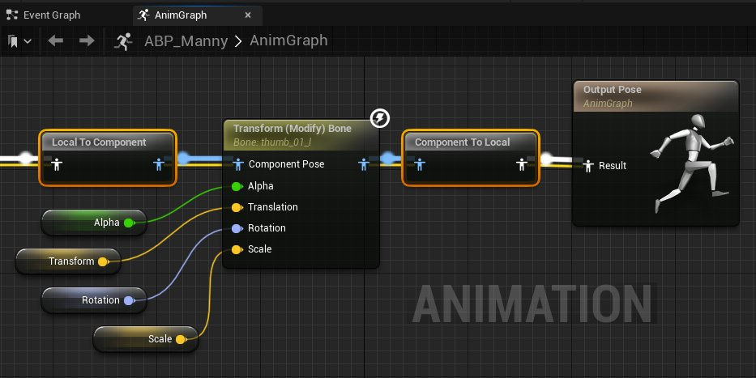
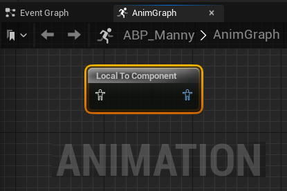
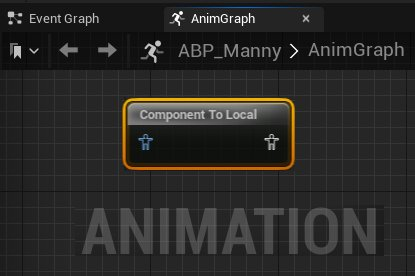

# 空间转换节点

> 路径：虚幻引擎5.7文档 / 为角色和对象制作动画 / 骨架网格体动画系统 / 动画蓝图 / 动画节点参考 / 空间转换节点

> 原始页面：https://dev.epicgames.com/documentation/unreal-engine/animation-blueprint-component-space-conversion-in-unreal-engine

**AnimGraph** 上的动画蓝图节点将计算并生成新的姿势，以在 **本地空间** 或 **组件空间** 中驱动动画。**本地空间** 中生成的动画姿势会相对于骨骼的 **父骨骼** 计算骨骼变换。**组件空间（Component Space）** 中生成的动画姿势相对于角色的[骨骼网格体组件](../../../../../working-with-content/skeletal-mesh-assets/index.md)来计算骨骼变换。

使用动画蓝图的 **AnimGraph** 中提供的 **Convert Spaces** 节点，可以在 **本地** 和 **组件** 空间之间转换姿势。

处理动画蓝图中的姿势时，大部分节点都将在本地空间中运行，这由 **白色** 姿势输入和输出引脚指示。但是，特定[混合节点](../animation-blueprint-blend-nodes/index.md)和所有[骨骼控制点节点](../animation-blueprint-skeletal-controls/index.md)在 **组件空间** 中运行，这由 **蓝色** 姿势输入和输出指示。

要使用在组件空间中运行的节点，姿势必须首先使用Local to Component转换节点转换为组件空间。

动画姿势经历组件空间运算后，必须转换回本地空间，才能由其他节点使用，或提供输出节点的最终姿势。

由于每次转换 **到** 组件空间或 **从** 中转换时都有相关的成本，最好将在组件空间中运行的所有节点分组在一起，以减少所需的转换次数。
