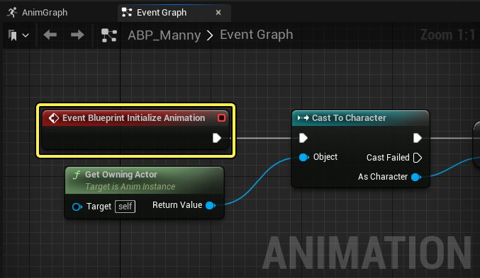
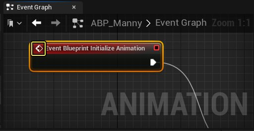
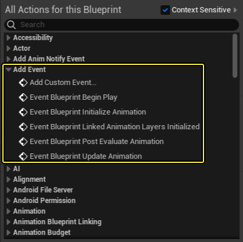
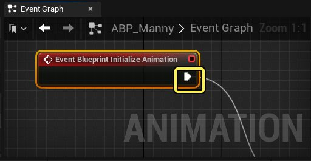

# 动画蓝图事件节点

> 路径：虚幻引擎5.7文档 / 为角色和对象制作动画 / 骨架网格体动画系统 / 动画蓝图 / 动画节点参考 / 动画蓝图事件节点

> 原始页面：https://dev.epicgames.com/documentation/unreal-engine/animation-blueprint-event-nodes-in-unreal-engine

在动画蓝图的 **事件图表（EventGraph）** 中, 事件节点可用作动画蓝图逻辑的起始或激活点。本文将介绍各类可用于在虚幻引擎中创建动画逻辑的动画事件节点。

在事件图表中，事件节点为红色，并且由节点右上角的 **箭头图标** 来表示。

在事件图表中右键点击，然后从菜单的 **添加事件（Add Event）** 部分可以选择节点来添加。

> [!NOTE]
> 一个动画蓝图的事件图表只能包含一个同一种类型的事件节点。但是可以同时在同一个节点上连接多个函数。

事件图表事件节点不包含输入引脚，因为它们是一连串动画逻辑的起点。事件节点的输出执行引脚会在事件节点激活的时候初始化按序连接的节点。每个类型的事件节点都由一组参数来激活。

你可以选用以下动画事件节点类型之一作为一连串逻辑的起始点。

## 动画时间节点类型

你可以选用以下动画事件节点类型之一和指定的参数作为一连串逻辑的起始点。

| 节点类型 | 图片 | 描述 |
| --- | --- | --- |
| **蓝图开始播放（Blueprint Begin Play）** | event blueprint begin play event node | **事件蓝图开始播放（Event Blueprint Begin Play）** 事件节点会在其所属的组件被[播放](../../../../../understanding-the-basics/playing-and-simulating/index.md)函数激活时激活其连接的任何逻辑。该节点连接的逻辑中，其所属的对象会比动画函数初始化都更先激活。把光标悬浮在节点上方，你可以参考节点所属的组件或者目标。 |
| **蓝图初始化动画（Blueprint Initialize Animation）** | event blueprint initialize animation event node | **蓝图初始化动画（Blueprint Initialize Animation）** 事件节点会在当前动画蓝图在运行时第一次构建时激活其连接的节点来执行初始化。使用该节点可以连接在动画蓝图开始时激活一次的逻辑。 |
| **蓝图链接初始化的动画分层（Blueprint Linked Animation Layers Initialized）** | event blueprint linked animation layers initialized event node | **蓝图链接初始化的动画分层（Blueprint Linked Animation Layers Initialized）** 事件节点会在所有动画分层完成初始化时激活连接的节点。你可以使用该节点来运行一次逻辑，会在所有动画分层完成初始化时激活。 |
| **蓝图后期运算动画（Blueprint Post Evaluate Animation）** | event blueprint post evaluate animation event node | **蓝图后期运算动画（Blueprint Post Evaluate Animation）** 事件节点会在动画蓝图完成运算后激活连接的节点。可以用该节点来激活蓝图完成运算后运行的逻辑。 |
| **蓝图更新动画（Blueprint Update Animation）** | event blueprint update animation event node loop update every frame | **蓝图更新动画（Blueprint Update Animation）** 事件节点每帧运行，可以让动画蓝图给任何需要的数值进行运算和更新。该事件节点是事件图表 **更新循环（update loop）** 的起始点。从上一次更新所用的时间可以从 **DeltaTimeX** 输出引脚获取，这样可以进行以时间为准的插值或者区间更新。 |

## 高级动画事件节点类型

你可以在动画蓝图事件图表中使用以下事件节点来按照项目特定的参数、玩家输入和自定义参数开始动画逻辑。

| 节点类型 | 图片 | 描述 |
| --- | --- | --- |
| **输入（Input）** | input keypress event node | **输入（Input）** 事件节点会在收到指定的[玩家输入](../../../../../gameplay-systems/input/index.md)时激活连接的逻辑，取决于逻辑连接的输出引脚，该输入可以是按下或释放。可以通过该节点来创建由用户输入控制的动画逻辑，并包含指定的输入函数，比如按键、鼠标移动或者触摸控制。 |
| **输入动作（Input Action）** | input action event node | **输入动作（Input Action）** 事件节点可以在玩家在运行时进行定义好的[输入动作](../../../../../gameplay-systems/input/index.md)时激活连接的逻辑。可以通过该节点来创建由用户与项目中特定系统的互动来控制的动画逻辑。这些系统可以在项目设置中定义。 |
| **动画通知（Anim Notify）** | anim notify event node | **动画通知（Anim Notify）** 事件节点可以在连接的[动画通知](../../../animation-assets-and-features/animation-sequences/animation-notifies/index.md)在动画中被激活时激活动画逻辑。这些节点由你项目中的 **动画通知（Anim Noties）** 控制，并且会在通知在动画序列、合成或蒙太奇中触发时激活所连接的动画逻辑。你可以用该事件节点创建连接到动画播放的动画逻辑。 |
| **自定义事件（Custom Event）** | custom event node in animbp eventgraph | **自定义事件（Custom Event）** 节点可以用于构建和定义激活项目中动画逻辑的自定义参数。参考文档来获取更多关于蓝图和蓝图节点的信息。 |
