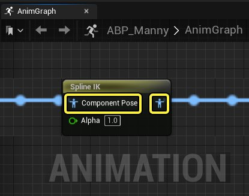
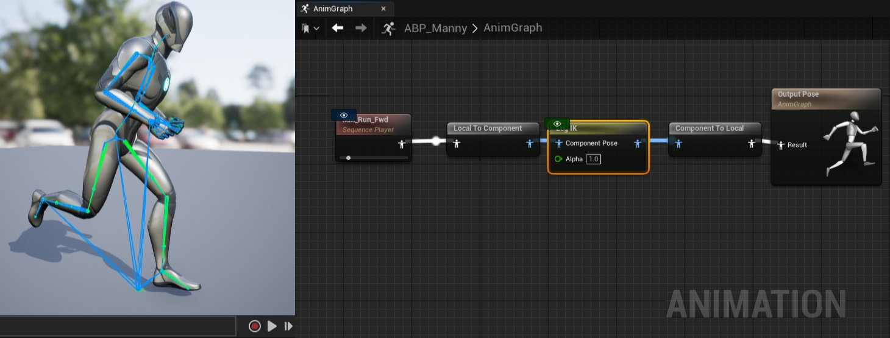
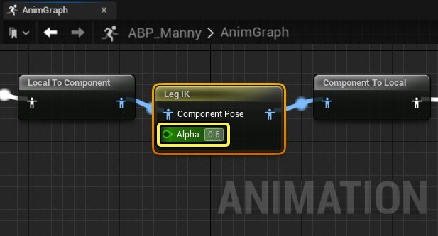
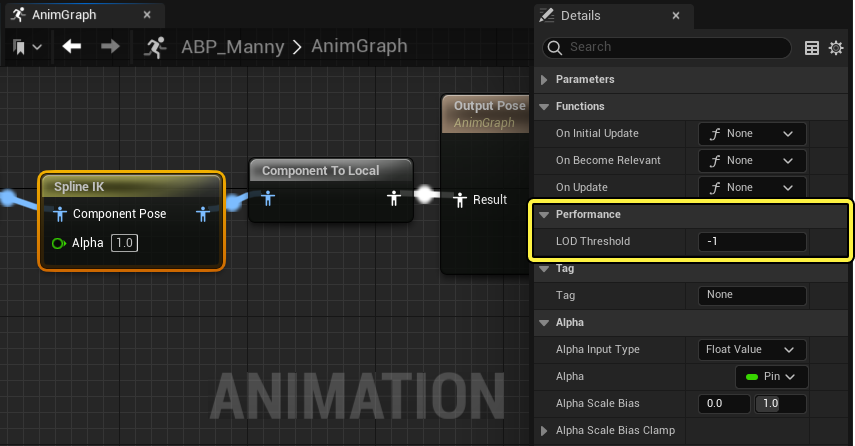

# 骨骼控制

> 路径：虚幻引擎5.7文档 / 为角色和对象制作动画 / 骨架网格体动画系统 / 动画蓝图 / 动画节点参考 / 骨骼控制

> 原始页面：https://dev.epicgames.com/documentation/unreal-engine/animation-blueprint-skeletal-controls-in-unreal-engine

使用 **骨骼控制（Skeletal Control）** [动画蓝图](../../index.md)节点，你可以直接控制角色的[骨架资产](../../../animation-assets-and-features/skeletons/index.md)。骨骼控制节点可在角色的动画蓝图中的 **AnimGraph** 上使用，以控制单独的骨骼，创建IK链以及其他由骨骼驱动的流程性动态动画。

骨骼控制节点的结构类似于其他AnimBP节点。节点可以通过 **输入引脚** 接收动画姿势，并通过 **输出引脚** 生成修改的姿势。大部分骨骼控制节点在 **组件空间（Component Space）** 中操作和计算变换。**组件空间（Component Space）** 中生成的动画姿势相对于角色的[骨骼网格体组件](../../../../../working-with-content/skeletal-mesh-assets/index.md)而非骨骼的父骨骼来计算骨骼变换。组件空间姿势引脚在动画图表中显示为蓝色。

你可以使用[空间转换节点](../animation-blueprint-component-space-022a8e09/index.md)将姿势从本地空间转换到组件空间。

> [!WARNING]
> 空间转换节点会对项目的性能带来相关成本。推荐将特定依赖空间的函数分组在一起，尽可能接近最终姿势节点，从而尽可能减少空间转换的发生。

**Alpha值** 在骨骼控制节点中也很常见。类似于[混合节点](../animation-blueprint-blend-nodes/index.md)，alpha值将控制在生成新姿势时对源姿势应用的修改程度。

对于骨骼控制节点，0.0到1.0之间的浮点值用作alpha值，以确定应用的骨骼变换的权重。使用值0.0时，输入姿势将获得完全权重，而使用值1.0时，控制点的计算变换将获得完全权重。

在每个骨骼控制节点的 **细节（Details）** 面板中，你还可以设置考虑节点的 **LOD阈值（LOD Threshold）** 。 定义为LOD阈值的值将是使用骨骼控制节点的最高LOD级别。使用更高的[LOD级别](../../../animation-assets-and-features/skeletons/skeletal-mesh-lods/index.md)时，模型的质量更低，将忽略骨骼控制节点。

通过限制LOD级别骨骼控制节点来计算骨骼变换，你可以降低动画系统的性能成本。

## 骨骼控制节点

你可以在此处参考更多文档，了解你可以在项目中使用的所有骨骼控制节点。

- [AnimDynamics](../../../../skeletal-mesh-an-2df34997/animation-blueprints/animation-blueprint-nodes/animation-bluep-7b8b20e5/animation-bluep-ec3334f1/index.md) - 介绍如何将Anim Dynamics AnimBP节点用作轻量级物理模拟解决方案，你可以通过该解决方案将基于物理的辅助动画应用于角色。

- [应用旋转百分比](../../../../skeletal-mesh-an-2df34997/animation-blueprints/animation-blueprint-nodes/animation-bluep-7b8b20e5/animation-bluep-31cee090/index.md) - 介绍如何应用旋转百分比，并通过骨架中其他骨骼的旋转的指定百分比数值，形成目标骨骼的旋转。

- [骨骼驱动控制器](../../../../skeletal-mesh-an-2df34997/animation-blueprints/animation-blueprint-nodes/animation-bluep-7b8b20e5/animation-bluep-0bf085c9/index.md) - 介绍骨骼驱动控制器节点。此节点允许 '驱动' 骨骼动态影响目标对象的运动。

- [CCDIK](../../../../skeletal-mesh-a-2df34997/animation-blueprints/animation-blueprint-nodes/animation-bluep-7b8b20e5/animation-blueprint-ccdik/index.md) - 介绍如何访问并使用CCDIK骨架控制节点来设置并控制IK链。

- [复制骨骼](../../../../skeletal-mesh-a-2df34997/animation-blueprints/animation-blueprint-nodes/animation-bluep-7b8b20e5/animation-bluepr-6cde76d7/index.md) - 介绍复制骨骼节点——一种可以将变换数据或其任何组件从一个骨骼复制到另一个骨骼的节点。

- [手部IK重定向](../../../../skeletal-mesh-an-2df34997/animation-blueprints/animation-blueprint-nodes/animation-bluep-7b8b20e5/animation-bluep-0ad325a9/index.md) - 介绍可用于处理IK骨骼重定向的手部IK重定向控制点。

- [Look At](../../../../skeletal-mesh-an-2df34997/animation-blueprints/animation-blueprint-nodes/animation-bluep-7b8b20e5/animation-bluep-f708dcc2/index.md) - 介绍如何使用Look At控制点指定要追踪或跟随另一骨骼的骨骼。

- [Modify Curve](../../../../skeletal-mesh-an-2df34997/animation-blueprints/animation-blueprint-nodes/animation-bluep-7b8b20e5/animation-bluep-779f7786/index.md) - 介绍Modify Curve节点，该节点可在动画图表中使用任意逻辑修改动画曲线。

- [观察骨骼](../../../../skeletal-mesh-an-2df34997/animation-blueprints/animation-blueprint-nodes/animation-bluep-7b8b20e5/animation-bluep-c1613746/index.md) - 介绍如何使用

- [RigidBody](../../../../skeletal-mesh-a-2df34997/animation-blueprints/animation-blueprint-nodes/animation-bluep-7b8b20e5/animation-bluepr-5a28424e/index.md) - 描述RigidBody节点以及如何在动画蓝图中将其作为轻量级物理模拟使用。

- [Spline IK](../../../../skeletal-mesh-a-2df34997/animation-blueprints/animation-blueprint-nodes/animation-bluep-7b8b20e5/animation-bluepr-4a611676/index.md) - 介绍如何使用

- [弹簧控制器](../../../../skeletal-mesh-an-2df34997/animation-blueprints/animation-blueprint-nodes/animation-bluep-7b8b20e5/animation-bluep-c313f345/index.md) - 介绍弹簧控制器（Spring Controller）；弹簧控制器用于限制一个骨骼可从其参考姿势位置处拉伸的距离，超过此距离之后，将应用反方向的力。

- [Trail Controller](../../../../skeletal-mesh-an-2df34997/animation-blueprints/animation-blueprint-nodes/animation-bluep-7b8b20e5/animation-bluep-abac07d2/index.md) - 介绍Trail Controller节点如何用于影响骨骼链。

- [Transform Bone](../../../../skeletal-mesh-an-2df34997/animation-blueprints/animation-blueprint-nodes/animation-bluep-7b8b20e5/animation-bluep-59aecf23/index.md) - 说明Transform (Modify) Bone骨骼控制点节点，该节点可用于修改指定骨骼的变换。

- [Twist Corrective](../../../../skeletal-mesh-an-2df34997/animation-blueprints/animation-blueprint-nodes/animation-bluep-7b8b20e5/animation-bluep-0f60a779/index.md) - 介绍Twist Corrective控制点如何用于根据一个骨骼相对于另一个骨骼的扭转来驱动曲线值。

- [Two Bone IK](../../../../skeletal-mesh-an-2df34997/animation-blueprints/animation-blueprint-nodes/animation-bluep-7b8b20e5/animation-bluep-5896e52c/index.md) - 介绍如何使用Two Bone IK控制点将IK用于包含3个关节的链。
