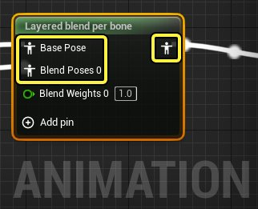
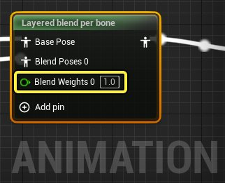
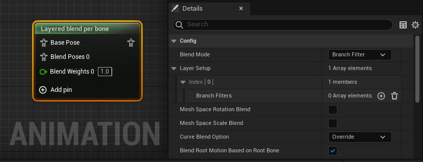
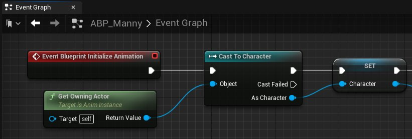
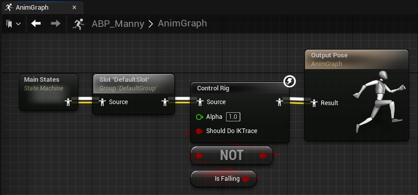
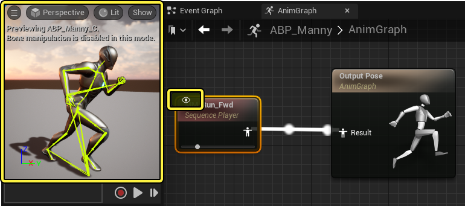
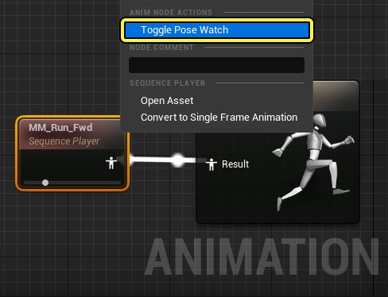
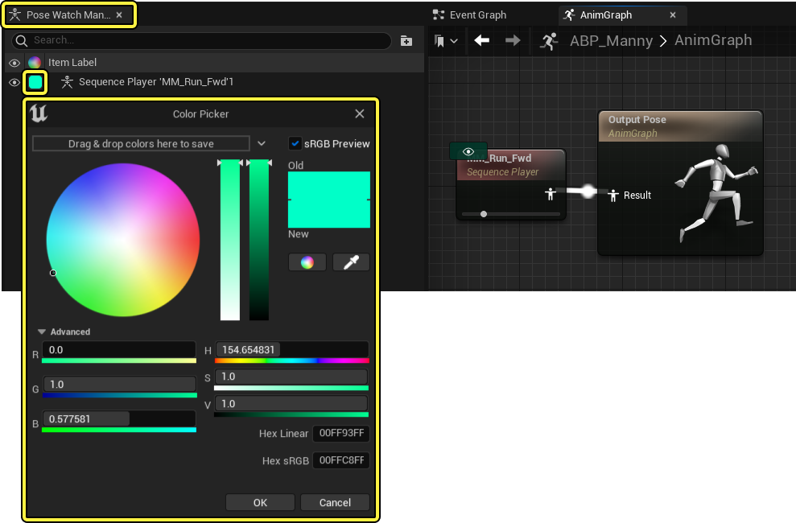

# 动画节点参考

> 路径：虚幻引擎5.7文档 / 为角色和对象制作动画 / 骨架网格体动画系统 / 动画蓝图 / 动画节点参考

> 原始页面：https://dev.epicgames.com/documentation/unreal-engine/animation-blueprint-nodes-in-unreal-engine

[动画蓝图](../index.md) (**AnimBP**) 是一种特殊的[蓝图](../../../../blueprints-visual-scripting/index.md)，可以控制物体的动画行为。动画蓝图包含两个图表，[事件图表](../graphing-in-animation-blueprints/index.md#%E4%BA%8B%E4%BB%B6%E5%9B%BE%E8%A1%A8)用于控制动画的逻辑和交互，[动画图表](../graphing-in-animation-blueprints/index.md#%E5%8A%A8%E7%94%BB%E5%9B%BE%E8%A1%A8)用于控制物体的动画姿势。动画蓝图中的所有图表都使用[节点](../../../../blueprints-visual-scripting/specialized-blueprint-visual-scripting-node-groups/nodes/index.md)来进行操作。这些节点按照它们在动画蓝图中的作用分为几种不同的类型。

## 动画节点结构

动画图表和事件图表中的动画蓝图节点包含 **输入** 和 **输出** 引脚，用于传递信息。

此外，动画蓝图还有属性引脚（比如数据值或变量），可以通过动画蓝图中的动画图表和事件图表中的关联函数进行修改。

在动画蓝图中选中节点，**细节（Details）** 面板中也会显示节点属性。

## 事件图表节点

事件图表用于处理输入的数据，然后数据会用于在动画图表中驱动姿势数据，比如触发播放、启用或停用动画函数以及更新动画数据。

在 **动画事件（Animation Events）** 文档中，你可以查看 **事件图表（EventGraph）** 动画蓝图节点的功能和属性。

- [动画蓝图事件节点](animation-blueprint-event-nodes/index.md)

## 动画图表节点

**动画图表（AnimGraph）** 节点使用来自 **事件图表（EventGraph）** 的数据，以此决定物体每一帧的动画姿势。

以下是各个主要动画图表节点的参考文档。

- [混合节点](animation-blueprint-blend-nodes/index.md)

- [骨骼控制](animation-blueprint-skeletal-controls/index.md) - 用于直接操控目标骨架的骨骼并对其应用解算器的动画节点。

- [空间转换节点](animation-blueprint-component-space-022a8e09/index.md) - 在本地和组件空间之间转换姿势的动画节点。

- [FABRIK动画蓝图节点](fabrik-animation-blueprint/index.md) - 介绍FABRIK动画节点。

## 动画节点姿势观看

使用动画蓝图时，你可以在特定动画蓝图节点上开启 **姿势观看（Pose Watching）**，从而在 **视口（Viewport）** 中查看用不同颜色表示的姿势调试图像。

要启用这个功能，**右键单击** 包含姿势数据的节点，并选择 **切换姿势观看（Toggle Pose Watch）**。

你还可以同时使用多个活跃的姿势观看节点，可以比较蓝图中不同时刻的姿势，以找出当前姿势引入错误的确切时刻。

单击节点左上角的图标可以隐藏观看的姿势。要改变观看姿势的颜色，在 **菜单栏（Menu Bar）中找到**窗口（Window） > 姿势观看管理器（Pose Watch Manager）** 并且选择要改变的姿势旁边的颜色选项。

你可以在取色器窗口中停用姿势观看，或者在动画节点上重新选择 **切换姿势观看（Toggle Pose Watch）** 来停用姿势观看。
