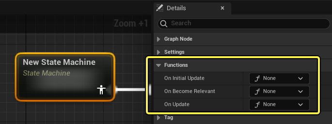
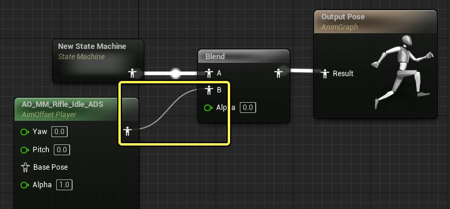
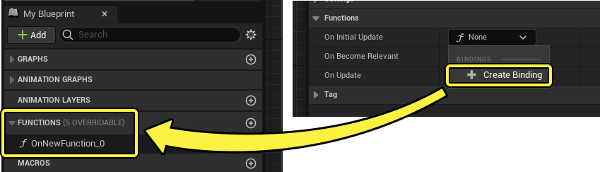
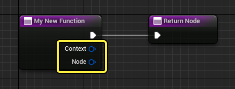
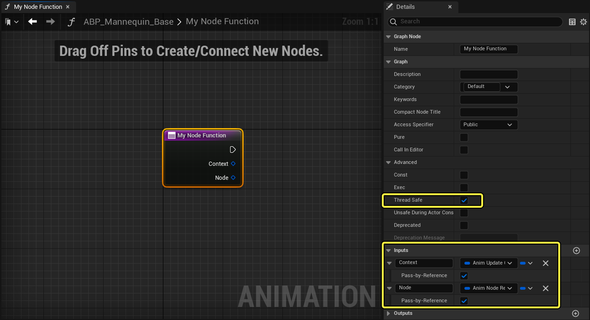
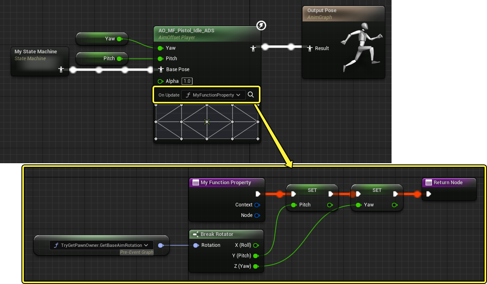
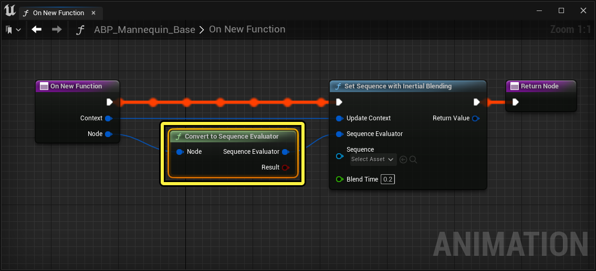
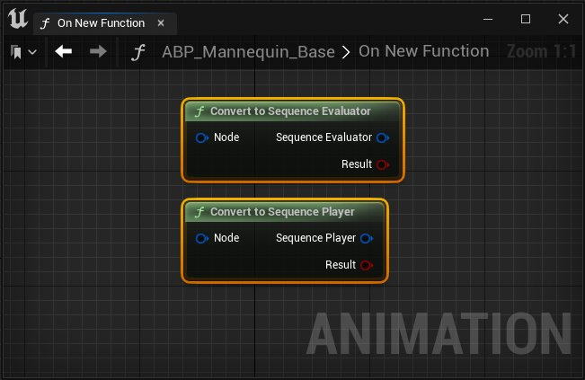

# 动画节点函数

> 路径：虚幻引擎5.7文档 / 为角色和对象制作动画 / 骨架网格体动画系统 / 动画蓝图 / 在动画蓝图中使用图表功能 / 动画节点函数

> 原始页面：https://dev.epicgames.com/documentation/unreal-engine/animation-blueprint-node-functions-in-unreal-engine

**动画节点函数** 是[函数图表](../../../../../blueprints-visual-scripting/specialized-blueprint-visual-scripting-node-groups/functions/index.md)，你可以在图表的 **更新** ** 循环中的设定点将其绑定到特定[动画蓝图节点](../../animation-blueprint-nodes/index.md)，以便执行相关逻辑。你可以使用动画节点函数设置引用变量、确定动态值、设置动画状态、整理复杂图表。此外，通过使用动画节点函数，逻辑仅在图表的求值中的设定点运行，这可显著提高动画系统的性能。

你可以使用此文档详细了解如何使用虚幻引擎中的动画节点函数。

## 创建新的动画节点函数

要创建新的动画节点函数，请在AnimGraph中选择节点，并找到该节点的 **细节（Details）** 面板的 **函数（Functions）** 分段。

你可以根据项目的需要，选择在任何可用绑定上创建新函数。下方列出了各个可用函数及其说明：

| 函数 | 说明 |
| --- | --- |
| **On Initial Update** | 首次更新动画蓝图节点之前，引擎会调用绑定到此函数的图表的逻辑。你可以使用此函数为不会变化的节点设置常量，例如组件引用或静态值。 |
| **On Become Relevant** | 每次节点在图表中变得相关时，引擎会调用绑定到此函数的图表的逻辑。你可以使用此函数设置节点需要的动态值，但在节点求值时不会更新。 |
| **On Update** | 每次更新节点时，引擎会调用绑定到此函数的图表的逻辑。你可以使用此函数设置节点在其更新期间需要的动态值。如需使用 **On Update** 函数绑定的示例工作流程，请参阅[距离匹配](../../../animation-assets-and-features/locomotion/distance-matching/index.md)文档。 |

> [!NOTE]
> **AnimGraph** 中 **相关性** 的概念指的是引擎是否在对节点求值。在未对节点求值的情况下，例如使用[Blend节点](../../animation-blueprint-nodes/animation-blueprint-blend-nodes/index.md)或[状态机](../../state-machines/index.md)时，一些节点可能完全处于非活动状态。发生此情况时，该节点不相关。只有当前对 **输出姿势** 带来影响的节点才被视为相关。
>
> 在此示例中，Aim Offset节点不相关，因为Blend节点完全混合到输入A。
>
> 

选择何时将新函数绑定到节点的求值周期后，使用绑定的下拉菜单中的（ **+** ） **创建新绑定（Create New Binding）** 选项创建新的函数图表。随后该函数图表将显示在 **我的蓝图（My Blueprints）** 面板中，其中你可以命名和打开该函数。

新的动画节点函数会在 **Function** 节点上自动创建 **输入（Input）** 引脚，这些引脚用于将数据从绑定的动画蓝图节点传递到函数的图表。一些函数操作可能不需要使用这些引脚，但其他逻辑可能需要它们提供的数据，例如，如果你使用该函数读取节点的当前状态。

| 输入引脚 | 说明 |
| --- | --- |
| **上下文（Context）** | 允许节点让与节点相关的数据通过，例如增量时间或惯性化请求。 |
| **节点（Node）** | 允许节点让自身通过此引脚。通常，你需要使用Convert函数将此引脚转换为特定节点类型。 |

> [!NOTE]
> 你还可以将现有函数绑定到动画蓝图节点，只要它满足以下要求即可：
>
> - 函数的[**线程安全**](../../../animation-debugging-and-optimization/animation-optimization/index.md#%E4%BD%BF%E7%94%A8%E5%A4%9A%E7%BA%BF%E7%A8%8B%E5%8A%A8%E7%94%BB%E6%9B%B4%E6%96%B0)属性已启用。
> - 函数必须包含两个 **输入** 。第一个是 **动画更新上下文引用（Anim Update Context Reference）** 类型，第二个是 **动画节点引用（Anim Node Reference）** 类型。其中每个输入还必须启用其 **按引用传递（Pass-by-Reference）** 属性。
>
> 

创建或绑定新函数到动画蓝图节点后，该函数将显示在AnimGraph中的该节点上。

在此示例中，用于获取角色的旋转并设置俯仰值和偏航值的Aim Offset逻辑全部包含在该函数中。引擎仅当更新AnimGraph中的Aim Offset节点时才执行此逻辑，而不是在事件图表中每次更新时执行，从而显著减少性能开销。

> [!TIP]
> 你可以使用图表中动画节点函数旁边的 **放大镜** 图标，直接从关联的动画蓝图节点打开该函数。

## 动画节点函数中的图表绘制

动画节点函数中的图表绘制逻辑类似于虚幻引擎中的其他所有函数图表。

如果你想进一步提高项目的性能，可以实现[动画优化](../../../animation-debugging-and-optimization/animation-optimization/index.md)技术，例如[属性访问](../property-access/index.md)，确保引擎将动画节点函数卸载到执行动画更新的工作线程上。

### Sequence Player节点

将动画节点函数绑定到 **Sequence Player** 或 **Sequence Evaluator** 节点时，你可以使用函数中的 **Sequence Player** 节点，直接使用动画节点函数与动画序列交互并播放动画序列，让Gameplay团队能够更好地控制动画播放。

下方列出了Sequence Player节点及其作用说明。

| 名称 | 图像 | 说明 |
| --- | --- | --- |
| 设置序列求值器 | **Set Sequence** （ **Evaluator Library** ） | 设置要由连接的**Sequence Evaluator** 节点播放的当前动画序列。 |
| 设置序列播放器 | **Set Sequence** （ **Player Library** ） | 设置要由连接的 **Sequence Player** 节点播放的当前动画序列。 |
| 使用混合求值器设置序列 | **Set Sequence with Inertial Blending** （ **Evaluator Library** ） | 使用带有指定时长的 **惯性混合（Inertial Blend）** 设置要由连接的 **Sequence Evaluator** 节点播放的当前动画序列。 |
| 使用混合播放器设置序列 | **Set Sequence with Interior Blending** （ **Player Library** ） | 使用带有指定时长的 **惯性混合（Inertial Blend）** 设置要由连接的 **Sequence Player** 节点播放的当前动画序列。 |
| set explicit time节点 | **Set Explicit Time** （ **Evaluator Library** ） | 设置连接的 **Sequence Evaluator** 节点的当前累积时间。 |

在动画函数中创建Sequence Player节点并将其添加到图表后，你需要使用 **Convert** 节点为播放器节点提供恰当的数据。

#### 转换为Sequencer Player和Evaluator节点

你可以使用Convert节点将上下文Sequence Player和Evaluator节点中的数据传递到动画节点函数，以便使用动画蓝图函数播放动画。

将Sequence Player节点添加到动画节点函数图表时，从Function节点的节点（Node）引脚添加Convert节点，并将输出连接到Player节点的 **Sequence Player** 或 **Sequence Evaluator** 输入。

> [!NOTE]
> 直接在Sequence Evaluator或Player节点上构建动画节点函数时，你可以使用纯函数Convert节点（绿色）。
>
> 
>
> 在不同的节点类型（例如状态机）上创建动画节点函数时，你必须使用函数convert节点（蓝色）恰当地将节点转换为Sequence Player或Evaluator。
>
> > 图片已省略：convert函数

### 状态机

你可以在状态机节点上创建动画蓝图函数节点，并使用它们设置状态机的动画状态。例如，你可以将On Update函数用于 **Set State** 节点，以设置动画状态机状态，而无需设置过渡逻辑。

#### Set State节点

你可以使用Set State节点，直接使用动画节点函数设置动画状态，而无需设置过渡逻辑。下方列出了Set State节点的属性及其作用说明。

> 图片已省略：set state节点

| 属性 | 说明 |
| --- | --- |
| 更新上下文 | 连接Function节点的上下文（Context）引脚以向Set State节点提供其操作的必要上下文，例如增量时间，以及AnimGraph中的当前位置。 |
| 节点 | 设置节点引用，供Set State节点用作绑定、播放速率和当前播放时间。 确保此节点连接到Convert to Animation State Machine节点，以恰当地设置函数图表中的状态机。 函数直接绑定到State Machine节点时，你可以使用纯Convert to Animation State Machine节点（绿色）。 纯函数转换状态 节点未直接连接到State Machine节点时，你必须使用Convert to Animation State Machine函数节点（蓝色）。 转换状态函数 |
| 目标状态 | 设置引擎在此节点变为激活时运行的状态。你可以使用动态值绑定此引脚，或使用节点上的字段输入状态的名称。 |
| 时长 | 设置从当前状态到目标状态的过渡混合的时长。使用值 `0.0` 将立即过渡，值越大，过渡越慢。 |
| 混合类型 | 设置节点将用于在状态之间过渡动画的混合类型。 可以从以下选项中进行选择： **标准混合（Standard Blend）** ：执行线性混合。 **惯性化（Inertialization）** ：执行惯性化混合。 |
| 混合配置文件 | 设置要应用于混合的混合配置文件。 |
| Alpha混合选项 | 设置Alpha混合选项以自定义动画混合。 |
| 自定义混合曲线 | 设置要用作混合曲线的曲线资产。 |

### Get State节点

你可以使用Get State节点确定哪个动画状态当前已激活。下方列出了Get State节点的输入和输出引脚及其作用说明。

> 图片已省略：获取动画状态

| 引脚 | 说明 |
| --- | --- |
| **更新上下文（Update Context）** | 使用Function节点的上下文（Context）引脚在图表中设置Get State节点的上下文。此引脚会传输增量时间等信息，以及AnimGraph中的当前位置。 |
| **节点（Node）** | 设置节点引用，供Set State节点用作绑定、播放速率和当前播放时间。 |
| **返回值（Return Value）** | 将当前动画状态的名称作为字符串值返回。 |

#### Is State Blend In和Out节点

你可以使用 **Is State Blending In** 或 **Out** 节点确定当前动画状态是向内还是向外混合，以便构建逻辑来驱动混合行为。下方列出了Is State Blending In或Out节点引脚及其作用说明。

> 图片已省略：向内和向外混合状态

| 引脚 | 说明 |
| --- | --- |
| **更新上下文（Update Context）** | 使用 **Function** 节点的 **上下文（Context）** 引脚在图表中设置 **Get State** 节点的上下文。此引脚会传输增量时间等信息，以及AnimGraph中的当前位置。 |
| **节点（Node）** | 设置节点引用，供 **Set State** 节点用作绑定、播放速率和当前播放时间。 |
| **返回值（Return Value）** | 返回状态是 **向内（In）** 还是 **向外（Out）** 混合的布尔值。 |

使用Is State Blending In或Out节点时，你必须使用Convert to Animation State节点提供恰当的节点上下文数据。直接在动画状态输出节点上更新函数时，你可以使用纯 **Convert to Animation State** 节点（绿色），对于其他所有适用情况，请使用 **Convert to Animation State** 函数节点（蓝色）。

> 图片已省略：转换为动画状态

### 将函数绑定到状态

你还可以直接将动画节点函数绑定到动画状态。但是，函数图表只能绑定到状态AnimGraph中的输出节点。

> 图片已省略：在单独的状态上构建函数逻辑

## 其他资源

如需详细了解如何使用动画节点函数，请参阅Lyra示例项目。

- [Lyra中的动画](../../../../../samples-and-tutorials/sample-game-projects/lyra-sample-game/animation-in-lyra-sample-game/index.md)

要参考设置动画节点函数的示例工作流程，请参阅"距离匹配（Distance Matching）"文档。

- [距离匹配](../../../animation-assets-and-features/locomotion/distance-matching/index.md)
