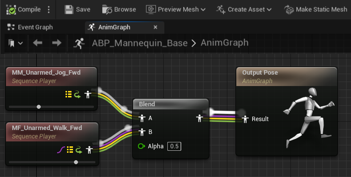
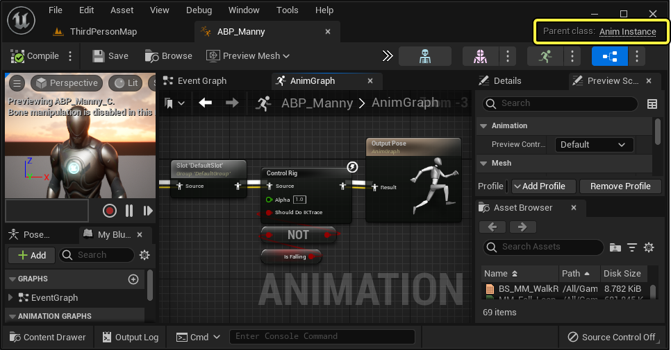
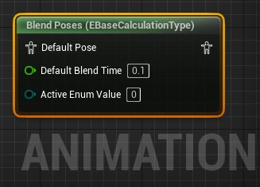
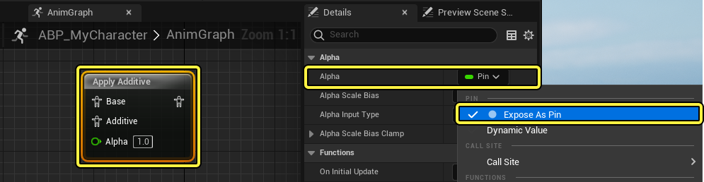
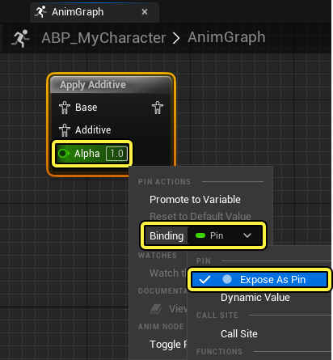
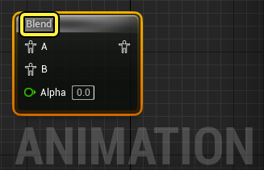
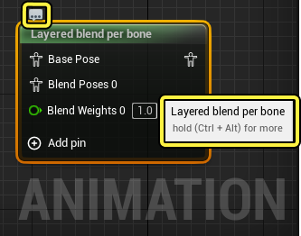
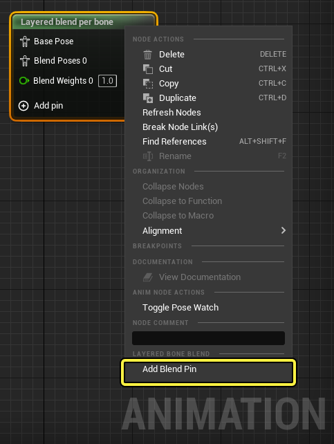

# 动画节点技术指南

> 路径：虚幻引擎5.7文档 / 为角色和对象制作动画 / 骨架网格体动画系统 / 动画蓝图 / 在动画蓝图中使用图表功能 / 动画节点技术指南

> 原始页面：https://dev.epicgames.com/documentation/unreal-engine/animation-node-technical-guide-in-unreal-engine

**动画节点** 在[动画蓝图](../../index.md)中用来执行多种操作，例如处理[动画资产](../../../animation-assets-and-features/index.md)、混合[动画姿势](../../../animation-assets-and-features/animation-pose-assets/index.md)，以及操控骨骼网格体的[骨骼](../../../animation-assets-and-features/skeletons/index.md)。**虚幻引擎** 提供了一套动画节点。除此之外，你还可以创建自定义节点来满足项目需要。



要在项目的[代码IDE](../../../../../cpp-programming/setting-up-your-development-environment-for-cplusplus/index.md)中打开动画蓝图，请在[AnimBP编辑器](../../animation-blueprint-editor/index.md)中打开AnimBP，然后点击编辑器窗口左上角的 **父类（Parent Class）** 链接。



## 动画节点剖析

动画节点的两个基本组件是：

- 一个

  运行时结构体

  ，用于执行生成输出姿势所需的实际操作。
- 一个

  编辑器时容器类

  ，负责处理图表节点的视觉表现和功能，例如节点标题和上下文菜单。

要添加新动画节点，你必须创建这两个组件。

### 节点层级

你可以创建节点的层级， 不过，非抽象类型的编辑器时类都只应包含一个运行时节点。

> [!WARNING]
> 派生时不要添加额外节点，除非父类是抽象类并且不包含运行时节点。

请参阅 `UAnimGraphNode_BlendListBase` 节点系列，了解示例。



## 运行时节点组件

**运行时结构体** 派生自 `FAnimNode_Base` 类，负责初始化、更新以及在一个或多个输入姿势上执行操作来生成所需的输出姿势。它还会声明节点为执行所需操作需具备的输入姿势链接和属性。

### 姿势输入

在运行时节点中，姿势输入（Pose Input）通过创建 `FPoseLink` 或 `FComponentSpacePoseLink` 类型的属性来公开。`FPoseLink` 在处理本地空间中的姿势时使用，例如混合动画。`FComponentSpacePoseLink` 在处理组件空间中的姿势时使用，例如应用骨骼控制器。

一个Anim BP节点可以有单个姿势输入。下面是使用单个姿势输入的动画节点示例。

| **节点分类** | **代码示例** | **图像** |
| --- | --- | --- |
| **本地空间** | **本地空间** 姿势输入代码的实现： `UPROPERTY(Category=Links) FPoseLink BasePose;` | 姿势输入引脚 |
|  | UPROPERTY(Category=Links) |  |
|  | FPoseLink BasePose; |  |
| **组件空间** | **组件空间** 姿势输入代码的实现： `UPROPERTY(Category=Links) FComponentSpacePoseLink ComponentPose;` | 姿势输入引脚 组件空间 姿势输入引脚 为蓝色。 |
|  | UPROPERTY(Category=Links) |  |
|  | FComponentSpacePoseLink ComponentPose; |  |

一个Anim BP节点还可以针对在多个动画之间混合的节点有多个姿势输入引脚。

| **节点分类** | **代码示例** | **图像** |
| --- | --- | --- |
| **混合节点** | **基础姿势** 和 **叠加姿势** 输入引脚代码实现： `UPROPERTY(Category=Links) FPoseLink Base; UPROPERTY(Category=Links) FPoseLink Additive;` | 姿势输入引脚 |
|  | UPROPERTY(Category=Links) |  |
|  | FPoseLink Base; |  |
|  |  |  |
|  | UPROPERTY(Category=Links) |  |
|  | FPoseLink Additive; |  |

实现到你的自定义Anim BP节点中之后，上述每个属性都将显示姿势链接输入引脚。

> [!NOTE]
> 此类型的属性始终公开为输入引脚。它们无法选择性地隐藏或仅用作 **细节（Details）** 面板中的可编辑属性。

### 属性和数据输入

你可以将任意数量的属性分配给AnimBP，用于执行节点的操作。你可以像设置其他属性一样使用 `UPROPERTY` 宏声明自定义属性。

| **节点分类** | **代码示例** | **图像** |
| --- | --- | --- |
| **Alpha属性实现（Alpha Property Implementation）** | **Alpha属性（Alpha property）** 引脚代码实现： `UPROPERTY(Category=Settings, meta(PinShownByDefault)) mutable float Alpha;` | 属性引脚 |
|  | UPROPERTY(Category=Settings, meta(PinShownByDefault)) |  |
|  | mutable float Alpha; |  |

使用特殊的 **元数据键** ，动画节点属性可以公开为 **数据输入引脚** ，以允许值传递到节点。下面是你在为项目创建自定义AnimBP节点时可以使用的元数据键。

| 元数据键 | 说明 |
| --- | --- |
| `NeverAsPin` | 此键会将属性作为AnimGraph中的数据引脚隐藏，并且仅可在节点的 **细节（Details）** 面板中编辑。 |
| `PinHiddenByDefault` | 你可以使用此键默认将属性作为引脚隐藏。然后属性可以作为数据引脚在AnimGraph中公开。请参阅[可选引脚](#%E5%8F%AF%E9%80%89%E5%BC%95%E8%84%9A)小节，详细了解如何在AnimGraph中公开隐藏的引脚。 |
| `PinShownByDefault` | 你可以使用此键默认将属性作为数据引脚在AnimGraph中公开。 |
| `AlwaysAsPin` | 此键始终将属性作为数据点在AnimGraph中公开。 |

### 可选引脚

对于已隐藏但可使用 `PinHiddenByDefault` 或 `PinShownByDefault` 等键在AnimGraph中公开的属性，你可以在节点的 **细节（Details）** 面板中公开属性，方法是找到相应属性，并从下拉菜单打开 **公开为引脚（Expose As Pin）** 。



你还可以隐藏AnimGraph中的属性引脚，方法是 **右键点击** 要隐藏的引脚，找到 **绑定（Binding）** 选项，并从下拉菜单打开 **公开为引脚（Expose As Pin）** 。



## 编辑器节点组件

编辑器类派生自 `UAnimGraphNode_Base` ，负责节点标题等视觉元素或添加上下文菜单操作。

编辑器时间类应该包含公开为可编辑的运行时节点实例。

```
	UPROPERTY(Category=Settings)	FAnimNode_ApplyAdditive Node; 
```

### 标题



你可以覆盖动画节点的标题元素在AnimGraph中的外观，例如使用 `GetNodeTitle` 和 `GetNodeTitleColor` 函数覆盖文本和背景颜色。

例如，`UAnimGraphNode_ApplyAdditive` 节点使用灰色背景并且显示为"应用Additive（Apply Additive）"：

```
	FLinearColor UAnimGraphNode_ApplyAdditive::GetNodeTitleColor() const	{		return FLinearColor(0.75f, 0.75f, 0.75f);	} 	FString UAnimGraphNode_ApplyAdditive::GetNodeTitle(ENodeTitleType::Type TitleType) const	{		return TEXT("Apply Additive");	} 
```

### 提示文本



创建自定义动画节点时，你可以通过覆盖 `GetTooltip` 函数，创建可在AnimGraph中查看的自定义提示文本：

```
	FString UAnimGraphNode_ApplyAdditive::GetTooltip const	{		return TEXT("Apply additive animation to normal pose");	} 
```

### 情境菜单

创建你自己的自定义动画节点时，可以将特定于节点的选项添加到节点的上下文菜单，在AnimGraph中 **右键点击** 该节点可访问该菜单。你可以使用 `GetContextMenuActions` 函数将上下文菜单选项添加到自定义动画节点，该函数也是虚幻引擎中所有蓝图节点的函数。



例如，`UAnimGraphNode_LayeredBoneBlend` 节点添加了用于添加 **添加混合引脚（Add Blend Pin）** 或 **删除混合引脚（Remove Blend Pin）** 的上下文菜单选项：

```
	void UAnimGraphNode_LayeredBoneBlend::GetContextMenuActions(const FGraphNodeContextMenuBuilder& Context) const	{		if (!Context.bIsDebugging)		{			if (Context.Pin != NULL)			{				// 我们仅为常规混合列表（BlendList）/按枚举混合列表（BlendList）实现此函数，按布尔混合列表（BlendList）不支持添加/删除引脚				if (Context.Pin->Direction == EGPD_Input)				{					//@TODO：仅在具有数组的引脚上提供此选项					Context.MenuBuilder->BeginSection("AnimNodesLayeredBoneBlend", NSLOCTEXT("A3Nodes", "LayeredBoneBlend", "Layered Bone Blend"));					{						Context.MenuBuilder->AddMenuEntry(FGraphEditorCommands::Get().RemoveBlendListPin);					}					Context.MenuBuilder->EndSection();				}			}			else			{				Context.MenuBuilder->BeginSection("AnimNodesLayeredBoneBlend", NSLOCTEXT("A3Nodes", "LayeredBoneBlend", "Layered Bone Blend"));				{					Context.MenuBuilder->AddMenuEntry(FGraphEditorCommands::Get().AddBlendListPin);				}				Context.MenuBuilder->EndSection();			}		}	} 
```

## 派生的原生Getter

你可以创建自己的 `UAnimInstance` 派生类来实现性能提升。如果需要提升性能，你可以添加新的Getter。你可以执行下面的步骤来设置新的Getter：

- Getter函数必须标记为

  UFUNCTIONS

  。
- 它们必须是

  BlueprintPure

  。
- 它们必须包含

  AnimGetter="True"

  元数据。

它们还必须定义一些专门指定的参数（也在 `AnimInstance.h` 中的基本动画Getter函数上面对它进行了介绍）。这些参数包括：

| **参数** | **说明** |
| --- | --- |
| **int32 AssetPlayerIndex** | 该Getter处理资源播放器，将按可用资源播放器将条目添加到编辑器。 |
| **int32 MachineIndex** | 该Getter处理状态机，将按状态机添加条目。 |
| **int32 StateIndex** | 它还需要MachineIndex。该Getter处理状态，将按状态添加条目。 |
| **int32 TransitionIndex** | 它还需要MachineIndex。该Getter处理过渡，将按过渡添加条目。 |

你还可以使用辅助函数，获取Getter中的实际节点。它们存在于 `UAnimInstance` 上：

| **函数** | **说明** |
| --- | --- |
| **GetStateMachineInstance(int32 MachineIndex)** | 获取烘焙后的状态机实例。 |
| **GetCheckedNodeFromIndex(int32 NodeIdx)** | 从索引获取节点，如无效则断言。 |
| **GetNodeFromIndex(int32 NodeIdx)** | 同上，可返回nullptr。 |
| **GetRelevantAssetPlayerFromState(int32 MachineIndex, int32 StateIndex)** | 获取状态中具有最高权重的资源播放器。 |
