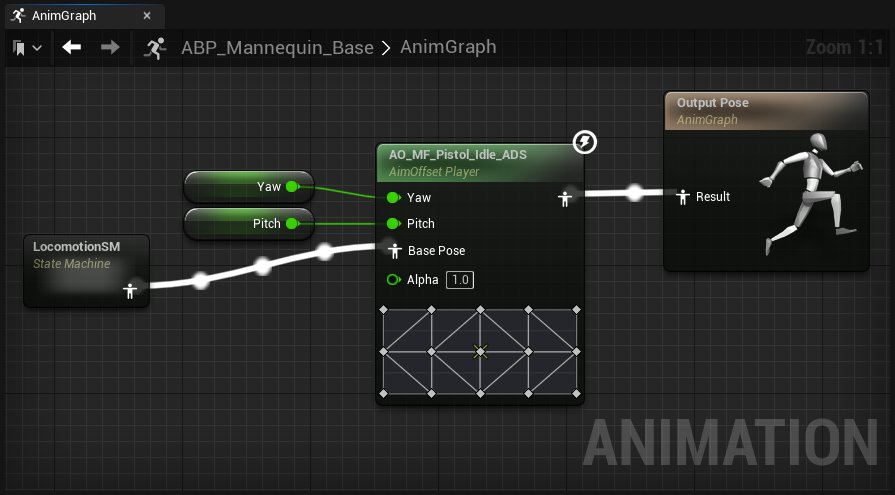
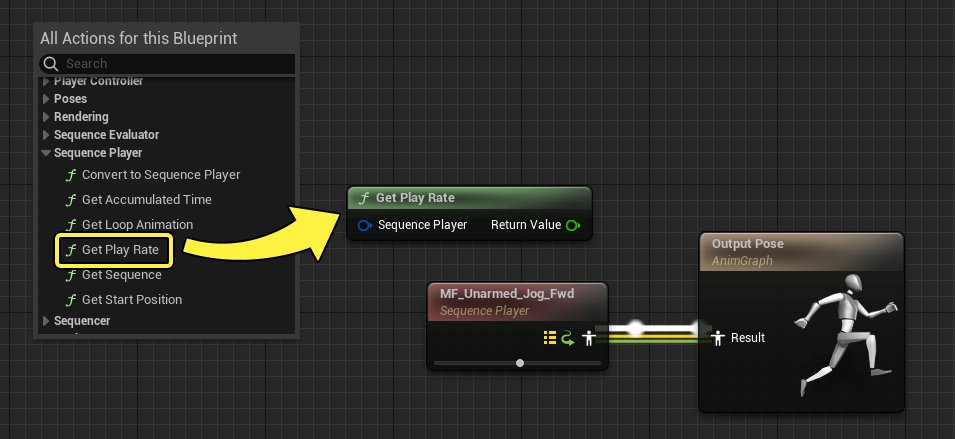
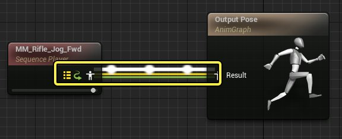

# 在动画蓝图中使用图表功能

> 路径：虚幻引擎5.7文档 / 为角色和对象制作动画 / 骨架网格体动画系统 / 动画蓝图 / 在动画蓝图中使用图表功能

> 原始页面：https://dev.epicgames.com/documentation/unreal-engine/graphing-in-animation-blueprints-in-unreal-engine

使用 **动画蓝图** 的主要方法是在 **动画图表** 和 **事件图表** 中创建逻辑。此逻辑会定义蓝图的姿势行为、变量和其他属性。这些图表将协同工作，在任意给定帧提供角色的最终输出姿势。

本文档概述了动画蓝图中的动画图表、事件图表和图表绘制体验。

#### 先决条件

- 你已创建

  动画蓝图

  并将其打开。
- 你对

  蓝图视觉效果脚本编写

  有基本的了解，动画蓝图从中继承其接口和行为。

## 动画图表

AnimGraph可供你为角色创建特定于动画的逻辑。通常，这涉及创建节点来控制混合、变换骨骼、移动和其他类似动画效果。在AnimGraph中，你可以使用根据EventGraph或函数计算的值，然后将这些变量连接为AnimGraph节点的输入，例如[混合空间](../../animation-assets-and-features/blend-spaces/blend-spaces-in-animation-blueprints/index.md)。节点及其值的组合效果连接到 **Output Pose**，这是为每个帧定义角色的最终姿势的地方。

作为基本示例，你可以在AnimGraph中创建 **Sequence Player** 节点，它将引用[动画序列](../../animation-assets-and-features/animation-sequences/index.md)。将此节点连接到 **Output Pose** 节点，然后点击[工具栏](../animation-blueprint-editor/index.md#%E5%B7%A5%E5%85%B7%E6%A0%8F)中的 **编译（Compile）**。你现在应该会看到动画无限播放，因为 **Sequence Player** 会持续不断播放动画。

> 动图已省略：动画图表示例

### 创建和连接节点

类似于[蓝图](../../../../blueprints-visual-scripting/index.md)，在图表中右键点击并选择节点即可创建节点。

如果你创建输出 **姿势** 信息的节点，则该节点可以连接到其他姿势引脚，例如 **Output Pose** 节点上的引脚。通常，创建和连接节点将需要你重新编译蓝图。

> 动图已省略：连接姿势节点

你可以在AnimGraph中创建多种节点类型。如需详细了解它们，请参阅[动画节点参考](../animation-blueprint-nodes/index.md)页面。

- [动画节点参考](../animation-blueprint-nodes/index.md)

### 执行流和信息

**姿势连接** 由 **姿势图标** 表示，其执行显示为其连接线上的脉冲链接。对于普通图表，例如蓝图的EventGraph，此流在播放期间可以直观地看到，因为它依赖于事件的触发。AnimGraph有所不同，它总是会显示执行流，因为它不基于事件，并且每个帧都会进行求值。

> 动图已省略：动画图表中的执行流

在AnimGraph中，执行流表示在不同节点之间传递的姿势。诸如 **Blends** 之类的一些节点有多个输入，并在内部决定哪个输入目前是执行流的一部分。确定这一信息通常依赖于一些外部输入，例如传递到数据引脚的值。在此示例中，Blend节点上的 **Alpha** 值设置为 **0** 或 **1** ，从而启用或禁用每个传入姿势的求值。

> 动图已省略：动画图表中的执行更改

姿势和节点还可以包含多个内部属性，它们由节点上连接的引脚和图标之间的并行执行线表示。此信息传达了与动画姿势一起发送的其他属性。

属性列表如下所示：

| 属性 | 图标 | 说明 |
| --- | --- | --- |
| **曲线（Curves）** |  | 传递[动画曲线](../../animation-assets-and-features/animation-sequences/animation-curves/index.md)数据。 |
| **属性（Attributes）** |  | 传递[动画属性](../../animation-assets-and-features/animation-sequences/fbx-attributes/index.md)数据。 |
| **同步（Sync）** |  | 传递[同步组](../animation-sync-groups/index.md)数据。 |
| **根骨骼运动（Root Motion）** |  | 传递[根骨骼运动](../../animation-assets-and-features/locomotion/root-motion/index.md)数据。 |
| **惯性混合（Inertial Blending）** |  | 传递[Inertialization](../animation-blueprint-nodes/animation-blueprint-blend-nodes/index.md#%E6%83%AF%E6%80%A7%E5%8C%96)数据。该指标仅在请求Inertialization节点时显示，通常是在发生混合时。 |

### 节点函数

随着AnimGraph中的正常节点执行，你还可以指定要在节点的执行步骤期间调用的函数。这样就可以创建更容易管理的逻辑，在其相关节点和函数中进行整理。此外，这可节省CPU资源，以便这些事件仅在节点处于活动状态时调用。

在 **AnimGraph** 中选择任一 **动画节点** 并找到 **细节（Details）** 面板中的 **函数（Functions）** 属性类别可访问这些函数属性。

以下函数属性可用：

| 函数类型 | 说明 |
| --- | --- |
| **On Initial Update** | 此函数仅在Gameplay或模拟期间执行一次。它在节点首次变为相关时执行，并且在 **On Become Relevant** 之前执行。如果节点重复变为相关，它不会重新执行。 |
| **On Become Relevant** | 此函数在节点首次变为相关时执行，并且在 **On Initial Update** 之后执行。如果节点反复变为相关，例如混合开启，然后关闭，再开启，它还会重新执行。 |
| **On Update** | 只要节点相关，此函数就会在每个更新函数连续执行。它在 **On Become Relevant** 执行之后开始执行。 |

> [!NOTE]
> AnimGraph中的 **相关性** 概念指的是节点是否正在进行求值。在节点未进行求值的情况下，例如使用混合节点或状态机时，一些节点可能会处于完全不活动状态。发生此情况时，该节点 **不相关** 。只有当前对输出姿势带来影响的节点才被视为 **相关** 。
>
> 在此示例中，Aim Offset节点不相关，因为Blend节点完全混合到输入 **A** 。
>
> 

要添加新 **函数**，请点击所选 **属性** 的 **下拉菜单**，然后选择 **创建绑定（Create Binding）** 。这将为你的动画蓝图创建新函数，并将其绑定到函数属性。

通过这种方式创建函数时，系统会自动创建输入引脚，用于将该函数链接到所关联的节点。这些引脚在一些情况下是可选的，但如果你使用函数读取节点的当前状态，则是必需的。

- 上下文

  ：允许节点让与节点相关的数据通过，例如增量时间或惯性化请求。
- 节点

  ：允许节点让自身通过此引脚。通常，你需要使用

  Convert

  函数将此引脚转换为特定节点类型。

函数分配给节点时，由节点上可见的函数名称来指示。在此示例中，用于获取角色的旋转并设置俯仰和偏转值的Aim Offset逻辑全部包含在函数中。此逻辑仅会在此节点更新时执行，而不是像在[事件图表](#%E4%BA%8B%E4%BB%B6%E5%9B%BE%E8%A1%A8)中那样不断执行，从而降低了性能成本。

### 属性访问

为了加快获取和设置属性，你可以使用 **属性访问** 功能，其中包含各种各样的自动化函数。属性访问对于减少获取属性的实例、冗余连接和总体图表复杂度很有用。它还可用于以[线程安全](#cpu%E7%BA%BF%E7%A8%8B%E4%BD%BF%E7%94%A8%E5%92%8C%E6%80%A7%E8%83%BD)的方式自动将Gameplay数据提供给动画图表。

此功能主要有两种用法：

#### 作为节点

要创建 **属性访问节点** ，请右键点击 **AnimGraph** ，然后从 **变量（Variables）** 类别选择 **属性访问（Property Access）** 。

> 图片已省略：创建属性访问节点

添加后，你需要将其绑定到 **Get** 函数。点击节点上的 **下拉菜单** ，然后选择你需要的 **Get函数** 。你还可以导航到单个Get之外，找到更具体的属性。此示例将创建从 **TryGetPawnOwner** 到 **GetActorLocation** 再到 **特定轴** 的Get属性路径。

> 图片已省略：属性访问节点绑定

绑定之后，你可以使用属性访问节点在图表中提供属性逻辑。

> 图片已省略：属性访问节点逻辑

#### 作为引脚

要使用更简单的逻辑，你还可以直接将属性访问嵌入到属性引脚选择 **节点** ，找到 **细节（Details）** 面板中的 **引脚（pin）** 属性，然后点击该属性的 **下拉菜单** 。你可以从中选择类似的 **Get函数链** 以映射到此节点的属性。

> 图片已省略：属性访问引脚

#### 属性访问函数

你还可以创建自定义函数，来实现更复杂逻辑并输出结果值。为了确保属性值的正确，你必须对函数进行以下处理：

- 函数必须包含

  返回节点

  ，最终产生的属性连接到

  返回值（ReturnValue）

  输出引脚。
- 必须在函数

  细节

  面板中勾选

  纯（Pure）

  。

> 图片已省略：property access function settings

只要正确设置，就可以在属性访问菜单中添加这些函数了。

> 图片已省略：property access function

#### 属性访问设置

该属性访问菜单包含以下选项和属性：

> 图片已省略：属性访问菜单

| 名称 | 说明 |
| --- | --- |
| 调用站点（Call Site） | 调用站点用于控制在哪个CPU线程上执行属性访问。你可以选择以下选项： **自动（Automatic）** ，这将根据上下文和线程安全自动确定此属性访问的调用站点。你应该在大多数情况下保留这种选项。 **线程安全（Thread Safe）** ，这将在工作线程上执行此属性访问。 **游戏线程（事件图表前）（Game Thread (Pre-Event Graph)）** ，这将在事件图表执行之前在游戏线程上执行此属性访问。 **游戏线程（事件图表后）（Game Thread (Post-Event Graph)）** ，这将在事件图表执行之后在游戏线程上执行此属性访问。 **工作线程（事件图表前）（Worker Thread (Pre-Event Graph)）** ，这将在事件图表执行之前在工作线程上执行此属性访问。 **工作线程（事件图表后）（Worker Thread (Post-Event Graph)）** ，这将在事件图表执行之后在工作线程上执行此属性访问。 |
| 函数（Functions） | 你可以绑定到属性访问的函数列表。 |
| 属性（Properties） | 动画蓝图中的变量的列表，因为你还可以将属性访问绑定到变量。 |

### CPU线程使用和性能

创建复杂的AnimGraph逻辑时，可能有必要考虑图表逻辑的性能和成本。默认情况下，AnimGraph在不同于EventGraph的CPU线程（称为"工作线程"）上执行。而"游戏线程"则是动画蓝图的事件图表和其他所有蓝图执行所在的CPU线程。

此行为允许动画与其他更新并行工作到完成，从而显著提高多核计算机上游戏的性能。

如果在AnimGraph中执行不安全的操作，编译器还将发出警告。安全的操作通常是：

- 使用大部分AnimGraph节点。
- 直接访问动画蓝图的成员变量（包括结构的成员）。
- 调用不会修改状态的蓝图纯函数（例如大部分数学函数）。

> [!NOTE]
> 你可以在 **类设置细节（Class Settings Details*）** 面板中禁用 **使用多线程动画更新（Use Multi Threaded Animation Update）** ，从而禁用此行为，以便AnimGraph在游戏线程上执行，不过我们并不推荐这样做。
>
> > 图片已省略：禁用使用多线程动画

除了AnimGraph之外，函数还可以选择在工作线程上执行。然后，在将函数与[节点函数](#%E8%8A%82%E7%82%B9%E5%87%BD%E6%95%B0)一起使用时，你可以卸载整个动画蓝图图表以专门在工作线程上运行，进一步提高性能。

> [!NOTE]
> 你可以在所选函数的 **细节（Details*）** 面板中禁用 **线程安全（Thread Safe）** ，从而禁用此行为，不过我们并不推荐这样做。
>
> > 图片已省略：禁用线程安全

## 事件图表

每个动画蓝图都有单个 **EventGraph**，这是一个标准图表，使用一组与动画相关的特殊事件来启动节点序列。EventGraph的最常见用途是更新AnimGraph节点使用的值或属性。

### 动画事件

EventGraph的用法是添加一个或多个事件以充当进入点，然后连接函数、流控制节点和变量以执行所需的操作。

有了AnimGraph中提供的[CPU线程](#cpu%E7%BA%BF%E7%A8%8B%E4%BD%BF%E7%94%A8%E5%92%8C%E6%80%A7%E8%83%BD)和[节点函数](#%E8%8A%82%E7%82%B9%E5%87%BD%E6%95%B0)功能，推荐尽量少使用EventGraph。这是因为EventGraph与项目中的其他大部分蓝图逻辑一起在主游戏线程上执行。因此，在动画蓝图中采用复杂的EventGraph会降低总体性能。这些事件大部分有线程安全的对应事件，应尽可能使用后者。

| 事件名称 | 节点图像 | 说明 |
| --- | --- | --- |
| **开始运行（Begin Play）** |  | 类似于[蓝图视觉效果脚本编写](../../../../blueprints-visual-scripting/index.md)中的 **事件开始运行（Event Begin Play）**，该事件在游戏或模拟开始时执行，但在Actor的 **开始运行（Begin Play）** 事件之前执行。 作为线程安全的替代选择，你可以改为将 **On Initial Update** [节点函数](#%E8%8A%82%E7%82%B9%E5%87%BD%E6%95%B0)用于相关节点。 |
| **初始化动画（Initialize Animation）** |  | 该事件在创建动画蓝图实例时执行一次，以执行初始化操作。动画蓝图一旦创建，它就立即执行，在Actor的 **构造脚本（Construction Script）** 和 **开始运行（Begin Play）** 执行之前执行。 |
| **链接的动画图层已初始化（Linked Animation Layers Initialized）** |  | 该事件执行一次，在初始化动画（Initialize Animation）之后以及所有链接的动画图层初始化之后执行。 作为线程安全的替代选择，你可以改为将 **On Initial Update** [节点函数](#%E8%8A%82%E7%82%B9%E5%87%BD%E6%95%B0)用于相关链接的动画图层节点。 |
| **评估动画后（Post Evaluate Animation）** |  | 每个帧执行，但在动画完成求值并已应用当前帧的姿势后执行。这很适合用于重置值，或获取骨骼的准确变换。 |
| **更新动画（Update Animation）** |  | 每个帧执行，允许动画蓝图对自己需要的值执行计算和更新。该事件是EventGraph的更新循环的进入点。自上次更新以来经过的时间在 **增量时间X（Delta Time X）** 引脚中提供，这样可以执行时间相关的插值或增量更新。 作为线程安全的替代选择，你可以改为使用[**Blueprint Thread Safe Update Animation函数**](#%E7%BA%BF%E7%A8%8B%E5%AE%89%E5%85%A8%E6%9B%B4%E6%96%B0%E5%8A%A8%E7%94%BB)。 |
| **AnimNotify** |  | 在触发[骨架通知](../../animation-assets-and-features/animation-sequences/animation-notifies/index.md#%E9%AA%A8%E6%9E%B6%E9%80%9A%E7%9F%A5)时执行。 |

### 线程安全更新动画

要提高动画蓝图的性能，你可以使用Update Animation Event的线程安全的替代选择，即 **Blueprint Thread Safe Update Animation** 。该替代选择是一个函数，你必须将其覆盖，才能将其添加到蓝图中。它很有用，因为Event Graph Update Animation事件始终在游戏线程上运行，因此它无法利用多线程来提高总体帧率。

要这样做，请点击 **我的蓝图（My Blueprint）** 面板的 **函数（Functions）** 类别中的 **覆盖（Override）** 下拉菜单，然后选择 **Blueprint Thread Safe Update Animation** 。

> 图片已省略：线程安全更新动画

它现在添加到了你的函数列表。打开它将显示函数进入点，以及 **增量时间（Delta Time）** 引脚，类似于EventGraph Update Animation节点上的增量时间X（Delta Time X）引脚。现在你可以像在EventGraph中那样在此函数中创建相同的更新动画逻辑，此函数在工作线程而不是游戏线程上执行。

> 图片已省略：线程安全更新动画
