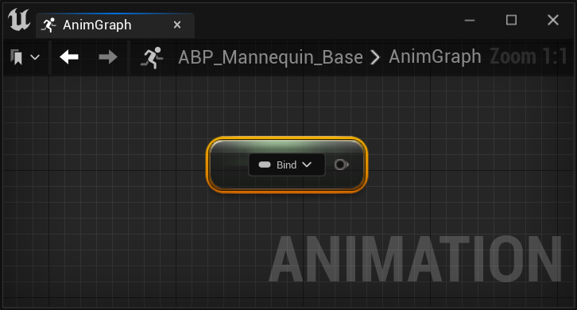
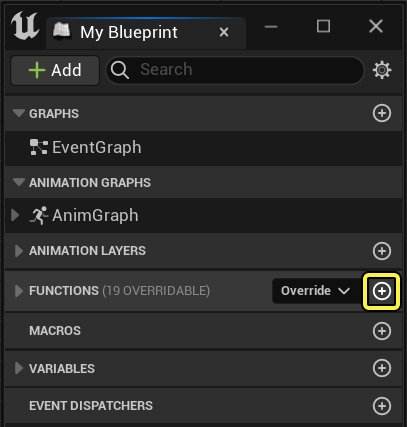
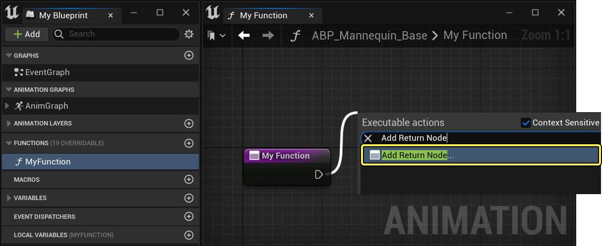
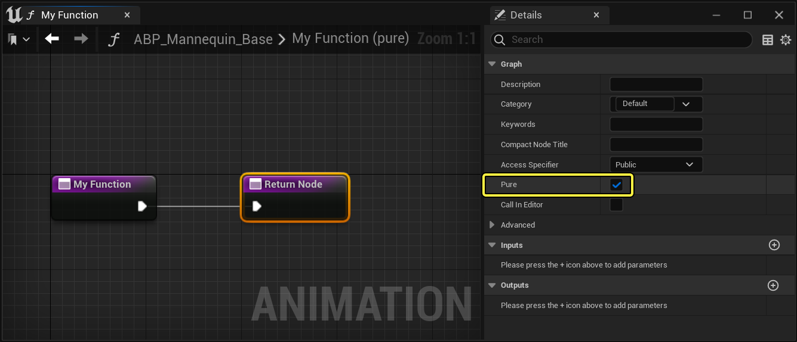
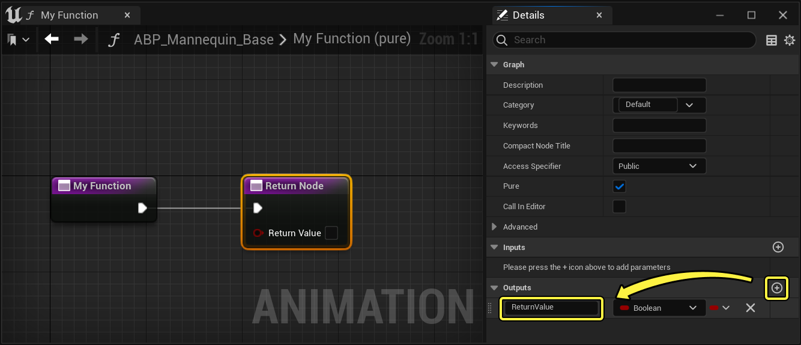
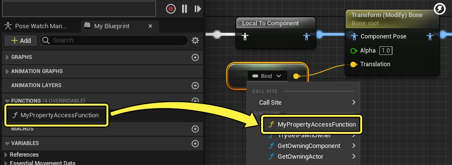
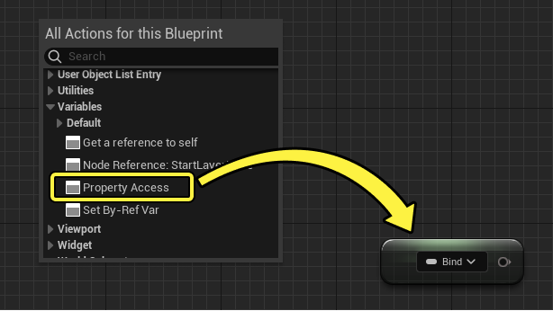
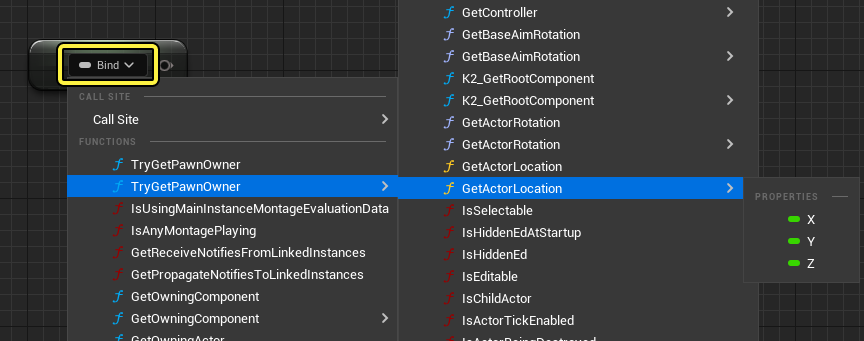

# 属性访问

> 路径：虚幻引擎5.7文档 / 为角色和对象制作动画 / 骨架网格体动画系统 / 动画蓝图 / 在动画蓝图中使用图表功能 / 属性访问

> 原始页面：https://dev.epicgames.com/documentation/unreal-engine/property-access-in-unreal-engine

使用 **属性访问（Property Access）** ，你可以在动画蓝图中的任何地方访问仅在 **游戏线程（Game Thread）** 上可访问的组件和变量。使用属性访问调用组件或变量会拍摄其数据的快照，你可以使用快照驱动[动画图表](../index.md#%E5%8A%A8%E7%94%BB%E5%9B%BE%E8%A1%A8)、[动画节点函数](../index.md#%E5%8A%A8%E7%94%BB%E8%8A%82%E7%82%B9%E5%87%BD%E6%95%B0)、[蓝图线程安全函数](../index.md#%E7%BA%BF%E7%A8%8B%E5%AE%89%E5%85%A8%E6%9B%B4%E6%96%B0%E5%8A%A8%E7%94%BB)或事件图表中的函数逻辑。使用属性访问可减少项目必须在 **游戏线程（Game Thread）** 上求值的工作量，还可减少你必须执行的手动蓝图脚本数量，从而提高游戏和工作流程性能。

你可以使用以下文档详细了解如何使用属性访问节点、引脚和函数来优化项目的动画系统。

## 概述

创建[动画蓝图](../../index.md)中的逻辑时，你通常会使用[事件图表](../index.md)设置变量并与其他蓝图和组件交互。事件图表总是在项目的 **游戏线程（Game Thread）** 上求值。

要提高动画系统的性能，你可以使用 **属性访问函数** 在动画图表更新所在的相同 **工作** **线程** 上运行 **事件图表** 函数。例如，你可以使用属性访问来直接访问角色的速度，而无需投射到角色蓝图并创建函数节点以提取速度向量。

| 不使用属性访问 | 使用属性访问 |
| --- | --- |
| 事件图表上的传统投射和变量设置 | property access |

## 属性访问函数

属性访问的运作方式是对函数图表求值，以拍摄游戏线程变量或组件的数据的快照，并转换该数据以[兼容线程安全](../index.md#%E7%BA%BF%E7%A8%8B%E5%AE%89%E5%85%A8%E6%9B%B4%E6%96%B0%E5%8A%A8%E7%94%BB)。创建属性访问节点时，或在动画蓝图节点引脚上调用属性访问函数时，你可以从访问项目的基础组件和变量的若干预生成函数中选择。

这些函数可提供变量和组件，例如角色的速度、移动方向或移动组件引用，你可以使用它们来驱动AnimGraph中的动画姿势选择或混合。

如需详细了解如何绑定属性访问节点和引脚，请参阅[属性访问绑定](#%E5%B1%9E%E6%80%A7%E8%AE%BF%E9%97%AE%E7%BB%91%E5%AE%9A)小节。

### 自定义属性访问函数

你还可以创建自定义属性访问函数，以便输出更具体或独特的值。要创建自定义属性访问函数，请首先在 **我的蓝图（My Blueprint）** 面板中选择 **添加（Add）** （ **+** ），以便添加新函数至该图表。

创建返回节点，并将其连接到函数节点。

选择 **返回节点（Return Node）** 并启用 **细节（Details）** 面板中的 **纯（Pure）** 属性。

使用 **添加（Add）** （ **+** ）添加新输出值，并将输出命名为 `ReturnValue` 。

> [!WARNING]
> 输出必须严格命名为 `ReturnValue` 。其他名称将导致无法从属性访问节点或引脚绑定中访问属性访问函数。

现在你可以构建逻辑来设置返回节点的输出引脚，后者会成为绑定到你的函数的属性访问节点或引脚的输出。

现在你可以使用"绑定（Bind）"下拉菜单选择属性访问函数，将该函数绑定到属性访问节点或引脚。属性访问函数根据输出的数据类型进行颜色编码。

> [!TIP]
> 为了优化性能，我们推荐你为属性访问函数启用线程安全属性。将函数启用为线程安全后，你还需要使用属性访问来做出所有变量和组件引用。将自定义属性访问函数设为线程安全，就可以显著提高动画系统的性能。

## 属性访问绑定

你可以使用现有动画蓝图节点上的属性访问[节点](#%E4%BD%9C%E4%B8%BA%E8%8A%82%E7%82%B9)或[引脚](#%E4%BD%9C%E4%B8%BA%E5%BC%95%E8%84%9A)绑定，在动画蓝图中的任意地方访问默认和自定义属性访问函数。

### 作为节点

你可以在动画蓝图中的任意地方创建属性访问节点。要创建属性访问节点，请右键点击 **AnimGraph** ，然后从 **变量（Variables）** 类别中选择 **属性访问（Property Access）** 。

创建属性访问节点后，你需要将其绑定到 **函数** ，以引用你想访问的组件或变量。你还可以绑定满足必要要求的自定义属性访问函数图表。要将函数绑定到属性访问节点，请从 **绑定（Bind）** 下拉菜单选择函数。

函数按层级整理，父组件函数包含对应于其子属性的子函数。例如，你可以浏览到父函数之外，隔离它包含的更具体的属性。在此示例中，创建了从 **TryGetPawnOwner** 到 **GetActorLocation** ，再到特定轴浮点值（ **X** 、 **Y** 或 **Z** ）的Get属性路径。

绑定属性访问节点后，你可以使用该节点访问图表中的组件或变量，以驱动节点的逻辑。

> 图片已省略：属性访问示例

## 作为引脚

你还可以将属性访问函数直接绑定到一些AnimNode引脚。要将属性访问函数绑定到AnimNode引脚，请在图表中选择节点，然后在节点的细节面板中找到输入引脚绑定设置。从"引脚（Pin）"下拉菜单中选择 **函数（Function）** ，以动态驱动引脚值。

> 图片已省略：作为引脚的属性访问函数

## 属性访问设置

属性访问上下文菜单包含以下选择和属性：

> 图片已省略：属性访问上下文菜单设置

| 名称 | 说明 |
| --- | --- |
| **调用站点（Call Site）** | **调用站点（Call Site）** 将控制在哪个线程上执行绑定的属性访问函数。你可以选择以下选项： **自动（Automatic）** ：基于上下文和线程安全自动确定绑定的属性访问函数的 **调用站点** 。在大多数情况下，你应该将此项保留为选择内容。 **线程安全（Thread Safe）** ：对 **工作线程** 上绑定的属性访问函数求值。 **游戏线程（Game Thread）** （ **事件图表前（Pre-Event Graph）** ）：在对 **事件图表** 求值之前，对 **游戏线程** 上绑定的属性访问函数求值。 **游戏线程（Game Thread）** （ **事件图表后（Post-Event Graph）** ）：在对 **事件图表** 求值之后，对 **游戏线程** 上绑定的属性访问函数求值。 **工作线程（Worker Thread）** （ **事件图表前（Pre-Event Graph）** ）：在对事件图表求值之前，对下一个可用 **工作线程** 上绑定的属性访问函数求值。 **工作线程（Worker Thread）** （ **事件图表后（Post-Event Graph）** ）： 在对 **事件图表** 求值之后，对下一个可用 **工作线程** 上绑定的属性访问函数求值。 |
| **函数（Functions）** | 选择要绑定到节点或引脚的属性访问函数。 |
| **属性（Properties）** | 选择动画蓝图中包含的变量或组件引用，以便可以绑定到属性访问节点或引脚。 |

## 其他资源

如需详细了解如何使用蓝图线程安全函数和属性访问来优化动画系统，请参阅[动画优化](../../../animation-debugging-and-optimization/animation-optimization/index.md)文档。

- [动画优化](../../../animation-debugging-and-optimization/animation-optimization/index.md)

如需了解使用蓝图线程安全函数和属性访问来获取动画变量的工作流程示例，请参阅[如何获取动画变量](../../../animation-workflow-guides-and-examples/how-to-get-animation-variables-in-animation-f9136b17/index.md)文档。

- [如何获取动画变量](../../../animation-workflow-guides-and-examples/how-to-get-animation-variables-in-animation-f9136b17/index.md)

如需了解优化虚幻引擎项目以使用线程安全函数的工作流程示例，请参阅[调整Lyra的动画系统](https://www.unrealengine.com/zh-CN/tech-blog/adapting-lyra-animation-to-your-ue5-game)博客文章。
