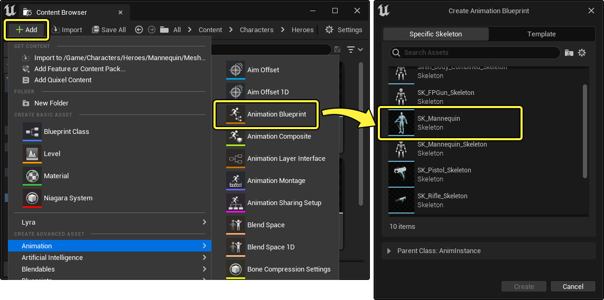
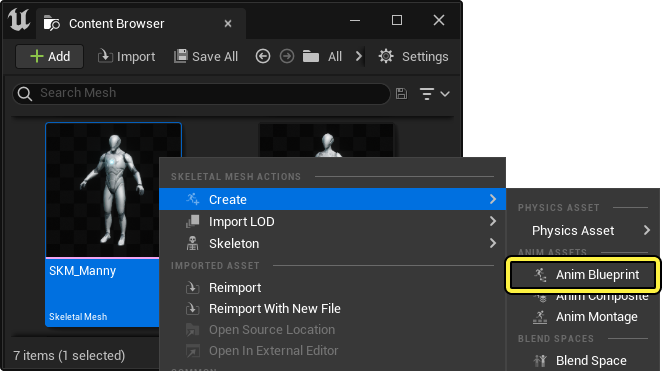
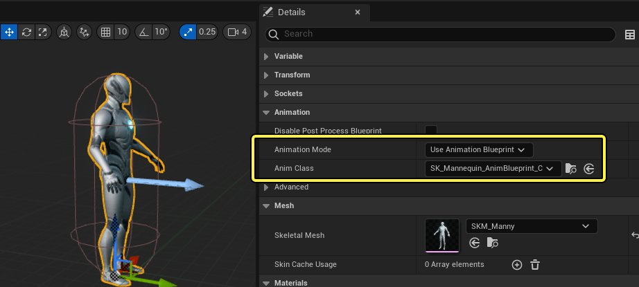

# 动画蓝图

> 路径：虚幻引擎5.7文档 / 为角色和对象制作动画 / 骨架网格体动画系统 / 动画蓝图

> 原始页面：https://dev.epicgames.com/documentation/unreal-engine/animation-blueprints-in-unreal-engine

**动画蓝图** 是一种特殊的 **蓝图**，它用于在游戏中控制 **骨骼网格体** 的动画效果。**动画蓝图编辑器（Animation Blueprint Editor）** 中的 **图表（Graphs）** 可以效果动画，允许你直接控制骨架的骨骼，或设置骨骼网格体逐帧逻辑，以便创建最终动画姿势。

该文档介绍了如何创建动画蓝图、使用动画编辑器及其主要功能。

#### 先决条件

- 你的项目中包含一个

  骨骼网格体

  .

## 动画蓝图创建

你可以通过以下方式来创建动画蓝图：

在 **内容浏览器（Content Browser）** 中，点击 **添加（+）（Add (+)）** 然后选择 **动画（Animation） > 动画蓝图（Animation Blueprint）**。然后，你需要指定动画蓝图的目标 **骨骼**。选中一个骨骼后点击 **创建（Create）**.

> [!NOTE]
> 对于这种创建方式，你可以选择指定一个 **模板动画蓝图（Template Animation Blueprint）**，也可以在想要创建子蓝图的情况下指定 **父蓝图（Parent Class）**。关于模板的更多信息，访问[动画蓝图链接](animation-blueprint-linking/index.md)页面。

在 **内容浏览器（Content Browser）** 中右键点击 **骨骼网格体资产（Skeletal Mesh Asset）**，然后选择 **创建（Create） > 动画蓝图（Anim Blueprint）**。这样也可以创建动画蓝图。

创建后，双击新建的 **动画蓝图（Animation Blueprint）** 来在 **动画蓝图编辑器（Animation Blueprint Editor）** 中打开。要了解该编辑器的界面、工具栏以及分区，参考[动画蓝图编辑器](animation-blueprint-editor/index.md)页面。

- [动画蓝图编辑器](animation-blueprint-editor/index.md)

### 指定给角色

动画蓝图本身并不会影响角色，除非你将它指定给某个角色。通常，你需要将它分配给角色的骨骼网格体（不论其是否在关卡中或者作为蓝图中的一个组件被引用）。

要分配动画蓝图，请选中你的骨骼网格体，然后设置以下属性：

- 将

  动画模式（Animation Mode）

  设为

  使用动画蓝图（Use Animation Blueprint）

  。
- 将

  动画类（Anim Class）

  设为你的动画蓝图资产。

## 使用动画蓝图

使用动画蓝图时，有几种功能和工作流程。从使用 **动画图表（AnimGraph）** 创建动画逻辑，再到使用 **链接动画实例（Linked Anim Instances）**, 动画蓝图为你提供了一整套强大的工具。

请参考以下页面，了解如何为你的角色创建强大的动画逻辑。

- [动画蓝图编辑器](animation-blueprint-editor/index.md) - 动画蓝图编辑器及其界面概览

- [在动画蓝图中使用图表功能](graphing-in-animation-blueprints/index.md) - 使用动画蓝图中的各种图表在骨骼网格体上编辑、混合和操控姿势。

- [状态机](state-machines/index.md) - 使用状态机创建基于逻辑的分支动画。

- [动画节点参考](animation-blueprint-nodes/index.md) - 介绍动画蓝图中的各种动画节点

- [动画插槽](animation-slots/index.md) - 在动画图表中添加插入点来使用插槽播放动画。

- [同步组](animation-sync-groups/index.md) - 使用同步组同步不同长度的动画周期。

- [动画蓝图链接](animation-blueprint-linking/index.md) - 使用动画蓝图链接和模板将你的动画蓝图逻辑模块化。
