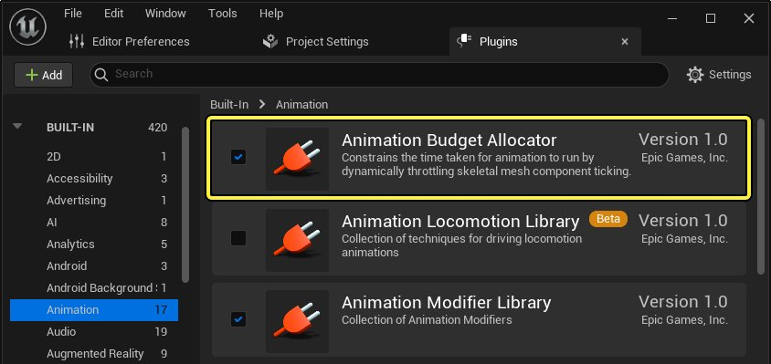
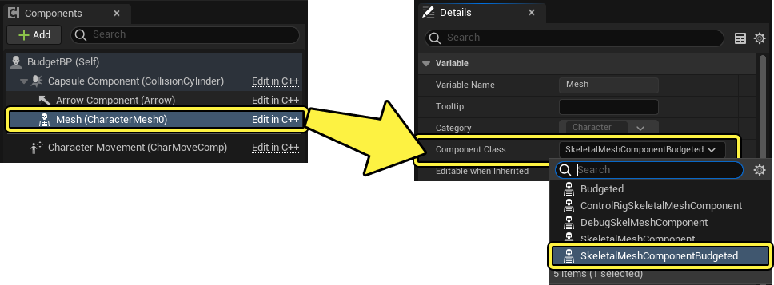
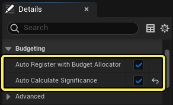
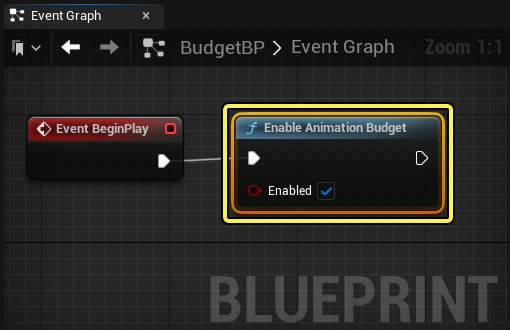
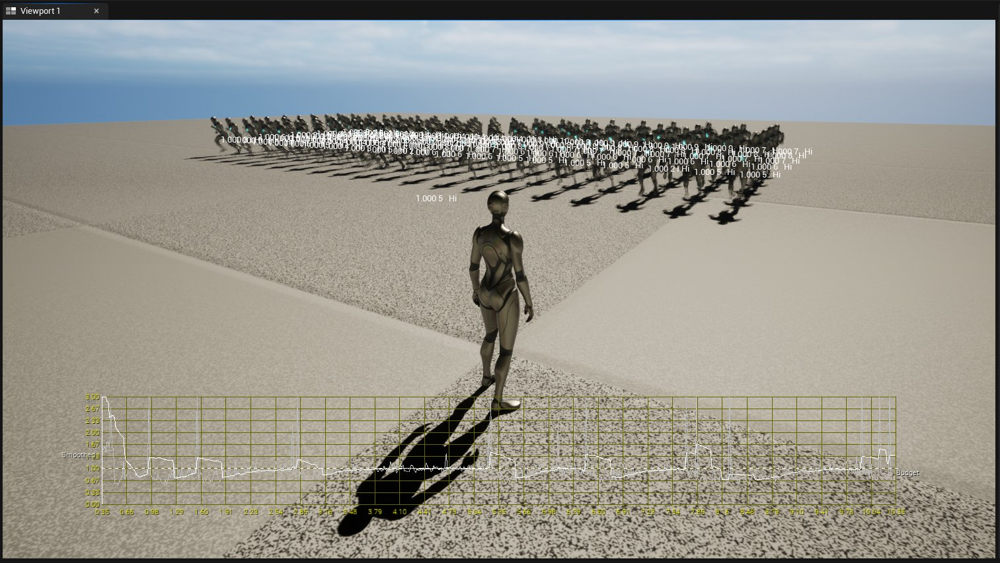
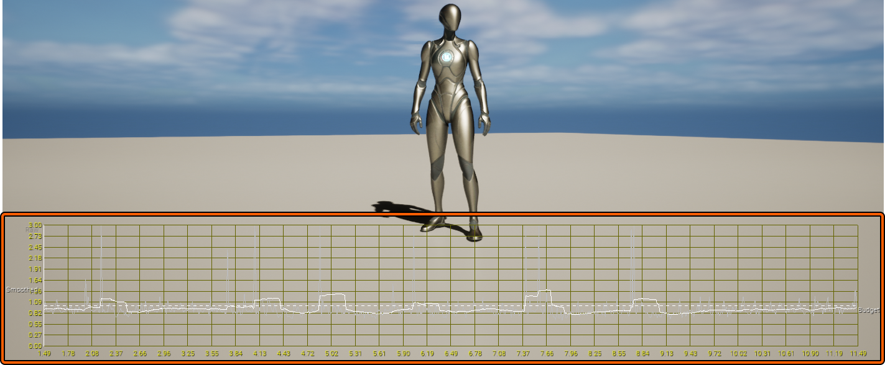
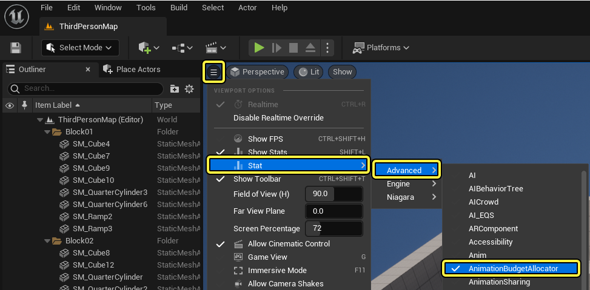
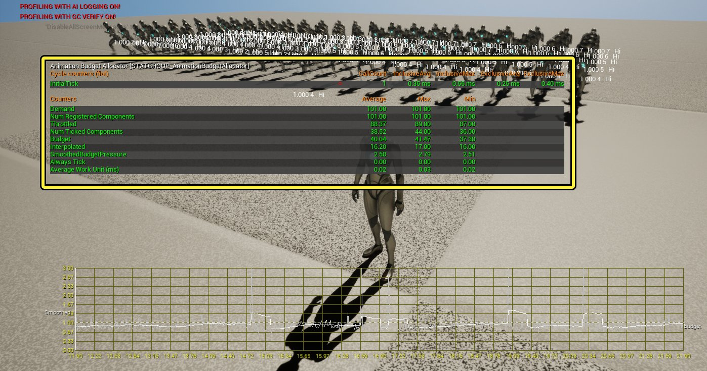

# 动画预算分配器

> 路径：虚幻引擎5.7文档 / 为角色和对象制作动画 / 骨架网格体动画系统 / 动画调试和优化 / 动画预算分配器

> 原始页面：https://dev.epicgames.com/documentation/unreal-engine/animation-budget-allocator-in-unreal-engine

**动画预算分配器（Animation Budget Allocator）** 是一种插件，可在 **虚幻引擎（Unreal Engine）** 中使用，以约束为指定骨骼网格体上运行的动画数据分配的计算时间。你可以使用动画预算分配器降低许多动画角色的成本，方法是设置处理预算，预算分配器会据以动态限制骨骼网格体组件动画更新。在一次性为很多角色制作动画时，你可以为动画数据设置固定CPU预算，从而以最小的系统开销最大限度提高可感知到的动画质量。

> 动图已省略：ImageAltText

动画预算分配器将确定 **游戏线程** 上待执行工作的固定预算，可逐个平台调整，以毫秒为单位。然后预算分配器将确定是否可以更新所有必要的动画更新，或者是否需要优化。如果需要优化，预算分配器会确定所请求更新的重要性，并基于多项条件识别目标，目的是动态调整负载，以适应固定 **游戏线程** 预算。

下面是预算分配器进行优化以降低性能负载的目标区域：

- 在个别骨骼网格体组件上停止更新，并偏好现有的领导者姿势组件。
- 以较低速率执行动画更新。
- 选择是否在更新之间 **插值（Interpolate）** 。

#### 先决条件

- 启用动画预算分配器[插件](../../../../understanding-the-basics/foundational-knowledge-in/working-with-plugins/index.md)。在 **菜单栏** 中找到 **编辑（Edit）** > 插件（**Plugins）** ，找到 **动画（Animation）** 分段下列出的 **动画预算分配器（Animation Budget Allocator）** ，或使用搜索栏。启用插件并重启编辑器。
- 
- 带有角色蓝图的骨骼网格体角色。
- 要在角色上播放的动画。

## 设置动画预算分配器

为了利用动画蓝图分配器，你必须设置角色蓝图的网格体组件的 **组件类（Component Class）** 以使用 **SkeletalMeshComponentBudgeted** 类。

要设置角色的组件类，请在角色的蓝图中找到 **组件（Components）** 面板，并选择网格体组件打开 **细节（Details）** 面板。将 **组件类（Component Class）** 属性设置为下拉菜单中的 **SkeletalMeshComponentBudgeted** 选项。



> [!NOTE]
> 或者，也可以将以下C++代码添加到 `ACharacter` 子类构造函数中：
>
> `: Super(ObjectInitializer.SetDefaultSubobjectClass<USkeletalMeshComponentBudgeted>(ACharacter::MeshComponentName))`

在"预算（Budgeting）"分段中，启用 **自动计算重要性（Auto Calculate Significance）** 并确保 **自动注册预算分配器（Auto Register with Budget Allocator）** 已启用。



创建 **Enable Animation Budget** 节点并将其连接到角色的蓝图事件图表中的 **Event Begin Play** 节点，然后选中 **启用（Enabled）** 属性。



现在你可以将角色蓝图添加到关卡，方法是从 **内容浏览器（Content Browser）** 将资产拖入关卡 **视口（viewport）** ，或使用蓝图生成角色。开始模拟时，将默认启用预算分配器。你可以使用视口中场景上渲染的图表来观察处理负载。

> [!NOTE]
> Enable Animation Blueprint Budget节点和该功能都必须启用，预算分配器才能正常运行。该功能默认启用，但你可以在模拟期间使用 `a.Budget.Enabled` 控制台命令进行切换。你可以使用反引号(`)键输入控制台命令，并在字段中输入命令。
>
> 你可以使用 `a.Budget.Debug.Enabled` 控制台命令切换动画预算分配器的调试覆层，在项目的模拟期间实时观察分配器的操作。



## 使用动画预算分配器

动画预算分配器实施了优化，使动画处理总负载不超出预算，同时保留系统可以生成的最大动画质量。它会偏好最靠近、最重要的网格体，以尽可能最高的帧率运行其动画，同时降低重要性较低的网格体的帧率和质量。



动画预算分配器的调试图表沿y轴、随时间推移、沿图表的x轴观察项目的处理负载，并实时更新。项目对总体动画系统的预算沿图表右侧渲染为虚线并标注为 **预算（Budget）** 。

实线表示动画系统在沿图表观察时间的个别时刻的 **性能（Performance）** 。

考虑到动画预算分配器的选定优化，性能将根据需要完成的工作量而异。

你可以通过启用 **统计数据覆层（stat overlay）** ，查看有关预算分配器的过程的更多信息。要启用统计数据覆层，请在视口菜单中找到 **统计数据（Stat）** > **高级（Advanced）** 并切换 **AnimationBudgetAllocator** 选项。



你现在可以在开始项目模拟时查看更多信息。



你可以在下面参考动画预算分配器的统计数据覆层中存在的信息列表：

| 统计数据 | 说明 |
| --- | --- |
| **初始更新（Initial Tick）** | 你可以使用初始更新来观察激活预算分配器时的初始更新统计数据。使用此类别，你可以观察初始更新的非独占平均时间、非独占最长时间、独占平均时间和独占最长时间，以毫秒(ms)为单位。 |
| **需求（Demand）** | 这里你可以观察运行预算分配器的需求。你可以观察预算分配器正在处理的对象的平均、最大(Max)、最小(Min)数量。 |
| **注册组件数量（Num Registered Components）** | 这里你可以观察预算分配器正在处理的注册骨骼网格体组件数量，包括构成[模块化角色](../../animation-workflow-guides-and-examples/working-with-modular-characters/index.md)的多个骨骼网格体组件。你可以观察骨骼网格体对象的平均、最大(Max)、最小(Min)数量。 |
| **受限制（Throttled）** | 这里你可以观察预算分配器正在优化的受限制骨骼网格体对象数量。你可以观察骨骼网格体对象的平均、最大(Max)、最小(Min)数量。 |
| **更新组件数量（Num Ticked Components）** | 这里你可以观察预算分配器正在对每次更新优化的骨骼网格体对象数量。你可以观察骨骼网格体对象的平均、最大(Max)、最小(Min)数量。 |
| **预算（Budget）** | 这里你可以观察预算分配器能够对每次更新优化的骨骼网格体对象数量。你可以观察骨骼网格体对象的平均、最大(Max)、最小(Min)数量。 |
| **内插（Interpolated）** | 这里你可以观察预算分配器选择内插而不是渲染实际动画帧的骨骼网格体对象数量。你可以观察骨骼网格体对象的平均、最大(Max)、最小(Min)数量。 |
| **平滑的预算压力（SmoothedBudgetPressure）** | 这里你可以观察预算分配器的平滑预算压力，或选择内插而不是选择动画帧率的压力程度。 |
| **总是更新（Always Tick）** | 这里你可以观察"总是更新"的状态以及衰减时间。"总是更新"会绕过预算分配器的处理，允许网格体总是更新其动画数据。 |
| **平均工作单位（毫秒）（Average Work Units (ms)）** | 这里你可以观察每个处理周期完成所用的时间，以毫秒(ms)为单位。你可以观察的平均、最长(Max)、最短(Min)时钟时间。 |

使用动画预算分配器优化的每个骨骼网格体都将使用包含调试信息的唯一覆层进行渲染。

> 图片已省略：ImageAltText

该数值表示网格体的更新速率。值为1时，表示网格体将每帧进行更新。值为5时，表示网格体将每5帧进行更新。

存在的其他信息表示以什么样的保真度处理动画数据。下面是动画预算分配器将处理动画数据的选项：

- 高（Hi）

  （高细节） - 骨骼网格体组件运行成本更高的逻辑。
- 低（Lo）

  （低细节） - 成本很高的逻辑（例如额外的角色部分或可以远距离跳过的成本更高的工作）没有运行。
- I

  （插值） - 骨骼网格体在相邻帧之间插值。

> [!NOTE]
> 使用[模块化角色](../../animation-workflow-guides-and-examples/working-with-modular-characters/index.md)时，你可以查看构成模块化角色的每个骨骼网格体组件的各组调试信息。
>
> > 图片已省略：ImageAltText

### 平台缩放

为多个平台开发虚幻引擎项目时，你可以逐个平台控制动画预算分配器的设置。

在大部分情况下，推荐在[可扩展性设置](https://dev.epicgames.com/documentation/404)中将 `cvar` 输入设置为你所针对的特定平台的系统。

例如，你可以添加 `DefaultScalability.ini` 文件，基于 **视野距离质量（View Distance Quality）** 设置，为动画预算分配器的目标预算设置预算：

```
      [ViewDistanceQuality@0]      a.Budget.BudgetMs=1.0
```

```
      [ViewDistanceQuality@1]      a.Budget.BudgetMs=1.5
```

```
      [ViewDistanceQuality@2]      a.Budget.BudgetMs=2.0
```

```
      [ViewDistanceQuality@3]      a.Budget.BudgetMs=2.5 
```

然后，你可以在特定于平台的可扩展性设置中覆盖这些值。

有关创建特定平台的配置文件的更多信息，请参阅[关于Android项目的自定义设备描述和伸缩性](../../../../mobile-development/android-support/packaging-and-publishing-android-projects/customizing-device-profiles-and-scalability-in-e75f27cc/index.md)，了解为Android设备构建配置文件的示例。

## 动画预算分配器C++ API

你可以在项目 `Engine` 安装文件夹下的以下目录中访问动画预算分配器的C++文件：

`Engine\Plugins\Runtime\AnimationBudgetAllocator\Source\AnimationBudgetAllocator\Public\`

你可以参考下面的 `IAnimationBudgetAllocator.h` 文件：

```
      // 版权所有1998-2019 Epic Games, Inc.保留所有权利。       #pragma once       class USkeletalMeshComponentBudgeted;       class UWorld;       struct FAnimationBudgetAllocatorParameters;       /**       * 动态管理骨骼网格体组件更新速率，尽量维持指定预算。       */       class IAnimationBudgetAllocator       {       public:           /** 获得指定世界的预算器 */           static ANIMATIONBUDGETALLOCATOR_API IAnimationBudgetAllocator* Get(UWorld* InWorld);           /**           * 向预算器系统注册组件。如果该组件已经注册，此函数不执行任何操作。           * 调用此函数之后：           * - 默认更新函数将禁用           * - URO将禁用           * - 并行动画任务将重新路由到预算器           */           virtual void RegisterComponent(USkeletalMeshComponentBudgeted* InComponent) = 0;           /**           * 从预算器系统取消注册组件。如果该组件未注册，此函数不执行任何操作。           * 调用此函数之后：           * - 默认更新函数将重新启用           * - URO将重新启用           * - 并行动画任务将重新路由回内部函数           */           virtual void UnregisterComponent(USkeletalMeshComponentBudgeted* InComponent) = 0;           /**           * 更新此组件的先决条件。应该在先决条件可能已在外部被更改时调用。           */           virtual void UpdateComponentTickPrerequsites(USkeletalMeshComponentBudgeted* InComponent) = 0;           /**           * 设置指定组件的重要性和其他标记。           * 此信息用于动态控制组件的更新速率。           */           virtual void SetComponentSignificance(USkeletalMeshComponentBudgeted* Component, float Significance, bool bNeverSkip = false, bool bTickEvenIfNotRendered = false, bool bAllowReducedWork = true, bool bForceInterpolate = false) = 0;           /** 将指定组件设置为更新或不更新。如果预算器已禁用，则会调用Component->SetComponentTickEnabled(bShouldTick)。*/           virtual void SetComponentTickEnabled(USkeletalMeshComponentBudgeted* Component, bool bShouldTick) = 0;           /** 获得指定组件是设置为更新还是不更新 */           virtual bool IsComponentTickEnabled(USkeletalMeshComponentBudgeted* Component) const = 0;           /** 告知减少了某个组件的工作 */           virtual void SetIsRunningReducedWork(USkeletalMeshComponentBudgeted* Component, bool bInReducedWork) = 0;           /** 设置更新时间 */           virtual void SetGameThreadLastTickTimeMs(int32 InManagerHandle, float InGameThreadLastTickTimeMs) = 0;           /** 设置完成任务时间 */           virtual void SetGameThreadLastCompletionTimeMs(int32 InManagerHandle, float InGameThreadLastCompletionTimeMs) = 0;           /** 每帧更新系统 */           virtual void Update(float DeltaSeconds) = 0;           /** 设置此预算分配器是否已启用 */           virtual void SetEnabled(bool bInEnabled) = 0;           /** 获得此预算分配器是否已启用 */           virtual bool GetEnabled() const = 0;           /** 设置各种参数 */           virtual void SetParameters(const FAnimationBudgetAllocatorParameters& InParameters) = 0;           }; 
```

## 更多控制台命令

你可以参考下面可用于处理动画预算分配器的可用控制台命令列表，及其功能的说明：

| 命令 | 值 | 说明 |
| --- | --- | --- |
| `a.Budget.AlwaysTickFalloffAggression` | 区间[0.1, 0.9]，默认值 = 0.8 | 控制"总是更新"组件在有负载时衰减的速率。值越高，意味着在超出分配的时间预算时，我们会更大幅度地减少总是更新组件的数量。 |
| `a.Budget.BudgetFactorBeforeAggressiveReducedWork` | 区间 > 1，默认值 = 2.0 | 预算压力超过此数量时，将更快速地减少工作。 |
| `a.Budget.BudgetFactorBeforeReduceWork` | 区间 > 1，默认值 = 1.5 | 减少工作会延迟到预算压力超过此数量之后。 |
| `a.Budget.BudgetFactorBeforeReducedWorkEpsilon` | 区间 > 0.0，默认值 = 0.25 | 增加工作会延迟到预算压力低于 `a.Budget.BudgetFactorBeforeReducedWork` 的值减去此命令的值之后。 |
| `a.Budget.BudgetMs` | 值 > 0.1，默认值 = 1.0 | 我们为待执行骨骼网格体工作分配的时间，以毫秒为单位。超出预算时，其他各种控制台变量会发挥作用，例如 `a.Budget.AlwaysTickFalloffAggression` 和 `a.Budget.InterpolationFalloffAggression` 。 |
| `a.Budget.BudgetPressureSmoothingSpeed` | 区间 > 0.0，默认值 = 3.0 | 在多大程度上平滑用于限制工作减少量的预算压力值。 |
| `a.Budget.Debug.Enabled` | 值：0/1 | 控制在支持的版本中是否在视口中渲染动画预算分配器的调试图表。 |
| `a.Budget.Debug.Force` | 值：0/1 | 允许用特定值来覆盖所有网格体上的预算设置。 |
| `a.Budget.Debug.Force.Interp` | 值：0/1 | 在启用 `a.Budget.Debug.Force` 的情况下切换插值。 值1将启用插值，值0将禁用插值。 |
| `a.Budget.Debug.Force.Rate` | 值：> 0 | 在启用 `a.Budget.Debug.Force` 的情况下覆盖每次动画更新的帧数。 例如，值为5表示动画将会每5帧更新一次。 |
| `a.Budget.BudgetMs` | 值：> 0.0 | 在启用 `a.Budget.Debug.Force` 的情况下，降低阈值以使预算分配器在动画系统上生效。 例如，值0.1将使预算分配器生效的时间阈值大大降低。 |
| `a.Budget.Debug.ShowAddresses` | 值：0/1 | 控制调试渲染是否也显示组件数据的地址。 |
| `a.Budget.Enabled` | 值：0/1 | 控制是否启用骨骼网格体批处理系统。应该在没有运行中的骨骼网格体时设置。 |
| `a.Budget.GBudgetPressureBeforeEmergencyReducedWork` | 区间 > 0.0，默认值 = 2.5 | 控制在紧急减少工作时的预算压力（适用于非bAlwaysTick的所有组件）。 |
| `a.Budget.InitialEstimatedWorkUnitTime` | 值 > 0.0，默认值 = 0.08 | 控制我们预期骨骼网格体组件执行的平均时间，以毫秒为单位。值仅适用于组件的第一次更新，此后我们会使用更新所用的实际时间。 |
| `a.Budget.InterpolationFalloffAggression` | 区间[0.1, 0.9]，默认值 = 0.4 | 控制内插组件在有负载时衰减的速率。值越高，意味着在超出分配的时间预算时，我们会更大幅度地减少内插组件的数量。仅当超出时间预算时，才会内插组件。 |
| `a.Budget.InterpolationMaxRate` | 值 > 1，默认值 = 6 | 控制插值时发生更新的速率。 |
| `a.Budget.InterpolationTickMultiplier` | 区间[0.1, 0.9]，默认值 = 0.75 | 控制分散内插更新相较于"普通"更新将耗用的预期值。 |
| `a.Budget.MaxInterpolatedComponents` | 区间 >= 0，默认值 = 16 | 开始限制之前可内插的最大组件数量。 |
| `a.Budget.MaxTickedOffsreen` | 值 >= 1，默认值 = 4 | 我们更新的屏幕外组件的最大数量（最重要的优先）。 |
| `a.Budget.MaxTickRate` | 值 >= 1，默认值 = 10 | 我们允许的最大更新速率。如果设置此项，我们可能会超出预算，但仍将单独的网格体的质量保持在合理水平。 |
| `a.Budget.MinQuality` | 值[0.0, 1.0]，默认值 = 0.0 | 允许的最低质量指标。质量直接由NumComponentsTickingThisFrame / NumComponentsThatWeNeedToTick确定。如果值非0.0，则我们可能会超出时间预算。 |
| `a.Budget.ReducedWorkThrottleMaxInFrames` | 区间[1, 255]，默认值 = 20 | 防止工作减少量由于系统和负载噪点而过于频繁地改变。预算压力下使用的最大值。 |
| `a.Budget.ReducedWorkThrottleMaxPerFrame` | 区间[1, 255]，默认值 = 4 | 控制每次更新与工作减少量之间切换的最大组件数量。 |
| `a.Budget.ReducedWorkThrottleMinInFrames` | 区间[1, 255]，默认值 = 2 | 防止工作减少量由于系统和负载噪点而过于频繁地改变。超出预算压力时使用的最小值（例如：激进式减少）。 |
| `a.Budget.StateChangeThrottleInFrames` | 区间[1, 128]，默认值 = 30 | 防止限制值由于系统和负载噪点而过于频繁地改变。 |
| `a.Budget.WorkUnitSmoothingSpeed` | 值 > 0.1，默认值 = 5.0 | 平均工作单位收敛到测量数量的速度。 |
