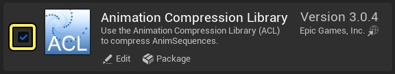
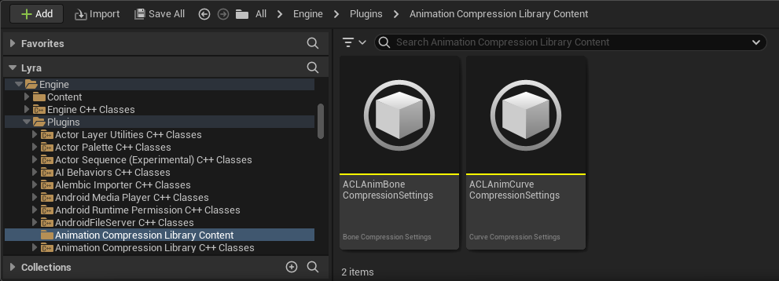
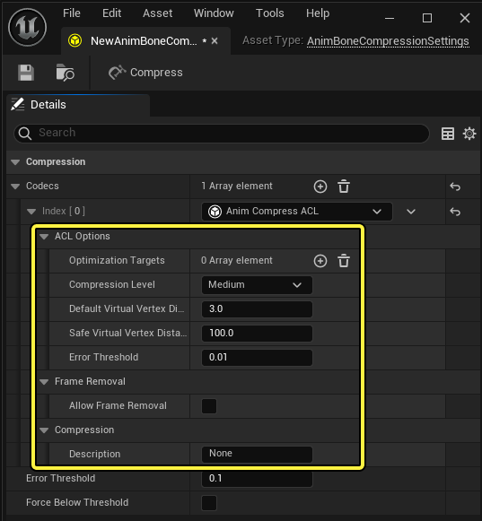
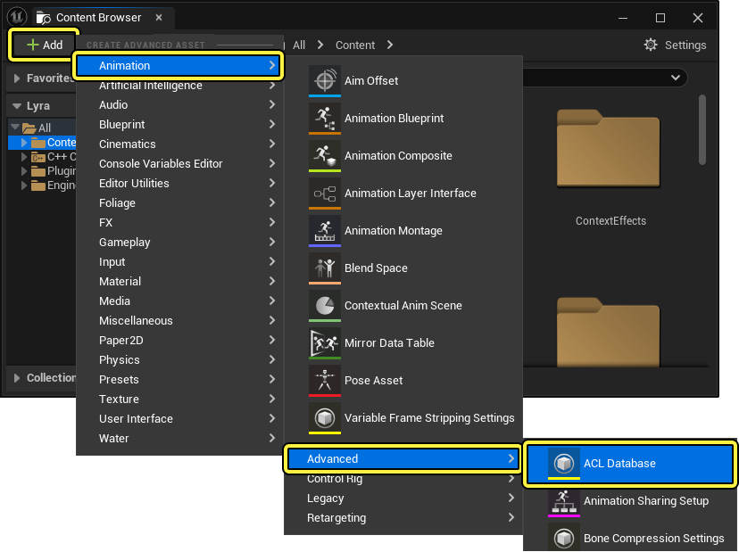
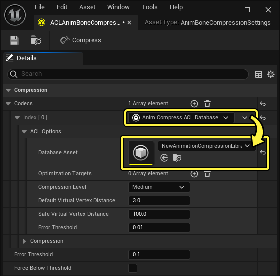
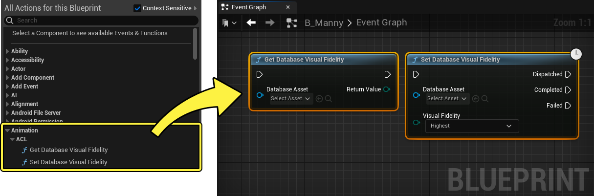
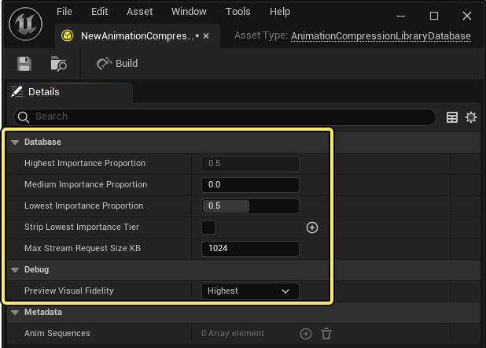
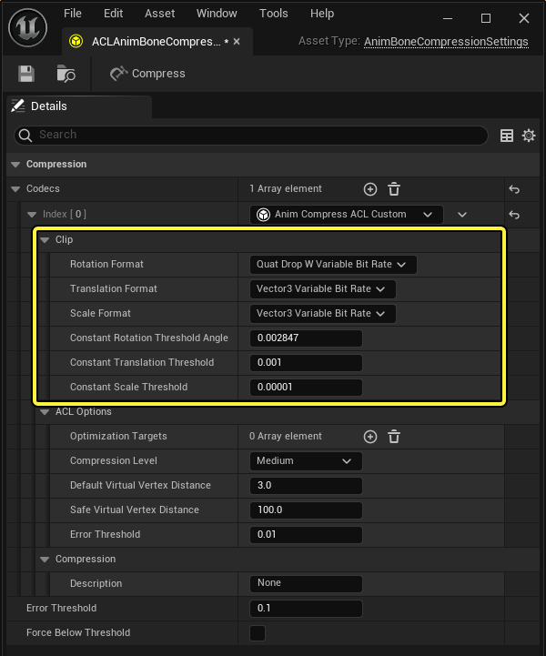

# 动画压缩库

> 路径：虚幻引擎5.7文档 / 为角色和对象制作动画 / 骨架网格体动画系统 / 动画调试和优化 / 动画压缩 / 动画压缩库

> 原始页面：https://dev.epicgames.com/documentation/unreal-engine/animation-compression-library-in-unreal-engine

**动画压缩库（Animation Compression Library）** （ **ACL** ）是一款插件，它采用更强大的可定制压缩编解码器，可用于进一步自定义动画压缩。

#### 先决条件

- 确保启用

  动画压缩库（Animation Compression Library）

  插件。在菜单栏中找到

  编辑（Edit）

  >

  插件（Plugins）

  ，然后找到列示于动画分段下的动画压缩库，你也可以使用搜索栏搜索。启用插件并重启编辑器。

## ACL设置

ACL插件预配置了骨骼和曲线压缩设置资产，可用于压缩任意项目的动画序列。可在以下位置访问压缩设置资产：`引擎（Engine）> 插件（Plugins）> 动画压缩库内容（Animation Compression Library Content）` 。

此外，你可以新建骨骼和曲线压缩设置资产，并设置 **编码解码器（Codec）** 属性，以使用 **动画压缩ACL（Anim Compress ACL）** 选项访问其功能

| 默认骨骼动画压缩库资产 | 默认曲线动画压缩库资产 |
| --- | --- |
| 骨骼压缩设置 | 曲线压缩设置 |

> [!TIP]
> 对于大多数项目，建议使用默认 **动画压缩ACL（Anim Compress ACL）** 编码解码器，它可为大多数用例生成最优的结果。

### 更改默认压缩设置

要更改打包期间使用的默认压缩设置资产，你需要编辑项目中 **Animation.DefaultObjectSettings** 分段下的 `BaseEngine.ini` 或等效文件。

相关条目为：`BoneCompressionSettings="/Engine/Animation/DefaultAnimBoneCompressionSettings` 。

此条目指向 **引擎内容（Engine Content）** 文件夹中包含的默认压缩设置资产。你可以修改条目来使用不同路径，从而将该资产更改为指向你所选的其他合适的资产，例如指向默认ACL压缩设置资产或自定义压缩设置资产的路径。

要将默认压缩设置资产设置为使用默认ACL压缩设置资产，请使用以下条目路径： `BoneCompressionSettings="/Plugins/AnimationCompressionLibraryContent/ACLAnimBoneCompressionSettings`

> [!NOTE]
> 要将条目设置为使用自定义资产，路径将指向该资产的存放位置。例如，文件的 `BoneCompressionSettings="/Game/Compression/MySettings` 位于以下文件路径：`.../MyProject/Content/Compression/MySettings.uasset` 。

## ACL骨骼压缩

动画压缩ACL编码解码器倾向于尽可能安全的压缩，因此不建议执行过多的设置调优。如果你需要更强大的压缩或希望探索更强大的压缩功能，可以选择使用 **动画压缩自定义ACL（Anim Compress Custom ACL）** 编码解码器，它提供更多高级选项和设置调优，旨在用于调试用途。

### ACL骨骼压缩引用

此处你可以查看ACL编码解码器的属性及其功能描述列表。所有单位都是虚幻单位（厘米）。

| 属性 | 说明 |
| --- | --- |
| **优化目标（Optimization Targets）** | 骨骼网格体，用于在压缩期间估算蒙皮变形。要添加资产，使用 ( **+** ) **添加（Add）** ，然后从下拉菜单中选择一个资产。该属性旨在确保在压缩期间保留最佳的视觉真实度。如果你可以为ACL编码解码器提供骨骼网格体引用，编码解码器无需近似于视觉网格体，从而改善压缩结果。但如果使用更具真实感的网格体，内存占用会略微增加。 |
| **压缩级别（Compression Level）** | 从五个可用压缩级别中选择要使用的级别。级别越高压缩越慢，但生成项占内存空间越小。务必测试你的压缩结果，找出项目的最佳结果。 压缩级别决定了ACL尝试优化内存占用的力度。级别越高，内存占用越小，但压缩时间越长；级别越低压缩越快，但内存占用越大。中间级别比较平衡，适合制片使用。 |
| **默认虚拟顶点距离（Default Virtual Vertex Distance）** | 为普通骨骼设置默认的虚拟顶点距离。 务必为默认虚拟顶点距离选择一个合适的值。默认值3cm通常适用于普通角色，但大型对象或较为奇特的角色可能需要微调。UE还支持需要更高精度的特殊骨骼。默认情况下，每个带有插槽的骨骼，以及包含UAnimationSettings::KeyEndEffectorsMatchNameArray中存在的子字符串之一的骨骼，都将被视为需要高精度。常见子字符串包括：手、眼睛、IK、摄像机等。对于那些特殊骨骼，则使用安全虚拟顶点距离代替。 |
| **安全虚拟顶点距离（Safe Virtual Vertex Distance）** | 需要更高精度的骨骼的虚拟顶点距离。 |
| **误差阈值（Error Threshold）** | 优化和压缩动画序列时使用的误差阈值。这个值越低，误差越小，越高误差会越大。 ACL优化算法将尝试积极地删除它所能删除的所有内容，直至误差超过指定的误差阈值。因此，阈值非常重要，设置时应该尽量保守。0.01cm的默认值适用于电影级品质，而且很可能不需要任何调优。误差阈值可与虚拟顶点距离一起使用，因为误差是在虚拟顶点上测量的。 |

## 动画压缩ACL数据库

动画压缩ACL数据库编码解码器将基于品质的流送向压缩设置资产公开，该资产可用于选择性地剥离动画中最不重要的关键帧，然后可以在运行时选择性地流进或流出，通过流送有效地控制品质。

### ACL数据库配置

要使用ACL数据库编码解码器，首先必须新建一个 **ACL数据库** 资产，使用内容浏览器中的 ( **+** ) **添加（Add）** 并前往 **动画（Animation）** -> **ACL数据库（ACL Database）** 。

创建资产之后，双击该资产即可展开其设置。如需更多信息，请参阅[ACL数据库设置](#acl%E6%95%B0%E6%8D%AE%E5%BA%93%E8%AE%BE%E7%BD%AE)分段。

一旦数据库资产配置成功，必须在动画压缩ACL数据库编码解码器的数据库资产（Database Asset）属性中引用它。

然后可以使用蓝图控制数据库资产，以动态设置ACL自定义编码解码器的 **压缩级别（Compression Level）** 。你可以右键点击图表并在上下文菜单中找到 **动画（Animation）** > **ACL** ，将ACL数据库节点添加到蓝图。

#### 获取数据库视觉真实度

你可以使用获取数据库视觉真实度(Get Database Visual Fidelity)节点读取已定义的ACL数据库资产的视觉真实度的当前设置。要定义数据库资产，可以使用 **Database Asset** 输入引脚连接引用变量，或者使用该节点的下拉菜单选择一个ACL数据库资产。读取视觉真实度作为一个枚举值从 **Return Value** 输出引脚返回

#### 设置数据库视觉真实度

你可以使用设置数据库视觉真实度(Set Database Visual Fidelity)节点通过蓝图来设置ACL数据库资产的视觉真实度。要定义数据库资产，可以使用 **Database Asset** 输入引脚连接引用变量，或者使用该节点的下拉菜单选择一个ACL数据库资产。要设置视觉真实度，使用 **Visual Fidelity** 输入引脚连接引用变量，或使用图表中该引脚上的下拉菜单来定义所需的级别。

### ACL数据库设置

ACL数据库资产用于自动引用编码解码器的所有动画序列资产。此处你可以引用ACL数据库资产设置列表及其功能说明：

| 设置 | 说明 |
| --- | --- |
| **最高重要性比例（Highest Importance Proportion）** | 始终加载在内存中的动画数据的百分比（最重要的关键帧）。这三个表示比例的数值加起来须为1.0。 |
| **中等重要性比例（Medium Importance Proportion）** | 移动到可流送中间层的动画数据的百分比。这三个表示比例的数值加起来须为1.0。 |
| **最低重要性比例（Lowest Importance Proportion）** | 移动到可流送最低层的动画数据的百分比。这三个表示比例的数值加起来须为1.0。 |
| **剥离最低重要性层（Strip Lowest Importance Tier）** | 是否完全剥离最低层（一旦剥离就不能流送）。 |
| **最大流送请求大小（KB）（Max Stream Request Size KB）** | 最大IO流送请求大小（读数小意味着性能较差，应该避免）。 |
| **预览视觉真实度（Preview Visual Fidelity）** | 在编辑器中用于预览的视觉真实度级别（仅编辑器，临时）。 预览视觉真实度字段旨在帮助在编辑器中预览数据以特定保真度流送时的动画质量。编辑器默认始终显示最高视觉真实度。 |

### ACL数据库编码解码器设置

此编码解码器与动画压缩ACL编码解码器一致，新增了引用ACL数据库资产的功能，可用于引用多个动画序列。多个ACL数据库编码解码器可以引用同一数据库资产。使用此编码解码器的动画序列最终会进入选定数据库，并可以在运行时流送数据，或者在烘焙过程中完全剥离数据。

ACL的帧剥离比UE的帧剥离功能强大得多。ACL能够控制要剥离的数据量，它将从数据库中的所有动画中选出最不重要的关键帧。这意味着如果某些序列重要性更高，可能会比其他序列保留更多关键帧，而这可能也意味着ACL帧剥离会大幅减小压缩产生的破坏性，同时可以跨许多序列进行全局优化。

> [!NOTE]
> 建议你在压缩动画时测试帧剥离结果。虽然ACL将剥离导致最小误差的关键帧，但与压缩整个动画集相比，处理单个序列时效果可能不会很好。虽然误差可能更低，但感知到的真实度损失可能比使用虚幻引擎默认帧剥离技术更高。虚幻引擎的帧剥离对应一个固定的帧率，以统一的方式移除关键帧。虽然此方法不会尝试保留更重要的关键帧，导致更高的误差，但感知到的真实度损失可能低于ACL解决方案。

在已烘焙的版本中，默认不流送数据。默认最低的视觉真实度级别。要增加该级别，必须流送数据。这是通过蓝图接口公开的。

### ACL蓝图流送

可以通过普通潜在蓝图节点查询和设置视觉真实度。通过设置所需的真实度级别，ACL计算出需要流入或流出的数据。如果流送期间接入了多个更改请求，这些请求将排入队列，要等排在前面的所有请求完成后才会执行更改请求。目前无法中断真实度更改请求。

要更改视觉真实度时，根据需要分配和释放内存以满足请求。数据从磁盘异步加载。

## 动画压缩自定义ACL

使用自定义ACL压缩编码解码器可以调整和控制ACL的各个方面。

> [!NOTE]
> 自定义ACL编解码器主要用于调试用途，因此不应在制片中使用。另请注意，能够支持所有可能的选项会带来一个后果，即由于编译器剥离的代码较少，解压缩通常会慢一些。

### 自定义ACL设置

此处你可以查看动画压缩自定义ACL编码解码器的属性及其功能描述列表。

| 属性 | 说明 |
| --- | --- |
| **旋转格式（Rotation Format）** | 选择要使用的旋转格式。ACL插件支持三种旋转格式：四元全比特率（Quat Full Bit Rate）、四元丢弃 **W** 全比特率（Quat Drop **W** Full Bit Rate）和四元丢弃 **W** 可变比特率（Quat Drop **W** Variable Bit Rate）。四元丢弃 **W** 可变比特率（Quat Drop **W** Variable Bit Rate）选项几乎始终是最佳选择，因此其被设置为默认值。四元全比特率（Quat Full Bit Rate）和四元丢弃 **W** 全比特率（Quat Drop **W** Full Bit Rate）选项可用作保险的备用方案和调试用途。可使用下拉菜单从下列选项中选择一个格式： **四元全比特率（Quat Full Bit Rate）** ：将数据压缩成32位浮点数，基本上保留了原始动画数据。 **四元丢弃W全比特率（Quat Drop W Full Bit Rate）** ：将数据压缩成 **X** 、 **Y** 和 **Z** 32 位浮点数，并丢弃 **四元数** ( **W** )。 **四元丢弃W可变比特率（Quat Drop W Variable Bit Rate）** ：使用可变比特率压缩数据，以存储 **X** 、 **Y** 和 **Z** 数据，丢弃 **四元数** ( **W** )。可变比特率是理想的选择，另一个选项用于调试用途。 |
| **平移格式（Translation Format）** | [ 选择要使用的平移格式。可使用下拉菜单从下列选项中选择一个格式： **Vector3全比特率（Vector3 Full Bit Rate）** ：使用Vector 3值的完整比特率的调试选项。 **Vector3可变比特率（Vector3 Variable Bit Rate）** ：可变比特率是理想的选择，其他选项用于调试用途。 |
| **缩放格式（Scale Format）** | 选择要使用的缩放格式。可使用下拉菜单从下列选项中选择一个格式： **Vector3全比特率（Vector3 Full Bit Rate）** ：使用Vector 3值的完整比特率的调试选项。 **Vector3可变比特率（Vector3 Variable Bit Rate）** ：可变比特率是理想的选择，其他选项用于调试用途。 |
| **等速旋转阈值角（Constant Rotation Threshold Angle）** ： | 设置用于检测等速旋转轨道的阈值。 |
| **等速平移阈值（Constant Translation Threshold）** ： | 设置用于检测等速平移轨道的阈值。 |
| **等速缩放阈值（Constant Scale Threshold）** ： | 设置用于检测等速缩放轨道的阈值。 |

## ACL曲线压缩引用

对于[动画修饰符](../../../animation-assets-and-features/animation-modifiers/index.md)和[变形目标](../../../animation-assets-and-features/morph-target-previewer/index.md)等项目，你可以使用ACL曲线压缩编码解码器来压缩动画曲线数据。如果你提供骨骼网格体作为压缩编码解码器的引用，则ACL曲线编码解码器在压缩变形目标时尤为有效。利用引用网格体，编码解码器可以计算并存储顶点位移精度值，而非泛型标量轨迹精度值，以压缩网格体变形曲线轨迹。此处你可以查看ACL曲线压缩编码解码器的属性及其功能描述列表。

> 图片已省略：自定义骨骼压缩资产动画压缩库设置

| 属性 | 说明 |
| --- | --- |
| **曲线精度（Curve Precision）** | 在源资产中没有与当前变形目标相关联的动画曲线时，压缩动画曲线时要定位的曲线精度。 |
| **变形目标位置精度（Morph Target Position Precision）** | 如果 **变形目标源（Morph Target Source）** 属性有定义，在压缩变形目标动画曲线时，将变形目标曲线的所需精度（以世界空间单位计）设置为目标。这保证了变形目标变形满足指定的精度值（默认值0.01cm）。 |
| **变形目标源（Morph Target Source）** | 设置一个骨骼网格体，用于提取要使用 **变形目标位置精度（Morph Target Position Precision）** 值压缩的变形目标曲线。如果一个动画曲线被映射到源资产中的某个变形目标，则 **变形目标位置精度（Morph Target Position Precision）** 属性的值将用于计算压缩精度。如果不存在动画曲线，则将使用 **曲线精度（Curve Precision）** 替代。 要添加骨骼网格体资产，使用下拉菜单并选择适用的资产。 |
