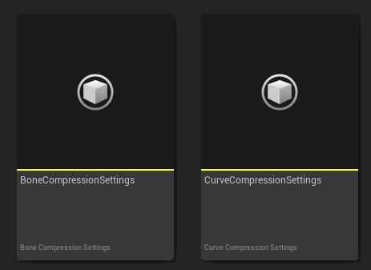
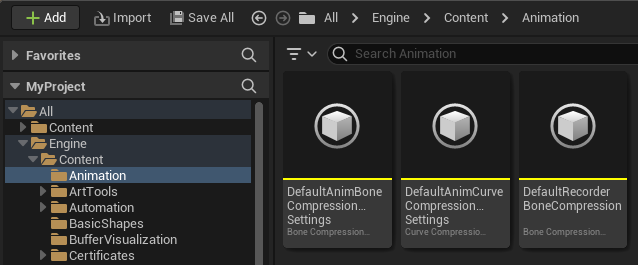
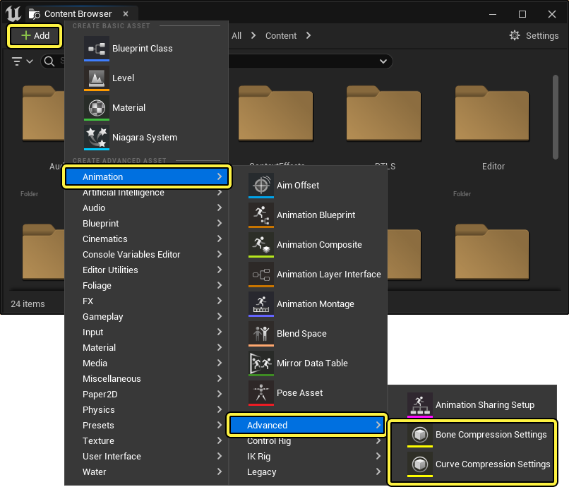
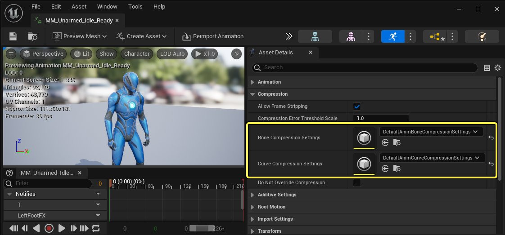
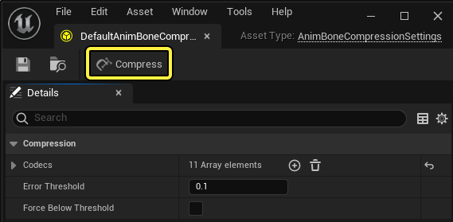
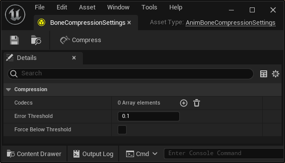
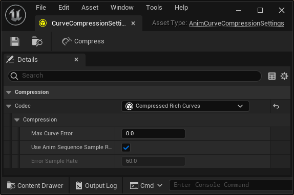

# 动画压缩

> 路径：虚幻引擎5.7文档 / 为角色和对象制作动画 / 骨架网格体动画系统 / 动画调试和优化 / 动画压缩

> 原始页面：https://dev.epicgames.com/documentation/unreal-engine/animation-compression-in-unreal-engine

在 **虚幻引擎** 中创建动画系统时，若要降低动画系统的整体文件尺寸和内存开销，你可以将动画序列资产中的动画数据进行压缩。压缩动画后，项目的整体性能会得到显著改善，在功率不同的多个硬件目标上扩展项目时，这种改善会尤其明显。

你可以使用此文档进一步了解虚幻引擎中的 **动画压缩** 。

## 概述

通常，动画的动作量极少时，动画压缩后获得的收益最大，其整体质量几乎不会受到影响，而动画具有大量动作时，质量下降较为明显。处理动画压缩时，务必要根据项目可以承受的质量损失级别来确定你要实施的压缩类型。

在虚幻引擎中，有两类数据资产可用于执行动画序列的压缩，分别是 **骨骼压缩设置（Bone Compression Settings）** 资产和 **曲线压缩设置（Curve Compression Settings）** 资产。使用这些资产时，你可以应用 **压缩编码解码器** ，它将测试不同的压缩方法，在质量损失和削减文件尺寸之间寻找最优平衡，并且只采用最佳结果。

虚幻引擎预装了一套通用的压缩设置资产，供你在项目的动画序列中使用。你可以在 **引擎（Engine）** > **内容（Content）** > **动画（Animation）** 文件夹中找到这些默认资产。

> [!NOTE]
> 你还可以选择创建自己的压缩资产，以进一步控制如何压缩动画。要创建动画压缩设置资产，请在 **内容浏览器（Content Browser）** 中点击 **+添加（+Add）** ，前往 **动画（Animation）** > **高级（Advanced）** ，选择 **骨骼压缩设置（Bone Compression Settings）** 资产或 **曲线压缩设置（Curve Compression Settings）** 资产。
>
> 

要在虚幻引擎中压缩动画，你可以使用[动画序列编辑器](../../animation-editors/animation-sequence-editor/index.md) **资产细节（Asset Details）** 面板中的 **压缩设置（Compression Settings）** 属性，将压缩设置资产分配给动画序列。

注册到动画序列的压缩设置资产被更改后，将自动应用新的压缩设置。如果自从上次压缩资产以来，压缩设置发生了变化，那么，当[衍生数据缓存](../../../../production-pipeline/using-derived-data-cache/index.md)（DDC）注意到新的压缩设置资产注册到了动画序列中时，或者在进行烘焙时，压缩也会在加载过程中自动应用。

更改压缩编码解码器的属性时，不会自动应用压缩，因为该资产可能被分配给了多个资产。要手动压缩注册到特定动画设置资产的所有资产，你可以使用压缩设置资产 **工具栏** 中的 **压缩（Compress）** 按钮。

> [!NOTE]
> 点击压缩按钮后，会出现一个对话框，提示你确认将被压缩的资产总数。

## 骨骼压缩

骨骼压缩用于减少动画序列资产中与骨架动作相关的数据量。骨骼压缩编码解码器旨在为特定骨骼优化动画数据（这些骨骼在关键帧之间未发生动作或只发生小幅度动作，插值等技术足以满足此类情况）。

在创建了骨骼压缩设置资产，并将其分配给动画序列后，你可以双击该骨骼压缩设置资产，访问其属性，你能够在其中选择和定制压缩动画骨骼运动数据的不同方法。

| 属性 | 说明 |
| --- | --- |
| **编码解码器（Codecs）** | 在这里，你可以定义要尝试的动画骨骼压缩编码解码器列表。要新增编码解码器数组，请点击 **编码解码器（Codecs）** 属性中的 **添加+（Add+）** 。添加一个编码解码器后，与你选择的编码解码器相关的其他属性将填入字段。 在动画序列中执行骨骼压缩时，列表中的空条目将被忽略。然而，要压缩骨骼数据，该列表必须包含至少一个编码解码器。 如需所有可用编码解码器的详细说明，以及它们附加属性的说明，请参阅[骨骼压缩编码解码器参考](animation-compression-c-e43d46f8/index.md#%E9%AA%A8%E9%AA%BC%E5%8E%8B%E7%BC%A9%E7%BC%96%E7%A0%81%E8%A7%A3%E7%A0%81%E5%99%A8%E5%8F%82%E8%80%83)文档。 |
| **误差阈值（Error Threshold）** | 压缩时，将使用低于该误差阈值的最佳编码解码器。默认值为 `1` 。 |
| **强制低于阈值（Force Below Threshold）** | 启用后，将使用具有较低误差的编码解码器（即使它可能增加动画序列的文件尺寸），直到误差低于阈值。 |

## 曲线压缩

曲线压缩用于压缩动画序列的曲线数据。曲线压缩编码解码器旨在使用各种方法优化数据，从而减少曲线数据（这些方法的目标值在关键帧之间几乎不会发生变化或完全不会发生变化，插值等技术足以满足此类情况）。

在创建了曲线压缩设置资产，并将其分配给动画序列后，你可以双击该曲线压缩设置资产，访问其属性，你能够在其中选择和定制压缩动画曲线数据的不同方法。

| 属性 | 说明 |
| --- | --- |
| **编码解码器（Codecs）** | 在这里，你可以定义一个曲线压缩编码解码器。要设置一个编码解码器数组，请使用下拉菜单选择一个编码解码器。添加一个编码解码器后，与你选择的编码解码器相关的其他属性将填入字段。 在动画序列中执行骨骼压缩时，列表中的空条目将被忽略。然而，要压缩曲线数据，该资产必须包含一个编码解码器。 如需所有可用编码解码器的详细说明，以及它们附加属性的说明，请参阅[曲线压缩编码解码器参考](animation-compression-c-e43d46f8/index.md#%E6%9B%B2%E7%BA%BF%E5%8E%8B%E7%BC%A9%E7%BC%96%E7%A0%81%E8%A7%A3%E7%A0%81%E5%99%A8%E5%8F%82%E8%80%83)文档。 |
| **最大曲线误差（Max Curve Error）** | 设置压缩 **富曲线** 时允许的最大误差阈值。该值默认为 `0` 。 |
| **使用动画序列采样率（Use Anim Sequence Sample Rate）** | 启用后，将使用 **误差采样率（Error Sample Rate）** 属性的值确定动画序列在压缩期间的采样率。 |
| **误差采样率（Error Sample Rate）** | 当启用 **使用动画序列采样率（Use Anim Sequence Sample Rate）** 属性后，动画序列将使用此属性的定义值作为测量曲线误差时使用的采样率。该值默认为 `60` 。 |

## 压缩编码解码器

如需虚幻引擎中骨骼压缩编码解码器和曲线压缩编码解码器的所有参考资料，请参阅[动画压缩编码解码器参考说明](animation-compression-c-e43d46f8/index.md)文档。

- [动画压缩编码解码器参考说明](animation-compression-c-e43d46f8/index.md)
