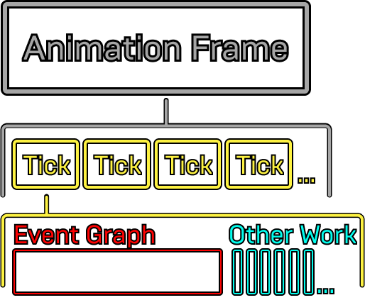
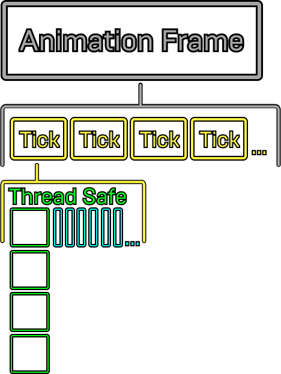
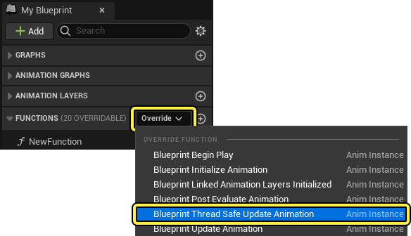
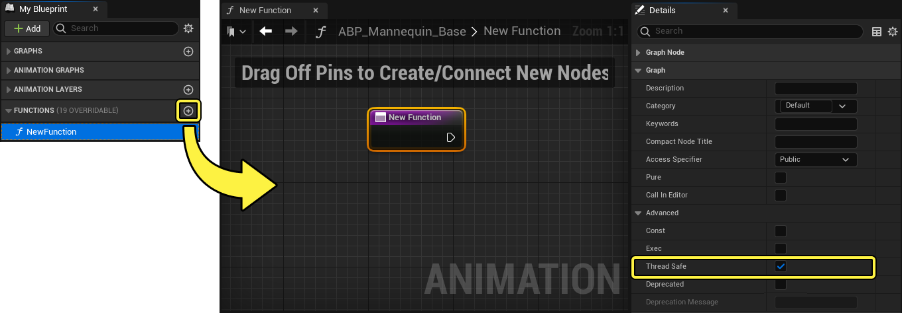
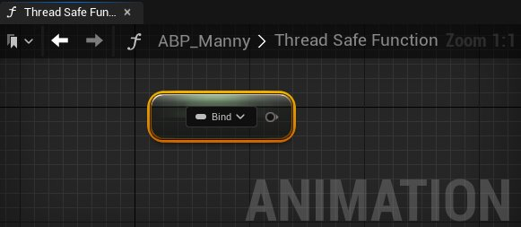
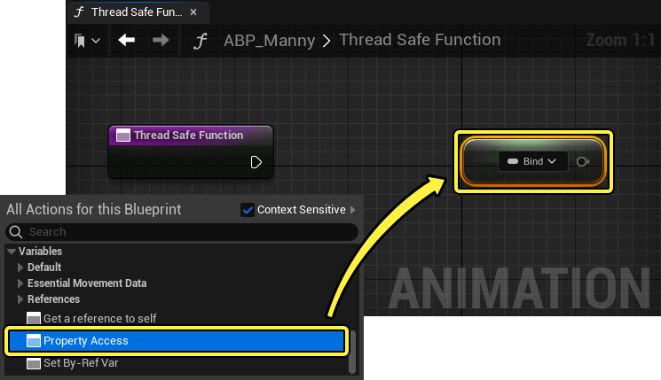
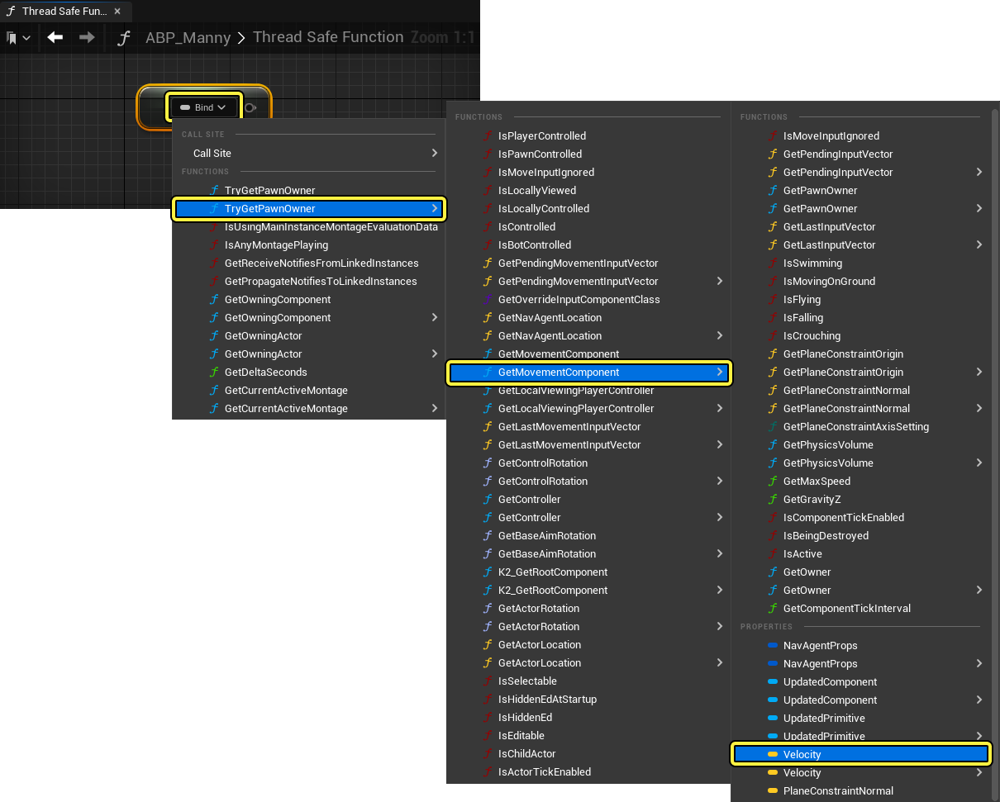
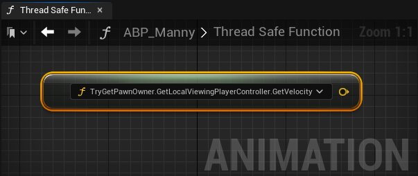

# 动画优化

> 路径：虚幻引擎5.7文档 / 为角色和对象制作动画 / 骨架网格体动画系统 / 动画调试和优化 / 动画优化

> 原始页面：https://dev.epicgames.com/documentation/unreal-engine/animation-optimization-in-unreal-engine

在 **虚幻引擎** 中使用[动画蓝图](../../animation-blueprints/index.md)开发动画系统时，你可以使用多种动画优化技术来提高项目的性能。

你可以阅读本文，详细了解在虚幻引擎中优化动画系统的一些最佳实践技术。

## 概述

项目的动画系统性能，即每帧的求值效率，取决于你的 **游戏线程（Game Thread）** 和 **工作线程（Worker Threads）** 每次 **更新（Tick）** 时处理动画系统所需的时间。

动画会被添加到动画蓝图，在运行时经过求值并在角色上播放。动画混合、IK求值、物理模拟等其他进程将分别占用项目的性能预算，以便求值。一些进程很简单，求值时不需要多少性能预算，另一些进程可能会执行更高级的运算，生成更美观的动画，但可能需要大量性能预算。所有动画系统功能都有对应的性能成本。

一般来说，在动画蓝图的性能成本中，最昂贵的运算是 **事件图表（Event Graph）** 逻辑。虽然可以使用[快速路径](#%E5%8A%A8%E7%94%BB%E5%BF%AB%E9%80%9F%E8%B7%AF%E5%BE%84)之类的系统优化 **AnimGraph** 逻辑，但为了实现最佳性能，建议你尽可能减少事件图表逻辑。事件图表会在每次更新时求值，每个进程在 **游戏线程（Game Thread）** 上按顺序发生。

下图是单个动画帧的概念分解。每个动画帧包含多次更新，每次更新时都会对事件图表求值。事件图表求值通常是每次更新时执行的最大运算。事件图表求值按顺序执行，这意味着每次更新的求值需要更长时间才能完成。

要优化此进程，你可以将事件图表逻辑迁移到 **线程安全函数（Thread Safe functions）** ，在可用的 **工作线程（Worker Threads）** 上同时求值。

下图展示了每次更新完成所需时间大幅减少。将所有事件图表运算迁移到线程安全函数时，运算可以同时执行，因而大幅减少了每次更新时求值所需时间，并提高了动画系统性能。

## 使用多线程动画更新

动画蓝图事件图表始终在 **游戏线程（Game Thread）** 上运行。为了优化事件图表中的逻辑，利用多线程处理，你可以改用 **线程安全函数（Thread Safe functions）** 构建逻辑。

> [!WARNING]
> 为了确保线程安全，对从项目中其他蓝图和组件派生的数据（例如变量）的所有引用，都必须由动画蓝图调用，而不是推送到动画蓝图中。

### 蓝图线程安全更新动画

你可以使用 **蓝图线程安全更新动画（Blueprint Thread Safe Update Animation）** 重载函数，以线程安全方式对动画蓝图中的逻辑求值。你可以将蓝图线程安全更新动画函数添加到“我的蓝图”面板中的动画蓝图，方法是在与 **函数（Function）** 分段相邻的 **重载（Override）** 下拉菜单中选择它。

### 线程安全函数

线程安全函数是[蓝图函数](../../../../blueprints-visual-scripting/specialized-blueprint-visual-scripting-node-groups/functions/index.md)，可用于执行逻辑以设置可以由动画系统使用的变量和属性，以及执行通常在事件图表中执行的其他运算。

要在动画蓝图中创建线程安全函数，请使用（ **+** ） **添加（Add）** 在 **我的蓝图（My Blueprint）** 面板中创建新函数。**创建新函数，然后打开其**细节（Details）**面板并启用**线程安全（Thread Safe）** 属性。

接着可以将启用了线程安全的函数添加到蓝图线程安全更新动画重载函数，从而在每次更新时，当工作线程变为可用时同时求值。

> 动图已省略：ImageAltText

### 属性访问

线程安全函数无法直接访问非线程安全蓝图和组件。为了安全地访问非线程安全蓝图及其属性，你可以使用 **属性访问（Property Access）** 功能读取其数据并调用其函数。属性访问（Property Access）可在线程安全函数的图表中或AnimGraph节点上的引脚属性中作为独立节点使用。

**Property Access节点 | 属性访问引脚**

要创建Property Access节点，请在线程安全函数的图表中右键点击，并选择快捷菜单中的 **Property Access** 选项。

你可以使用Property Access节点引用其他蓝图和游戏对象中与我们的动画蓝图相关的变量、组件和数据。要定义属性访问数据调用的源，请选择 **绑定（Bind）** 下拉菜单，然后选择你想引用的组件或属性。通过选择属性或组件，你可以直接引用对象或数据，你也可以在属性或组件的嵌套选项中浏览，以直接访问其组件或属性。

现在你可以使用绑定的属性访问引用，设置线程安全蓝图函数中的其他属性或变量了。

如需详细了解如何使用[线程安全函数](../../animation-blueprints/graphing-in-animation-blueprints/index.md#%E7%BA%BF%E7%A8%8B%E5%AE%89%E5%85%A8%E6%9B%B4%E6%96%B0%E5%8A%A8%E7%94%BB)和[属性访问数据](../../animation-blueprints/graphing-in-animation-blueprints/index.md#%E5%B1%9E%E6%80%A7%E8%AE%BF%E9%97%AE)，请参阅[在动画蓝图中使用图表功能](../../animation-blueprints/graphing-in-animation-blueprints/index.md)文档。

如需了解使用线程安全函数和Property Access节点来获取动画变量的工作流程示例，请参阅[如何获取动画变量](../../animation-workflow-guides-and-examples/how-to-get-animation-variables-in-animation-f9136b17/index.md)文档。

如需了解优化虚幻引擎项目以使用线程安全函数的工作流程示例，请参阅博文[调整Lyra的动画系统](https://www.unrealengine.com/zh-CN/tech-blog/adapting-lyra-animation-to-your-ue5-game)。

## 动画快速路径

**动画快速路径（Animation Fast Path）** 提供了优化 **AnimGraph** 更新中的变量访问的一种方式。这样引擎就可以在内部复制参数，而不是执行蓝图代码，后者需要调用 **蓝图虚拟机（Blueprint Virtual Machine）** 。编译器目前可以优化以下结构体：

- **成员变量（Member Variables）**
- **否定布尔成员变量（Negated Boolean Member Variables）**
- **嵌套结构的成员（Members of a Nested Structure）**

要利用动画快速路径，在动画蓝图的AnimGraph中，确保没有执行蓝图逻辑。

在以下示例蓝图中，AnimGraph正在读取多个浮点值，这些浮点值用于驱动多个 **混合空间（Blend Space）** 资产和一个 **Blend** 节点，生成 **输出姿势（Output Pose）** 。右上角以闪电图标表示的每个节点都在利用快速路径，因为没有执行逻辑。

> 图片已省略：ImageAltText

如果将任意形式的计算添加到图表中，关联的节点将不再使用快速路径。在以下示例中，一个简单的乘法函数被添加到浮点变量，导致Blend Space节点无法使用快速路径。编译图表之后，会删除闪电图标，表示这种变化。

> 图片已省略：ImageAltText

### 快速路径方法

下面是可用于在动画蓝图中实现快速路径变量访问的方法。

#### 直接访问成员变量

你可以直接访问和读取变量的值来确定输出姿势，从而使用快速路径。

> 图片已省略：ImageAltText

#### 访问嵌套结构体的成员

你可以分解嵌套结构体，例如旋转体变量，以直接访问其组件，同时仍使用快速路径。要分解结构体，你可以直接右键点击图表中的变量，并在快捷菜单中选择 **拆分结构体引脚（Split Struct Pin）** ，或使用 **Break** 节点。现在你可以直接访问其组件值。

> 图片已省略：ImageAltText

> [!NOTE]
> **Break Transform** 等一些 **Break Struct** 节点不会使用快速路径，因为这些节点在内部执行转换，而不是直接复制数据。

## 就蓝图使用发出警告

要确保你的动画蓝图在使用快速路径，你可以启用 **就蓝图使用发出警告（Warn About Blueprint Usage）** 属性。启用“就蓝图使用发出警告”后，从AnimGraph调用蓝图虚拟机时，编译器将向 **编译器结果（Compiler Results）** 面板发出警告。

要启用 **就蓝图使用发出警告（Warn About Blueprint Usage）** ，请在 **优化（Optimization）** 下你的 **动画蓝图（Animation Blueprint）** 的 **类设置（Class Settings）** 中启用该选项。

> 图片已省略：ImageAltText

在启用“就蓝图使用发出警告（Warn About Blueprint Usage）”属性后，在AnimGraph中执行蓝图逻辑时，如有可以使用快速路径访问的变量没有被通过快速路径访问， **编译器结果（Compiler Results）** 面板中将显示一条警告消息。你可以点击警告消息中的链接，在图表中明确指出警告的来源。这有助于跟踪需要进行的优化，并且能让你识别或许可以被优化的节点变量访问。

> 图片已省略：ImageAltText

## 动画优化工具

虚幻引擎提供了一套调试工具，可用于分析动画系统并找出优化机会。

### 倒回调试器

你可以使用倒回调试器录制 **在编辑器中运行** （ **PIE** ）模拟的片段，实时分析动画系统。使用 **Trace** ，你可以观察动画系统的属性的求值，定位可以优化的漏洞和性能问题。

> 动图已省略：ImageAltText

有关设置和使用倒回调试器的更多信息，请参阅以下文档：

- [Rewind调试器](../animation-rewind-debugger/index.md)

## 通用技巧

当你开始考虑项目的动画系统性能，你可以在优化过程中参照以下指南。每个项目都有独特的优化要求，根据项目的大小和规模，可能需要更激进的更改，不过，以下指南提供了能让大部分项目受益的通用方法。

- 确保满足并行更新的条件。

  - 在UAnimInstance::NeedsImmediateUpdate结构体中，你可以看到为避免在

    游戏线程

    上运行动画的更新阶段而必须满足的所有条件。如果角色移动需要

    根骨骼运动

    ，将无法执行并行更新，因为角色移动不是多线程的。
- 尽可能使用 **更新速率优化（Update Rate Optimizations）** (URO)。

  - URO将防止你的动画过于频繁地更新。它的应用方式取决于你的项目需要，但建议将大部分角色的更新速率目标设定在15Hz及以下、在合适距离运行，并禁用插值。
  - 要启用URO，请在骨骼网格体组件的 **细节（Details）** 面板中找到 **优化（Optimization）** 分段，并选择 **启用更新速率优化（Enable Update Rate Optimizations）** 属性。接着，你可以使用 `AnimUpdateRateTick()` 结构体设置并观察蓝图的更新速率。

> 图片已省略：ImageAltText

- 你还可以选择在骨骼网格体组件的细节面板中启用

  显示调试更新速率优化（Display Debug Update Rate Optimizations）

  属性，在模拟期间将应用于项目的URO速率的调试信息显示在屏幕上。

> 图片已省略：ImageAltText

> [!NOTE]
> 建议不要使用URO，而是使用[动画预算分配器插件](../animation-budget-allocator/index.md)来控制动画蓝图求值的更新速率。

- 当你的角色不需要访问其[物理资产](../../../../gameplay-systems/physics/physics-asset-editor/index.md)时，启用 **组件使用固定骨骼边界（Component Use Fixed Skel Bounds）** 。

  - 在骨骼网格体组件的

    细节（Details）

    面板中，启用

    组件使用固定骨骼边界（Component Use Fixed Skel Bounds）

    属性。

  > 图片已省略：ImageAltText

  - 这将跳过使用物理资产，而改为总是使用骨骼网格体中定义的固定边界。
  - 这还将跳过为每个帧重新计算用于剔除的包围体，从而提高性能。

### 其他注意事项

分析项目时，使用[Animation Insights](../animation-insights/index.md)，你可以看到，在工作线程完成其进程之后，在主线程上有为骨骼网格体运行的FParallelAnimationCompletionTask。满足并行更新的条件后，此进程将是你在分析中看到的大部分主线程工作。它通常包含几个事项，具体取决于你的设置：

- 计算项目的组件的移动，例如更新物理对象。

  - 对于实际没有此需求的事项，尽可能避免更新物理。这能够最大幅度缩减FParallelAnimationCompletionTask。
- 启动动画通知。

  - 所有通知都应该不基于蓝图，以避免调用蓝图虚拟机。
  - 通知应该在 **游戏线程** 上执行，因为通知可能影响动画对象的生命周期。
- 启用URO时的动画插值。
- 使用材质或变形目标曲线时的曲线混合。
