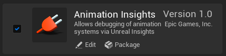
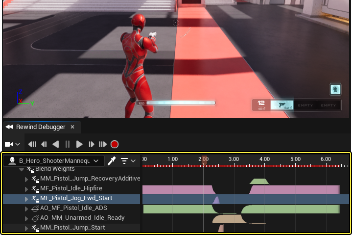
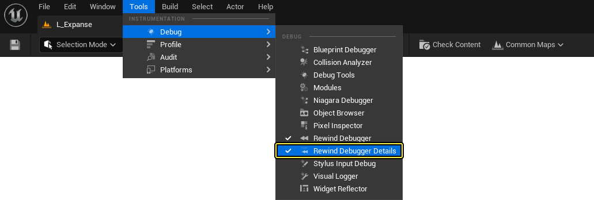
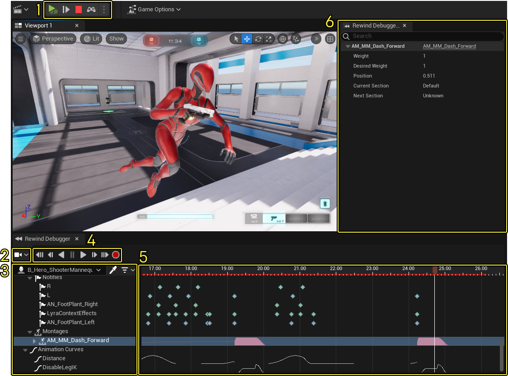
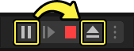
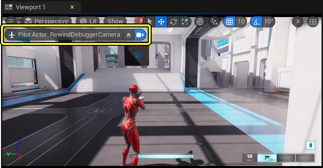
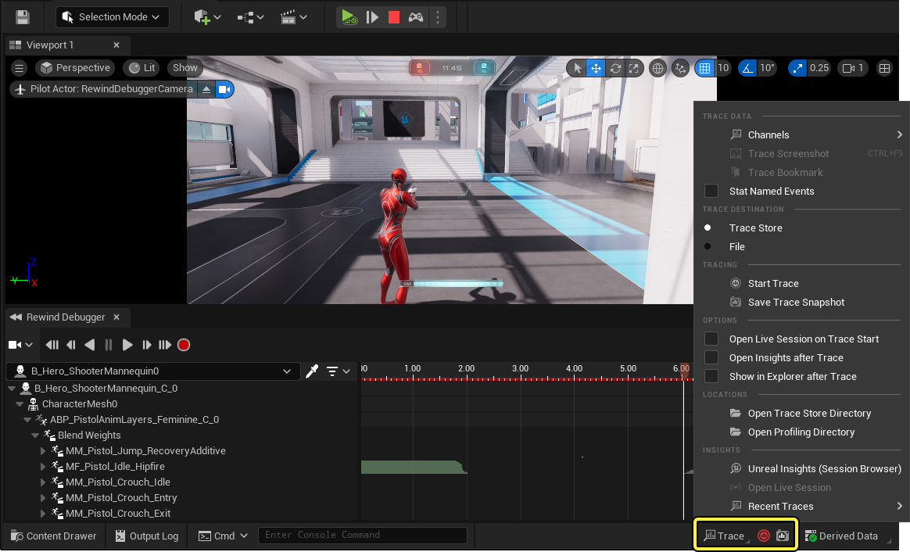

# Rewind调试器

> 路径：虚幻引擎5.7文档 / 为角色和对象制作动画 / 骨架网格体动画系统 / 动画调试和优化 / Rewind调试器

> 原始页面：https://dev.epicgames.com/documentation/unreal-engine/animation-rewind-debugger-in-unreal-engine

通过 **Rewind调试器（Rewind Debugger）** ，你可以在运行时期间录制项目的片段，并倒回模拟来观察有关动画行为和互动的信息。Rewind调试器以 [Animation Insights](../animation-insights/index.md) 为基础构建，提供了全新的视觉接口来调试 **虚幻引擎** 中的动画内容。

#### 先决条件

- 启用

  Animation Insights

  插件

  。在

  菜单栏

  中找到

  编辑（Edit）> 插件（Plugins）

  并找到

  动画（Animation）

  分段中的

  Animation Insights

  ，或使用

  搜索栏

  。启用插件并重启编辑器。



## 概述

在虚幻引擎中创建项目时，可能很难在运行时期间调试项目。通过Rewind调试器，你可以在运行时期间录制项目的片段，然后在录制内容中向后推移，在功能更齐备、更稳定的工作环境中调试动画内容。Rewind调试器提供了有关动画变量、阈值、触发器、通知等的信息。在录制的片段中推移时，会在Rewind调试器 **细节（Details）** 面板中填充带有上下文的信息。

> 动图已省略：demonstration of the rewind debugger

动画数据以视觉方式表示，在选择目标对象后，在 **Rewind调试器时间轴** 轨道上填充。Rewind调试器轨道可以包含关于[动画蓝图](../../animation-blueprints/index.md),[序列](../../animation-assets-and-features/animation-sequences/index.md) playback,[动画变量](../../animation-workflow-guides-and-examples/how-to-get-animation-variables-in-animation-f9136b17/index.md),[通知](../../animation-assets-and-features/animation-sequences/animation-notifies/index.md)甚至更多信息。



要打开Rewind调试器（Rewind Debugger）窗口，在 **菜单栏** 中找到 **工具（Tools）** > **调试（Debug）** > **Rewind调试器** 。



在从Rewind调试器时间轴中选择一个轨道后，你可以在 **Rewind调试器细节** 面板中查看更精确的动画数据。要打开Rewind调试器细节（Rewind Debugger Details）面板，在 **菜单栏** 中找到 **工具** > **调试** > **Rewind调试器细节**。


## Rewind调试器接口

Rewind调试器窗口填充了独特的接口，供你在导航录制的动画时使用。



| 功能 | 图像 | 说明 |
| --- | --- | --- |
| **1.项目模拟功能按钮（Project Simulation Controls）** | 项目模拟功能按钮播放暂停停止弹出 | 使用播放、暂停和停止等功能控制项目的模拟。如需了解更多信息，请参阅[虚幻编辑器接口](../../../../get-started/unreal-engine-for-new-users/unreal-editor-interface/index.md#main%20toolbar)文档。 |
| **2.Rewind调试器菜单（Rewind Debugger Menu）** | 包含可用数据选项卡的摄像机模式和视图选项的Rewind调试器菜单 | 让你控制摄像机行为并切换哪些选项卡可见。**摄像机模式（Camera Modes）** 如下所示： **禁用（Disabled）** 将禁用摄像机移动，使摄像机不绑缚游戏对象。 **跟随目标Actor（Follow Target Actor）** 会将摄像机锁定到预定位置中的所选对象。你可以将摄像机定位到关卡中的任意位置，并且摄像机将沿与所选对象相同的轨道移动。 该选项不会追踪所选对象，而是根据与角色相同的移动数据来移动摄像机。 **重播录制的摄像机（Replay Recorded Camera）** 将摄像机锁定到它在模拟中占用的位置，跟随相同的移动（如有）。 确保你在尝试更改摄像机控制模式之前，先弹出项目模拟功能按钮（Project Simulation Controls）中的播放器功能按钮。 |
| **3.对象大纲视图（Object Outliner）** | 高亮显示滴管工具的Rewind调试器对象大纲视图 | 录制之后，在此处选择主题以填充Rewind调试器的细节（Details）面板。你可以在视口窗口中手动选择主题，也可以使用 **滴管（Dropper）** 工具并在视口窗口中选择主题。 选择对象之后，对象大纲视图将列出所选对象以及所有子对象和组件，包括在运行时期间创建或销毁的子对象和组件，以及所有附加的控制器。 对象大纲包括以下工具，你可以用来协助选择要调试的游戏对象，以及筛选它们连接的组件。 **滴管工具（Dropper Tool）**: 你可以使用滴管工具在视口中手动选择一个游戏对象进行调试。 **过滤器菜单（Filter Menu）**: 你可以使用过滤菜单，过滤对象大纲的组件和选定游戏对象的子对象列表。 有些游戏对象是由多个组件组成的，例如[移动组件](https://dev.epicgames.com/documentation/404),[动画蓝图](../../animation-blueprints/index.md)等等。每一个这些组件都作为子对象列在对象大纲中，且在Rewind调试器时间轴中包含相关的轨道，必须单独选择才能在 **Rewind调试器细节** 面板中看到它们各自的数据。 |
| **4.播放功能按钮（Playback Controls）** | 高亮显示录制的Rewind调试器播放功能按钮播放暂停前进后退 | 让你控制项目模拟的录制片段的播放。你还会在这里发现录制按钮，用于在模拟项目时开始和停止录制过程。 |
| **5.倒回时间轴（Rewind Timeline）** | 高亮显示红色播放头的Rewind调试器时间轴 | 让你在项目模拟的录制片段中手动推移。 |
| **6.细节（Details）面板和[数据选项卡](#%E6%95%B0%E6%8D%AE%E9%80%89%E9%A1%B9%E5%8D%A1)** | 高亮显示数据选项卡和视图选项的Rewind调试器细节面板 | 细节（Details）面板根据所选主题和打开的数据选项卡显示所有可用数据。显示的信息可能包括变量值、布尔值状态，等等。 根据你在对象大纲视图中选择的主题，系统会在Rewind调试器细节面板顶部自动填充不同的选项卡。 要打开Rewind调试器细节面板，在 **菜单栏** 中找到 **工具** > **调试** > **Rewind调试器细节**。 |

## 使用Rewind调试器

1. 要使用Rewind调试器，首先点击项目模拟功能按钮（Project Simulation Controls）中的 **绿色播放按钮** ，启动游戏模拟。
2. 然后点击Rewind调试器播放功能按钮中的

   录制

   以开始录制项目模拟。

   > [!NOTE]
   > 要将光标从模拟断开连接而不停止或暂停模拟，请使用热键 **Shift + F1** 。
3. 当你录制了足够数量的项目模拟时，使用项目模拟功能按钮（Project Simulation Controls）暂停模拟并弹出摄像机。

   
4. 再次点击

   录制

   以停止录制。

录制的游戏部分现在可以准备使用。你可以通过从**对象大纲** 中选择一个游戏对象，或在视口中使用 **滴管** 工具选择你的游戏对象，然后开始调试游戏对象。

在选择了一个游戏对象后，**Rewind调试器时间轴** 会在上下文中填充与游戏对象的组件和子对象有关的动画数据轨道。你可以用播放头或播放控制拖动Rewind调试器时间轴来查看录制的动画数据如何更新视口中的游戏对象。

> [!NOTE]
> 要快速读取时间轴中的动画数据值，可以将鼠标悬停在时间轴轨道上，查看录制片段的时间位置上读取的动画轨道当前值。
>
> > 动图已省略：hover your cursor over animation data tracks for a quick readout of animation data values

在Rewind调试器（Rewind Debugger）菜单中，你还可以选择不同的摄像机模式以在调试时获取不同的主题视图。例如，通过 **禁用（Disabled）** 选项，你可以分离摄像机并随意放置它，从任意角度观察你的动画主题来辅助工作流程。

> 动图已省略：playback scrubbing from a different camera angle

在Rewind调试器的对象大纲视图中选择对象后，Rewind调试器的细节（Details）面板将使用与该对象和录制中的当前时刻相关的选项卡和信息填充上下文。你可以使用播放头或播放功能按钮在Rewind调试器时间轴中推移，查看信息如何随着实时录制的模拟及其行为而动态更新和变化。



在对你的游戏对象或动画系统进行编辑后，你可以使用项目模拟功能按钮中的控制器图标重新连接游戏控制器，然后恢复游戏，继续进行调试。当游戏模拟重新开始时，除非手动停止，Rewind调试器仍会继续录制游戏过程。

### 追踪文件

当用Rewind调试器录制游戏片段时，[追踪文件](../../../../testing-and-optimizing-content/unreal-insights/trace/index.md)将同时被录制并存储在你的本地机器中。您可以访问属性和设置来管理您的追踪文件，比如暂停追踪文件录制，开始新的追踪文件录制，以及在Unreal Insights中打开最近的追踪文件录制。



> [!WARNING]
> 追踪文件将被录制并永久储存，所以管理你的追踪文件，偶尔删除旧文件十分重要。你可以通过选择底栏中的追踪图标，并选择到打开追踪存储目录 **Open Trace Store Directory** 来访问你保存追踪文件的位置进行管理。
>
> > 图片已省略：open trace file directory
>
> 你也可以按照文件路径轨迹来访问追踪文件：
>
> ```
> "Drive":\Users\"User Name"\AppData\Local\UnrealEngine\Common\UnrealTrace\Store\001
> ```

## 动画蓝图

获取录制的项目模拟片段之后，你可以在对象大纲视图中 **双击** 动画蓝图组件，在新建窗口中打开并连接[动画蓝图编辑器](../../animation-blueprints/animation-blueprint-editor/index.md)。在拖动录制片段时，动画蓝图编辑器显示所选动画蓝图的录制状态，与游戏对象的录制时刻相对应。

> 动图已省略：attached animation blueprint demo simultaneous debugging

有了这个功能，你可以观察动画蓝图是如何在录制的游戏片段的任意时刻生成输出姿势(Output pose)的。你可以观察[动画蓝图节点](../../animation-blueprints/animation-blueprint-nodes/index.md)，[变量](../../animation-workflow-guides-and-examples/how-to-get-animation-variables-in-animation-f9136b17/index.md)，[状态机](../../animation-blueprints/state-machines/index.md)的位置等等。

### 姿势查看

在动画蓝图中，你可以在 **动画蓝图节点** 上启用[姿势查看（Pose Watch）](../../animation-shortcuts-and-tips/index.md#posewatch)来查看每个节点在录制游戏过程中对 **输出动画姿势** 的影响。这对于了解在游戏录制过程中每个节点对于对象的动画有什么影响非常有用。

> 动图已省略：use pose watch animation blueprint nodes with rewind debugger

> [!NOTE]
> [动画蓝图节点](../../animation-blueprints/animation-blueprint-nodes/index.md)必须[启用姿势查看](../../animation-shortcuts-and-tips/index.md#posewatch),然后Rewind调试器才能录制游戏过程。然后可以在使用录制的游戏片段时切换姿势查看。

## 倒回调试设置

你可以访问在虚幻引擎的[项目设置](../../../../understanding-the-basics/foundational-knowledge-in/unreal-editor-preferences/index.md)，参考 **Rewind调试器设置**。通过点击菜单中的 **编辑 >项目设置** ，打开项目设置。Rewind调试器设置部分位列在 **插件** 类别下。

> 图片已省略：rewind debugger settings in unreal engine project settings under plugins

| 设置 | 说明 |
| --- | --- |
| **摄像机模式（Camera Mode）** |  |
| **在PIE中自动录制** (**在编辑器中播放**) | 当 **启用** 时，只要Rewind调试器已启动，游戏模拟开始时Rewind调试器将自动录制游戏过程。当 **禁用** 时，游戏录制将需要手动启动。 |
| **显示空的Object轨道** | 当 ***启用** 时，空的动画数据轨道在Rewind调试器时间轴中仍然可见。当 **禁用** 时，所有空的轨道都会被隐藏。 |

## 拓展

Rewind调试器的用途超出了与Animation Insights插件打包的版本。团队可以建立并在Rewind调试器中添加自定义的轨道，以显示其项目的特定组件或游戏元素。

在 **姿势搜索插件（Pose Search plugin）** 中可以看到一个例子，说明如何修改Rewind调试器，使其适配项目的具体需要，该插件具有独特的调试工具，专门用于处理姿势搜索动画。

> 图片已省略：pose search plug in experimental

安装了这两个插件后，当选定的角色使用姿势搜索节点时，会在Rewind调试器中添加一个自定义的姿势搜索轨道，其中包含用于协助调试的姿势搜索动画扩展数据。

> 图片已省略：custom pose search node data tracks in the rewind debugger timeline

> [!NOTE]
> 你可以尝试使用姿势搜索（Pose Searching）功能，但它目前是实验性的，我们不建议用它来发行项目。
