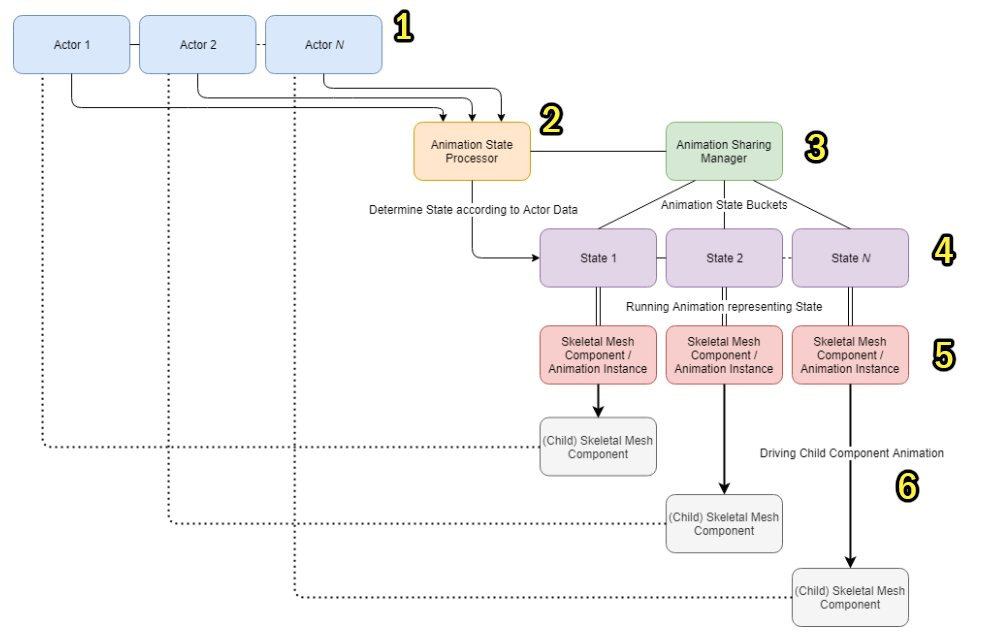
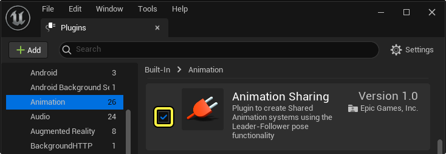
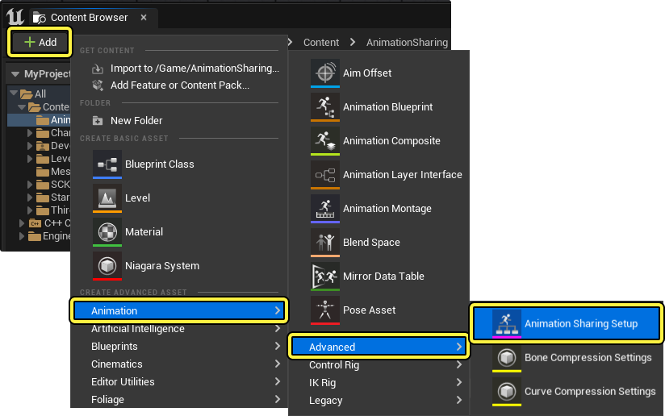
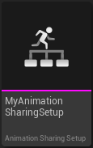
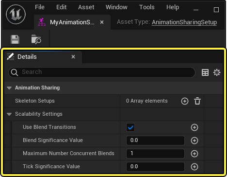
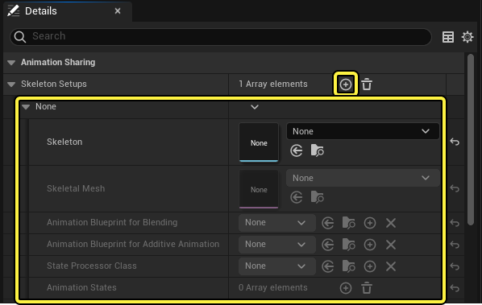
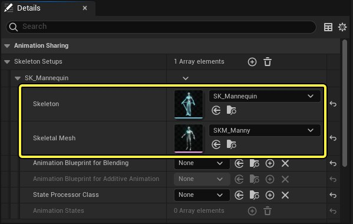
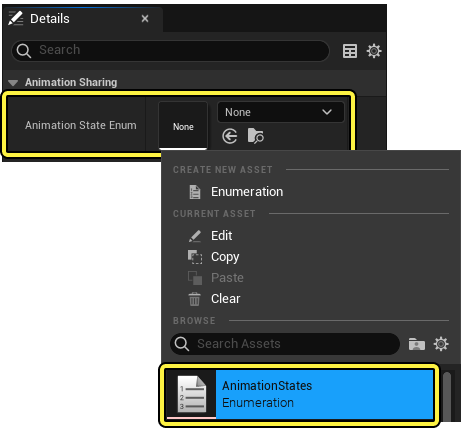

# 动画共享插件

> 路径：虚幻引擎5.7文档 / 为角色和对象制作动画 / 骨架网格体动画系统 / 动画调试和优化 / 动画共享插件

> 原始页面：https://dev.epicgames.com/documentation/unreal-engine/animation-sharing-plugin-in-unreal-engine

在为大量角色创建动画系统时，可以使用 **动画共享插件（Animation Sharing Plugin）** 来显著降低项目的性能成本。 你无需对关卡中的每个角色逐一进行[动画蓝图](../../animation-blueprints/index.md)的评估，而是可以在多个角色之间共享单次评估的多段动画，因此在这样一个系统中，100个角色和1000个角色之间的差异产生的性能成本增幅极小。

借助[领导者姿势组件（Leader Pose Component）](../../animation-workflow-guides-and-examples/working-with-modular-characters/index.md)系统，动画共享插件利用一组动画状态桶，为其评估动画实例。 然后，生成的姿势被转移到所有构成这个桶的子组件。 然后，可以采用混合和播放位置随机化技术为群集角色提供更多样化的动画播放。

> 动图已省略：ImageAltText

下面提供了系统工作原理的简单分解图，其中使用编号标注说明了所包含的组件：

1. 单独群集Actor（AActor）
2. 作为动画共享设置一部分的 `UAnimationStateProcessor` 实例
3. 使用动画共享设置进行初始化的运行时管理器
4. 用户设置的状态（命名的枚举）
5. 以骨骼网格体组件形式出现的状态的运行时表示
6. 用于与子骨骼网格体组件共享动画的主姿势组件系统

#### 先决条件

- 启用

  动画共享

  插件

  。 在

  菜单栏

  中导航到

  编辑（Edit）

  >

  插件（Plugins）

  ，然后在

  动画（Animation）

  分段下找到列出的"动画共享（Animation Sharing）"插件，或者也可以使用

  搜索栏

  搜索该插件。

  启用（Enable）

  该插件并重新启动编辑器。

- 一个群集骨骼网格体角色。
- 一组要在角色上播放的动画。

## 设置动画共享

安装动画共享插件后，创建 **动画共享设置（Animation Sharing Setup）** 资产。 要创建新资产，请使用 **内容浏览器（Content Browser）** 中的 **（+）添加** **（(+) Add）**，然后导航到 **动画（Animation）** > **高级（Advanced）** > **动画共享设置（Animation Sharing Setup）**。

动画共享设置资产包含将在指定Actor之间共享的所有信息。

打开动画共享设置资产以在"细节（Detail）"面板中访问其属性。

### 骨架设置

使用动画共享设置资产的 **骨骼设置（Skeletal Setups）** 属性，可以指定多个骨架及其相应的属性来定义将要共享动画系统的网格体。 当有多个骨架和骨骼网格体将在动画共享期间由动画驱动时，这是非常有用的。 使用"骨架设置（Skeleton Setups）"属性的 **（+）添加** **（(+) Add）** 可以添加一个数组。

"骨架设置（Skeleton Setups）"数组添加到资产后可以访问的可用属性列表及相关功能描述如下：

| 属性 | 描述 |
| --- | --- |
| **骨架（Skeleton）** | 要复制的骨架资产。 动画共享设置特定于指定骨架。 |
| **骨骼网格体（Skeletal Mesh）** | 要复制的骨骼网格体。 这仅用于调试姿势。 |
| **用于混合的动画蓝图（Animation Blueprint for Blending）** | 作为AnimSharingTransitionInstance子项的动画蓝图。 必须创建并设置其中之一来处理状态之间的混合。 此外，每次需要混合时，都会生成一个并运行以处理增加成本的过渡。 |
| **用于叠加动画的动画蓝图（Animation Blueprint for Additive Animation）** | 作为AnimSharingAdditiveInstance子项的动画蓝图，用于叠加动画。 在动画共享设置资产中，还需要将"动画状态（Animation State）"设置为"按需（On Demand）"，并启用"叠加（Additive）"选项。 |
| **状态处理器类（State Processor Class）** | 确定Actor所处状态时使用的接口类。需要设置此属性才能添加动画状态。 |
| **动画状态（Animation States）** | 这是一个数组，包含Actor可以处于的所有状态。每个状态都有自己的桶。 |

使用相应的 **骨架（Skeleton）** 和 **骨骼网格体（Skeletal Mesh）** 属性可以定义要共享动画的骨架和骨骼网格体资产。

### 动画状态枚举

为了选择群集角色的姿势，你需要创建一个 **枚举资产（Enumeration Asset）** 以便在动画共享设置资产中选择动画状态。 要创建枚举资产，请在 **内容浏览器（Content Browser）** 中导航到 **（+）添加** **（(+) Add）**，然后选择 **蓝图（Blueprints）** > **枚举（Enumeration）**。

指定枚举资产的 **名称（Name）** 并 **打开（Open）** 该资产。

> 图片已省略：ImageAltText

然后，使用 **（+）添加枚举器** **（(+) Add Enumerator）** 按钮并在 **显示名称（Display Name）** 属性中键入定义，为每个群集动画状态指定枚举。 此工作流程中为 `Idle` 和 `Run` 动画创建了两个枚举。

> 图片已省略：ImageAltText

### 动画共享角色蓝图

创建一个代表群集角色的角色蓝图。 在内容浏览器中导航到 **（+）添加** **（(+) Add）** 并选择 **蓝图类（Blueprint Class）** > **角色（Character）**。

> 图片已省略：ImageAltText

指定群集角色蓝图的 **名称（Name）** 并 **打开（Open）** 该蓝图。

> 图片已省略：ImageAltText

使用 **骨骼网格体资产（Skeletal Mesh Asset）** 属性的下拉菜单指定角色的网格体。

> 图片已省略：ImageAltText

在角色蓝图的 **事件图表（Event Graph）** 中，可以构建基于变量或Gameplay状态设置枚举资产状态的逻辑。 此工作流程示例中使用了按键函数 **键盘事件5（Keyboard Event 5）** 更改枚举状态。

> 图片已省略：ImageAltText

然后，在 **事件开始运行（Event Begin Play）** 节点的逻辑中，创建一个 **获取动画共享管理器（Get Animation Sharing Manager）** 节点。 接下来，创建一个 **注册Actor（Register Actor）** 节点，并将共享管理器的 **返回值（Return Value）** 引脚连接到"注册Actor（Register Actor）"节点的 **目标（Target）** 引脚。 创建一个 **自（Self）** 引用变量并将其连接到 **输入Actor（In Actor）** 引脚。 最后，将角色的骨架设置为 **共享骨架（Sharing Skeleton）**。

> 图片已省略：ImageAltText

### 动画共享状态处理器

`AnimationSharingStateProcessor` 类是一个专用的蓝图类，可用于设置动画共享设置资产的动画状态，以便控制应使用 **枚举（Enumeration）** 资产播放的动画。

要创建新的 `AnimationSharingStateProcessor` 蓝图，请在 **内容浏览器（Content Browser）** 中导航，使用 **（+）添加** **（(+) Add）**，并选择 **蓝图类（Blueprint Class）**。

> 图片已省略：ImageAltText

使用 **搜索栏** 找到并选择 `AnimationSharingStateProcessor` 类，然后点击 **选择（Select）** 按钮。

> 图片已省略：ImageAltText

指定该蓝图的 **名称（Name）** 并在[蓝图编辑器（Blueprint Editor）](../../../../blueprints-visual-scripting/user-interface-reference-for-the-blueprints-vis-53faed96/index.md)中打开该蓝图。

> 图片已省略：ImageAltText

> [!NOTE]
> 动画共享状态处理器蓝图应仅用于原型设计。 与蓝图实现相反，使用原生实现将大大提高运行时性能。

在蓝图的 **类默认值（Class Defaults）** 面板中，选择 **动画状态枚举（Animation State Enum）** 下拉菜单，然后选择你的 **枚举（Enumeration）** 资产。

> 图片已省略：ImageAltText

添加枚举资产后，可以使用动画共享状态处理器蓝图的两个 **覆盖函数（Override Functions）** 在一群角色之间引用和驱动动画选择。

> 图片已省略：ImageAltText

- 可以使用

  处理Actor状态（Process Actor State）

  函数来引用共享动画角色的蓝图以及引用枚举资产状态。

> 图片已省略：ImageAltText

- 使用

  获取动画状态枚举（Get Animation State Enum）

  可与动画共享状态处理器的原生实现进行交互，以便返回枚举类。

创建动画共享状态处理器蓝图后，可以在动画共享设置资产的 **状态处理器类（State Processor Class）** 属性中指定该蓝图。

> 图片已省略：ImageAltText

### 动画状态

将动画共享状态处理器蓝图指定给动画共享设置资产后，可以使用 **动画状态（Animation States）** 属性中的 **（+）添加** **（(+) Add）**，然后从 **状态（State）** 属性下拉菜单中选择枚举值来创建动画状态数组。

> 图片已省略：ImageAltText

对于每个动画状态数组，使用 **（+）添加** **（(+) Add）** 添加一个 **动画设置（Animation Setups）** 数组，以便定义要播放的动画序列。

> 图片已省略：ImageAltText

"动画状态（Animation State）"数组属性列表及相关功能描述如下：

| 属性 | 描述 |
| --- | --- |
| **状态（State）** | 使用下拉菜单定义哪个枚举状态将激活动画状态数组。 可用选项是基于指定 **动画状态处理器（Animation State Processor）** 的 **动画状态枚举（Animation State Enum）** 属性继承的值。 |
| **动画设置（Animation Setups）** | 在此处可设置"动画状态（Animation States）"属性，例如要播放的动画序列以及应用的随机化技术。 对于添加到 **动画状态（Animation States）** 属性的每个 **动画设置（Animation Setups）** 数组，具有以下可用属性： **动画序列（Anim Sequence）**：设置激活此动画状态时播放的 **动画序列（Animation Sequence）**。 **动画蓝图（Anim Blueprint）**：设置动画共享[动画蓝图](#%E5%8A%A8%E7%94%BB%E8%93%9D%E5%9B%BE%E8%AE%BE%E7%BD%AE)以便在激活此动画状态时播放 **动画序列（Animation Sequence）**。 **随机实例数量（Num Randomized Instances）**：设置在激活此动画状态时要生成的随机动画播放实例数。 随机实例将生成唯一的 **起始时间偏移**，以使群集的外观多样化。 使用 **（+）添加** **（(+) Add）** 可以基于每个平台设置此属性。 **已启用（Enabled）**：启用后，此动画状态将可激活。 使用 **（+）添加** **（(+) Add）** 可以基于每个平台设置此属性。 |
| **按需（On Demand）** | 启用后，此状态 **按需** 分类，这意味着可以在需要时启动唯一的动画。 这将为每个按需动画生成一个唯一的实例。 当达到最大值时，它会对齐到最近的动画。 |
| **叠加（Additive）** | 启用后，此状态为 **叠加** 动画状态。 还必须启用 **按需（On-demand）**，并且需要[叠加动画蓝图（Additive Animation Blueprint）](#%E5%8A%A8%E7%94%BB%E5%85%B1%E4%BA%AB%E5%8F%A0%E5%8A%A0%E5%AE%9E%E4%BE%8B)来处理混合。 |
| **混合时间（Blend Time）** | 在此处可设置混合到状态时的混合时长。 |
| **并发实例的最大数量（Maximum Number Of Concurrent Instances）** | 将为状态创建的实例数（特定于平台）。 |
| **需要曲线（Requires Curves）** | 启用后，此动画状态需要曲线或变形目标才能正确用于跟随者组件。 |

### 可扩展性设置

使用动画共享设置资产 **可扩展性设置（Scalability Setting）** 分段的属性可以定义如何在大量Actor中进行动画共享。

> 图片已省略：ImageAltText

**可扩展性设置（Scalability Settings）** 属性列表及相关功能描述如下：

| 属性 | 描述 |
| --- | --- |
| **使用混合过渡（Use Blend Transitions）** | 启用后，动画将执行混合以从一种状态过渡到另一种状态。 |
| **混合显著性值（Blend Significance Value）** | 在此处可设置与过渡是否应该混合有关的显著性值。 值为0表示不会考虑显著性，值为1表示会首先考虑显著性。 |
| **并发混合的最大数量（Maximum Number Concurrent Blends）** | 在此处可设置可以同时运行的混合数。 每一个超过这个限制的动画都会对齐到最近的动画。 |
| **更新显著性值（Tick Significance Value）** | 在此处可设置一个将用于[显著性管理器（Significance Manager）](../../../../testing-and-optimizing-content/significance-manager/index.md)的值。 超过指定值的任何值都不会更新。 |

### 动画蓝图设置

你需要设置一个动画蓝图，通过引用当前激活姿势 `从组件（From Component）` 和馈送到动画共享系统的姿势 `到组件（To Component）` 来处理动画状态之间的混合。 这需要一个名为 **动画共享过渡实例（Anim Sharing Transition Instance）** 的特殊动画蓝图类。 要创建动画蓝图，请在 **内容浏览器（Content Browser）** 中导航，选择 **动画（Animation）** > **动画蓝图（Animation Blueprint）**。

> 图片已省略：ImageAltText

选择角色的骨架，将 `AnimSharingTransitionInstance` 定义为动画蓝图的类，然后选择 **创建（Create）**。

> 图片已省略：ImageAltText

指定资产的 **名称（Name）** 并打开该资产。

> 图片已省略：ImageAltText

在共享过渡动画蓝图的AnimGraph中，右键单击并搜索 **从组件（From Component）** 过渡变量。 然后，创建该变量的输出并将此输出连接到 **从网格体复制姿势（Copy Pose From Mesh）** 节点。 创建"从网格体复制姿势（Copy Pose From Mesh）"节点的输出，并将此输出连接到 **按布尔值混合姿势（Blend Poses by bool）** 节点的 **True姿势（True Pose）** 输入引脚。

> 图片已省略：ImageAltText

右键单击图表并搜索 **到组件（To Component）** 过渡变量。 然后，创建该变量的输出并将此输出连接到 **从网格体复制姿势（Copy Pose From Mesh）** 节点。 将"从网格体复制姿势（Copy Pose From Mesh）"节点的输出连接到 **按布尔值混合姿势（Blend Poses by bool）** 节点的 **False姿势（False Pose）** 输入引脚。

> 图片已省略：ImageAltText

在图表中单击鼠标右键，搜索 **混合布尔值（Blend Bool）** 过渡变量，并将此变量连接到"按布尔值混合姿势（Blend Poses by Bool）"节点的"激活值（Active Value）"输入引脚。 然后，在图表中单击鼠标右键以搜索并创建 **混合时间（Blend Time）** 变量以便引用动画共享设置资产中的 **混合时间（Blend Time）** 属性，并将此变量连接到 **True** 和 **False混合时间（False Blend Time）** 引脚。 然后，将"按布尔值混合姿势（Blend Poses by Bool）"节点的输出连接到 **输出姿势（Output Pose）** 节点。

> 图片已省略：ImageAltText

现在，将共享过渡状态动画蓝图添加到动画共享设置资产。

> 图片已省略：ImageAltText

现在，你可以在多个角色之间共享动画时过渡动画播放。

#### 动画共享叠加实例

当使用叠加动画时，你需要设置动画蓝图来处理共享的叠加动画。 这需要一个名为 `AnimSharingAdditiveInstance` 类的特殊动画蓝图类。

> [!NOTE]
> 为了将动画标记为叠加动画，你需要针对每个叠加动画的动画状态数组，在动画共享设置资产中启用 **按需（On Demand）** 和 **叠加（Additive）** 属性。
>
> > 图片已省略：ImageAltText

要创建叠加动画共享动画蓝图，请在 **内容浏览器（Content Browser）** 中导航，选择 **动画（Animation）** > **动画蓝图（Animation Blueprint）**。

> 图片已省略：ImageAltText

选择角色的骨架，将 `AnimSharingAdditiveInstance` 定义为动画蓝图的类，然后选择 **创建（Create）**。

> 图片已省略：ImageAltText

指定资产的 **名称（Name）** 并 **打开（Open）** 该资产。

> 图片已省略：ImageAltText

在叠加动画蓝图的 **AnimGraph** 中，右键单击并创建 **基础组件（Base Component）** 叠加变量。 从基础组件变量创建并连接 **从网格体复制姿势（Copy Pose From Mesh）** 节点，然后将此节点的输出连接到 **应用空间叠加动画（Apply Space Additive）** 节点。

> 图片已省略：ImageAltText

在AnimGraph中单击鼠标右键，然后创建一个 **序列播放器（Sequence Player）** 节点。 选择"序列播放器（Sequence Player）"节点并将该节点的"序列（Sequence）"属性公开为图表中的引脚，具体做法是在 **细节（Details）** 面板中导航，并在 **序列（Sequence）** 属性中选择 **公开引脚（Expose Pin）**。

> 图片已省略：ImageAltText

在AnimGraph中单击鼠标右键并创建一个 **叠加动画（Additive Animation）** 叠加变量，然后将此变量连接到"序列播放器（Sequence Player）"节点的 **Sequence（序列）** 引脚。 接着将"序列播放器（Sequence Player）"节点的输出连接到"应用网格体空间叠加动画（Apply Mesh Space Additive）"节点的 **叠加（Additive）** 引脚。 最后，将"应用网格体空间叠加动画（Apply Mesh Space Additive）"节点的输出连接到 **输出姿势（Output Pose）** 节点。

> 图片已省略：ImageAltText

现在可以将叠加动画蓝图添加到动画共享设置资产。

> 图片已省略：ImageAltText

现在可以将共享动画混合为叠加动画。

#### 动画共享状态实例

你可以使用 **动画共享状态实例（Anim Sharing State Instance）** 动画蓝图类在角色之间运行共享动画。 使用动画共享状态动画蓝图可以添加AnimBP行为以默认公开两个属性：

- **要播放的动画（Animation to Play）**。
- **Permutation时间偏移（Permutation Time Offset）**。

要创建动画共享动画蓝图，请在"内容浏览器（Content Browser）"中使用"（+）添加（(+) Add）"创建新的动画蓝图资产，然后选择"动画（Animation）">"动画蓝图（Animation Blueprint）"。

> 图片已省略：ImageAltText

选择骨架资产，从下拉菜单中选择 `AnimSharingStateInstance` 类，然后选择 **创建（Create）**。

> 图片已省略：ImageAltText

指定动画蓝图的 **名称（Name）** 并打开该蓝图。

> 图片已省略：ImageAltText

在AnimGraph中，单击鼠标右键以创建一个 **序列播放器（Sequence Player）** 节点。 在"序列播放器（Sequence Player）"节点的 **细节（Details）** 面板中，通过在引脚类型下拉菜单中选择 **公开为引脚（Expose as Pin）**，将 **序列（Sequence）** 和 **起始位置（Start Position）** 属性作为引脚公开到图表中。 在图表中单击鼠标右键以创建一个 **要播放的动画（Animation to Play）** 动画共享变量，并将此变量连接到"序列播放器（Sequence Player）"节点的 **序列（Sequence）** 引脚。

> 图片已省略：ImageAltText

在图表中单击鼠标右键以创建一个 **Permutation时间偏移（Permutation Time Offset）** 动画共享变量，并将此变量连接到"序列播放器（Sequence Player）"节点的 **起始位置（Start Position）** 引脚。 最后，将"序列播放器（Sequence Player）"节点的输出连接到 **输出姿势（Output Pose）** 节点。

> 图片已省略：ImageAltText

> [!NOTE]
> 动画共享实例图表的原生实现会公开 `GetInstancedActors`，后者返回当前由该状态驱动的所有 `AActor`。 这样可确保正确处理所有当前[通知](../../animation-assets-and-features/animation-sequences/animation-notifies/index.md)并将这些通知传播到唯一实例。
>
> 这是通过覆盖HandleNotify并相应地处理来实现的。

在动画共享设置资产中，对于需要随机动画播放偏移的每个动画状态，在"蓝图（Blueprint）"属性中指定"动画共享动画蓝图（Animation Sharing Animation Blueprint）"。 然后，在 **随机实例数量（Num Randomized Instances）** 属性中设置一个值。

> 图片已省略：ImageAltText

### 动画共享管理器

为了在运行时执行动画共享，必须在角色或关卡蓝图中创建一个指向 **动画共享设置（Animation Sharing Setup）** 资产的 **动画共享管理器（Animation Sharing Manager）** 节点。 创建"动画共享管理器（Animation Sharing Manager）"节点后，使用图表中的下拉菜单定义你的动画共享设置资产。 此工作流程示例将"创建动画共享管理器（Create Animation Sharing Manager）"节点添加到关卡蓝图中。

> 图片已省略：ImageAltText

面向"动画共享管理器（Animation Sharing Manager）"节点并可调用的其他函数及相关功能描述如下：

| 函数 | 描述 |
| --- | --- |
| **已启用动画共享（Animation Sharing Enabled）** | 返回是否启用动画共享。 |
| **获取动画共享管理器（Get Animation Sharing Manager）** | 返回动画共享管理器（如果没有设置，则返回null）。 |
| **注册Actor（Register Actor）** | 根据指定的"共享骨架（Sharing Skeleton）"向动画共享管理器注册一个Actor。 |

现在可以将群集角色添加到关卡中，并在动画状态改变时观察其动画播放情况。

## 动画共享调试

**在编辑器中运行**（Play in Editor，简称 **PIE**）模拟期间，可以启用一些有用的视口调试渲染，以便展示动画共享插件如何工作及其如何选择动画。

> 动图已省略：ImageAltText

可用于在虚幻引擎中调试动画共享系统的控制台命令列表如下：

| 命令 | 描述 |
| --- | --- |
| `a.Sharing.ToggleVisibility` | 切换领导者姿势组件（Leader Pose Components）的可视性。 调试渲染将位于关卡的原点(0,0,0)。 共享动画的角色在使用激活的姿势时将渲染为 **绿色**，在混合时将渲染为 **蓝色**。 **红色** 姿势是未激活的姿势。 **洋红色** 线将指向角色正在共享的激活姿势。 |
| `a.Sharing.ScalibilityPlatform` | 控制检索每个平台的可扩展性设置时应使用的平台。 |
| `a.Sharing.Enabled` | 切换是否激活动画共享系统。`0` 将禁用系统，`1` 将启用系统。 |
| `a.Sharing.DebugStates` | 切换调试渲染中可见的动画状态数。 添加到命令的值将决定要渲染的调试状态数。 |
