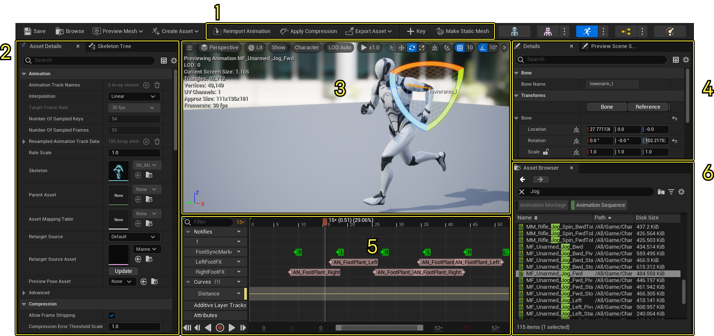
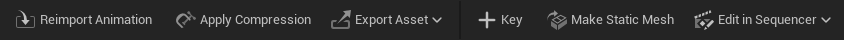
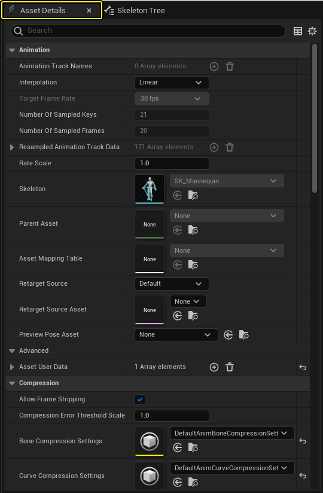
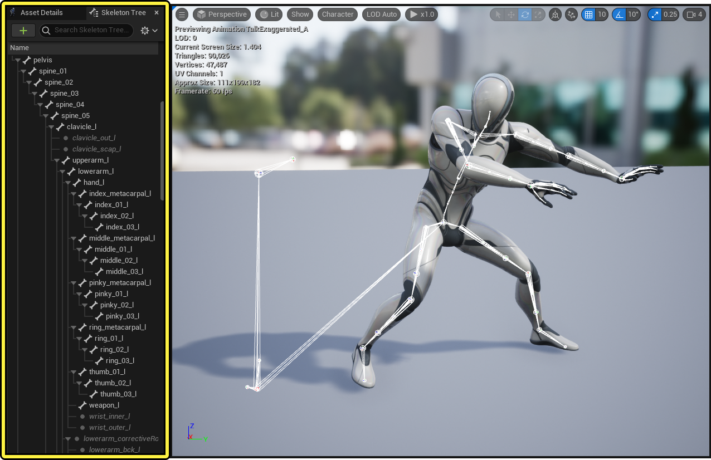
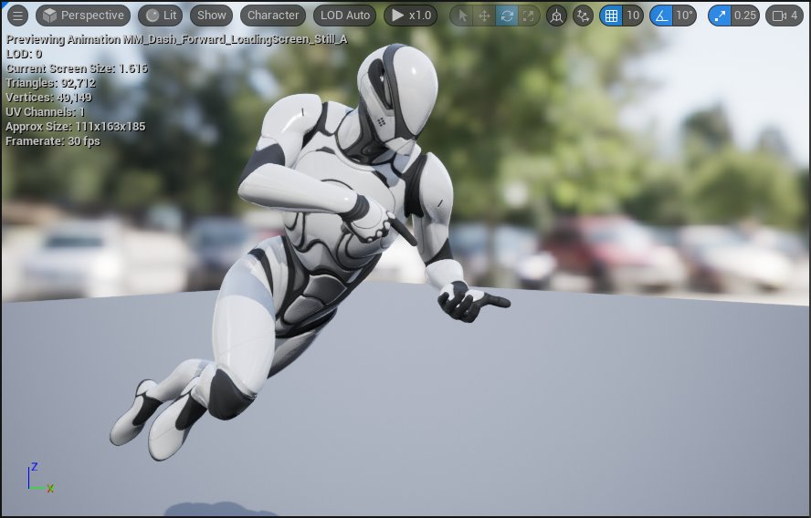
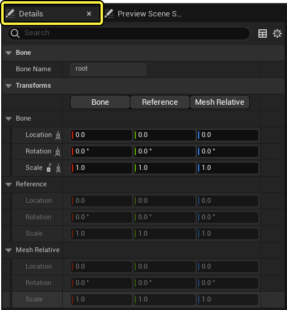
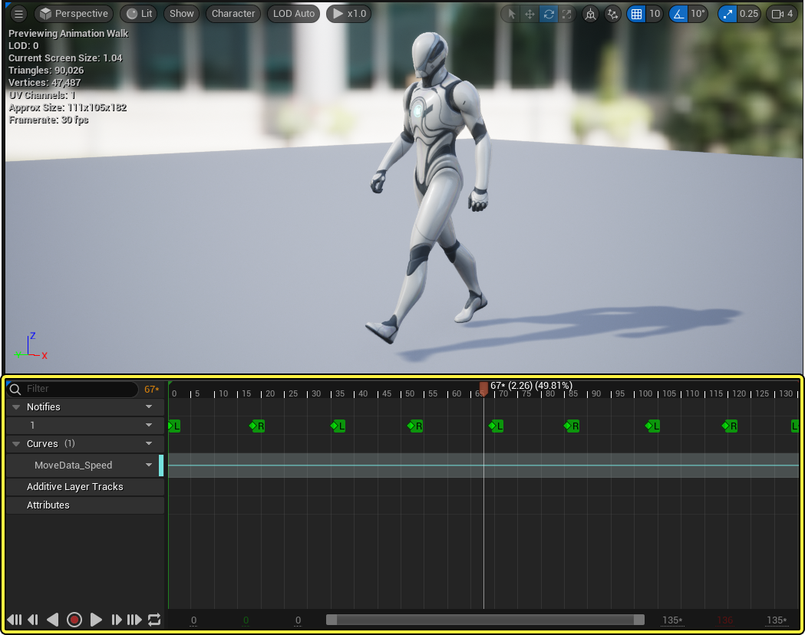
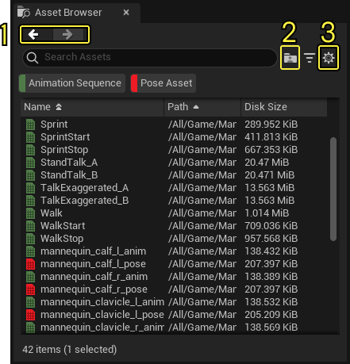

# 动画序列编辑器

> 路径：虚幻引擎5.7文档 / 为角色和对象制作动画 / 骨架网格体动画系统 / 动画编辑器 / 动画序列编辑器

> 原始页面：https://dev.epicgames.com/documentation/unreal-engine/animation-sequence-editor-in-unreal-engine

**动画序列编辑器（Animation Sequence Editor）** 中可以使用各种动画相关的资产，并应用于虚幻引擎的 **骨架网格体（Skeletal Meshes）** 。 你可以使用动画序列编辑器编辑和预览动画 **序列（Sequences）**，**蒙太奇（Montages）**，**曲线（Curves）** 等等。

该页面包含关于动画序列编辑器的重要信息，讲解以下工具和窗口：

1. [工具栏（Toolbar）](#%E5%B7%A5%E5%85%B7%E6%A0%8F)
2. [资产细节/骨架树（Asset Details / Skeleton Tree）](#%E8%B5%84%E4%BA%A7%E7%BB%86%E8%8A%82%E9%9D%A2%E6%9D%BF/%E9%AA%A8%E6%9E%B6%E6%A0%91)
3. [视口（Viewport）](#%E8%A7%86%E5%8F%A3)
4. [细节/预览场景设置（Details / Preview Scene Settings）](#%E7%BB%86%E8%8A%82%E9%9D%A2%E6%9D%BF/%E9%A2%84%E8%A7%88%E5%9C%BA%E6%99%AF%E8%AE%BE%E7%BD%AE)
5. [资产编辑器（Asset Editor）](#%E8%B5%84%E4%BA%A7%E7%BC%96%E8%BE%91%E5%99%A8)
6. [资产浏览器（Asset Browser）](#%E8%B5%84%E4%BA%A7%E6%B5%8F%E8%A7%88%E5%99%A8)

## 工具栏

以下是动画序列编辑器工具栏中独有的按钮以及它们功能的描述。

| 名称 | 图标 | 描述 |
| --- | --- | --- |
| **重新导入动画（Reimport Animation）** | 重新导入动画图标按钮 | 使用这个按钮来从电脑的原始文件中重新导入动画。如果文件位置未知或者无法找到文件，虚幻引擎会提醒你浏览电脑找到要重新导入的文件。 |
| **应用压缩（Apply Compression）** | 应用压缩图标按钮 | 使用这个按钮将 **动画压缩（Animation Compression）** 应用到你的动画上来减少动画运行占用的资源。 |
| **导出资产（Export Asset）** | 导出资产图标按钮 | 使用这个按钮将当前的动画资产为当前骨骼作为动画数据或预览网格体导出。更多信息请参阅[导入和导出FBX文件](../../../cinematics-and-movie-making/unreal-engine-sequencer-movie-tool-overview/import-and-export-cinematic-fbx-animations/index.md)。 |
| **关键（Key）** | 关键图标按钮 | 将当前姿势的一个 **关键帧（Keyframe）** 作为叠加层添加到资产编辑器。 |
| **创建静态网格体（Make Static Mesh）** | 创建静态网格体图标按钮 | 用网格体显示的当前姿势创建一个新的静态网格体。 |
| **在Sequencer中编辑（Edit In Sequencer）** | 在Sequencer中编辑图标按钮 | 在Sequencer中打开当前动画。在这个下拉菜单中也可以选择切换按钮来在[Control Rig](../../../control-rig/index.md)中打开动画或者将动画烘焙至Control Rig。 |

## 资产细节面板/骨架树

默认情况下，该窗口有两个面板，[资产细节](#animation%20asset%20details) 面板和 [骨架树](#skeleton%20tree%20window) 面板。

### 动画资产细节面板

**动画资产细节（Animation Asset Details）** 面板是一个根据场景变换的属性编辑器，可以用来修改选中动画序列的设置及其资产，比如混合空间、动画蒙太奇和动画通知。

| 名称 | 描述 |
| --- | --- |
| **动画轨道名称（Animation Track Names）** | 显示当前选中的动画轨道的名称。 |
| **插值（Interpolation）** | 该属性控制动画关键帧之间的插值。 **线性插值（Linear interpolation）** 会实现关键帧之间的线性缓动，导致关键帧处的突然开始和结束动作。 线性插值 **步插值（Step interpolation）** 会实现非插值的关键帧，使其保持其数值直到下一个关键帧。 步插值 |
| **目标帧率（Target Frame Rate）** | 这里显示导入或创建的动画不可编辑的目标帧率。 |
| **关键帧取样数量（Number of Sampled Keys）** | 这里显示当前导入或创建的动画的关键帧取样数量。 |
| **取样帧数量（Number of Sampled Frames）** | 这里显示当前导入或创建的动画的取样帧数量。 |
| **重新取样的动画轨道数据（Resampled Animation Track Data）** | 这里罗列受动画控制的骨骼。取决于动画的导出方式，并不是所有骨骼都会运动。 |
| **速率（Rate Scale）** | 动画播放速度，默认为1，数字越小速度越慢，数字越大速度越快。 |
| **骨骼（Skeleton）** | 代表使用的骨骼资产。双击可以打开[骨骼编辑器](../../animation-assets-and-features/skeletons/index.md)。 |
| **母资产（Parent Asset）** | 在使用动画蒙太奇或者当前选中的动画蒙太奇是子资产的时候，罗列关联的 **母资产（Parent Asset）**。然而，对当前蒙太奇做出的修改将会被停用，除非是用资产 **映射表（Mapping Table）** 给子资产分配动作。该数据会被用于烘焙成普通资产。 在把动画映射到精确时间或者取代其它动画的时候非常有用。 |
| **资产映射表（Asset Mapping Table）** | 显示资产映射表，和子母动画蒙太奇配合使用。映射表打开时，双击来引用关联的源资产和目标资产。 |
| **重定向源（Retargeting Source）** | 在[重定向动画](../../animation-assets-and-features/skeletons/animation-retargeting/index.md)时使用的基本姿势。 |
| **重定向源资产（Retarget Source Asset）** | 如果重定向源属性设为默认（无），选中的骨架网格体就会在重定向时被用作基本姿势。变换数据会被保存到RetargetSouceAssetReferencePose。 |
| **预览姿势资产（Preview Pose Asset）** | 预览骨架网格体时使用的默认骨架网格体姿势资产，仅在使用关联资产打开一个动画编辑器模式的时候适用。 |
| **资产用户数据（Asset User Data）** | 资产用户数据是一组应用的函数，可以对接到动画上来产出数据或者做出统一的动作。除了动画序列之外，该数据还可以用于多种资产，比如骨架网格体和骨架资产，并且将任意用户数据对接至这些目标上。 |
| **允许剥离帧（Allow Frame Stripping）** | 启用后，将会在需要时允许导出平台将动画中低优先级的帧移除。如果动画丢失大量动作可以将该选项禁用。 |
| **压缩错误阈值大小（Compression Error Threshold Scale）** | 调整压缩时的错误阈值大小。这在使用不同倍率播放动画的时候很有用。比如，如果动画连接的Actor或组件被放大到10，这个数值也应该设为10。 |
| **骨骼压缩设置（Bone Compression Settings）** | 骨骼压缩设置用于将该序列中骨骼上的动画数据压缩。 |
| **曲线压缩设置（Curve Compression Settings）** | 曲线压缩设置用于压缩序列中的[动画曲线](../../animation-assets-and-features/animation-sequences/animation-curves/index.md)数据。 |
| **禁用覆盖压缩（Do Not Override Compression）** | 防止在运行CompressAnimations命令行的时候导致压缩格式被覆盖。一些高帧率动画比较敏感，不应该被改动。 |
| **叠加动画类型（Additive Anim Type）** | **概述** 动画可以作为绝对或者叠加使用。当绝对动画被用于控制骨骼时，各个骨骼会互相竞争互相影响。叠加动画可以在对应区域内设置优先级来避免这个问题，使得各个动画之间不会冲突。 **叠加动画（Additive Animation）** 叠加动画会使用基本动画和当前动画的起始位置计算delta值或者置换值。也可以将delta差值用叠加动画应用到任何基本动画，从而制作出各种不同的变种动画。 创建叠加动画需要以下两个部分。 **当前动画（Current Animation）** 你想要添加到基本动画的动画。 **基本动画（Base Animation）** 用于计算delta值的基础动画。delta值如何提取取决于选择哪个基本动画。 **叠加动画类型（Additive Animation Type）** 判断你需要使用哪种动画。 **非叠加（No additive）**: 非叠加动画会与其它动画数据竞争。 **本地空间（Local Space）**: 这种叠加动画的delta值使用本地空间来计算。这是最常用的叠加动画。将本地空间作为参考，叠加动画可以使用delta值来平顺地将叠加动画数据添加到现有属性的位置。 **网格体空间（Mesh Space）**: 这种叠加动画会将delta值应用到组件空间中。[动画偏移](../../animation-assets-and-features/blend-spaces/aim-offset/index.md) 中需要这种动画，因为动画偏移需要在组件空间里运用。 可以使用多种方式得到用于叠加动画的基本动画。选择叠加动画类型后，有如下选项： **骨骼参考姿势（Skeleton Reference Pose）**: 使用当前骨骼的参考姿势作为基本姿势。 **选中动画缩放（Selected Animation Scaled）**: 使用一整个动画序列作为基本姿势。BasePoseSeq必须提前设定好。 **选中动画帧（Selected Animation Frame）**: 使用动画序列中的一帧作为基本姿势。BasePoseSeq和RefFrameIndex必须提前设定好（RefFrameIndex）会受限制。 **该动画中的帧（Frame from this Animation）**: 会从该动画中选取一个特定帧作为基本姿势。 |
| **启用根动作（EnableRootMotion）** | 启用后，将会允许提取根动作数据并将其传送至相对的动画。更多信息参阅[根动作](../../animation-assets-and-features/locomotion/root-motion/index.md)。 |
| **根动作锁定根（Root Motion Root Lock）** | 提取根动作时根骨骼会被锁定至以下选中位置。 **参考姿势（Ref Pose）**: 使用参考姿势的根骨骼位置。 **动画第一帧（Anim First Frame）**: 使用动画第一帧的根骨骼位置。 **零（Zero）**: 动画第一帧时使用根骨骼位置。 |
| **强制锁定根（Force Root Lock）** | 启用后会强制根锁定，即使根动作没有启用时也一样。 |
| **使用规格化根动作大小（Use Normalized Root Motion Scale）** | 启用后，根动作中提取出来的规格化大小比例FVector(1.0, 1.0, 1.0)会被使用。 |
| **动画长度（Animation length）** | 选择要导入的动画范围或者长度。 **导出时（Exported Time）**: 基于导出时的定义来导入动画帧。 **加入动画时（Animated Time）**: 导入分配有动画数据的帧范围。当导出范围比FBX文件中实际动画长的时候很有用。 **设定范围（Set Range）**: 手动定义导入动画的起始和结束帧。 |
| **在骨骼层级关系中导入网格体（Import Meshes in Bone Hierarchy）** | 勾选后，骨骼层级关系中的网格体会被导入而不是被转换成骨骼。 |
| **导入帧范围（Frame Import Range）** | 在动画长度属性下方，如果设置范围（Set Range）被选中，就可以手动设置当前动画导入或重新导入时使用的帧数范围。 |
| **使用默认采样率（Use Default Sampler Rate）** | 启用后，将会以30 FPS采样全部动画曲线。 |
| **自定义取样率（Custom Sample Rate）** | 使用特定的采样率采集FBX动画数据。如果设为0，虚幻引擎会自动检测最佳采样率。 |
| **导入自定义属性（Import Custom Attribute）** | 若有，虚幻引擎会将自定义属性作为动画中的曲线导入。 |
| **删除现有自定义属性曲线（Delete Existing Custom Attribute Curves）** | 启用后，全部之前的自定义属性都会在重新导入的时候被删除。 |
| **删除现有非曲线的自定义属性（Delete Existing Non Curve Custom Attributes）** | 启用后，全部之前非曲线的自定义属性都会在重新导入的时候被删除。 |
| **导入骨骼轨道（Import Bone Tracks）** | 默认情况下，虚幻引擎会导入骨骼变换轨道。禁用后，会移除骨骼变换轨道。通常用于只有曲线的动画。 |
| **设置材质曲线类型（Set Material Curve Type）** | 为所有已有的自定义属性设置材质曲线类型。 |
| **材质曲线后缀（Material Curve Suffixes）** | 为自定义属性设置材质曲线类型时带上后缀。如果设置材质曲线类型（Set Material Curve Type）选为是，该选项会被忽略。 |
| **移除重复关键帧（Remove Redundant Keys）** | 启用后，会在将自定义属性作为曲线导入时移除重复关键帧。 |
| **删除现有变形目标曲线（Delete Existing Morph Target Curves）** | 启用后，会从FBX中删除现有的 **变形目标（Morph Targets）**。 |
| **不导入只有0值的曲线（Do not import curves with only 0 values）** | 启用后，虚幻引擎会在导入时忽略只有0值的曲线。通常用于将自定义属性或者变形目标作为曲线导入，防止添加多余要评估的曲线。 |
| **保留本地变换（Preserves Local Transform）** | 启用后，会导入动画内部的曲线。 |
| **导入变换（Import Transform）** | 将导入的变换可控偏移放置。会在使用骨骼和骨架网格体资产的时候很有用。 |
| **导入旋转（Import Rotation）** | 将导入的旋转可控偏移放置。会在使用骨骼和骨架网格体资产的时候很有用。 |
| **导入等分缩放（Import Uniform Scale）** | 导入时可控等分缩放。 会在使用骨骼和骨架网格体资产的时候很有用。 |
| **转换场景（Convert Scene）** | 将场景从FBX坐标系统转换至UE坐标系统。 |
| **强制前置X轴（Force Front XAxis）** | 将场景从FBX坐标系统转换至UE坐标系统时前置X轴而不是Y轴。 |
| **转换场景单位（Convert Scene Unit）** | 将场景从FBX单位转换至UE单位（厘米）。 |
| **源文件（Source File）** | 查看当前选中资产的文件路径。 |
| **单个骨骼自定义属性数据（Per Bone Custom Attribute Data）** | 显示当前骨骼资产中每块骨骼的自定义属性。 |
| **数据模型（Data Model）** | 这里显示一个包括当前动画重要数据的数据资产，比如骨骼动画轨道和曲线数据，还有动画帧率、样本帧和关键帧之类的基础信息。 |
| **控制器（Controller）** | 这里显示当前动画数据控制器的一个示例。该资产控制上述数据模型资产的运作。 |
| **元数据（Meta Data）** | 可以和资产一起保存的元数据。你可以使用 'GetMetaData' 调试指令来查找数据。 |

> [!NOTE]
> 双击[资产浏览器](#asset%20browser)中的动画来打开查看资产细节。

### 骨架树

骨架树面板显示当前骨骼资产的 **骨架层次结构（Skeletal Hierarchy）** ，用于创建并编辑骨骼 [插槽](../../animation-assets-and-features/skeletons/skeletal-mesh-sockets/index.md) 和定义 [动画重定向](../../animation-assets-and-features/skeletons/animation-retargeting/index.md) 相关的设置。

虽然骨架树可以从动画序列编辑器中打开，但是这个面板的内容与 **骨骼编辑器（Skeleton Editor）** 更加相关，更多信息参阅以下链接。

[骨骼编辑器](../../animation-assets-and-features/skeletons/index.md)

## 视口

[视口](../../../../get-started/unreal-engine-for-new-users/unreal-editor-interface/index.md#level%20viewport) 窗口用于预览动画资产在选定骨架网格体上的播放并显示资产相关的信息。

更多动画编辑器独有的视口功能的相关信息，参阅 [动画视口](../index.md#viewport) 。

## 细节面板/预览场景设置

资产编辑器的细节面板和虚幻引擎中的其它 **细节面板（Details Panels）** 类似，主要用于修改使用资产编辑器时添加的设置。比如，从骨架树窗口选中一个骨骼，细节面板会显示这块骨骼相关的设置。

更多编辑器细节面板的相关信息，参阅 [骨骼编辑器](../../animation-assets-and-features/skeletons/index.md) 文档。

在同一区域里还有[预览场景设置](../index.md#preview%20scene%20settings) 选项卡，用于控制预览设置，比如选中的动画、应用的骨架网格体以及视口光照和后期处理设置。

## 资产编辑器

资产编辑器窗口的界面和功能会根据打开的动画资产变换。你可以播放和修改 **混合空间（Blend Spaces）** 、**动画蒙太奇（Animation Montage）** 等等。

以下是虚幻引擎中各种动画资产的相关链接，每个页面包括资产类型的描述以及各自独特资产编辑器的界面和属性。

- Animation Sequence
- Pose Asset
- Anim Blueprint
- Anim Composite
- Anim Montage
- Blend Space
- Blend Space 1D
- Aim Offset
- Aim Offset 1D

## 资产浏览器

资产浏览器与 [内容浏览器](../../../../understanding-the-basics/content-browser/index.md) 相似，用于查看和过滤当前骨骼资产关联的动画资产。

1. 使用前进和后退按钮来查看之前选中的动画。
2. 这里可以切换其他开发者（Other Developers）过滤器来查看其他开发者文件夹里的资产，用于共享服务器的团队项目。
3. 设置按钮用于打开资产浏览器的各种设置，比如切换 **查看选项（View Options）** 中的 **高级细节（Advanced Details）** 列，来查看列表中资产的高级细节信息。

> [!NOTE]
> **资产浏览器（Asset Browser）** 和 **内容浏览器（Content Browser）** 使用同样的颜色来帮助区分不同种类的动画资产。

动画资产可以在 **动画资产编辑器（Animation Sequence Editor）** 中打开，也可以在资产浏览器的内容浏览器中 **双击** 打开。取决于打开的资产，资产编辑器会自动调整显示相对应的工具和属性。

打开资产前，可以将光标放在资产上方来查看高级细节信息。

> 图片已省略：资产浏览器光标悬停细节

**右键点击** 资产会打开一个菜单，可以 **保存（Save）** 资产、在新窗口中 **打开（Open）** 资产或者在电脑的文件资源管理器中 **浏览（Browse）** **文件路径（File Path）** 。
