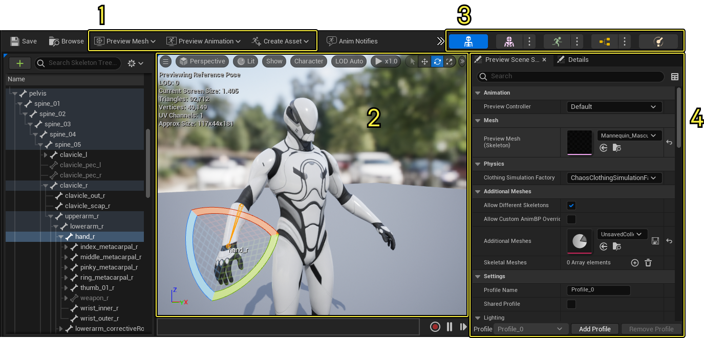
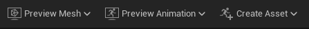
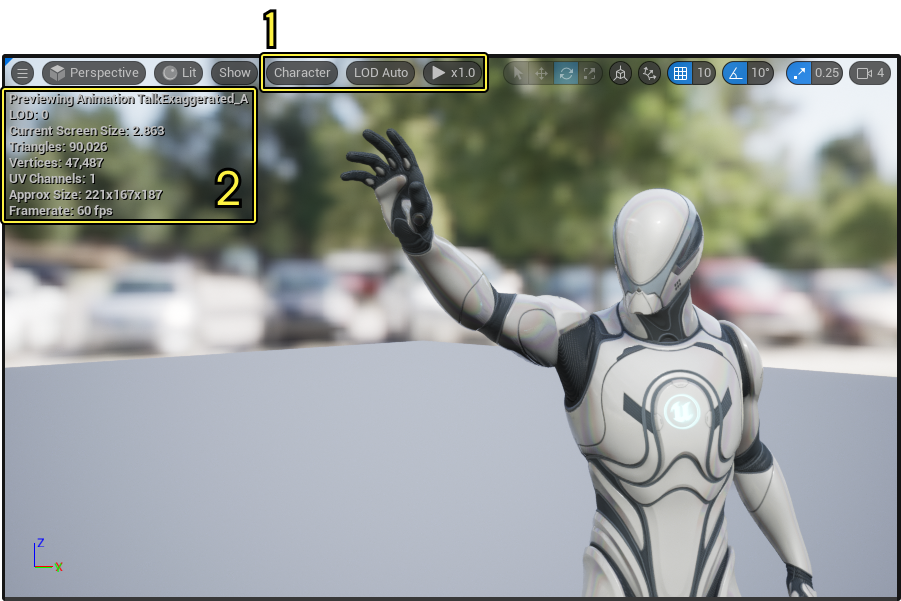
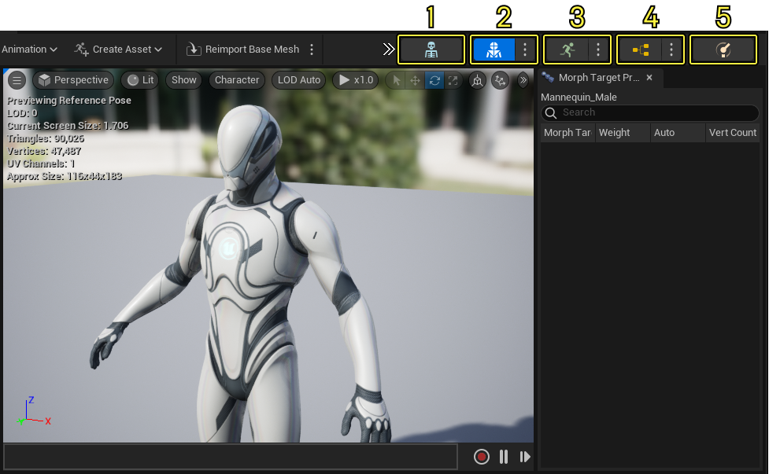
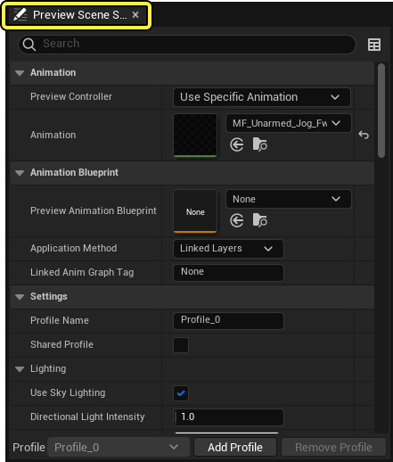

# 动画编辑器

> 路径：虚幻引擎5.7文档 / 为角色和对象制作动画 / 骨架网格体动画系统 / 动画编辑器

> 原始页面：https://dev.epicgames.com/documentation/unreal-engine/animation-editors-in-unreal-engine

**虚幻引擎** 中的 **骨架网格体动画系统（Skeletal Mesh Animation System）** 包含专门的动画资产编辑器， 可以在骨架网格体和其它 **动画资产（Animation Assets）** 上使用强大的动画工具。利用这些动画编辑器，可以创建角色动画、关卡的互动以及其它程序性动作。

该文档带你全面了解虚幻引擎中的动画编辑器。

## 概览

一个角色的骨架网格体可以关联很多资产，并可以在 **内容浏览器（Content Browser）** 中打开。这些资产包括 **骨骼（Skeleton）** 、 **骨架网格体（Skeletal Mesh）** 、 **动画序列（Animation Sequences）** 以及 **动画蓝图（Animation Blueprints）** 。打开不同类型的资产，不同的 **编辑器模式（Editor Mode）** 会随之打开。

以下是动画编辑器窗口重要功能的概况，在所有动画编辑器模式中通用。

1. [工具栏](#toolbar)
2. [视口](#viewport)
3. [编辑器模式](#editor%20modes)
4. [预览场景设置](#preview%20scene%20settings)

## 工具栏

所有的动画编辑器模式都包含 **工具栏（Toolbar）** ，它和虚幻引擎众多编辑器和窗口的 **工具栏（Toolbar）** 相似。关于工具栏的常见功能，参阅[主工具栏](../../../get-started/unreal-engine-for-new-users/unreal-editor-interface/index.md#main%20toolbar)。关于动画编辑器中工具栏的功能，参阅它们各自的相关页面。

所有的动画编辑器都包含以下独特的功能：

| 名称 | 图标 | 描述 |
| --- | --- | --- |
| **预览网格体（Preview Mesh）** | 工具栏预览网格体图标按钮 | 为当前资产设置一个新的预览骨架网格体（在动画或骨骼前储存）。 |
| **预览动画（Preview Animation）** | 工具栏预览动画图标按钮 | 使用当前资产选择一个预览动画来播放。 |
| **创建资产（Create Asset）** | 工具栏创建资产图标按钮 | 在该下拉菜单中可以创建以下动画资产： [创建动画资产](../animation-assets-and-features/animation-sequences/index.md)从当前默认的 **参考姿势（Reference Pose）** 或者显示的网格体 **当前姿势（Current Pose）** 创建一个新的动画序列。 [创建姿势资产](../animation-assets-and-features/animation-pose-assets/index.md)从显示的网格体 **当前姿势（Current Pose）** 、 **当前动画（Current Animation）** 描述或者 **插入姿势（Insert Pose）** 描述创建一个新的姿势资产。 [动画蓝图](../animation-blueprints/index.md)为当前骨架网格体创建一个新的 **动画蓝图（Animation Blueprint）** 。 [动画合成](../animation-assets-and-features/animation-composites/index.md)使用选中的骨骼创建一个新的 **动画合成（AnimComposite）** 。 [动画蒙太奇](../animation-assets-and-features/animation-montage/index.md)使用选中的骨骼创建一个新的 **动画蒙太奇（AnimMontage）** 。 [混合空间](../animation-assets-and-features/blend-spaces/index.md)创建一个新的 **混合空间（Blend Space）** 用于平顺混合不同动画之间之间的过渡。 [1D混合空间](../animation-assets-and-features/blend-spaces/index.md#blend%20space%201d)使用选中的骨骼创建一个新的 **1D混合空间（1D Blend Space）** 。 [瞄准偏移（Aim Offset）](../animation-assets-and-features/blend-spaces/aim-offset/index.md)使用选中的骨骼创建一个新的 **瞄准偏移混合空间（Aim Offset Blend Space）** 。 [1D瞄准偏移（Aim Offset 1D）](../animation-assets-and-features/blend-spaces/aim-offset/index.md#aim%20offsets%201d)使用选中的骨骼创建一个新的 **瞄准偏移1D混合空间（Aim Offset 1D Blend Space）** 。 |

## 视口

[视口](../../../building-virtual-worlds/level-editor/editor-viewports/index.md)窗口用于预览选中骨架网格体的动画资产播放并显示资产的相关信息。以下是和动画编辑器相关的重要功能。

1. 视口属性设置

   以下是动画序列编辑器视口相关的视口属性。

   | 名称 | 描述 |
   | --- | --- |
   | **预览动画（Preview Animation）** | 罗列当前选中的动画序列。 |
   | **LOD（细节层次）（LOD (Level of Detail)）** | 当前显示的LOD或者给角色指定的LOD值。 |
   | **当前屏幕大小（Current Screen Size）** | 该数值表示角色的边界框占用多少视口（边界框默认由物理资产产生，若没有物理资产便使用骨骼资产）。该数字受动画的边界框的大小、角色和摄像机的距离以及摄像机的镜头缩放影响。基于该数值，你可以指定LOD何时在关卡之间切换。 |
   | **三角形（Triangles）** | 罗列预览的网格体中渲染出的三角形的数量。 |
   | **顶点（Vertices）** | 罗列预览的网格体中顶点或者独立坐标点的数量。 |
   | **UV通道（UV Channels）** | 罗列当前网格体的[UV通道](../../../working-with-content/static-meshes/using-uv-channels-with-static-meshes/index.md)。 |
   | **近似大小（Approximate Size）** | 当前动画占用空间的边界框的尺寸，由动画资产计算得来。默认情况下计算时使用物理资产，若没有物理资产便使用骨骼资产。使用虚幻引擎单位（厘米）。 |
   | **帧率（Frame Rate）** | 显示当前动画播放的帧率。 |
2. 调试文本

   调试文本也显示在视口的右上角。调试文本包括当前使用的动画资产的重要参考信息，比如资产名称、LOD模式、当前屏幕大小以及诸如显示的三角形和顶点数量之类的网格体显示输出属性。

## 编辑器模式

每种编辑器模式都可以从项目窗口右上角对应的按钮打开：

1. [骨骼编辑器](skeleton-editor/index.md): 该编辑器用于骨骼，可以可视化地控制骨架网格体关联的骨骼和关节层次级别。
2. [骨架网格体编辑器](animation-sequence-editor/index.md): 骨架网格体编辑器用于编辑网格体、分配 **材质（Materials）**、调整LOD以及测试[变形对象](#morphtargetpreviewer)功能。
3. [动画序列编辑器](../../paper-2d-overview/how-to-use-paper-2d/paper-2d-setting-up-an-animation-state-machine/index.md): 如果骨架网格体关联了动画序列，你可以使用这里的 **混合空间（Blendspaces）**、变形目标和 **动画通知（Animation Notifies）** 这些强大工具来编辑和预览这些序列。
4. [动画蓝图编辑器](../animation-blueprints/index.md): 与虚幻引擎的[蓝图编辑器](../../../blueprints-visual-scripting/index.md)类似，动画蓝图编辑器是一个用于指引关卡中动画的功能和动作的可视化脚本环境。你可以在为网格体创建动画蓝图资产后打开这个模式。
5. [物理资产编辑器](../../../gameplay-systems/physics/physics-asset-editor/index.md): 物理资产编辑器专门用于操作骨架网格体上的物理资产。

第一次打开骨架网格体资产时，骨架网格体编辑器会默认打开。点击其它编辑器模式时，当前编辑器窗口中会打开一个新的窗口选项卡。

### 骨骼编辑器

骨骼编辑器中包括骨架网格体中骨骼层次级别和可视化的数据预览。这里可以调整骨骼位置、创建[骨骼插槽](../animation-assets-and-features/skeletons/skeletal-mesh-sockets/index.md)以及预览[动画曲线](../animation-assets-and-features/animation-sequences/animation-curves/index.md)。

- [骨架编辑器](skeleton-editor/index.md)

### 骨架网格体编辑器

骨架网格体编辑器模式用于编辑骨架网格体的视觉属性，比如操作网格体的多面体结构、编辑关联的材质甚至是指定LOD。

- [骨架网格体编辑器](skeletal-mesh-editor/index.md)

### 动画序列编辑器

在动画序列编辑器模式中可以以动画为中心进行针对项目中任何动画资产类型的动画编辑，比如创建和管理 **动画序列（Animation Sequences）** 、 **动画通知（Animation Notifies）** 和 **动画蒙太奇（Animation Montages）** 等等。

- [动画序列编辑器](animation-sequence-editor/index.md)

## 预览场景设置

虚幻引擎所有的项目窗口都包含 **预览场景（Preview Scene）** 这样的可视化预览。在这个窗口中可以方便地看到你的资产和动画在不同光照环境和播放场景中的样子。

以下是动画编辑器模式独有的预览场景设置的一些功能：

| 名称 | 描述 |
| --- | --- |
| **预览控制器（Preview Controller)** | 这里可以控制视口中预览哪一个动画。 **默认（Default）** 使用动画工具的默认设置。大多数情况下，这会导致角色使用参考姿势，除非是在预览动画序列。 **参考姿势（Reference Pose）** 使用骨架网格体的参考姿势。 **使用特定动画（Use Specific Animation）** 会打开选项来选择骨架网格体关联的特定动画序列来预览。 **Live Link预览控制器（Live Link Preview Controller）** 使用用了Live Link设置的预览。 选中的模式会在视口 **调试文本（Debug Text）** 的第一行显示。 视口窗口调试文本 |
| **预览网格体（骨骼）（Preview Mesh (Skeleton)）** | 该属性可以修改骨架网格体用于预览，为骨骼编辑器和动画编辑器独有的功能。 |
| **允许不同骨骼（Allow Different Skeletons）** | 启用后可以再多选择一个网格体用于在视口中预览，即使是与当前骨骼没有关联也可以。这是骨骼编辑器和动画编辑器独有的功能。 |
| **允许自定义动画蓝图覆写（Allow Custom AnimBP Override）** | 如果正在使用预览合集（Preview Collection），你可以启用该属性来允许覆写自定义动画蓝图。这是骨骼编辑器和动画编辑器独有的功能。 |
| **额外网格体（Additional Meshes）** | 用于施用网格体合集（Mesh Collection）的实例，可以在预览中查看当前网格体合集中的其它网格体。这是骨骼编辑器和动画编辑器独有的功能。 |
| **骨架网格体（Skeletal Meshes）** | 显示特定 **预览网格体合集（Preview Mesh Collection）** 中的骨架网格体。这是骨骼编辑器和动画编辑器独有的功能。 |
| **设置（Settings）** | 通常的场景光照和渲染设置。 |
