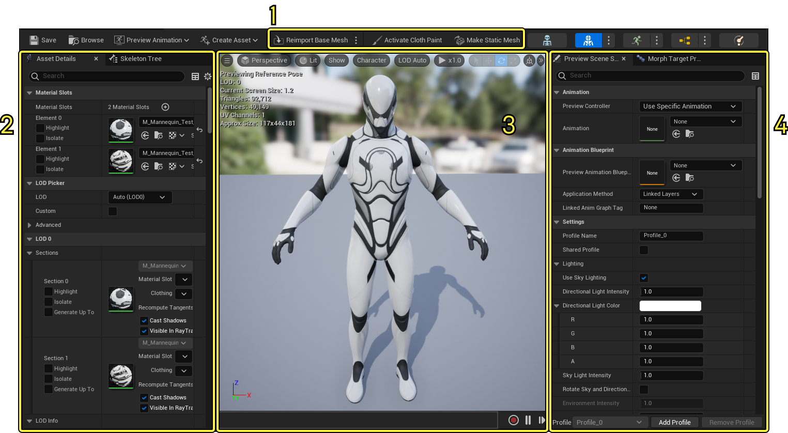
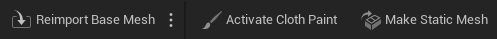
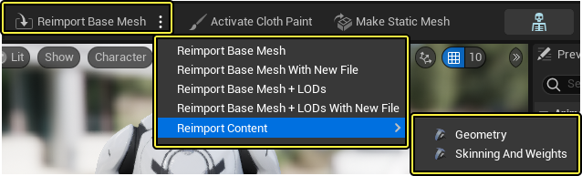
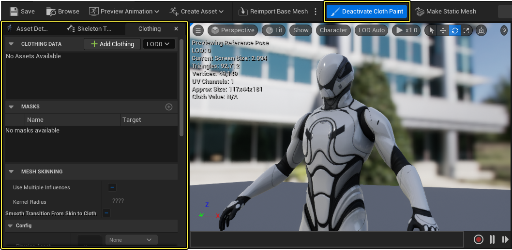
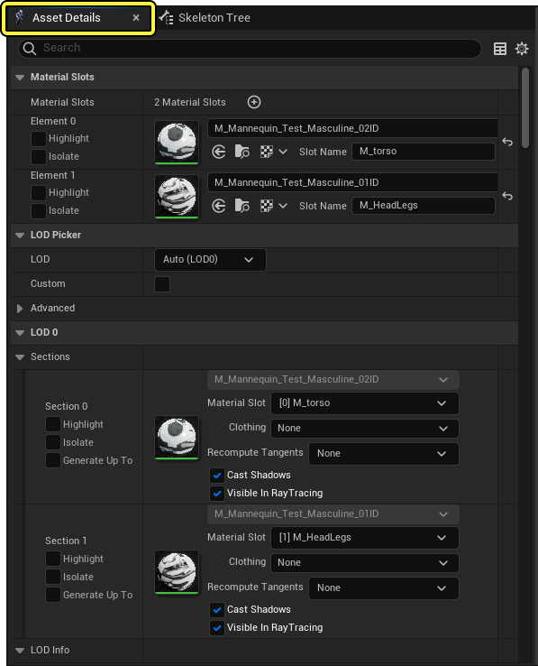
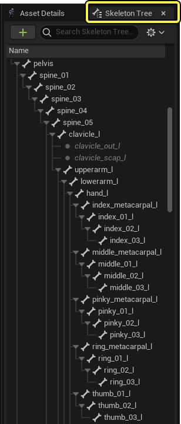

# 骨架网格体编辑器

> 路径：虚幻引擎5.7文档 / 为角色和对象制作动画 / 骨架网格体动画系统 / 动画编辑器 / 骨架网格体编辑器

> 原始页面：https://dev.epicgames.com/documentation/unreal-engine/skeletal-mesh-editor-in-unreal-engine

**骨架网格体编辑模式（Skeletal Mesh Editor Mode）** 包括用于操作和预览 **骨架网格体（Skeletal Mesh）** 资产的工具。 它和[静态网格体编辑器](../../../../working-with-content/static-meshes/index.md)相似。骨架网格体编辑器可以通过指定[材质](../../../../designing-visuals-rendering-and-graphics/unreal-engine-materials/index.md)、添加服装元素、设置[LOD](../../../../working-with-content/static-meshes/creating-and-using-lods/index.md)（细节层次（Level of Detail））以及预览应用到网格体的[变形目标](../../../../working-with-content/static-meshes/static-mesh-morph-targets/index.md)来修改多面体网格体。

骨架网格体编辑器有如下工具和面板：

1. [工具栏](#toolbar)
2. [资产细节/骨架树（Asset Details / Skeleton Tree）](#assetdetails/skeletontree)
3. [视口](#viewport)
4. [预览场景设置/变形目标预览器（Preview Scene Settings / Morph Target Previewer）](#previewscenesettings/morphtargetpreviewer)

## 工具栏

骨架网格体编辑器的工具栏和虚幻引擎众多编辑器和窗口的工具栏相似。动画编辑器的常见功能相关信息请参阅[动画编辑器概览的工具栏小节](../index.md#toolbar)。

### 重新导入基本网格体

使用 **重新导入基本网格体（Reimport Base Mesh）**，可以重新导入当前骨架网格体的基本网格体。通常用于网格体没有正确导入需要做出调整，或者你想要重新制作当前网格体的情况。

| 设置 | 描述 |
| --- | --- |
| **重新导入基本网格体（Reimport Base Mesh）** | 打开当前骨架网格体的原始FBX源文件，并同时打开新的导入选项窗口。 |
| **使用新文件重新导入基本网格体（Reimport Base Mesh With New File）** | 打开一个文件浏览器窗口，可以选择新的FBX源文件来导入。虚幻引擎会自动将现有的材质、骨骼和其它资产指定到新的网格体，并且在无法准确匹配的情况下请求许可。无法指定的资产将会被标为失败。 |
| **带LOD重新导入基本网格体（Reimport Base Mesh + LODs）** | 重新导入网格体原始源文件，包括基本LOD和源文件关联的自定义LOD。 |
| **到LOD使用新文件重新导入基本网格体（Reimport Base Mesh + LODs With New File）** | 导入基本网格体、基本LOD和新源文件的自定义LOD。LOD可以之间从FBX文件导入，也可以在其它源文件中找到。在[资产细节](#asset%20details%20/%20skeleton%20tree)面板中找到 **源导入文件名（Source Import Filename）** 来查看各个网格体源文件。 |
| **重新导入内容（Reimport Content）** | 只为网格体的基本LOD导入特定的内容元素。元素可以是几何体或者分开的蒙皮和重量。 |

点击这些和源文件相关联的选项后，虚幻引擎会自动从网格体原始已知位置将其打开。如果无法找到文件，或者要选择新的源文件，文件浏览器窗口将会打开，用于指定源文件。

### 布料绘制

虚幻引擎提供一个简单高效的布料解算器，集成了编辑和预览工具，包含在骨架网格体编辑器工具栏中。

点击这个按钮将会打开布料面板并且贴靠在 **资产细节（Asset Details）** 和 **骨架树（Skeleton Tree）** 面板旁边。这里包括帮助分配网格体布料材质和控制动作的属性和设置。

更多虚幻引擎中布料的相关信息和工作流程示例请参阅[布料工具](../../../../gameplay-systems/physics/cloth-simulation/clothing-tool/index.md)页面。

### 创建静态网格体

**创建静态网格体（Make Static Mesh）** 按钮会从当前骨架网格体的姿势创建一个新的静态网格体资产。

将骨架网格体操作至想要的姿势然后点击 **创建静态网格体（Make Static Mesh）** ，会弹出窗口提醒你选择保存新静态网格体的位置。该资产现在可以放置到关卡中或者像其它任何静态网格体一样进行编辑。

## 资产细节/骨架树（Asset Details / Skeleton Tree）

默认情况下，该窗口有两个面板，[资产细节](#animation%20asset%20details) 面板和 [骨架树](#skeleton%20tree%20window) 面板。即使从其它编辑器也可以打开这些面板，在骨架网格体编辑器中的这些面板有独特的功能。

### 资产细节

骨架网格体资产细节面板用于编辑修改选中骨架网格体及其元素（材质、LOD、[简化工具](#reduction%20tool)）的设置，并且界面会根据场景而变换。该选项卡下的很多属性对全部网格体都通用，会在[静态网格体](../../../../working-with-content/static-meshes/index.md)页面详细说明。

以下是资产细节面板独有的相关属性。

| 属性 | 描述 |
| --- | --- |
| **分段（Sections）** | 这里包括很多与用于指定和预览静态网格体相同的属性。然而，**生成上限（Generate Up To）** 是骨架网格体LOD生成所独有的属性，用于选择当前材质生成至哪一层LOD。在切换不同LOD的材质时会很有用。 |
| LOD 信息 |  |
| **LOD滞后（LOD Hysteresis）** | 用于避免在LOD边界上的"闪烁"。只有在LOD从复杂变为简单时才会生效。高数值会增加看到模型的滞后，从而让显著不同的LOD之间的过度变得更加平顺。 |
| **优先骨骼（Bones to Prioritize）** | 虽然骨架网格体简化工具可以高效地减少骨架网格体的三角数量，有时这种简化工具会过度简化。优先骨骼列表可以更好地控制要简化的的骨骼，确保列表中骨骼上的几何体不被简化。列表中的优先骨骼会保持质量。使用 **优先权重（Weight of Prioritization）** 属性来控制优先级。 |
| **优先区块（Sections to Prioritize）** | 和上述的优先骨骼属性类似，该属性罗列一些网格体的区块或者材质插槽，并优先保持其质量。 使用 **优先权重（Weight of Prioritization）** 属性来控制优先级。 |
| **优先权重（Weight of Prioritization）** | 判断骨骼或者区块优先级的数值。该权重用于减少顶点简化，0值为不减少，高数值增加列表中骨骼和区块的优先级，低数值减少优先级。 |
| **源导入文件名（Source Import Filename）** | 显示源文件路径，包括基本网格体FBX文件和其它相关联的自定义LOD源文件。 |
| **蒙皮缓存用法（Skin Cashe Usage）** | 这个下拉菜单可以在使用蒙皮缓存功能时设置LOD行为。有如下几个选项： **自动（Auto）** 沿用项目的全局设置。 **禁用（Disabled）** 表示网格体不会使用蒙皮缓存。 **启用（Enabled）** 表示网格体会使用蒙皮缓存。 如果网格体的 **支持光线追踪（Support Ray Tracing）** 属性启用，上述选项默认选择 **启用（Enabled）** 。 |
| **变形目标位置容错值（Morph Target Position Error Tolerance）** | 高数值代表更好的压缩和占用更少内存，同时导致更低的质量。 |
| **烘焙姿势（Bake Bose）** | 选用单个帧烘焙到LOD网格体。当自动LOD生成为了达到低细节度LOD而移除骨骼但是你想要保留被移除的更好细节时，该功能会很有用。更多信息参阅[姿势资产](../../animation-assets-and-features/animation-pose-assets/index.md)页面。 |
| **烘焙姿势覆盖（Bake Pose Override）** | 覆盖烘焙动作属性。在特定LOD设置被使用时可以停用源烘焙姿势。更多信息请参阅[姿势资产](../../animation-assets-and-features/animation-pose-assets/index.md)页面。 |
| **要删除的骨骼（Bones to Remove）** | 该LOD级别骨骼中要删除的骨骼。 |
| 骨架网格体简化工具 |  |
| **终止条件（Termination Criterion）** | 骨架网格体简化工具中的终止条件选项可以改变简化工具在生成LOD时简化骨架网格体资产的方式。比如，你可以指定顶点而不是三角形的数量或者减少比例，从而更好地达到内存或性能指标。 简化工具有以下选项： **三角形（Triangles）**: 使用 **三角形百分比（Percent of Triangles）** 属性，简化工具将会在生成LOD时把基本网格体的三角形减少百分比作为目标。 **顶点（Vertices）**: 使用 **顶点百分比（Percent of Vertices）** 属性，简化工具将会在生成LOD时把基本网格体的顶点减少百分比作为目标。 **第一个简化的百分比（First Percent Simplified）**: 该选项同时使用三角形百分比和顶点百分比属性，简化工具将会在生成LOD时把先达到的百分比作为目标。 **最大三角形数量（Max Triangles）**: 该选项在生成LOD时使用 **最大三角形数量（Max Triangles Count）** 属性中设置好的最大三角形数量作为目标。 **最大顶点数量（Max Vertices）**: 该选项在生成LOD时使用 **最大顶点数量（Max Vertices Count）** 属性中设置好的最大顶点数量作为目标。 **第一个满足的最大数量（First Max Satisfied）**: 该选项在生成LOD时同时使用最大三角形数量和最大顶点数量属性，将先达到的最大数量作为目标。 取决于选择的终止条件，以下选项会变为相关的属性。 |
| **三角形百分比（Percent of Triangles）** | 该属性表示简化至新LOD时的目标三角形百分比。 |
| **顶点百分比（Percent of Vertices）** | 该属性表示简化至新LOD时的目标顶点百分比。 |
| **最大三角形数量（Max Triangles Count）** | 使用百分比条件时保留的三角形的最大数量，用来限制自动生成。 |
| **最大顶点数量（Max Vertices Count）** | 使用百分比条件时保留的顶点的最大数量，用来限制自动生成。 |
| **最大三角形数量（Max Triangles Count）** | 使用最大三角形数量条件时保留的顶点的最大数量。 |
| **最大顶点数量（Max Vertex Count）** | 使用最大顶点数量条件时保留的顶点的最大数量。 |
| **重新映射变形目标（Remap Morph Targets）** | 从基础LOD重新映射变形目标到缩减过的LOD。 |
| **最大骨骼影响（Max Bone Influence）** | 可以分配给每个顶点的最大骨骼数量。 |
| **施加骨骼边界（Enforce Bone Boundaries）** | 启用后，虚幻引擎会减少带有不同主要骨骼的顶点之间的边缘塌陷。这对于舌头之类的片段有用，但是在极端简化下会产生不好的结果。 |
| **合并相交顶点骨骼（Merge Coincident Vertices Bones）** | 启用后，UV边界之类的同一位置都会有同样的骨骼重量，可以用于纠正角色运动时重叠骨骼的错误。 |
| **体积纠正（Volumetric Correction）** | 用于判断该LOD级别体积纠正量的滑块。默认的数值1会保留体积。较小的数值会通过压平曲面来减少体积，更高的数量会增大曲面来增加体积。 |
| **锁定网格体边缘（Lock Mesh Edges）** | 启用后，网格体表面的切割会通过锁定顶点的方式保存下来。这会增加简化网格体边缘上的质量，但是会产生更多三角形。 |
| **锁定顶点颜色边界（Lock Vertex Color Boundaries）** | 启用后，连接两个顶点颜色的边缘会被锁定，这会增加简化网格体边缘上的质量，但是会产生更多三角形。 |
| **重新生成（Regenerate）** | 点击后，虚幻引擎会根据上述简化工具的属性重新生成当前LOD。 |
| LOD设置 |  |
| **LOD设置（LODSettings）** | 选择要用来保存当前LOD信息的数据资产。该数据可以保存到现有的数据资产，也可以通过点击 **生成资产（Generate Asset）** 来生成一个新的。 |
| **禁用低于最低LOD剥离（Disable Below Min LOD Stripping）** | 启用后，低于最低LOD的剥离将被禁用。使用加号（+）按钮，可以给指定的平台或组添加权限越过该选项。 |
| **覆写LodStreaming设置（Override LodStreaming Settings）** | 启用后，覆盖LOD流送设置。使用加号（+）按钮，可以给指定的平台或组添加权限越过该选项。 |
| **流送LOD（Stream LODs）** | 启用后，将支持LOD流送。使用加号（+）按钮，可以给指定的平台或组添加权限越过该选项。 |
| **流送LOD最大数量（Max Num Streamed LODs）** | 允许的流送的LOD的最大数量。使用加号（+）按钮，可以给指定的平台或组添加权限越过该选项。 |
| **可选LOD最大数量（Max Num Optional LODs）** | 允许的可选的LOD的最大数量。使用加号（+）按钮，可以给指定的平台或组添加权限越过该选项。 |
| 布料 |  |
| **网格体布料资产（Mesh Clothing Assets）** | 罗列当前网格体关联的布料资产。 |
| 网格体 |  |
| **骨架（网格体）（Skeleton（Mesh））** | 当前骨架网格体的骨骼资产。双击骨骼会将其在骨骼编辑器中打开。 |
| 动画绑定 |  |
| **默认动画绑定（Default Animation Rig）** | 与当前骨架网格体关联的Control Rig。 |
| 物理 |  |
| **启用单多面体碰撞（Enable Per Poly Collision）** | 启用后，将允许单个多面体碰撞，或者阻止网格体内的各个多面体重叠。 |
| **物理资产（Physics Asset）** | 与骨架网格体关联的物理资产。双击物理资产将会打开物理编辑器。 |
| 光照 |  |
| **阴影物理资产（Shadow Physics Asset）** | 与骨架网格体相关联的阴影物理资产。 |
| 骨架网格体 |  |
| **后期处理动画蓝图（Post Process Anim Blueprint）** | 指定或者打开一个[后期处理动画蓝图](../../animation-blueprints/index.md#assigning%20post%20process%20animation%20blueprints)，它会在任何骨架网格体组件的主动画实例的动画蓝图之后运行。将后期处理动画蓝图分配至骨架网格体，无需将逻辑复制到其他蓝图就可以创建AnimDynamics、骨架控制或者其它动画蓝图逻辑。 |
| **高级用户数据（Advanced User Data）** | 一组储存起来的用户数据，用于施用统一的函数或者访问储存的信息。 |
| 动画 |  |
| **节点映射数据（Node Mapping Data）** | 一组储存起来的节点映射数据，用于施用统一的函数或者访问储存的信息。 |
| 导入设置 |  |
| **导入内容类型（导入/网格体）（Import Content Type (Import/Mesh)）** | 选择源文件中想要导入的内容，有以下选项： **几何体和蒙皮重量（Geometry and Skinning Weight）** 导入源文件的全部内容。 **只导入几何体（Geometry Only）** 只导入对应的内容。 **只导入蒙皮和重量（Skinning and Weights Only）** 只导入对应的内容。 |
| **更新骨骼参考姿势（Update Skeleton Reference Pose）** | 启用后，网格体的骨骼的参考动作会在导入时被更新。 |
| **使用T0作为参考姿势（Use T0 As Ref Pose）** | 启用后，第一帧会被在导入时被用作参考姿势。 |
| **保留平滑组（Preserve Smoothing Groups）** | 启用后，带有不匹配平滑组的三角形会在导入时被分开。 |
| **导入骨骼层次级别中的网格体（Import Meshes In Bone Hierarchy）** | 启用后，骨骼层次级别中的网格体会被导入而不是转换成骨骼。 |
| **导入变形目标（Import Morph Targets）** | 启用后，会为导入的网格体创建虚幻引擎变形物体。 |
| **阈值位置（Threshold Position）** | 编辑用于比较顶点位置是否相等的阈值。 |
| **阈值切线法线（Threshold Tangent Normal）** | 编辑用于比较法线、切线和副法线是否相等的阈值。 |
| **阈值UV（Threshold UV）** | 编辑用于比较UV相等的阈值。 |
| **变形阈值位置（Morph Threshold Position）** | 用于计算变形目标delta值时的顶点位置是否相等的阈值。 |
| **普通输入方式（Normal Input Method）** | 选择网格体关联的法线和切线的输入方式，下拉菜单有如下选项： 在虚幻引擎中 **计算法线（Compute Normals）** 。 从源文件 **导入法线（Import Normals）** 。 从源文件 **导入法线和切线（Import Normals and Tangents）** 。 |
| 文件路径 |  |
| **源文件（几何体和蒙皮重量）（Source File (Geometry and Skinning Weights)）** | 源文件的文件路径。 |
| 蒙皮重量 |  |
| **蒙皮重量配置（Skin Weight Profiles）** | 一组蒙皮重量配置，用于施用统一的函数或者访问储存的信息。 |
| 光线追踪 |  |
| **光线追踪最低LOD（Ray Tracing Min LOD）** | 判定当前网格体的哪一个LOD作为光线追踪反射的最低LOD。 |
| **布料LOD偏差模式（Cloth LOD Bias Mode）** | 选择布料模拟的LOD偏差，有以下选项： **映射到同一LOD（Mapping to Same LOD）** 只储存最低数量的布料变形器映射来节约内存。使用该模式时布料元素的光线追踪不能和已渲染的使用不同的LOD。 **映射到最低LOD（Mapping to a Min LOD）** 储存更多的布料数据变形器映射来使布料元素的光线追踪变为光线追踪最低LOD。 使用该模式时布料元素的光线追踪不能和已渲染的使用不同的LOD，也不能和设置好的光线追踪最低LOD不同。 **映射到任何LOD（Mappings to Any LOD）** 牺牲内存使用来储存全部布料变形器映射来使布料的光线追踪可以变为任何高LOD。在使用光线追踪LOD偏差控制台的时候选用该模式。 |
| 采样 |  |
| **区域（Regions）** | 一组区域采样数据，施用统一的函数或者访问储存的信息。 |

### 骨架树

骨架树选项卡显示当前骨骼资产的 **骨骼层次级别（Skeletal Hierarchy）** ，可以用于创建和编辑[插槽](../../animation-assets-and-features/skeletons/skeletal-mesh-sockets/index.md)并进行[动画重定向](../../animation-assets-and-features/skeletons/animation-retargeting/index.md)相关的设置。

虽然骨架树和骨骼编辑器模式最为相关，使用骨架网格编辑器时，[骨架网格插槽](../../animation-assets-and-features/skeletons/skeletal-mesh-sockets/index.md)也非常重要。

## 视口

[视口](../../../../building-virtual-worlds/level-editor/editor-viewports/index.md)窗口可以用于预览选中的骨架网格体并查看资产的相关信息。

更多视口中以动画为中心的独特功能，参阅[动画编辑器概览页面](../index.md)。

## 预览场景设置/变形对象预览器（Preview Scene Settings / Morph Target Previewer）

该面板有两个选项卡：**预览场景设置（Preview Scene Settings）** 和 **变形对象预览器（Morph Target Previewer）**。

### 预览场景设置

[预览场景设置](../index.md#preview%20scene%20settings)用于控制选中的动画和使用的骨架网格体之类的预览设置以及视口光照和后期处理设置。

> 图片已省略：骨架网格体预览场景设置

### 变形目标预览器

**变形目标预览器（Morph Target Previewer）** 用于预览对骨架网格体关联的变形目标做出的编辑和修改。

> 图片已省略：变形目标预览器
