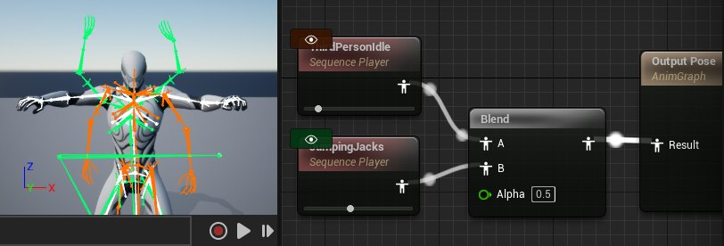
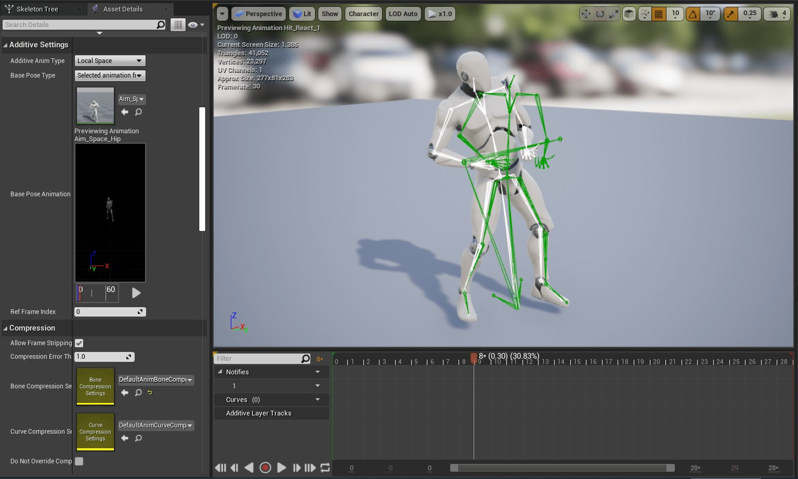

# 动画生产率提示与技巧

> 路径：虚幻引擎5.7文档 / 为角色和对象制作动画 / 骨架网格体动画系统 / 动画生产率提示与技巧

> 原始页面：https://dev.epicgames.com/documentation/unreal-engine/animation-shortcuts-and-tips-unreal-engine

## 资产导航操作

### 在单独选项卡中打开

按住SHIFT的同时打开动画资产，可在新选项卡中打开。

按住Shift打开新的选项卡 [注释：UE5推出时将上面的行替换为注释部分] 在UE4中，按住SHIFT的同时打开动画资产，可在新选项卡中打开。 在UE5时，可在在编辑器偏好设置中启用"始终在新选项卡中打开动画资产（Always Open Animation Assets in New Tab）"，将上述操作设置为默认行为。

### 动画资产筛选

打开动画资产后，你可以在资产浏览器（Asset Browser）选项卡中筛选内容。 特别有用的筛选器包括 **动画筛选器（Anim Filters）>使用曲线...（Uses Curve...）** 和 **动画筛选器（Anim Filters）>使用骨架通知...（Uses Skeleton Notify...）**。

### 内容浏览器筛选

内容浏览器有各种针对动画内容的筛选器，但务必再看看 **其他筛选器（Other Filters）** 类别。它有一些实用的选项，例如 **已签出（Checked Out）** 文件。

### 引用查看界面

引用查看界面非常适用于追踪引用动画资产的资产。 **热键（Hotkeys）：**Alt+Shift+R

> 动图已省略：引用查看界面的快捷键

### 内容浏览器高级搜索语法

欲了解如何使用内容浏览器的高级搜索功能，请参见[高级搜索语法](../../../understanding-the-basics/content-browser/advanced-search-syntax/index.md)文档。

## 动画蓝图

### 蓝图编辑器速查表

欲了解使用 **蓝图编辑器** 的通用技巧，请参见[蓝图速查表](../../../blueprints-visual-scripting/specialized-blueprint-visual-scripting-node-groups/blueprint-editor-cheat-sheet/index.md)。

### 姿势观看

右键点击 **动画图表（Animation Graph）** 中的任意动画节点，选择 **切换姿势观看（Toggle Pose Watch）**，以查看姿势当前在图表中的调试绘制效果。



## 动画序列/蒙太奇编辑器

### 显示叠加动画

查看叠加动画时，点击预览视口顶部的 **角色（Character）** 按钮，并选择 **动画（Animation）>附加基础（Additive Base）** 以绘制基本姿势。



## 编辑器首选项

### 自动保存

你可以使用 **编辑器偏好设置（Editor Preferences）** 中的 **启用自动保存（Enable AutoSave）** 设置禁用自动保存。

### 关卡加载

在 **编辑器偏好设置（Editor Preferences）** 中将 **启动时加载关卡（Load Level at Startup）** 设为 **上一次打开的关卡（Last Opened）**，以在重新启动编辑器时始终加载之前打开的最后一个关卡。

## 通用技巧

### 撤销未保存的更改

如果你对某个文件做了更改但未保存，现在想清除这些更改，可在内容浏览器中右键点击该文件，选择 **资产操作（Asset Actions）>重新加载（Reload）**。

## 在编辑器中运行(PIE)

### 动画调试文本

| 命令 | 说明 |
| --- | --- |
| **NextDebugTarget (PGUP)** | 更改调试目标 |
| **PreviousDebugTarget (PGDOWN)** | 更改调试目标 |
| **ShowDebug** | 清除显示 |
| **ShowDebug ANIMATION** | 切换动画调试数据的显示状态 |
| **ShowDebugToggleSubCategory** | 切换特定类别的显示（见自动完成结果） |

### 其他命令

| 命令 | 说明 |
| --- | --- |
| **a.animnode.*** | 各种动画节点的调试选项 |
| **Log `<类别>` `<详细级别>`** | 更改日志详细级别 更改日志详细级别的示例：`Log LogAnimMontage Verbose` |
| **p.VisualizeMovement 0** | 隐藏移动组件调试 |
| **p.VisualizeMovement 1** | 显示移动组件调试 |
| **show Bones** | 显示/隐藏骨骼 |
| **show Collision** | 显示/隐藏碰撞 |
| **Slomo 0.5** | 慢动作 |
| **Stat FPS** | 显示帧率 |
| **t.MaxFPS 0** | 移除帧率限制 |
| **t.MaxFPS 20** | 将帧率限制为20（警告：会影响编辑器） |

### 调试LOD

| 命令 | 说明 |
| --- | --- |
| **a.VisualizeLODs 0** | 隐藏LOD信息 |
| **a.VisualizeLODs 1** | 显示LOD信息 |
| **FORCESKELLOD LOD=2** | 将所有骨骼网格体强制设为LOD 2 |
| **FORCESKELLOD LOD=-1** | 禁用强制LOD |

### 调试属性

| 命令 | 说明 |
| --- | --- |
| **DisplayAll `<类名称>` `<属性名称>`** | 显示特定类的所有对象上的某个属性的值。 对组件值使用DisplayAll的示例：`DisplayAll CharacterMovementComponent Velocity` 对AnimBP值使用DisplayAll的示例：`DisplayAll MyAnimBP_C AimYaw` |
| **DisplayClear** | 清除DisplayAll的结果 |
| **GetAll `<类名称>` `<属性名称>`** | 与DisplayAll相同，但打印至输出日志 |
| **Display `<对象名称>` `<属性名称>`** | 显示单个实例的属性值 |

> [!NOTE]
> 使用 **Display** 查找Actor **GetAll** 命令可用于查找要用于 `<对象名称>` 的内容。
>
> 1. 要查找感兴趣的
>
>    Actor ID
>
>    ，将鼠标悬停在世界大纲视图中该Actor的名称上。例如：
>
>    BP_MyPawn_C_3
> 2. 运行
>
>    GetAll MyAnimBP AimYaw
> 3. 在输出日志中找到对象名称的路径。例如：
>
>    /Temp/UEDPIE_0_Untitled_1.Untitled_1:PersistentLevel.BP_MyPawn_C_3.CharacterMesh0.MyAnimBP_C_0
> 4. 运行
>
>    Display /Temp/UEDPIE_0_Untitled_1.Untitled_1:PersistentLevel.BP_MyPawn_C_3.CharacterMesh0.MyAnimBP_C_0 AimYaw

### 内存追踪

| 命令 | 说明 |
| --- | --- |
| **obj list class="AnimSequence"** | 列示加载的所有动画序列（推荐在烘焙版本中测试） |
| **obj refs name=ASSET_NAME** | 打印指定资产的引用关系链 示例：`obj refs name= /Game/Characters/Animations/ThirdPersonJump_End.ThirdPersonJump_End` |

### 作弊脚本

你可以通过在游戏的DefaultGame.ini中添加 **作弊脚本**，将多个控制台命令组合成单个命令。

示例：

```
		[CheatScript.ShowAnimVars]		+Cmd="displayclear"		+Cmd="DisplayAll CharacterMovementComponent Velocity"		+Cmd="DisplayAll MyAnimBP_C AimYaw" 
```

从控制台运行命令：`CheatScript ShowAnimVars`。

### 编辑器工具控件

[编辑器工具控件](https://dev.epicgames.com/documentation/404)允许在蓝图中完整地创建自定义编辑器控件。一个常见用例是创建一组触发常用控制台命令的按钮。
