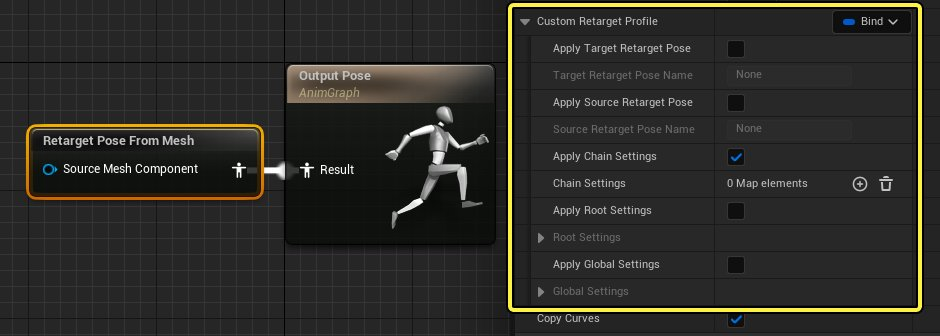
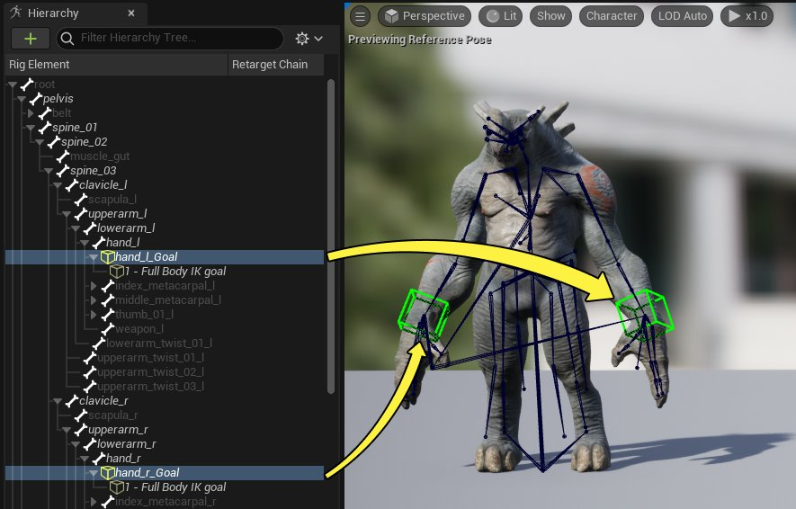
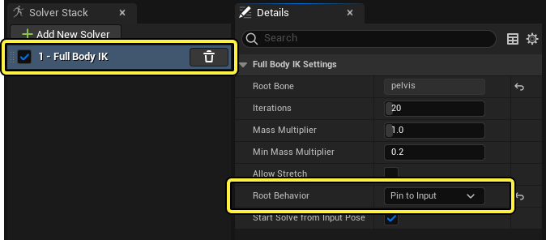
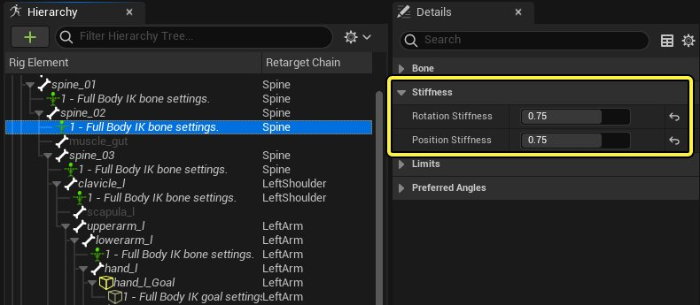
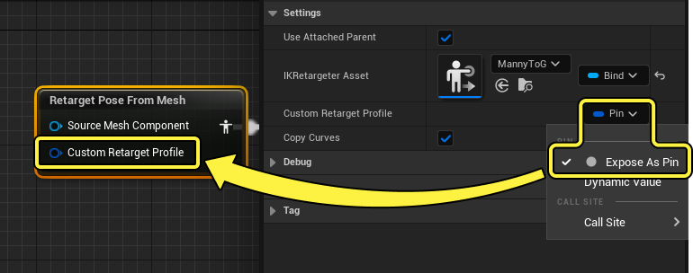
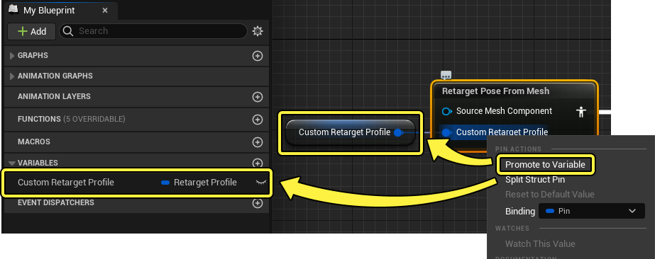
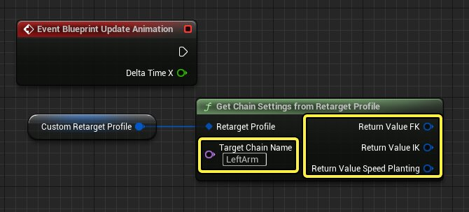
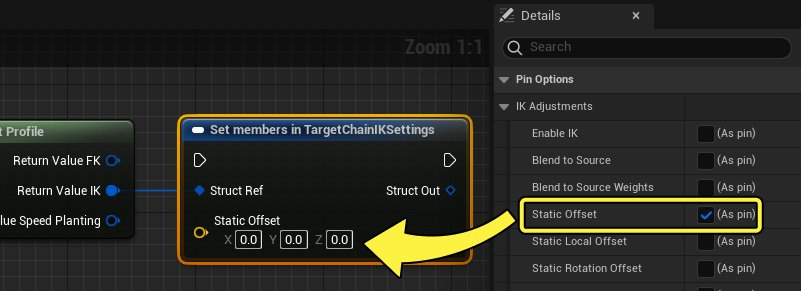

# 使用重定向配置文件

> 路径：虚幻引擎5.7文档 / 为角色和对象制作动画 / 骨架网格体动画系统 / 动画操作指南和示例 / 使用重定向配置文件

> 原始页面：https://dev.epicgames.com/documentation/unreal-engine/animating-ik-retarget-settings-in-unreal-engine

除了在运行时期间对角色进行 **IK重定向（IK Retargeting）** ，你还可以使用 **重定向配置文件（Retarget Profiles）** 动态修改 **全局（Global）** 、 **根（Root）** 和 **链（Chain）** 设置。重定向配置文件是 **Retarget Pose From Mesh** 动画蓝图节点的额外功能，可用于更改这些设置或为其制作动画。这很适合用于在整个动画中的不同点更改或应用不同的重定向设置。

本文档介绍如何设置重定向配置文件以及各种修改方式。

#### 先决条件

- 你将角色设置为在运行时使用

  Retarget Pose From Mesh

  动态重定向。有关操作说明，请参阅

  运行时IK重定向

  页面。
- 你熟悉

  动画蓝图

  的用法。
- 你熟悉如何创建和使用

  Sequencer

  。

## 访问重定向配置文件

你可以找到[运行时IK重定向](../runtime-ik-retargeting/index.md)先决条件步骤中创建的目标角色动画蓝图，从其中的 **Retarget Pose From Mesh** 节点访问重定向配置文件。选择 **Retarget Pose From Mesh** 并找到 **细节（Details）** 面板中的 **自定义重定向配置文件（Custom Retarget Profile）** 属性。

## 静态覆盖

默认情况下，你在分配的IK重定向器资产中设置的设置由 **Retarget Pose From Mesh** 节点使用。你可以修改节点上的 **自定义重定向配置文件（Custom Retarget Profile）** 属性，从而静态覆盖这些设置：

| 名称 | 说明 |
| --- | --- |
| **应用目标重定向姿势（Apply Target Retarget Pose）** | 启用此项会覆盖用于目标角色的[重定向姿势](https://dev.epicgames.com/documentation/404)。 |
| **目标重定向姿势名称（Target Retarget Pose Name）** | 如果启用了 **应用目标重定向姿势（Apply Target Retarget Pose）** ，此设置会指定要改用的新重定向姿势名称。 |
| **应用源重定向姿势（Apply Source Retarget Pose）** | 启用此项会覆盖用于源角色的[重定向姿势](https://dev.epicgames.com/documentation/404)。 |
| **源重定向姿势名称（Source Retarget Pose Name）** | 如果启用了 **应用源重定向姿势（Apply Source Retarget Pose）** ，此设置会指定要改用的新重定向姿势名称。 |
| **应用链设置（Apply Chain Settings）** | 启用此项会使用下面在 **链设置（Chain Settings）** 中指定的新设置覆盖IK重定向器资产中使用的[链设置](https://dev.epicgames.com/documentation/404)。 |
| **链设置（Chain Settings）** | 用于添加链以使用新链设置覆盖的数组。点击 **添加（Add (+)）** 添加新链，并设置名称以匹配IK重定向器资产中的某个重定向链。展开 **FK** 、 **IK** 或 **快速栽植（Speed Planting）** 类别以修改其中的设置。 |
| **应用根设置（Apply Root Settings）** | 启用此项会使用下面在 **根设置（Root Settings）** 中指定的新设置覆盖IK重定向器资产中使用的[根设置](https://dev.epicgames.com/documentation/404)。 |
| **根设置（Root Settings）** | 如果启用了 **应用根设置（Apply Root Settings）** ，这些设置会覆盖IK重定向器资产中使用的根设置。 |
| **应用全局设置（Apply Global Settings）** | 启用此项会使用下面在 **全局设置（Global Settings）** 中指定的新设置覆盖IK重定向器资产中使用的[全局设置](https://dev.epicgames.com/documentation/404)。 |
| **全局设置（Global Settings）** | 如果启用了 **应用全局设置（Apply Global Settings）** ，这些设置会覆盖IK重定向器资产中使用的全局设置。 |

## 动态覆盖

如果你需要控制重定向设置何时发生更改，则必须创建额外的蓝图逻辑。由于蓝图和动画情境具有任意性，你可以采用许多方式创建逻辑，进而编辑各种重定向情境。

在此示例中，重定向配置文件将用于调整更大角色的手臂，以正确伸到地面，匹配人体模型。

> 动图已省略：目标角色不正确

### IK Rig设置

由于此特定重定向情境，你需要修改目标角色的[IK Rig](../../animation-assets-and-features/ik-rig/ik-rig/index.md)，以便使用IK目标和解算器。此示例使用[全身IK (FBIK)](../../animation-assets-and-features/ik-rig/ik-rig/ik-rig-solvers/index.md#%E5%85%A8%E8%BA%ABik)解算器，但你可以根据角色选择其他种类的[IK Rig解算器](../../animation-assets-and-features/ik-rig/ik-rig/ik-rig-solvers/index.md)。必须执行此步骤，才能提供IK手臂链设置供重定向配置文件修改。

打开目标角色的用于重定向的IK Rig资产，并执行以下操作：

1. 在

   层级（Hierarchy）

   面板中右键点击某个手部骨骼，并选择

   新IK目标（New IK Goal）

   。
2. 在下一个提示中，确保

   全身IK（Full Body IK）

   设置为解算器，并点击

   添加解算器（Add Solver）

   。
3. 在

   解算器堆栈（Solver Stack）

   面板中选择

   全身IK解算器（Full Body IK solver）

   ，然后右键点击另一手部骨骼，并选择

   新IK目标（New IK Goal）

   。
4. 最后，选择

   全身IK解算器（Full Body IK solver）

   ，在层级中右键点击根骨骼（通常是

   骨盆（pelvis）

   或

   臀部（hips）

   ），并选择

   在所选解算器设置根骨骼（Set Root Bone on Selected Solver）

   。

#### FBIK设置

在 **解算器堆栈（Solver Stack）** 中选择 **全身IK（Full Body IK）** ，并在细节面板中将 **根行为（Root Behavior）** 设置为 **固定为输入（Pin to Input）** 。必须这样做，才能在IK目标移动时防止下半身移动。

你还可能需要为FBIK解算器控制的骨骼创建额外的骨骼设置。这将解决FBIK解算可能造成的刚度或关节旋转不正确的问题。要创建骨骼设置，请选择 **全身IK解算器（Full Body IK Solver）** ，然后右键点击你要为其创建设置的骨骼，然后选择 **添加设置到选定骨骼（**Add Settings to Selected Bone）** 。

在此示例中，为了解决脊椎、肩部和手臂骨骼的旋转刚度，使用以下属性为这些骨骼（包括对称骨骼）创建了骨骼设置：

- **Spine_01**

  - 旋转和位置刚度（Rotation and Position Stiffness）

    ：0.75
- **Spine_02**

  - 旋转和位置刚度（Rotation and Position Stiffness）

    ：0.75
- **Spine_03**

  - 旋转和位置刚度（Rotation and Position Stiffness）

    ：0.75
- **Clavicle_l**

  - 旋转和位置刚度（Rotation and Position Stiffness）

    ：0.8
- **Lowerarm_l**

  - **使用偏好角度（Use Preferred Angles）** ：启用
  - **偏好角度（Preferred Angles）** ： 0, 0, 45

### 重定向配置文件变量设置

返回到目标动画蓝图，选择 **Retarget Pose From Mesh** 节点。在 **细节（Details）** 面板中，点击 **自定义重定向配置文件（Custom Retarget Profile）** 下拉菜单，并启用 **公开为引脚（Expose As Pin）** ，这样会在该节点上添加"自定义重定向配置文件（Custom Retarget Profile）"引脚。

右键点击新创建的引脚，并选择 **提升为变量（Promote to Variable）** 。这样会创建类型为 `重定向配置文件（Retarget Profile）` 的新[结构体变量](../../../../blueprints-visual-scripting/specialized-blueprint-visual-scripting-node-groups/blueprint-variables/blueprint-struct-variables/index.md)，并连接到该引脚。该变量也会在 **我的蓝图（My Blueprint）** 面板中显示。

### 创建事件图表逻辑

打开[动画蓝图事件图表](../../animation-blueprints/graphing-in-animation-blueprints/index.md#%E4%BA%8B%E4%BB%B6%E5%9B%BE%E8%A1%A8)，并引用此处的 **重定向配置文件变量（Retarget Profile variable）** ，然后执行以下操作：

1. 从中拖移并创建

   Get Chain Settings from Retarget Profile

   节点。
2. 将

   目标链名称（Target Chain Name）

   设置为你想为其制作动画的重定向链。在本示例中，它是

   LeftArm

   。
3. 右键点击

   返回值（Return Value）

   并选择

   拆分结构体引脚（Split Struct Pin）

   。

接下来，从 **返回值IK（Return Value IK）** 拖移并创建 **Set****members****in TargetChainIKSettings** 节点。将其选中，并在 **细节（Details）** 面板中启用 **静态偏移（Static Offset）** ，这样会将静态偏移链属性公开为节点上的引脚。

从 **结构体输出（Struct Out）** 拖移并创建 **Set Chain IKSettings in Retarget Profile** 节点，然后执行以下操作：

1. 将

   目标链名称（Target Chain Name）

   设置为之前使用的相同链名称：

   LeftArm

   ，
2. 将

   重定向配置文件（Retarget Profile）

   变量连接到

   重定向配置文件（Retarget Profile）

   输入。

> 图片已省略：在重定向配置文件中设置链IK设置

将 **事件蓝图更新动画（Event Blueprint Update Animation）** 连接到此执行链，然后将 **静态偏移（Static Offset）** 公开为变量，方法是右键点击该引脚并选择 **提升为变量（Promote to Variable）** 。

> 图片已省略：更新动画事件并公开静态偏移

最后，在静态偏移变量的 **细节（Details）** 面板中，启用 **公开到过场动画（Expose to Cinematics）** 和 **实例可编辑（Instance Editable）** ，后者使变量可在外部编辑。

> 图片已省略：将变量公开到实例和过场动画

### 对重定向设置制作动画

因为你在目标的动画蓝图事件图表中创建了逻辑，并将其链接到了 **事件蓝图更新动画（Event Blueprint Update Animation）** ，所以你可以在Sequencer中对公开的变量制作动画，方法与[对动画实例制作动画](../../../cinematics-and-movie-making/cinematic-workflow-guides-and-examples/control-animation-blueprint-parameters-from-sequencer/index.md)一样。

假定你已经[创建并打开关卡序列](../../../cinematics-and-movie-making/how-to-make-movies/index.md)，将重定向的角色蓝图添加到该序列和源骨骼网格体组件，然后在源组件上[播放动画](../../../cinematics-and-movie-making/how-to-make-movies/how-to-add-cinematic-animation-to-a-character/index.md)，观察目标上的重定向效果。

> 动图已省略：Sequencer中的运行时重定向

接下来，添加你之前公开的链设置变量，具体做法是：

1. 在

   蓝图轨道（Blueprint Track）

   上点击

   添加轨道（Add Track (+)）

   并选择

   目标（Target）

   组件，添加目标骨骼网格体组件。
2. 在目标

   组件轨道（Component Track）

   上点击

   添加轨道（Add Track (+)）

   并选择

   动画实例（Anim Instance）

   。
3. 在

   动画实例轨道（Anim Instance Track）

   上选择

   添加轨道（Add Track (+)）

   并选择该变量。

> 动图已省略：添加目标动画实例轨道

你现在可以将此轨道设为[关键帧](../../../cinematics-and-movie-making/unreal-engine-sequencer-movie-tool-overview/creating-animation-keyframes/index.md)，实时调整链属性。

> 动图已省略：关键帧重定向配置文件设置

通过对重定向配置文件制作动画以及[运行时重定向](../runtime-ik-retargeting/index.md)，你可以对运行时重定向结果进行精细微调，而不用创建新动画或更多资产。

|  |  |  |
| --- | --- | --- |
| 原始动画 | 对大角色上的重定向配置文件制作动画 | 对小角色上的重定向配置文件制作动画 |
