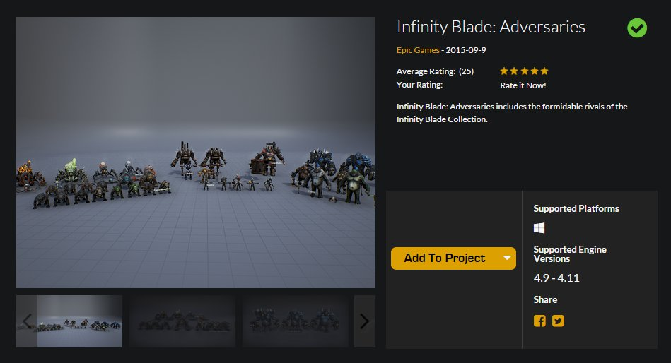
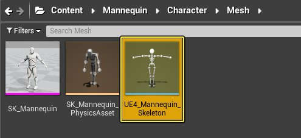
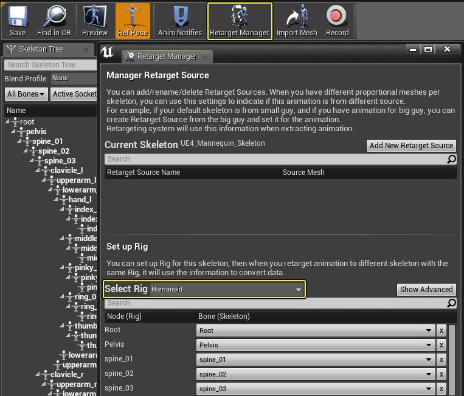
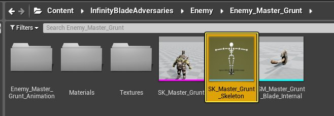
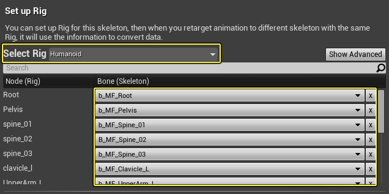
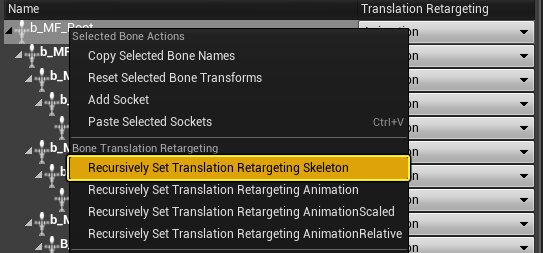
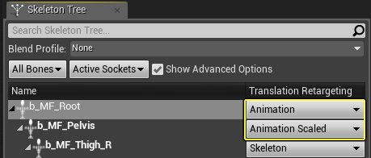
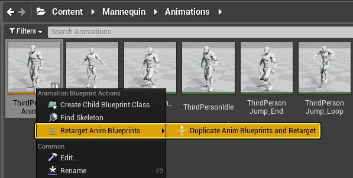

# 创建动态动画

> 路径：虚幻引擎5.7文档 / 为角色和对象制作动画 / 骨架网格体动画系统 / 动画操作指南和示例 / 创建动态动画

> 原始页面：https://dev.epicgames.com/documentation/unreal-engine/creating-dynamic-animations-in-unreal-engine

提高角色运动真实感的一种方法是为他们携带或穿戴的物品应用动态动画。 有了[**AnimDynamics**](../../animation-blueprints/animation-blueprint-nodes/animation-blueprint-skeletal-controls/index.md)，在现实中会随着你运动而摆动的物件（毛发、项链、手镯、刀剑、荷包等）也将会在游戏里随着角色的运动而弹跳和移动。

在本教程中，我们将把AnimDynamics应用到一个角色来实现下面看到的效果：

在上面的示例中，角色身上的背带和挂在他脖子上的炉子都应用了AnimDynamics。当角色移动时，背带会轻微摆动，而炉子的前后摆动幅度还要更大一点。 可以通过AnimDynamics节点的细节（Details）面板来调整运动量，以获得你需要的效果。还可以添加更多约束来操纵骨骼移动方式。

> [!NOTE]
> 如果角色已经设置了动画蓝图并有了已准备好用AnimDynamics驱动的骨骼，可以直接跳到第2步。

## 1 - 必要的设置

在开始将动态动画应用于角色之前，我们需要设置要使用的角色。模板角色没有任何可以使用的动态骨骼，所以我们将动画从模板角色重定向为Infinity Blade角色，这个角色有我们可以利用AnimDynamics影响的骨骼。

> [!NOTE]
> 在本指南中，我们使用 **蓝图第三人称（Blueprint Third Person）** 模板创建了一个新项目。
>
> 然后，我们将 **Infinity Blade:Adversaries** 包添加到了项目中，此包可从市场（Marketplace）免费获取。
>
> 

在打开了基于 **蓝图第三人称（Blueprint Third Person Template）** 的模板项目，并添加了 **Infinity Blade** 资源后：

1. 在 **内容浏览器** 中的 **Content/Mannequin/Character/Mesh** 下，打开 **UE4_Mannequin_Skeleton** 资源。

   
2. 单击 **重定向管理器（Retarget Manager）** 按钮，然后在 **选择绑定（Select Rig）** 下，分配 **Humanoid** 绑定。

   

   我们将此角色的动画蓝图和动画[重定向](../using-retargeted-animations/index.md)为一个Infinity Blade角色。
3. 在 **内容浏览器（Content Browser）** 中，导航至Infinity Blade Adversaries文件夹中的 **SK_Master_Grunt_Skeleton** 并打开它。

   
4. 单击 **重定向管理器（Retarget Manager）** 按钮，然后在 **选择绑定（Select Rig）** 下选择 **Humanoid**。
5. 对于绑定上的每个节点，从骨架分配一个骨骼。

   

   完整的分配如下表所示。

   | 节点（绑定） | 骨骼（骨架） |
   | --- | --- |
   | **Root** | b_MF_Root |
   | **Pelvis** | b_MF_Pelvis |
   | **spine_01** | b_MF_Spine_01 |
   | **spine_02** | b_MF_Spine_02 |
   | **spine_03** | b_MF_Spine_03 |
   | **clavicle_l** | b_MF_Clavicle_L |
   | **upperarm_l** | b_MF_UpperArm_L |
   | **lowerarm_l** | b_MF_Forearm_L |
   | **hand_l** | b_MF_Hand_L |
   | **clavicle_r** | b_MF_Clavicle_R |
   | **upperarm_r** | b_MF_UpperArm_R |
   | **lowerarm_r** | b_MF_Forearm_R |
   | **hand_r** | b_MF_Hand_R |
   | **neck_01** | b_MF_Neck |
   | **head** | b_MF_Head |
   | **thigh_l** | b_MF_Thigh_L |
   | **calf_l** | b_MF_Calf_L |
   | **foot_l** | b_MF_Foot_L |
   | **thigh_r** | b_MF_Thigh_R |
   | **calf_r** | b_MF_Calf_R |
   | **foot_r** | b_MF_Foot_R |

   在我们继续重定向之前，我们将调整平移重定向，以确保动画正确播放。
6. 在 **骨架树（Skeleton Tree）** 中，单击 **显示高级选项（Show Advanced Options）** 按钮。
7. **右键单击** **b_MF_Root** 骨骼，并选择 **递归地设置平移重定向骨架（Recursively Set Translation Retargeting Skeleton）**。

   
8. 在 **平移重定向（Translation Retargeting）** 下，将 **b_MF_Root** 设置为动画（Animation），并将 **b_MF_Pelvis** 设置为 **缩放后动画（Animation Scaled）**。

   

   已经设置了骨架，我们现在可以从模板角色重定向AnimBluperint和动画。
9. 导航到 **ThirdPersonAnimBP**，**右键单击** 它并选择 **复制动画蓝图并重定向（Duplicate Anim Blueprints and Retarget）**。

   
10. 在 **选择骨架（Select Skeleton）** 窗口中，选择 **SK_Master_Grunt_Skeleton** 资源，然后选择 **重定向（Retarget）**。

    > 图片已省略：7_SetTarget-1.png

    > [!TIP]
    > 你可以单击 **修改...（Change…）** 按钮来分配重定向资源复制到的位置（如果你愿意）。
11. 导航到复制的资源，并将新的动画蓝图重命名为 **GruntAnimBP**。

    > 图片已省略：8_RenameAnimBP-1.png
12. 导航到 **ThirdPersonCharacter** 蓝图，并打开它。

    > 图片已省略：9_OpenThirdBP-1.png
13. 单击 **组件（Components）** 窗口中的 **网格体（Mesh）**，然后在 **详细信息（Details）** 面板中分配 **SK_Master_Grunt** 和 **GruntAnimBP_C**。

    > 图片已省略：10_AssignNewCharacter-1.png
14. **编译（Compile）** 并 **保存（Save）**，然后关闭蓝图。

此时，如果你在编辑器中运行，你应该可以控制可用 **WASD** 和 **空格键** 运行和跳转的Grunt角色。

注意，角色身上的背带和挂在他脖子上的炉子的运动有限。此运动看起来相对静态，如果这些物件随着角色的运动而摆动，我们的角色看起来会更自然。

在下一步中，我们将利用AnimDynamics节点设置背带和炉子动画，使其对角色运动作出反应。

## 2 - 应用AnimDynamics

现在我们已经为角色设置了一个 **动画蓝图**，而且拥有我们想要动态设置动画的骨骼，那么我们可以通过 **AnimDynamics** 节点从 **动画蓝图** 的 **AnimGraph** 中实现这一点。

在我们的示例中，角色的脖子上挂着一个大炉子，我们想基于角色的运动来设置炉子动画。如果你正在用你自己的角色，你可以按照下面的步骤，分配你想要用AnimDynamics驱动的骨骼，并根据需要调整设置。

### 步骤

1. 在 **内容浏览器** 中，打开角色的 **动画蓝图** (**GruntAnimBP**)。
2. 单击 **MyBlueprint**，然后单击 **AnimGraph** 打开动画图表。
3. **右键单击** 图表，然后搜索并添加 **AnimDynamics** 节点。

   AnimDynamics节点采用了一个 **外部力（External Force）** 值，此力是施加在模拟中所有物体的附加力（此力为可选项，但值得考虑）。它还采用了 **组件姿势（Component Pose）**（即参考姿势数字）以及 **Alpha** 值（即应用骨骼控制的强度，其中0表示无强度，1表示全强度）。
4. **复制（Copy）** 并 **粘贴（Paste）** 此节点，然后如下所示连接节点。

   连接姿势引脚时，将自动创建 本地姿势到组件空间姿势（Local to Component） 和 组件空间姿势到本地姿势（Component to Local）。

   在我们的示例中，我们使用了两个AnimDynamics节点（一个影响背带，另一个影响炉子）。
5. 选择序列中的第一个 **AnimDynamics** 节点，然后在 **详细信息（Details）** 面板中，分配如下所示的设置。

   **预览（Preview）** 部分全部关于可视化，指示视口中应用于移动的当前限制。如果正在使用 **平面限制（Planar Limits）** 且未启用 **CoM**（质心），还可以看到碰撞球体。这超出了本例范围，但你可以体验一下这种设置。

   最后要设置的是 **边界骨骼（Bound Bone）** 或我们正在影响的骨骼。我们将其设置为角色的 **炉子** 骨骼（此骨骼影响背带）。
6. 当仍选中节点时，按如下所示设置 **设置（Setup）** 和 **约束（Constraint）** 部分。

   在 **设置（Setup）** 和 **约束（Constraint）** 部分中，定义由AnimDynamics驱动的骨骼的移动和移动范围。**盒体范围（Box Extent）** 设置惯性，**局部关节偏移（Local Joint Offset）** 定义枢轴点，**角限制（Angular Limits）** 设置运动的旋转范围（启用时用预览可视化选项指示）。

   > [!NOTE]
   > 请参阅骨架功能按钮的[**AnimDynamics**](../../animation-blueprints/animation-blueprint-nodes/animation-blueprint-skeletal-controls/index.md)部分，了解设置（Setup）和约束（Constraint）设置的详情。
7. 单击 **编译（Compile）**，注意背带物件如何侧倾。

   现在，**Y** 轴的角限制（Angular Limits）非常大，在上图中用绿色锥体表示。我们来缩小此范围。
8. 当仍选中节点时，在 **约束（Constraints）** 部分中，调整 **角限制（Angular Limits）** 的 **最小/最大值（Min/Max）**，如下所示。

   此时 **编译（Compile）** 时，背带不会向两边偏移移动太多（即便调整了 **速度（Speed）** 或 **IsInAir?** 设置）。
9. 选择序列中的第二个 **AnimDynamics** 节点，然后使用以下设置。

   > 图片已省略：undefined

   *点击查看大图。*

   通过上面的设置，我们更改了 **边界骨骼（Bound Bone）** 以定向为角色中的 **Furnace_Pivot** 骨骼，此骨骼影响炉子物件。我们还调整了 **扭曲轴（Twist Axis）**，使其在 **Y** 轴上扭转，提供前后运动，而不是左右运动。角限制（Angular Limits）设置为 **-50** 和 **50**，作为要移动的范围。
10. **编译（Compile）** 并 **保存（Save）**，然后在编辑器中运行。

### 最终结果

现在，你应该看到示例角色的炉子会基于约束设置随着角色的运动而弹跳。

利用 **设置（Setup）** 部分的 **盒体范围（Box Extent）** 和 **局部关节偏移（Local Joint Offset）** 值以及 **约束（Constraints）** 部分的 **线性（Linear）** 和 **角限制（Angular Limits）**，大胆进行尝试，看看AnimDynamics如何影响骨骼的运动。
