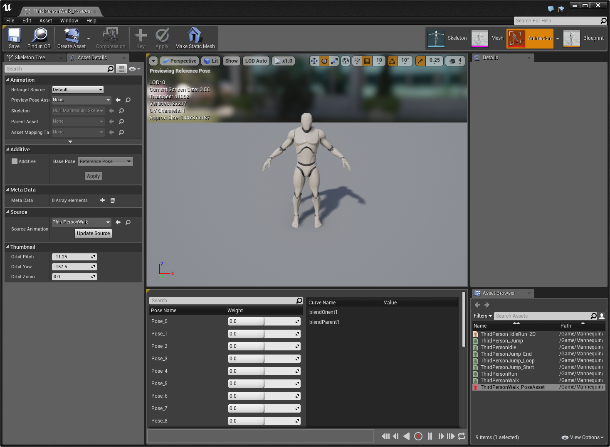

# 曲线驱动动画

> 路径：虚幻引擎5.7文档 / 为角色和对象制作动画 / 骨架网格体动画系统 / 动画操作指南和示例 / 曲线驱动动画

> 原始页面：https://dev.epicgames.com/documentation/unreal-engine/curve-driven-animation-in-unreal-engine

在此指南中，我们新建了一个行走动画，它完全依赖于曲线数据驱动。 使用基于现有 **动画序列（Animation Sequence）** 的 **姿势资产（Pose Asset）**，从动画中抓取两个动作，在两者之间进行混合，创建全新的行走动作。 虽然这是一个用于创建运动的 **Full Body** 示例，但也可采用这些相同概念并将它们应用到面部动画中，创建由曲线数据驱动的 **叠加** 面部动画。

> [!NOTE]
> 此指南中我们使用的是 **Blueprint Thirdperson Template** 项目。

1. 在 **Content Browser** 中的 **Content/Mannequin/Animations** 文件夹下，**右键点击** **ThirdPersonWalk** 并选择 **Create PoseAsset**。
2. 使用新 **姿势资产** 的默认命名，然后 **双击** 将其打开。

   

   *点击查看全图。*

   创建 **姿势资产** 时，**动作命名** 将默认自动生成（只要曲线存在于动画中）。 将在 **姿势资产** 所创建的动画中对每帧创建动作。 可调整每个动作的曲线权重，在应用权重影响时查看最终的动作。 例如在上图中我们对 **Pose_6** 的权重进行了调整，角色向前移动右脚。

   > [!NOTE]
   > 所有 **姿势资产** 均默认设为 **Full Body** 且不为 **Additive**，意味着加权值为 0（无影响）或 1（全影响）。 因此，在此将加权值设为 0.2 或设为 1 均无区别。 为得到更大的粒度，可将 **姿势资产** 设为 **Additive**。然而，对应用到角色全身的动画执行此操作可能导致角色意外出现缩小或比例失调。
3. **右键点击** **Pose_6** 并将其 **重命名** 为 **r_foot_fwd**。
4. **右键点击** **Pose_24** 并将其 **重命名** 为 **l_foot_fwd**。
5. 在 **主工具栏** 中点击 **Create Asset** 并选择 **Create Animation** / **From Reference Pose**。
6. 选择保存路径和保存命名（此例命名为 **CurveWalk**）。
7. 在新动画中 **右键点击** 时间轴，选择 **Append at the End** 并添加 **30** 帧。
8. 点击 **Curves** 下的 **Add** 按钮，然后在 **Add Variable Curve..** 下选择 **l_foot_fwd** 进行添加，然后再添加 **r_foot_fwd**。

   我们现在便拥有了两个需要用曲线数据驱动的动作。
9. 点击 **l_foot_fwd** 和 **r_foot_fwd** 曲线的 **Expand Window** 复选框。
10. 将时间轴移至 **0**，然后在 **l_foot_fwd** 曲线中按住 **Shift + 左键** 创建一个键并将 **Time** 和 **Value** 设为 **0**。
11. 按住 **Shift + 左键** 并添加分别为 **Time 0.5** 和 **Value 1.0**、**Time 1.0** 和 **Value 0.0** 的键。

    这样的设置将使角色的左脚在动画中向前迈出半步。
12. 在 **r_foot_fwd** 曲线中按住 **Shift + 左键** 并数值如下的键：（**Time 0、Value 1**）、（**Time 0.5、Value 0**），和（**Time 1、Value 1**）。

    在动画的开头，角色的右脚将向前迈出半步，然后切换至左脚向前。 动画接近结束时，我们使用曲线数据再次驱动右脚向前动作，循环即可生成行走动作循环。
13. 如需预览带姿势资产的动画，在 **Asset Details** 面板中将当前的 **Preview Pose Asset** 设为使用 **ThirdPersonWalk_PoseAsset** 即可。

## 最终结果

现在即可播放动画，查看由曲线数据混合的两个动作。

如需在运行时播放动画，需要在动画蓝图中使用一个 [动作混合节点](../../animation-blueprints/animation-blueprint-nodes/animation-blueprint-blend-nodes/index.md)。
