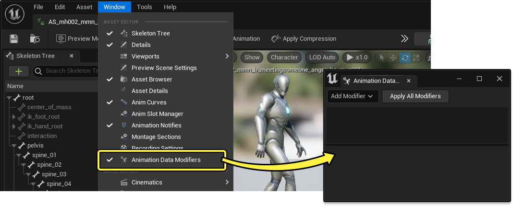
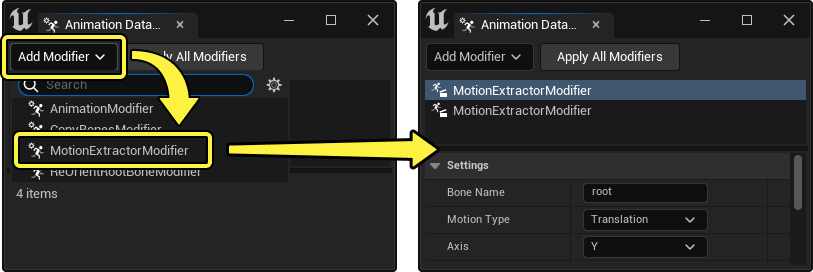
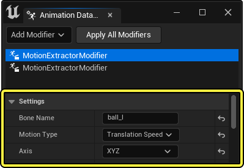
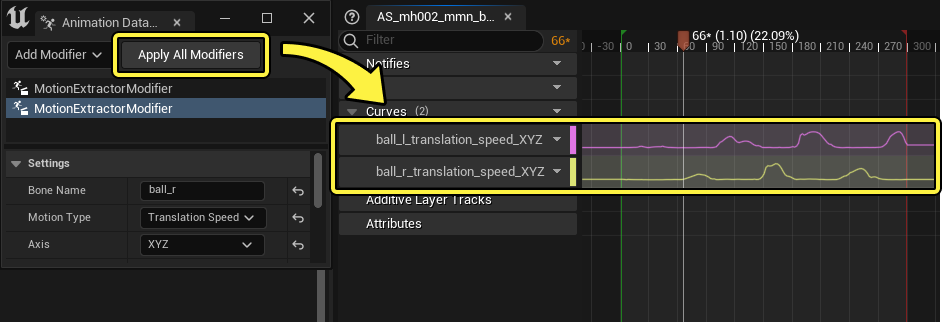
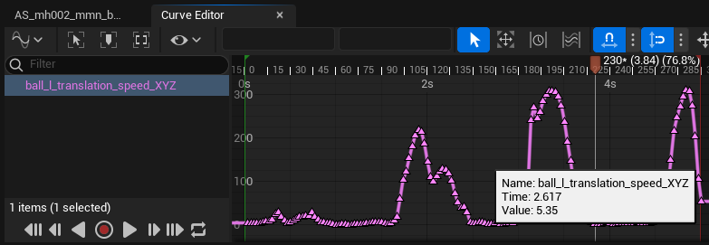
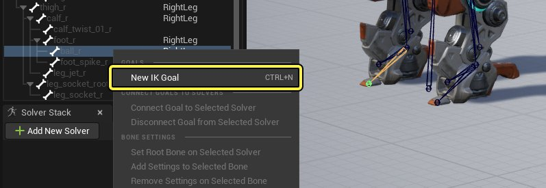
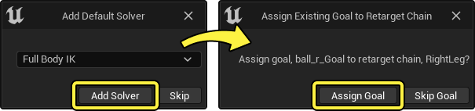
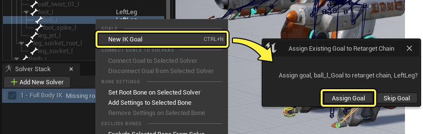

# 使用IK重定向器修正滑步

> 路径：虚幻引擎5.7文档 / 为角色和对象制作动画 / 骨架网格体动画系统 / 动画操作指南和示例 / 使用IK重定向器修正滑步

> 原始页面：https://dev.epicgames.com/documentation/unreal-engine/fix-foot-sliding-with-ik-retargeter-in-unreal-engine

使用[IK重定向器](https://dev.epicgames.com/documentation/404)在不同角色之间重定向动画时，目标角色可能会出现明显的滑步。如果源角色和目标角色之间的腿长和姿态迥异，造成腿重定向出现瑕疵，就会发生这种情况。要解决此问题，你可以使用 **快速栽植（Speed Planting）** 工作流程，在[IK目标](../../animation-assets-and-features/ik-rig/ik-rig/index.md#ik%E7%9B%AE%E6%A0%87)不应移动时将其固定在适当位置。

|  |  |
| --- | --- |
| 原始重定向结果 | 使用快速栽植修改后的重定向结果 |

本文档将介绍如何使用快速栽植（Speed Planting）解决重定向动画中的滑步问题。

#### 先决条件

- 你已使用IK重定向器将动画从一个角色重定向到另一个角色。有关如何执行此操作的信息，请参阅

  使用IK Rig重定向两足角色

  页面。
- 你熟悉在IK Rig中创建[全身IK]（(animating-characters-and-objects/SkeletalMeshAnimation/AssetsFeatures/IKRig/IKEditor/IKSolvers#全身IK)解算器的操作。

## 源动画设置

设置快速栽植（Speed Planting）的第一步是，在源动画中创建[动画曲线](../../animation-assets-and-features/animation-sequences/animation-curves/index.md)，定义整个动画过程中每个足部骨骼的速度。为此，你可以使用[动画数据修饰符](../../animation-assets-and-features/animation-modifiers/index.md)生成该曲线，从而快速产生准确运动数据。此步骤是为了使用动画曲线数据来确定足部在动画过程中的踏点。

### 动画数据修饰符

在你的源[动画序列](../../animation-assets-and-features/animation-sequences/index.md)中，从主菜单转到 **窗口（Window）> 动画数据修饰符（Animation Data Modifiers）** 。

接下来，点击 **添加修饰符（Add Modifier）> MotionExtractorModifier** 添加运动提取器修饰符。对源动画中的每个足部骨骼执行此操作。在本例中，添加了两个运动提取器修饰符。

在两个运动提取器修饰符中，设置以下属性：

- 骨骼名称（Bone Name）

  ：需要留意速度的足部骨骼的名称。本例使用

  ball_r

  和

  ball_l

  骨骼。
- 运动类型（Motion Type）

  ：平移速度。
- 轴（Axis）

  ：XYZ。

### 生成速度曲线

设置动画数据修饰符后，点击 **应用所有修饰符（Apply All Modifiers）** 生成指定骨骼的速度曲线。

双击曲线轨道打开[曲线编辑器](../../../cinematics-and-movie-making/unreal-engine-sequencer-movie-tool-overview/animation-curve-editor/index.md)，你可以在其中看到有关它的更多详细信息。选择关键帧或将光标悬停在其上来查看值。该信息可用于确定足部踏地时应使用的速度阈值。大多数情况下，这意味着曲线的下部平坦段是足部静止的时候，而峰值是足部运动的时候。

> [!NOTE]
> 因为你修改了该动画序列和[骨架](../../animation-assets-and-features/skeletons/index.md)（由于创建了新的曲线），所以现在两个资产都必须要保存。

## IK Rig设置

继续设置，现在你必须为目标角色上的腿部链创建IK目标和解算器。此示例使用了[全身IK（FBIK）](../../animation-assets-and-features/ik-rig/ik-rig/ik-rig-solvers/index.md#%E5%85%A8%E8%BA%ABik)解算器，但你可以根据角色选择其他种类的[IK Rig解算器](../../animation-assets-and-features/ik-rig/ik-rig/ik-rig-solvers/index.md)。必须执行此步骤，才能在动画期间腿部静止时使用IK固定腿部。

### 创建FBIK

打开用于重定向的目标角色的 **IK Rig资产（IK Rig Asset）** ，找到 **层级（Hierarchy）** 面板，在其中一个腿部重定向链中的末端骨骼上右键点击，然后选择 **新建IK目标（New IK Goal）** 。

出现后续提示时，确保将 **全身IK（Full Body IK）** 设置为解算器，并点击 **添加解算器（Add Solver）** ，然后点击 **指定目标（Assign Goal）** 。

接下来，确保在 **解算器堆栈（Solver Stack）** 面板中选择了新创建的全身IK解算器，右键点击另一个足部骨骼，选择 **新建IK目标（New IK Goal）** ，然后点击 **指定目标（Assign Goal）** 。

最后，选择 **全身IK（Full Body IK）** 解算器，然后右键点击层级中的根骨骼并选择 **在所选解算器上设置根骨骼（Set Root Bone on Selected Solver）** 。通常，FBIK解算器的根骨骼是骨盆或臀部。

> 图片已省略：在所选解算器上设置根骨骼

### FBIK设置

根据你的角色腿部的骨骼结构，你可能还需要为FBIK解算器控制的骨骼创建额外的骨骼设置。这将解决FBIK解算可能造成的刚度或关节旋转不正确的问题。要创建骨骼设置，请选择 **全身IK解算器（Full Body IK Solver）** ，然后右键点击你要创建设置的骨骼，然后选择 **添加设置到选定骨骼（Add Settings to Selected Bone）** 。

> 动图已省略：fbik设置

在本例中，为了解决某些腿部骨骼的旋转刚度，为这些骨骼创建了具有以下属性的骨骼设置：

- thigh_l

  - 使用偏好角度（Use Preferred Angles）

    ：启用（Enabled）
  - 偏好角度（Preferred Angles）

    ：0、0、-45
- calf_l

  - 使用偏好角度（Use Preferred Angles）

    ：启用（Enabled）
  - 偏好角度（Preferred Angles）

    ：0、0、45
- thigh_r

  - 使用偏好角度（Use Preferred Angles）

    ：启用（Enabled）
  - 偏好角度（Preferred Angles）

    ：0、0、-45
- calf_r

  - 使用偏好角度（Use Preferred Angles）

    ：启用（Enabled）
  - 偏好角度（Preferred Angles）

    ：0、0、45

> 图片已省略：fbik偏好角度

> [!NOTE]
> 根据你的角色的需要，可能需要其他骨骼设置来确保你的FBIK解算器正常工作，如 **刚度（Stiffness）** 、 **限制（Limits）** 和 **质量乘数（Mass Multiplier）** 。有关更多信息，请参阅[解算器](../../animation-assets-and-features/ik-rig/ik-rig/ik-rig-solvers/index.md)页面的 **全身IK** 小节。

## IK重定向器中的快速栽植

接下来，为你的角色打开 **IK重定向器资产（IK Retargeter Asset）** 。在视口中选择IK目标或链，并在 **细节（Details）** 面板中启用 **快速栽植（Speed Planting）** 。

> 图片已省略：启用快速栽植

在 **快速栽植（Speed Planting）** 分段设置以下属性：

- 将

  速度曲线名称（Speed Curve Name）

  设置为先前在源角色上生成的对应腿部曲线的名称。在本例中，它设置为

  ball_l_translation_speed_XYZ

  。
- 根据生成的曲线值，你可能需要将

  速度阈值（Speed Threshold）

  调整为略高于曲线平坦段的数值。如果发现角色的足部仍不当离地，则增加此数字。在本例中，设置为

  30

  。

对目标角色上所有必要的腿部链执行此操作。

> 图片已省略：快速栽植属性

## 最终效果

现在，当你在重定向器中播放动画时，应该会看到目标角色的足部踏地得到改善。你现在可以将重定向后的动画[导出](../../animation-assets-and-features/ik-rig/ik-rig/index.md#%E9%A2%84%E8%A7%88%E5%8A%A8%E7%94%BB%E5%92%8C%E5%AF%BC%E5%87%BA)导出到新的动画序列。

> 动图已省略：最终效果
